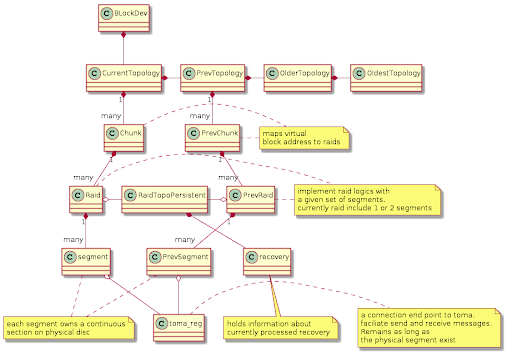

| Symbology:   Normal text, Important, to be defined issue, ~~inferior alternative,~~ future version,  |
| :---- |

[Interfaces](#interfaces)x

[OS interface](#os-interface)

[Nvmeiba module](#nvmeiba-module)

[Proc files](#proc-files)

[Client persistency](#client-persistency)

[SCSI ioctls](#scsi-ioctls)

[Os\_api of volume](#os_api-of-volume)

[Control Path](#control-path)

[Configuration and topology](#configuration-and-topology)

[Volume configuration terminology](#volume-configuration-terminology)

[Volume configuration resources](#volume-configuration-resources)

[Volume Topology](#volume-topology)

[Key-role-players](#key-role-players)

[Attach / Detach](#attach-/-detach)

[Attach flow](#attach-flow)

[Reservation mode](#reservation-mode)

[Named attach](#named-attach)

[Volumes stacking](#volumes-stacking)

[Detach state machine](#detach-state-machine)

[Sub volumes](#sub-volumes)

[Volume reconfiguration](#volume-reconfiguration)

[Modes of volume reconfigurations](#modes-of-volume-reconfigurations)

[Block device reconfiguration](#block-device-reconfiguration)

[MCS](#mcs)

[CCAPI](#ccapi)

[Multi-completion concept](#multi-completion-concept)

[Volume layer](#volume-layer)

[Volume io permission](#volume-io-permission)

[enum nvmeib\_io\_type\_permission](#enum-nvmeib_io_type_permission)

[Io permission arming of events](#io-permission-arming-of-events)

[Lock scheme mechanism](#lock-scheme-mechanism)

[Lock scheme considerations](#lock-scheme-considerations)

[Lock scheme selection](#lock-scheme-selection)

[Lock scheme remapping / rebuild by topology](#lock-scheme-remapping-/-rebuild-by-topology)

[Lock scheme in datapath](#lock-scheme-in-datapath)

[Client side topology](#client-side-topology)

[Major components](#major-components)

[Toma subscriptions](#heading=h.452snld)

[Version control RCU of topologies](#version-control-rcu-of-topologies)

[Reservation mode & version](#reservation-mode-&-version)

[Client-Toma protocol flows](#client-toma-protocol-flows)

[Client kernel module nvmeibc.ko](#client-kernel-module-nvmeibc.ko)

[Module utilities](#module-utilities)

[In RAM module persistency](#in-ram-module-persistency)

[Add/Remove client instance](#add/remove-client-instance)

[Client instances](#client-instances)

[Client instances layers](#client-instances-layers)

[Internal ioctls and module params](#internal-ioctls-and-module-params)

[String ioctls types](#string-ioctls-types)

[Module parameters](#module-parameters)

[Datapath components](#datapath-components)

[Definition of LBA’s](#definition-of-lba-types)

[High level IO flow and terminology](#high-level-io-flow-and-terminology)

[Input: BIO](#input:-bio)

[Convert BIO to operations](#convert-bio-to-operations)

[Operation throttling mechanism](#operation-throttling-mechanism)

[Elevator](#\(mini-\)elevator)

[Topology analysis](#topology-analysis)

[Operation prepare](#operation-prepare)

[Operation Execute](#operation-execution)

[Operation Error handling](#operation-error-handling)

[Operation \- 5 Properties of failure](#io-operation---5-properties-of-failure)

[Operation Retry](#io-operation-retry)

[Operation \- Abandon locks](#heading=h.2k82xt6)

[Datapath virtual functions](#datapath-virtual-functions)

[Datapath Server-side allocated structures](#datapath-server-side-allocated-structures)

[Blockset entry](#blockset-entry)

[JMDC](#jmdc---journal-metadata-cache)

[Active locks](#active-locks)

[Datapath Client-side structures per disk](#datapath-client-side-structures-per-disk)

[Journal range](#journal-range)

[Active locks set](#active-locks-set)

[Datapath IO execution \- components](#datapath-io-execution---components)

[Operation](#operation-\(op\))

[Command (cmd)](#command-\(cmd\))

[RDMAs](#rdmas)

[CLmat](#clmat-\(matrix\))

[Locks](#locks)

[MSSA](#mssa---multi-slice-snake-analyzer)

[C\_disk \- Active locks](#c_disk---active-locks)

[C\_disk \- Jam API](#c_disk---jam-api)

[Scratch buffers manager](#scratch-buffers-manager)

[Journal cookies](#journal-cookies)

[Raid-leader concept](#raid-leader-concept)

[Raid-leader pre/post binfo concept](#raid-leader-pre/post-binfo-concept)

[Block metadata](#block-metadata)

[Datapath known bottlenecks](#heading)

[Datapath Types](#datapath-types)[Block metadata](https://docs.google.com/document/d/1ULXPLt_2AisgdTHcBJKBmnxsyvpROUKAEdg67rC2dac/edit?ts=60d81764#heading=h.b4z933wf0x07)

[Thin (vv volumes)](#thin-\(vv-volumes\))

[QLC datapath](#qlc-datapath)

[Mirror datapath](#mirror-datapath)

[EC datapath](#ec-datapath)

[Auto extend](#auto-extend)

[Datapath state machines](#datapath-state-machines)

[High Level flow: Read](#high-level-flow:-read)

[High Level flow: Write](#high-level-flow:-write)

[High Level flow: Trim / Discard](#high-level-flow:-trim-/-discard)

[Trim Merge](#trim-merge)

[Trim Split](#trim-split)

[Lock acquisitions for Write to blockset](#lock-acquisitions-for-write-to-blockset)

[Lock acquisitions order](#lock-acquisition-order)

[Full state machine of locks acquisition](#full-state-machine-of-locks-acquisition)

[Race conditions](#race-conditions)

[Locks acquisition for Trim operation](#locks-acquisition-for-trim-operation)

[Locks release state machine](#locks-release-state-machine)

[Sync vs IO release locks difference](#sync-vs-io-release-locks-difference)

[Release / Abandon locks conditions](#release-/-abandon-locks-conditions)

[Abandon active locks conditions](#abandon-active-locks-conditions)

[Release state machine](#release-state-machine)

[Lock view for blockset](#lock-view-for-blockset)

[3 Flows of view lock](#3-flows-of-view-lock)

[Full State machine of view lock](#full-state-machine-of-view-lock)

[Lock Transfer between operations](#lock-transfer-between-operations)

[Transfer request](#transfer-request)

[Condition when transfer cannot occur](#condition-when-transfer-cannot-occur)

[The Transfer process](#the-transfer-process)

[Execution state machine of a single blockset](#execution-state-machine-of-a-single-blockset)

[Cascade of state machines](#cascade-of-state-machines)

[Error handling](#error-handling)

[EC math Reed-Solomon (gf calculations)](#ec-math-reed-solomon-\(gf-calculations\))

[Assembly code optimization](#assembly-code-optimization)

[3 mathematical functions](#3-mathematical-functions)

[API towards disk raid-leader (array of disk cmds)](#api-towards-disk-raid-leader-\(array-of-disk-cmds\))

[CRC calculations](#crc-calculations)

[Copy input EC buffers during gf calculations](#heading=h.zdd80z)

[Datapath: Block-Transport API](#heading=h.3jd0qos)

[Pausable layer](#pausable-layer)

[Client Remote API primitives](#client-remote-api-primitives)

[Datapath async framework of callbacks](#datapath-async-framework-of-callbacks)

[Datapath async \- callback vs wakeup concept](#datapath-async---callback-vs-wakeup-concept)

[Datapath async \- What not to do](#datapath-async---what-not-to-do)

[Datapath async \- Improvements of callbacks](#datapath-async---improvements-of-callbacks)

[Datapath async \- Framework types](#datapath-async---framework-types)

[Datapath error handling and monitoring](#datapath-error-handling-and-monitoring)

[Datapath retry mechanism](#datapath-retry-mechanism)

[Unified failure callback mechanism](#unified-failure-callback-mechanism)

[Resubmitter component](#resubmitter-component)

[Block Watchdog](#block-watchdog)

[IO problems monitor](#io-problems-monitor)

[Common bugs monitor](#common-bugs-monitor)

[Auto suspension mechanism](#auto-suspension-mechanism)

[Auto disk pause mechanism](#auto-disk-pause-mechanism)

[Datapath logging](#datapath-logging)

[Proc files](#proc-files-1)

[Counters](#counters-for-block-device)

[Binary Tracing](#binary-tracing)

[Profiling](#profiling)

[Datapath simulation](#datapath-simulation)

[Datapath special compilation flags](#datapath-special-compilation-flags)

[Datapath debug utils](#datapath-debug-utils)

[Datapath Optimization](#datapath-optimization)

[Placement alloc of operation](#placement-alloc-of-operation)

[Rebuilds / Syncs](#rebuilds-/-syncs)

[Recoveries](#recoveries)

[Recoveries API](#heading=h.1yib0wl)

[Recoveries batches](#recoveries-batches)

[Recoveries iterators](#recoveries-iterators)

[Recoveries drainer](#recoveries-drainer)

[Recoveries other issues](#recoveries-other-issues)

[Recovery \-\> Sync](#recovery--\>-sync)

[Recovery Performance](#recovery-performance)

[Decentralized unregister mechanism](#decentralized-unregister-mechanism)

[Cold recovery](#cold-recovery)

[Toma Side recovery](#toma-side-cold-recovery)

[Client R1 cold recovery](#client-r1-cold-recovery)

[Client EC cold recovery](#client-ec-cold-recovery)

[Client EC journal garbage collect recovery](#client-ec-journal-garbage-collect-recovery)

[Syncs](#syncs)

[Spawn mechanism](#spawn-mechanism)

[Datapath syncs virtual function](#datapath-syncs-virtual-function)

[Sync Types and mutation](#sync-types-and-mutation)

[Sync stacks](#sync-stacks)

[Sync resources](#sync-resources)

[Sync Lock / Unlock state machines](#sync-lock-/-unlock-state-machines)

[No-write-hole state machine](#no-write-hole-state-machine)

[Maintenances state machines](#maintenances-state-machines)

[Cold sync state machines](#cold-recovery-state-machines)

[HTR sync state machines](#htr-sync-state-machines)

[Autonomous sync ops](#autonomous-sync-ops)

[The simulator/unitest environment](#the-simulator/unitest-environment)

[Simulator list](#simulator-list)

[Simulators API to production code](#simulators-api-to-production-code)

[Simulators API to unitest code](#simulators-api-to-unitest-code)

[Concept of unitest](#concept-of-unitest)

[Unitest environment](#unitest-environment)

[Configuration](#configuration)

[Initialization](#initialization)

[Scenarios Type](#scenarios-type)

[Scenarios List](#scenarios-list)

[Tx Framework](#tx-framework)

[CI and simulator execution](#ci-and-simulator-execution)

[How to run the simulator](#how-to-run-the-simulator)

[Datapath components](#serjio)

[Dbits mechanism](#heading=h.4ihyjke)

[Blockset Info](#heading=h.2xn8ts7)

[Dirty markers (Dirty bits) mechanism](#heading=h.1csj400)

[Understanding dirty bits action](#heading=h.3ws6mnt)

[Detailed description of configuration changes:](#heading=h.2bxgwvm)

[Utils](#utils)

[User space config](#user-space-config)

[Elect Project](#elect-project)

[Cache pool management](#cache-pool-management)

[Caser-Remote-Client communication](#caser-remote-client-communication)

[Caser-Local-Client communication](#caser-local-client-communication)

[Caser-DB handling](#caser-db-handling)

[CPR (Clica) Local allocator for datapath](#cpr-\(clica\)-local-allocator-for-datapath)

[Datapath Components](#datapath-components-1)

[Async mechanism of callbacks and data structures](#async-mechanism-of-callbacks-and-data-structures)

[MDV](#mdv)

[DRV (QLC)](#drv-\(qlc\))

[WCV](#wcv)

[MTV](#mtv)

[Volume derives apis:](#volume-derives-apis:)

[Todo](#heading=h.r2r73f)

[Appendices:](#appendices:)

[Multi-Client: Multi-instance](#deprecated-code)

[Performance](#performance)

[Additional Read / Old design documents](#additional-read-/-old-design-documents)

Prologue

1. Please see the related documents via NVMESH\_docs command videos on Server 2 describing  
   1. R\&D structure, Excelero NVMesh high-level & the relation to R\&D teams  
   2. Block related videos \- ([here](https://web.microsoftstream.com/group/64b85a1b-f132-4d76-9def-44facc840eb6?view=videos))  
   3. Other teams resources, including list of webinars \- outdated.  
2. Link to google drive directory ([here](https://drive.google.com/drive/u/1/folders/0B9wtITu7vFuUdGJTUEtLR1BVdU0)) and inside the system architecture directory ([here](https://drive.google.com/drive/u/1/folders/0B9wtITu7vFuUOVFRS2dkTXVnc2c))  
3. ./scripts/block\_team\_bashrc.sh \- Very important, please make sure you understand it. A lot of code which describes how to use the system [SysArch](https://drive.google.com/drive/u/1/folders/0B9wtITu7vFuUOVFRS2dkTXVnc2c)

# Interfaces {#interfaces}

4. Block device (volume) is located inside the client's .ko driver. The driver can attach/detach or reconfigure any number of volumes. Each volume is implemented via a block device  
5. Make sure you watch the videos  
   1. server2:/home/qa/training/data\_services\_team/02\_daniel\_intro\_nvmesh\_eng.mp4  
   2. server2:/home/qa/training/data\_services\_team/03\_daniel\_block\_services\_eng.mp4  
6. Interface to OS
   1. Block device presents a long array of virtual blocks which represent the volume (example \[0..100GB\]). OS issue read/write/trim commands on blocks of size 4KB in the array.  
   2. Showing the device via /dev/ directory and lsblk.  
   3. Support fops (io, ioctls, open(), close() revalidate)  
   4. Writing logs to dmesg / binary tracing  
   5. Ioctls / module params to control the behaviour of block devices  
   6. /proc/ sub directories  
   7. Files on local disk  
      1. Persistency of volume/instances/configuration in /var/opt/NVMesh/  
   8. Explanation about generic block device, ([here](https://drive.google.com/drive/u/1/folders/0B9wtITu7vFuUYkxLSE5NaGtlZVE))  
7. Interface to Management  
   1. Mgmt on remote machine, together with management agent on client machine \+ mcs are collectively denoted as management  
   2. Accepting cli instructions configurations (like attach/detach/update and debug/qa specific commands). A bash script runs on the client, which gets a new configuration from the server and executes commands.  
   3. Accepting volume configurations via mcs.
   4. Report periodic IO stats, and attached volume status.  
   5. Send alerts to mgmt log when client encounters problems, like stuck detach.  
8. Interface to Toma  
   1. Control path: A protocol described well inside code inline documentation. For registering/unregistering segments.  
   2. Launching recovery mechanisms for blocksets on behalf of control path.  
   3. Launching recovery mechanisms with CASER (elect volumes).  
9. Interface to network (core) layer (software layer below block called c\_disk)  
   1. “Pausable” interface allowing response to interrupts or network failure, disk removal or other disruptions to disk access.  
   2. Remote IO commands to Read/Write/Trim a specific area of data  
   3. RDMA cmds: Take/Release locks, Take/Release active locks, change dirty bits.  
   4. Gen cmds: Instruct server to release EC journals, etc.

## OS interface {#os-interface}

Since, our product introduces a new block device, it has multiple integration points:

- Linux Kernel block device API - nvmeiba & nvmeibc modules use and used by the Linux Kernel API
- system.d - init system and service manager
  NVMESH product requires multiple services coordination:
  - Local management service (ManagementCM)
  - Trace daemon

### Nvmeiba module {#nvmeiba-module}

10. More info in the design doc ([here](https://docs.google.com/document/d/1ckdKvXLzS56hGzMXfnFiizWa8bnqBasw9wkD7Ofoaq4/edit#heading=h.i5w0c37o21n0))

It looks like we lost the document above. 

The main nvmeiba module purpose is to allow non distruptive upgrade. 

**HINT:** [Fundamental theorem of software engineering](https://en.wikipedia.org/wiki/Fundamental_theorem_of_software_engineering)

The idea was to create a small kernel module, with stripped to bare minimum logic to hold block devices opened  and accumulate the incoming I/O requests in the lists. Unfortunatelly, as we discovered later (Oct 2025) the nvmeiba & nvmeibc contract was broken and both modules should be modified. Obviously, replacing nvmeiba module requires distruptive upgrade. Since we cannot break our promise to the customers - distruptive upgrade is not an option and nvmeibc module should use different clever ideas to work around the bugs.

The current situation:

- We cannot change the nvmeiba interface - all `public` structs and exported functions are signed (CRC32). For example, the following changes are forbidden:
  <code>


  ```c
  
  struct original{ // v1
     ...
     uint64 reserved;
  };

  struct original{ // v2
     ...
     union{
          uint64 reserved;
          uint64 version;
     };
  };
  ```

  </code>

- We can add a new function to nvmeiba, but we cannot link with it - the symbol should be found at the runtime. We have some helper functions in the "common" module.
- We can change the inner nvmeiba implementation, but the nvmeibc module will be forced to find out the exact behavior/version during the runtime.
- Our build process always using the latest sources to build nvmeiba and nvmeiba modules, but during the NDU, the nvmeibc module will have to work with the nvmeiba module loaded into the kernel.
- Our NDU process is limited to N and N+1 versions, but nvmeiba module is the silent exception - on upgrade, we may find loaded nvmeiba module with version in range `[1..N]`.

**WARNING:** if it was not clear before, think twice before introducing changes into nvmeiba and then try to find other solution.

#### nvmeiba API

The nvmeiba code could be found under `/[project root]/clnt/atom` directory.

`struct nvmeiba_all_os_apis` - the struct instance keeps track of all block devices/volumes in the system, regardless their OS state. Only a single instance of this struct is created.

`struct nvmeiba_atom_os_api` - the struct has multiple purposes:

1. The main one - to allow NDU - nvmeibc module may be replaced, during this time the incoming I/O will be accumulated in the internal list
2. The secondary one - on NVMesh volume force detach, while the block device is still in use, the volume will be completely removed, but the atom will keep receiving & rejecting incoming I/O. Thus preventing the system crash.
3. In the past, the same NVMesh volume was used by the internal recovery procedure & the user processes. The volume under recovery was hidden, so the users would not be able to access it. But once, the user asked to attach the volume to the node, the volume should become public and register itself within the OS. Obviously, there is a complex volume state machine, which describes transitions between those states. So the third purpose of the struct was/is supporting such transitions. Practically it means: the `nvmeiba_atom_os_api` instance will have `struct gendisk* disk` variable set to `NULL`.

    **NOTE:** today we use hidden, specially crafted volume, which consists from a single RAID to execute the recovery procedure. So there is no need to expose such volumes to the nvmeiba module.

4. `struct nvmeiba_atom_os_api` is used as the "base" class for `struct nvmeibc_os_api`. This way, nvmeibc module get access to the `struct gendisk` instance. While nvmeibc module is loaded, it almost fully controls the atom state. `struct gendisk::fops` contains virtual table - the contract between OS & custom driver. nvmeibc module controls that table too.


### Proc files {#proc-files}

1.  Read-only files, Give a snapshot in time of the state of the system. Crucial for debugging a live system.  
    1. More info about how to debug using proc files in the document ([here](https://excelero.atlassian.net/wiki/spaces/ER/pages/35979270/Some+client+debug))  
2.  Writable /proc files are used to change the behavior of / pass messages to the client  
3.  Important procs  
    1. /proc/nvmeiba/  \- overview of all block devices. Useful with regard to hot upgrade  
    2. /proc/nvmeibc/ \- general status of the module  
       1. /proc/nvmeibc/inst\_list.json \- general status of each client instance  
    3. /proc/nvmeibc/volumes/\<vol\_name\>/  description of specific volume. Topology / IO stats / Recovery stats etc.

### Client persistency {#client-persistency}

14. Client/Server stores some persistency on local disk. In case of machine reboot, the client uses this persistency to return to the same state as prior to reboot (for example: attach to the same volumes, recreate the same aliases for volumes, recreate the same client instances, etc).
15. Persistency stores also the latest configuration/topology for Toma  
16. Please attach some volumes and explore the following directories to learn more:  
    1. /var/opt/NVMesh/block\_devices\_configuration  
    2. /var/opt/NVMesh/block\_devices\_sub\_vols  
    3. /var/opt/NVMesh/clnt\_instance\_configuration  
17. Persistency has the following goals  
    1. Recreate the same client instances after machine reboot. For this reason persistence stores for each instance the exact parameters with which it was created  
    2. For each instance, reattach all the previously attached volumes and add their aliases. This is crucial as nvmesh is loaded pretty early in the machine boot, before user space applications start loading and expect nvmesh disks to exist.
18. Boot order:  
    1. creating all instances and attaching volumes is a crucial blocking step in the boot process, because if the file system starts when block devices do not exist, all hell breaks loose in customers' scripts and environment.  
    2. NVMesh drivers load after nic / nvme drivers were already loaded.

### SCSI ioctls {#scsi-ioctls}

19. SCSI ioctls are used by several file systems and applications to discover and manage storage. NVMesh volumes provide a minimal SCSI interface to make them usable by these storage entities.  
20. Todo: Extend this section. [Doron Levi](mailto:doron.levi@ecelro.com)Please do so

### Os\_api of volume {#os_api-of-volume}

21. Volume presents an api of a standard block device. Please read about block device API in linux kernel device drivers section ([here](https://drive.google.com/drive/u/1/folders/0B9wtITu7vFuUYkxLSE5NaGtlZVE)). Also see instructional videos  
22. Todo: Extend this section  
23. Each client instance registers a major driver which can handle block devices.  
24. Each attached volume is a minor block device under the driver.  
25. Attached volume has a struct gen\_disk, struct bdev and a request queue for accepting bio.  
26. Request queue holds a special counter to keep track of the amount of IOs in flight.  
27. Attach volume ‘v1’ to client instance mc003 is visible via /dev/mc003/v1 as a disk (linux block device)  
    1. It can be viewed via ‘lsblk’  
    2. Params of block device and request queue can be controlled via  /sys/block/../v1/queue  
       1. Todo, Explain: About important params  
28. Additional api of volume  
    1. **Read partitions** \- When IO to volume becomes enabled for the first time, we issue self io of read partitions. Without it user space apps which rely on partitions will not work. Note: kernel also reads partitions upon attachment. But this IO can timeout and fail if volume is in state of io disabled for a long period of time  
    2. **Disk revalidation mechanism** \- Todo, explain, just google this  
    3. **IO draining mechanism** \- In case of force detach, we must safely drain the io before detaching the volume or else memory corruption will occur  
    4. **Bio iterators for good-path** \- Various kernel versions have different implementations of bio iterators. We have a unified wrapper iterator for bio in all versions. Moreover, a bio which passes our elevator might be chained. so the iterator runs over elevated bio.

### system.d

The services definitions files could be found under "/[project root]/system.d" directory. Those files define:

- how to start/stop the service
- the service dependencies

Today, Oct 2025, nvmeshclient.service depends on the trace daemon and nvmeshcm services. The trace daemon and nvmeshcm services are independent of each other. The trace daemon service collects logging information and stores it on the disk. The nvmeshcm service is the local representative of the cluster manager. The volumes are attached/detached/updated based on the requests the client receives from the nvmeshcm service.

nvmeshclient.service restart sequence (`# service nvmeshclient restart`)

1. [optionally] nvmesh_clnt_shutdown script invocation - instructs the nvmeibc module to handover the block devices care/responcibility to the nvmeiba
2. stop nvmeshclient service
3. restart trace daemon & nvmeshcm; since the services are independent of each other, the restart occurs in parallel
4. start nvmeshclient

A service start/stop implementation could be found inside "/[project root]/init.d" directory.

**Hint:** use `set -x` within the "/[project root]/init.d/nvmeshclient" script to see the exact commands being executed

**Hint:** use `journalctl -o short-precise --since "MM DD hh:mm:ss"` command to inspect the executed commands

nvmeshclient restart should be as short as possible. During the NDU(non distruptive upgrade), the I/O from the user application keep flowing; nvmeiba module accumulates all I/O requests.

# Control Path  {#control-path}

## Configuration and topology {#configuration-and-topology}

29. Management issues a configuration which is a description of how to convert volume’s virtual block address to a physical block address on disks. Configuration includes a separate description for each volume. Any client can use multiple volumes (block devices) at once. Tomas determine the topology, which describes in run time, how to use configuration. Where to lock, which disks to rebuild, where to read/write from, etc.  
    1. The configuration describes data layout and how to potentially access it. The topology describes how to actually perform IO operations.  
30. Please make sure you watch the instructional videos about configuration and topology before continuing reading.

## Volume configuration terminology {#volume-configuration-terminology}

31. **Volume** \- continuous range of vlbas \[0..N\], seen as a physical disk on a client. Same as block devices. Volume vlba mapping has an array of chunks.  
32. **Chunk** \- (vlba allocation). Continuous range of vlbas. Chunks are used to create large volumes (much larger than physical disks) or to extend volumes in run time.
    1. Chunk implements striping Raid 0\. Each basic unit in Raid 0 is a protection raid. So chunk has an array of protection raids  
33. **Protection raid** \- Implements a data procession scheme. Like Raid-6 8+2. Is an array of segments. Alternative names: praid, raid. Includes Raid-1/4/5/6 and also just jbods (non mirrored raids)  
34. **Disk segment** \- allocation on disk. Continuous disk lbas  
35. Example of Volume’s description  
    1. Volume is of size 2 \[GBytes\] it consists of 2 chunks (allocations) first of size 1.5 \[GB\] second of size 0.5.  
    2. First chunk is a raid 1+0, with a striping width of 3\. It includes 6 segments (3 for striping \+ additional 3 which mirror the first 3\) arranged as an array of 3 praids, each praid with 2 segments.  
    3. Segment i is located on physical disk at 162.198:0.1:Di at addresses XXi..YYi  
36. Note: configuration does not describe the real time state of the volume. Rather the offline description of its structure. If disk D1 disconnects from client C1 the configuration does not change. Just this client might not be able to issue IO on the volume until the disk is reconnected.  
37. Configuration is needed to be able to attach to the volume. All the segments must be accessible in real time to be able to do IO (or if the volume is mirrored, at least 1 segment from each raid-1 pair)  
38. Configuration can change, but those changes are not frequent. For example: Hot swap. Administrator wants to relocate segment i from disk D1 to disk D2 because D1 must be pulled from the system for a fix. Configuration update is propagated as  described above, and the volume gets a command “update” instead of “attach”. Update is much trickier than attach because IO may be running in the volume and we cannot just unsubscribe from the deprecated segment and subscribe to its replacement.  
39. **Blockset** \- When data protection is used (Raid-1/5/6) a few operations to disks are required and those operations together are not atomic. To force atomicity, we use remote locking mechanisms. Blockset is the minimal continuous range of vlba which is protected by 1 lock. Any 2 write operations to the same blockset will collide even if their vlba is not overlapping. Typically blockset size is 128\[kb\] \* (amount of data segments in the protection raid). Blockset is also a contiguous rlba range (see explanation about address types)  
40. **Stripe** \- Unlike other storage companies where stripe denotes the protection layer of raid, our stripe is a range of contiguous vlbas spanning over a few blocksets. Amount of blockset is identical to the amount of striping. Example Raid1+0 with striping of 5\. Effectively we have 5 raid-1s. Each blockset has 32 blocks. So vlbas \[0..31\] reside in the first blockset, vlbas \[0..32\*5-1\] reside in the first stripe. We can define the stripe height to be not 1 blockset but say 2 and then a stripe would be vblas \[0..32\*5\*2-1\] which is stripe\_height (2) \* stripe\_size (5) \* blockset (32) blocks.  
41. **Slice** \- Part of the blockset where protection is employed. 1 block from each disk. Slice size is 4\[kb\] \* (amount of data segments in protection raid). contiguous vlbas. Example: In EC 8+2 a single slice contains 10 blocks. First slice is vlbas \[0..7\] \+ 2 parity blocks
42. **Slice start** \- The block which stores the first data block of the slice. In EC 4 \+ 1, The roles are {D0, D1, D2, D3, P} \= 4 datas and 1 parity. Slice start denotes the role of Data 0 (D0)  
    1. Note D0 will not always reside on a specific disk/segment and might be rotated.
    2. Note to advance from D2 to D3 in a slice we typically increase the ‘rlba’ by one, but in snake mapping this is not the case. For more info read about {rlba,vlba} address ranges in the datapath section  
43. **owner segment of a blockset**: Each blockset in the protection raid has a natural blockset owner segment. This is defined as a segment which holds the Primary owner lock when protection raid is not degraded. Alternative equivalent definition \- is the segment where Data 0 (D0) resides. Due to rotations of parities \- D0 also rotates and each segment is an owner of roughly 1/{D+P} blocksets. When protection raid goes into degraded mode, then owner can change. For example: if Segment which holds D0 dies, then Primary owner lock and ownership is moved to segment which holds the parity ‘q’. Summary  
    1. Natural owner segment of blockset \= seg where D0 reside \= Owner segment according to configuration  
    2. De facto owner segment of blockset \= seg where primary owner lock resides \= Owner segment according to current topology  
    3. When protection raid is not degraded: Natural owner \= De facto owner

## Volume configuration resources {#volume-configuration-resources}

44. Volume vlba to dlba mapping includes  
    1. Array of segments \- regions on physical disks  
    2. Array of disks which host the segments. A single disk may hold multiple segments of one/many volumes  
    3. Targets: Which targets need to be discovered by client to connect to their disks  
    4. NICs: Through which nics IO can flow to volumes segments  
45. **struct nvmeibc\_volume\_conf** \- This mapping is given by management as an array of segments, disks, nics, and targets. Some of the arrays are needed for the transport layer (nics, servers). But the block layer cares only about segments and disks. During the attachment the management configuration msg is converted to 1 or more volume configurations which hold all the necessary information for the block layer to proceed with attachment.

### Volume configuration allocations

46. Volume / Block device can be viewed as 3D structure
47. **Volume has an array of chunks**. This allows an infinite scale of volume size, much larger than the physical disks. Also volume can be indefinitely extended as long as there are enough physical disks to hold volume segments.  
48. **Each chunk has an array of protection raids**. This array is actually called Raid-0 or striping. This allows a performance boost, as reads/writes are not limited by the amount of disks in a single protection raid but can span across many disks. Chunks alone do not achieve this performance boost because 2 IOs with relatively close vlbas will fall within the same chunk. But striping allows them to fall in different praids.  
49. **Each praid has an array of segments.** This achieves redundancy (data protection). For example: Raid-1 has a simple mirroring where 2 segments mirror each other. There is a penalty for write operations (do 2 writes on different disks in parallel) and also overall capacity of disks is reduced. Example: For raid 6 8+2 we use 10 blocks for every 8 blocks of data so actually only 80% of the physical disks space is usable. Reads do not suffer penalty as typically it is allowed to read from all legs of raid-1. With rotating parities of Raid5 or Raid6 reads also use all the physical disks

## Volume Topology {#volume-topology}

50. Topology \- unlike configuration (which is an offline description), the topology is a real-time decision of Toma on how to use the volume. Which disks are dead, which segments are in “read/write”, “write only” states, how to acquire the locks before writing IO etc. Topology can change rapidly in real time, and is conveyed by the toma to the client.
51. Topology is changed by altering a state of 1 praid. Large volumes (many chunks if large striping) can experience numerous topology changes in their praids due to a single network disconnection event  
52. Description of steps of how topology is acquired by a block device.  
    1. First configuration arrives at the block device and it subscribes to the desired segment. This action opens channels with all the relevant Tomas. Tomas on servers which hold nvme disks (over which this volume spans)  
    2. For each segment, the client tries to register (with a “NULL” topology that indicates that it does not know what the current topology is)  
    3. Toma returns a NACK(not acknowledged) reponse with the latest topology. The client updates internally and issues a new register request with the updated topology, followed by an ACK from the toma.  
53. When the topology is changed by the toma, the client is notified mainly via unregister or switch\_topo messages.  
54. Dedicated videos about Topology exist. Please watch them (TBD: add location of videos)  
55. Client stores the topologies of the volume in a linked list. Each time a topology is changed, it is inserted into the head of the list. Each topology has a reference counter (each IO on topology t1 will increase the counter of t1). Once the reference counter of a topology drops to zero (tail topology) it is freed as there are no more IO operations that may refer to it.  
56. Each new IO is always issued on the HEAD topology, but still we may have a few topologies each with a non-zero amount of IOs on it.  
57. The topologies mechanism is a modified version of an RCU data structure designed to  
    1. Reduce the locking contention due to access from many CPUs. Implemented via reads-writers lock. IO is a read. Topology change is a write  
    2. Unlike RCU, reader is guaranteed to get the head topology (most recent one)  
    3. Garbage collection. Once topology is not used anymore it is cleaned
    4. Drain capabilities. Can wait for topology related events.

# 

58. Topology RAM persistence: Though topologies are duplicated (to reflect changes over lifetime), there are bits of information which remain constant and are not duplicated. Two such components are  
    1. Segment persistency \- channel to toma, transport layer resources related to disk, etc  
    2. Praid persistency \- recoveries, loser, profilers, etc. They all remain as long as the praid is used (i.e., the volume is attached) regardless of topological changes

## Key-role-players {#key-role-players}

59. **Client:** stateless compute machine. Runs datapath, executes recoveries.  
    1. **Client module**: In charge of adding / removing client instances  
    2. **CCAPI**: client communication API. Implements CLI / Mgmt communication  
    3. Journal resources management  
       1. **JAM:** Manages client side EC journals (allocated to client by server)  
       2. **C\_DISK:** Implements client side reflection of real NVME disk (remote/local). Manages active locks, Journals, RDMA operations, disk operations, timeouts and other per disk resources. Implemented in nvmeibc\_disk.c. May reflect a local or a remote disk. nvmeibc\_disk\_locks.c is in charge of locking mechanisms for the block layer  
       3. **LOSER**: Upon disconnection mediates lost/abandoned resources from client to server  
    4. **Stats accumulators:**  
       1. IO profiler: In depth profile of datapath  
       2. Failed IO stats  
       3. Error counters for various corner cases, known bugs and recovery conditions  
       4. IO permissions alert: Alert to Logs/Dmesg/Mgmt about problems with IO  
    5. **Volume reconfer**: In charge of  Attach / Detach / Change configuration / Hot upgrade / Disable IO upon critical error  
    6. **Recovery**: Mechanism to fix problems created by other clients, rebuild disks, fix missing / corrupted RAM data structures etc  
       1. **Recoverer**: The client which is fixing the problem which was created by the **Recoveree** client**.** Sometimes the recoverer client has to use resources of recoveree (for roll forward) and sometimes not.  
       2. **Decentralized unregister:** Sub component of the above. Verifies with a group of Toma’s that it is legal for recoverer to take over resources of recoveree client  
    7. Elect components  
       1. **CPR**: Client side component of write cache volume which negotiates with CASER.  
60. **Management**: 1 or more machines running mgmt services.  
    1. Configuration is managed by management service and stored in distributed mongo-db.  
    2. GIt talks to other components (client & server) via MCS  
    3. Includes UI for system administrator to monitor/create/delete volumes, managing servers and disks  
    4. Includes rest-API for automated scripting  
61. **Toma**: Responsible for maintaining network topology and valid topological transitions. Responsible for synchronization of clients, initialization of Disks / RAM, recoveries and report to management  
    1. **CASER**: assist module in Toma which manages the control path of Elect volumes  
       1. More info here ([caser design](https://docs.google.com/document/d/1pCt6xHZZ8yuZqKqnEoxxTflf2SzP7kFsyaQf8UrQBzQ/edit))  
    2. **RAFT:** Mechanism through which multiple toma guarantee distributed persistency of topology  
62. **Server:** holds the state of the volumes. Disks, RAM data structures (including locks), Journals (EC journals, R1 active locks). Runs Toma  
    1. SERJIO: Manages EC journals from server side, allocates to clients, runs garbage collection, etc

## Attach / Detach {#attach-/-detach}

63. Those are mechanisms to create and destroy block devices on clients.
64. Upon attach volume, the client gets 3 types of fields  
    1. Volume configuration: which servers holds the physical (nvme) disks for the volume, vlba mapping to disk, volume protection and layout (datapath) type: Raid6/R1, etc  
    2. Owning Management: Actually this is not per volume information but rather per client instance. This is the management \+ mongo db that is in charge of this volume. A feature of multi-client-instances allows few management to control volumes, each with its own subset of protection raids and database  
    3. Attachment properties  
       1. Reservation mode, rebuild speed  
       2. Special attachment flags: is hidden? Is it a recoverer volume?

### Attach flow {#attach-flow}

65. User defines a new volume through the management  
66. Attach request to volume V arrives to client C1  
67. Client creates a special attach token (request\_id)  
    1. Valid attach tokens are stored in a hash  
68. Client passes a request to mgmt about the volume.  
69. Management can reject the request or approve it by sending a special code / reservation version, etc. If approved client continues  
70. Client sends a request to get the configuration of the volume  
71. Configuration arrives to the client and is verified against request\_id. This is needed in case the user already aborted the attach request with ctrl+C  
72. The block device layer takes the configuration and  
    1. Subscribes to each segment with the transport layer (manifesting the intention to use it)  
    2. If a rider volume is attached it finds all its carrier volumes  
       1. Side note: A rider volume like an ELECT volume comprises multiple carrier volumes.  
    3. For each segment, it tries to register with Toma (get permission to use it) according to the toma defined topology.  
73. Relevant scripts: nvmesh\_attach\_volume.py nvmesh\_detach\_volume.py

### Reservation mode {#reservation-mode}

74. Volume can be attached in Exclusive RW, Shared RW or read-only mode.  
75. More information in this document ([here](https://docs.google.com/document/d/12D3sg4Ct_VKts4wJa1iizpJ-YJJoyOwkPqQdOyvHGy4/edit)).  
76. Upon attaching in Exclusive mode, the client may preempt other clients from issuing IO to this volume

### Named attach {#named-attach}

77. Spec is here ([here](https://docs.google.com/document/d/1LvcQFVaAr9-VnqL1MBTKB2zCal6PcnzP4r8C71-77no/edit)).
78. Create an alias to the volume upon attachment. Same volume may be attached many times under different aliases \- thus allowing isolation to user space app attach/detach request  
79. All volume resources are reused or conversely there are no resources dedicated to a specific alias.
80. Aliases are implemented via the sub-volume (partition) mechanism.  
81. Aliases, unlike sub volume, do grow with the volume when it is extended.
    1. Example: volume of 1\[gb\]. Add sub volume to the first 0.5\[gb\]. Add alias (of size 1\[gb\]). Now extend the volume to size 2\[gb\]. Sub volume will remain 0.5\[gb\], alias grows to 2\[gb\]

### Volumes stacking  {#volumes-stacking}

82. NVMe drive is a carrier for information stored on NVMesh volumes.  
83. Volumes can be carriers for other volumes (called rider volumes). A rider volume may ride on top of other volumes and/or disks, effectively allowing a stack of volumes to exist, much like the way the linux device manager works  
84. The volume stacking mechanism is used in  
    1. Elect volumes: (1 \- “MDV”) carrier volume for metadata, (2 \- “WCV”) carrier volume for a write cache, (3 \- “QLC”) carrier volume for data at rest and a rider volume (“MTV”)  on top  
    2. Tiering mechanism: Cold tier (say cheap large drives arranged in raid6: 8+2), warm tier (say expensive raid1 2 disks) and hot tier of optane or battery backed ram disks.  
85. Volume stacking works by carrier translating its IO into vlba’s (1 or more IOs) to carrier volumes  
86. Note: volume stacking has a penalty in latency, potential additional memory allocations and context rescheduling.
    1. For this reason: sub-volumes and named attachments are implemented a bit differently.

### Detach state machine {#detach-state-machine}

87. Once a block device is in use, great care should be taken to prevent corrupting user space (or any other) io.
88. If a block device is in use, force detach can be issued, which implements the hot-unplug mechanism. It is described in much detail here  
    1. Unsafe detach ([here](https://docs.google.com/document/d/11GIdjuymoGlQ84uFGyf1Oo4Tun1NgvwP53ewqU75fjM/edit))  
89. Volumes can be detached for upgrade and reattached after the upgrade. This is the way hot upgrade works  
90. Please make sure you watch the instructional videos about attach/detach  
91. Detach state machine: Implemented via ‘struct nvmeibc\_volume\_detach\_t’  
    1. Check if volume is busy, if busy \- may abort detach.  
    2. Mark volume as detaching  
    3. Take self reference on os\_api of the block device. This make sures that if user space app does close() \- it will not free the block device  
    4. Drain IO. This is a transition to block device state machine of IO draining  
       1. Suspend the topology of the block device. Duplicate it into non ioable topology (suspended), and wait for the tail topologies to drain. Thus we know that no IO are executing (in flight)  
       2. Drain recoveries, destages and other control path tasks  
       3. Start rejecting incoming IOs and drain all IOs in the system (in resubmission queue, etc)  
       4. Drain toma messages. Ignore all incoming messages and drain the processing of existing messages  
    5. Schedule detach for rider volumes  
    6. Delete block device (clean it up, don’t free memory yet)  
    7. All atom’s of block device and its subvolumes/aliases will be freed once user space does last close() and can survive detach. In detach for upgrade, they definitely survive the detach process.  
    8. Free transport layer resources of volume (connections to disks which were needed only by this volume)  
    9. Free memory of the block device and stop its threads.  
    10. Put (release) the extra reference on the os\_api  
92. Note: detach can be executed upon attaching failure to clean up a failed attachment.

### Sub-volumes {#sub-volumes}

93. Sub-volumes are a mechanism for creating partitions on volumes. Mainly used for testing and implementation of aliases.  
94. Sub volume has minimal os API to mimic a block device to the kernel.
95. All incoming IO is passed as-is to the carrier volume, apart from minor manipulations to the vlba offset. Sub volumes can be implemented in 3 different ways  
    1. **Minimal** \- The sub-volume has a kernel block device but no request queue for IO’s. It uses the carrier volume’s  request queue. This is compatible with old kernels but cannot be used on new versions  
    2. **Distinct request queue** \- The sub-volume has its own request queue, but the internal private data structures of the request queue are shared with the carrier volume. This is the optimal implementation. There is 1 counter of in-flight IO on the carrier.  
    3. Distinct request queue \+ private data \- The sub-volume also allocates internal data structures. Each sub-volume counts its own IO in flight. Less effective and more difficult to implement force-detach functionality correctly

## Volume reconfiguration {#volume-reconfiguration}

96. Changing existing configuration of an attached volume. Here is a partial reason how volume might be reconfigured  
    1. Change in vlba mapping. For example, extending the volume, evicting a disk and remapping a segment to a new disk, possibly on a new target machine  
    2. Changing some attachment properties  
       1. Example: Hidden volume becomes visible and allows IO.  
       2. Note: many properties cannot change after attach, like datapath type.  
97. Additional information:  
    1. Volume reconfiguration spec ([here](https://docs.google.com/document/d/1x-RWkYLe21cTV7cykzuml3xeLiW-oPr4nD-uXIyRV6Y/edit))  
    2. Segment relocation spec ([here](https://docs.google.com/document/d/1banZCe8WN4YKym8Vr4aMYAuZ-mlhs0pueno9qzxlj0Y/))  
    3. There other types of reconfigurations, like convert jbod to Raid-1 and Raid-1 to jbod (volume upgrade/downgrade) but the code is not functional and was never certified  
98. Mechanism to request full configuration  
    1. Upon receiving wrong messages from management (unknown format, still unimplemented, etc), the client has the fallback to request a full configuration from management (list of all volumes to which it should be attached and their latest configuration).  
    2. On such requests, management may send also unneeded volume configuration (because management did not receive notification that the volume was already detached)

### Modes of volume reconfigurations {#modes-of-volume-reconfigurations}

99. **Hot** \- without stopping IO. User space applications do not notice a thing  
    1. The idea is to calculate the difference between previous and current configurations, and on the fly apply those deltas to eventually convert the volume to the new configuration.  
100. **Warm** \- IO is momentarily stopped. Client unregisters from all Tomas (servers) and reregisters. Typically IO hiccup of \< 0.01\[sec\]. In extremely bad cases can be up to 30\[sec\]  
101. **Reboot** \- Volume basically does almost full hot upgrade procedure without changing software version. Internal detach and internal reattach.  
     1. Reboot is automatically used if Hot/Warm reconfiguration fails. Example: client holds configuration version 10, it missed some configuration changes messages (version 11, 12, 13\) and receives a reconfiguration to version 14\. Version 14 and 10 might be so different that it is impossible to calculate the diffs between them  
     2. Minor difference between hot upgrade is that /proc files of volume still respond, and volume still belongs to nvmeibc module  
     3. Down side, large volumes require rebooting full resources of all disks, even if actual configuration change was relevant to a single segment (single disk) only. Example: Volume comprises of 10 protection raids, each of 8+2 segment. Total 100 disks are in use. Due to minor configuration changes in 1 segment now all the 100 have to renegotiate with Toma.  
     4. Typically in order of \< 1\[sec\]. In extreme cases up to 30\[sec\]
102. **Upgrade** \- Full procedure of hot upgrade on 1 volume. Volume is abandoned by nvmeibc module to nvmeiba and adopted back.  
     1. Used manually as a last resort on customer clusters, in an attempt to avoid machine reboot. Typically very dangerous if done incorrectly. Requires a few manual/scripted actions  
     2. Typical IO hiccup of \~5-60\[sec\] when done manually.  
103. **Cold** \- Just detaching the volume by force and reattaching. User space application may crash  
     1. Used manually in QA and R\&D. Not advised on customer sites as may corrupt the file system  
104. **Client service stop / Machine reboot** \- A huge overkill, rebooting the client machine will reattach the volume in its latest configuration but might lead to degraded modes (if client is local to server), rebuilds and other bad consequences.

### Block device reconfiguration {#block-device-reconfiguration}

105. Implemented via nvmeibc\_block\_api\_conf.c/h  
106. From ‘struct volume’ perspective \- if it is already attached then an arriving configuration is doing an update. It passes the configuration to the block device.
107. The block device converts the configuration to a topology and compares it with its own topology to calculate diffs in segments (vlba to dlba mapping). However, the configuration includes other components besides this mapping which need to be verified, like volume type and others.  
108. Moreover, sometimes the configuration itself remains unchanged, just the attachment property changes.  
109. The block device is in charge of making safe transitions. Example:  
     1. Hidden attached volume (IO api not visible to the operating system) is reconfiguring to visible attach. The configuration itself does not change, just the attachment type. In this case, the block device reinits its os api to reflect the IO api, which is a step that was skipped in the original constructor of os api, because it was created as hidden
     2. Change of reservation mode. Some transitions are invalid.

## MCS  {#mcs}

110. Management communication service. Through it the Client/Toma communicates with the management servers  
111. Design document is ([here](https://docs.google.com/presentation/d/1La_waxx1rpdTkmrIYq2p_c0hpQrTM4-LmlbyCKYnQfE/edit))  
112. MCS implementation is ([here](https://docs.google.com/document/d/17jWR24hgWXgIVhn3HZP-zqL8IVWmUbFXkKRV3pAlbQg/edit)). A bit outdated  
113. MCS mechanism includes  
     1. Compile time auto generated code for Json (parsed by management) and C code (used in Kernel client module and Toma)  
     2. Service, running on client and server which communicates with management and has msg queues. (Incoming, Outgoing)  
     3. Local cache, to allow reattaching to volumes, even when management is down or cannot be contacted via network.

## CCAPI {#ccapi}

114. In charge of communicating with MCS and CLI  
115. List of components  
     1. Handles configurations attach/update requests and permissions in attach-token hash  
     2. Parses configuration messages  
     3. Manages full configuration requests  
     4. Launches Attach/Detach/Update volume on main wq (workqueue) of client instances via the volume layer  
     5. Periodic status reports to management  
116. Parsing CLI ioctls and cmds  
     1. String commands to clients which control block device behaviour  
117. Todo: Describes in more details [Doron Levi](mailto:doron.levi@ecelro.com). Feel free to do so in your spare time

### Multi-completion concept {#multi-completion-concept}

118. Multi-completion.  
     1. Attach/Detach tasks require a lot of subtasks unknown in advance so it is hard to wait for such conditions. A waiting mechanism is implemented via multi-completion, which is a completion (semaphore) \+ atomic variable.
     2. Each new task increases the counter, each completed task decreases it. Upon reaching zero, the completion struct wakes up whoever is sleeping
     3. Example: Detach-all-volumes request  
        1. Starts 1 task \- find and detach all volumes. Say 10 volumes are found so the counter gets \+10, and \-1 for completion of the “find” task. Volume V7 has 3 aliases so it does \+3 for that. Etc  
     4. Example: Client shutdown  
        1. Starts as 1 task \- find and shutdown all client instances  
        2. Each instance does \+1 for self deletion and \+1 for task “detach all volumes from instance” as explained above.

### Volume layer {#volume-layer}

119. Volume layer  
     1. According to the original design, the CCAPI does attach/detach block devices via the volume layer. Volume was designed to be an abstraction, which can be implemented via block devices or another structure/class. The volume layer is implemented in nvmeibc\_volume.c/h.
     2. However, this volume abstraction turned out to be unneeded because the block device structure can be inherited from and represent various block devices so historically volume structure holds pointer to block device \+ some wrapping, but it is one-to-one correspondence  
120. Deprecated thin volumes implementation:  
     1. Thin (virtual volumes) were implemented via vv\_block device unlike regular volumes which are implemented via regular block device struct so there is some abstraction between volume and block device structures, but this code is deprecated  
121. Today when we talk about a volume or a block device, they actually mean the same thing  
122. Life-Cycle of volume: Upon attachment \- the volume object is created. It spawns block devices. Upon detaching, the block device might be freed while the volume still exists and is detaching.  
123. Volume maps the used transport layer disks for the block device

## Volume IO permission {#volume-io-permission}

### enum nvmeib\_io\_type\_permission {#enum-nvmeib_io_type_permission}

124. IO permissions is an enum which defines which IO can run on a volume. enum nvmeib\_io\_type\_permission
125. Volume IO permission has the minimal permission of its chunks. The chunk permission is minimal among its praids.  
126. IO permission of a praid is defined as the minimum among  
     1. What Toma allows according to topology. Example: toma allows doing only cold recovery and no IO on a specific topology  
     2. Clients constraints  
        1. Reservation mode. Example: Volume attached in read only  
        2. Protection raid is in double degraded mode with only reads allowed  
        3. Protection raid not registered vs all tomas properly  
        4. Volume is detaching / suspended.  
        5. Improper configuration / topology exists  
        6. Volume is attached as recoverer and cannot do any IO  
127. IO permission is calculated for each topology when it enters as head of the list and the IO permission of the block device is defined by the permissions of its head topology

### IO permission arming of events {#io-permission-arming-of-events}

128. Implemented in nvmeibc\_block\_dp\_io\_perm\_alert.c/h  
129. Upon certain transitions between IO permissions, certain actions must be taken. Some examples:  
     1. First time IO was enabled ever \- change the IO timeout, report to management, unblock CLI scripts which wait for IO enabled  
     2. When detach is stuck for a long time (IO permission of detach), periodically alert to management.  
     3. When raid-6 is in degraded mode for too long, move IO permission to read only
     4. Changes of IO permissions can be very rapid, say 1000 changes in 1 second. Client doesn't want to spam management with so many messages so some stabilization mechanism is employed. Once IO permission stabilizes (say for 10 seconds), the client will report it to management. As a result a rapid change of IO enabled/disabled will not be visible in management  
130. Clients have many levels of IO permissions, which can be changed in the future. Management does not care about most of the levels, especially for the error levels. Management does not care why IO is disabled (it might in the future).
131. So the reported IO permission has a different enum with less values. This is done by 2 functions  
     1. \_\_convert\_io\_type\_permission\_to\_alert
     2. Conversion to enum\_vol\_status which management can understand (non negative values)

## Lock scheme mechanism {#lock-scheme-mechanism}

132. Locking scheme is a way that protection raids define their rdma locks.
133. For example: raid-6
     1. Guarantee survivability in case of double disaster. There is no difference in when data is lost and when it is unavailable. If 3+ disks explode, data is unavailable and lost. If 2 or less disks disappear, IO may be still running and data is available.  
     2. If we use 1 copy of lock in server RAM (rdma) then a single failure of this server will result in data unavailability. Data is not lost, just not accessible, because the locking mechanism is not working. To match the un-availability with the data-loss of a praid we must store locks for Raid-1, Raid5 in 2 RAMs of different servers and locks of raid-6 in 3 RAMs.  
134. Locking scheme defines how many locks are used and where they are located. Defined in struct nvmeibc\_locks\_scheme

### Lock scheme considerations {#lock-scheme-considerations}

135. **How many locks** \- Ideally, match the protection level of praid. For Jbod / Raid-0, locks are not needed. However, if we want to support sub-block writes (read-modify-write) then at least 1 locks is needed even for Jbods / Raid-0  
136. **Location of locks**
     1. Example: We have a raid-1 of 2 replicas. Disk 1 on Server S1 and disk 2 on server S2. We may hold our 2 copies of locks on Servers {S1,S2} or select different servers {S3,S4}.  
        2. It is wiser to store the locks on the same servers that the praid disks are. This is the selected implementation in NVMesh. Some of the reasons:  
           1. Ability to piggyback rdma operations to the disk commands  
           2. Clear understanding of degraded modes.  Only the servers that store data affect the availability of the IO  
           3. Much easier to manage recoveries: overtaking of locks, breaking locks to stale, rolling forward a transaction (keeping locks together with EC journals)  
           3. However, in the future, this may change. Example: If we introduce a locking server: One external Server which has a battery backed RAM with only 1 copy of locks needed, unrelated to servers which hold the data of the praid
137. **Locks rotation** \-
     1. In Raid-1 this has no meaning. If we have 1 disk per server, then in triple mirroring: 3 servers receive writes and those 3 servers receive RDMA operations to their ram for lock/unlock.  
     2. Raid-4 vs Raid-5  
        1. The difference between Raid-4 and Raid-5 is the rotation of the data. In Raid 4, parity resides on a specific disk, in Raid-5 parity blocks are rotated and reside on all disks of praid.
        2. The trade off between Raid-4 and Raid-5 exists because parity is always written on each IO. In the raid of {4+1}, parity is written 4 times more for random 4KB IOs.  
        3. Raid-4 is better when buying Many cheap disks and only a few high performance disks for parties. Raid-5 is more symmetric, simplifies the code, and suitable for when all disks / nics / servers have roughly identical characteristics.  
        4. In Raid-5 the parity block is rotated each N rlbas.  
        5. In praid-5 {4+1}, rlba 0 is translated to Data0 resides on Disk0, but after we advance enough rlbas blocks Data0 will reside on Disk 1\. In NVMesh we do the rotation after each 2 blocksets. Exact term is blocksets\_strides \= 2\. Setting the stride to infinity converts raid-5 to raid-4.  
     3. Same considerations affect the locks. They may always reside on the same disks or rotate with the data. Example  
        1. Raid-6. 8+2. We have 10 servers. Locks may always reside on Servers {S1,S2,S3} which is equivalent to raid-4. Or the locks may rotate across servers and always reside on specific roles  {Data0, P-Parity, Q-parity}.  
     4. The locking scheme supports both implementations, but the chosen one in NVMesh is the same rotation as raid-5, raid-6, raid-1. Locks reside on Data-0 and on all parities. The main reason is a faster datapath. In write operations, parities always participate, so updating blockset info (locks, txid, dbits) can be done as a piggyback on disk operations  
138. **Types of locks** \- There are different lock types: Locks, copy of locks, journal of locks, etc. Read more in the datapath locks section

### Lock scheme selection {#lock-scheme-selection}

139. Upon volume creation, management defines the locking scheme for each volume. This is the basic locking scheme according to configuration.  
140. However when the topology changes (degraded modes), Toma determines which remapping of locks is done to keep the IO running.  
141. Protection raids might need to rebuild the data, but not rebuild the locks. And vice versa, so different recovery topologies exist for data and locks. See examples below

### Lock scheme remapping / rebuild by topology {#lock-scheme-remapping-/-rebuild-by-topology}

142. Remapping Examples:  
     1. In EC 8 \+ 2 there are 10 disks, but only 3 locks. So for certain rlba’s degraded mode in data might not be degraded mode in locks. If locks are on {Data0, P, Q} then there is a disk crash, which stores one of {D1,...D7}. This affects redundancy of data, but not of locks.  
     2. If disks holding {D2,D3} go down, then protection raid has no data redundancy at all, but locks redundancy remains \+2 and for example, the dirty markers are still kept in RAM in 3 copies  
     3. However if the Disk holding {D0 \= Data0} goes down, then we lose the primary owner lock and one of the other remaining backups becomes the primary lock.  
     4. During rebuild, data sometimes has to be fixed on disks and also servers RAM. However those 2 problems (disk problem and ram problems) are unrelated.  
     5. Upon power loss, all RAM information including all locks is lost, but data on disks remains intact. Alternatively, specific degraded mode topologies might be double degraded in data, but single degraded in locks.  
     6. As a result, the transition of topologies in Toma and the recoveries / rebuild is launched in a precisely calculated manner to address both the fixup of disk data and ram data structures (including locks) according to previous degradedness

### Lock scheme in datapath {#lock-scheme-in-datapath}

143. Management defines the basic locking scheme in the configuration and Toma changes this scheme in real time according to the current state via the topology. The result is a strict definition of a function.
144. Func (topology, io\_type, rlba) \-\> Returns this list of locks that should be taken {where, how many, which types of locks, locking order, etc}  
145. Implemented in nvmeibc\_block\_dp\_lock\_server.c  
146. Arguments of **Func (topology, io\_type, rlba)**  
     1. **Rlba** is important due to locks/data rotation, in raid-4 this parameter is meaningless. It defines which disk / segment has the role of Data-0. D0 is also denoted as slice start. This is our basic assessment (according to configuration) of how the locks are rotated.  
     2. **Io\_type** \- Writes might need to actually acquire locks (say 3 copies), while reads only view locks and access 1 copy of a lock.  
     3. **Topology** \- Defines the remapping of locks. From the rlba, we got the initial setup, say locks on segments {S4,S5,S6}, but because the disk of segment S4 is dead, actually the the lock on S5 replace S4 and instead of {S4 \- Actual lock,S5 \- backup lock,S6 \- backup lock} we get {S5 \- actual lock, S6, backup lock}.

## Client side topology {#client-side-topology}

147. There are great videos explaining topologies. Topology is a description of how to use the server's resources (disk / RAM) to run datapath efficiently.  
148. Toma is the control path component which decides upon current topology and clients must properly register vs all Tomas before IO can be enabled on protection raid. When IO is enabled for all protection raids in a volume \- we say that volume is ioable and user space applications IO requests can be served. As long as IO is disabled, every Read/Write/Trim request goes into the re-submission queue and is pending execution.

### Major components {#major-components}

149. Major components in client side topologies are:
     1. **Messages** (Send to / receive from) Toma and Caser  
     2. **Respond to events** that affect topology. Those events come from various contexts (interrupt, main-wq, disk wq, admin wq, etc..). The typical response to such events is duplicating topology and scheduling actions upon free of previous topology  
     3. Examples of such events:  
        1. Disk pause/cont. Alternative names connect / disconnect, discover /release  
        2. Configuration changes, volume update (extend, segment replacement, etc)  
        3. Detach/Attach requests  
        4. Toma messages \- bring new praid topology, request to unregister, start recovery, etc  
        5. Ioctls \- affecting topology. Dumping debug info, changing topology, flushing topology, etc  
        6. IO \- when an IO abandons locks due to a failed transaction, this affects the topology  
     4. **LOSER** \- cache of LOst SErver Resources (journals, locks etc).  
     5. **On\_topo\_free** \- component to schedule and execute tasks upon topology free  
     6. **Seg\_on\_active** \- component which is an optimization for io-ablity. See videos  
     7. **Hash of toma subscriptions** \- include segment persistency. The name is historically misleading. It should be actually called, hash of segments persistency. Each time we duplicate topology, there is a constant part of segment which does not change. Its channel to toma through transport layer, to which block device this segment belongs, etc.  
        1. Example: When toma message arrives to client, transport layer does not know which block device should handle this message. It does not know anything about block devices. So we search the hash and find segment persistency, from there extract the block device and let it handle the message.

### Access mode of disk segment

150. Segments access mode life cycle is described in enum NVMEIBTC\_DS\_MODE.  
151. The decision about segment access mode is taken by the Toma leader only. This calculated topology is propagated to other Tomas and through them to clients. Clients must comply to this instruction, or else data corruption occurs.  
152. Segment access mode is one of the following  
     1. **RW** \- Reading and writing is allowed to/from the segment. The best state of a healthy segment. Segment holds primary owner locks and is an owner seg for at least 1/(D+P) blocksets in the protection raid. Read more about owner segment in a dedicated section.  
     2. Dead (D) \- Segment is removed from the protection raid in the current topology. Protection raid is in degraded mode. Each attempt to write to this segment yields a dirty marker. Segment can be moved to a dead state due to the following main reasons  
        1. The physical nvme disk on which the segment resides is missing.
        2. The server holding this segment (disk) is down  
        3. The server is up but Toma is not responding (either down or has communication problem)  
     3. **W** \- Start of rebuild. When a segment that was Dead becomes alive, it does not necessarily have the latest data so reads are forbidden. Only writes. Meanwhile Toma initiates dbits recovery.  
     4. **W+** \- Upon completion of dirty bits rebuild, The segment is valid for reading but Toma still has not moved the primary owner locks back to the segment.  
     5. **W-** \- Special case when a dead segment is replaced with a different segment on a new disk. The mode is W- because regardless of dirty bits we know that this segment does not hold new data. A special full rebuild of the entire segment is required. Read more about this in a section of dirty convicts.  
153. Typical transitions:  
     1. RW \-\> Dead \-\> W \-\> W+ \-\> RW. Typical entering of degraded mode.  
     2. RW \-\> Dead \-\> W- \-\> W+ \-\>RW. Typical when disk brakes. Raid goes into degraded mode, the disk is replaced with a brand new one and we pass through W- mode.  
     3. RW \-\> Dead \-\> W \-\> Dead \-\> W \-\> Dead \-\> W ….  Typical when there are networking problems and Toma repeatedly disconnects/reconnects to the leader. Dbits rebuild starts but does not have enough time to finish before the next degraded mode.  
154. Mutual exclusive topologies:  
     1. When 2 clients are connected to a protection raids they can issue IO in different topologies, as long as those topologies do not differ too much. This is achieved by switch topology mechanism  
155. **Switch topology** is a soft transition between topologies without stopping IO, which can lead to different clients being in different topologies for a short period of time.  
     1. Below is a table of possible differences in topology. When client A sees the segment in access mode X, the table explains in which access mode this segment can be in client B. Client B can be a different machine or a different IO/CPU of the same client A  
     2. Switch topology is always enabled for data on disks but might be enabled/disabled for locks. In other words \- It is ok for clients writing to different segments but it is far more risky when clients acquire locks on different segments.  
     3. It is not OK for any client reading from a segment which another client does not write to. This is plain data corruption.  
     4. Assuming Toma allows switch topology for locks

| Client A | Client B | Explanation (Switch topology enabled for locks) |
| :---- | :---- | :---- |
| RW | RW / W+ | If dual locking switch topologies are enabled in Toma the W+ can exist with RW |
| D | D / W / W- | One client can see Dead while another as W / W- They both do not read from the segment, First client adding dirty bits, second client removing dirty bits. Dirty bits rebuild will not start before all clients consolidate to a single state (either W or W- ).  |
| W | W / D / W+ | 2 clients can exist in exactly one option from: {D/W} or {W/W+}. But it is impossible for 3 clients to be simultaneously in {D / W / W+} |
| W+ | RW / W+ /W | 2 clients can exist in exactly one option from: {W+/W} or {W+/RW}. But it is impossible for 3 clients to be simultaneously in {W / W+ / RW} |

     5. Assuming Toma forbids switch topology for locks

| Client A | Client B | Explanation (Switch topology disabled for locks) |
| :---- | :---- | :---- |
| RW | RW | The meaning of RW is Read / Write allowed and owner lock is on segment |
| D | D / W / W- | Same as in the previous table. D / W / W- segments do not hold primary owner lock so switch topology of locks is meaningless in this case |
| W | W / D / W+ | Same as in the previous table. |
| W+ | W+ /W |  |

     6. 

### Toma subscriptions

156. What is channel, zombie TRs/ etc  
157. Explain here

### Version control RCU of topologies {#version-control-rcu-of-topologies}

158. Described very well in videos.
159. Grep the word ‘RCU’ to see some explanation in other section of the documents  
160. Explain here

### Reservation mode & version {#reservation-mode-&-version}

161. Alternative names \- attachment mode, reservation mode  
162. Distributed algorithm for preempting clients with wrong reservation mode.  
163. Upon attachment of volume, the client receives
     1. reservation mode (Read-only, Shared-RW, Exclusive-RW)
     2. reservation version (ever growing number). This number reflects the generation of reservation mode, and increases when the client preempts another client, and also in other cases  
164. Full Design is ([here](https://docs.google.com/document/d/12D3sg4Ct_VKts4wJa1iizpJ-YJJoyOwkPqQdOyvHGy4/edit))  
165. See unitests on machines under NVMESH\_unitest() function, to see how things work.
166. Not all customers find this feature useful

### Client-Toma protocol flows {#client-toma-protocol-flows}

167. **Convert configuration to topology** \- To simplify the code, the client always works with topologies of the volume. New volume configuration is immediately converted to a topology where some fields are still missing. Like the lock-id, access mode of each segment, etc. New configuration arrives upon volume attach or configuration update. After conversion to topology, client works only with topologies (apply changes, calculate diffs etc)  
168. **Register praid until ioable** \- Client asks Tomas of all the segments for registration.
     1. Tomas give the client the latest topology which includes:  
        1. Unique lock id for this client.  
        2. Access mode for each segment, including an ever increasing praid version  
        3. Reservation version with which client knows if it was preempted by other clients  
        4. Maximal io permission  
     2. Once client has the latest topology it has to register with all Tomas and then praid becomes ioable  
169. **Unregister praid** \- The reverse of registering. Client Tells Tomas that it will not use this lock id any more.
     1. It unregisters vs all Tomas in the praid, possibly abandoning some resources:  
        1. Abandoned Locks (owner lock, active locks)  
        2. Abandoned journals
        3. Aborting various recovery tasks that client did for Tomas  
     2. Server (Toma and other server side components) will mark the resources as stale and other clients will help with fixup.  
170. **Switch topology** \- Transition between topologies can be done via reregister (unregister followed by register). However this is a “hard” transition which momentarily stops IO. Switch topology is a soft transition where clients can be in 2 topologies simultaneously.  
     1. 2 different clients can be in different topologies  
     2. 2 IO’s of the same client can be run in parallel in 2 different topologies.  
     3. Example: Topology is always calculated per praid, so if volume has 100 praids, each switching topology at exactly the same time then IO’s can run in different 101 volume topologies.  
     4. Switch topology can be done in 2 fashions by client (the goal is to keep volume ioable during the topology transition):  
        1. Direct transition \- Client immediately applies new topology. New IO’s will be launched on the new topology, in air IO’s which were launched on previous topology, will finish execution on their topology.  
        2. Delayed transition \- If the transition to the new topology will stop the IO (due to missing registration from a Toma), then client will first register to the needed Tomas with the new Topology and only then, make the transition.  
171. **Transition between configurations** \- Various volume configurations changes are supported (segment replacement, volume extension). All Tomas and all clients are roughly independent so they may receive new configuration in different times and not receive this at all. There are a few flows which guarantee that eventually clients and Toma will progress to the new topology (reflecting the new configuration). Please read the dedicated section about reconfigurations  
172. **Support client side recoveries** \- Please read the dedicated section about recoveries.

# Client kernel module nvmeibc.ko {#client-kernel-module-nvmeibc.ko}

173. The client module is in charge of client instances  
     1. Adding/removing client instances. Each client instance has a linux major drive number associated with it which can support multiple attached volumes (minor block devices).
     2. Changing parameters of client instances can be done live via dedicated ioctls. Default values come from module params, but each client instance may override them  
     3. There is a workqueue to serialize management of instances.  
174. Various initializations and communication vs Mellanox drivers  
175. Registering with a local server (when the client and server run on the same machine). Their communication is optimized and access to local disks is (usually \- GDS may be an exception) faster than to remote disks.  
176. Initialization
     1. UUID generation  
     2. In ram persistency (survives until reboot)  
     3. Various scratch buffers (unused metadata, zero pages, etc)  
177. Debugging mechanisms:  
     1. /proc files describing the status, compilation flags, access to long term logs and binary tracing user space threads.

## Module utilities {#module-utilities}

178. nvmesh\_client\_instance\_do.py \- a script to manage instances explicitly  
179. nvmesh\_attach\_volumes.py \- Manage attachment of volumes to instances  
     1. nvmesh\_detach\_volumes.py \- is the counterpart for detaching volumes  
180. nvmesh\_clnt\_anlayzer.py \- Automatic script to probe health of client. **Outdated**  
181. nvmesh\_script\_utils.py \- Various scripts to control actions on the module

### In RAM module persistency  {#in-ram-module-persistency}

182. Implemented via nvmeibc\_main\_module\_persistancy.h  
183. Currently unused

### Add/Remove client instance {#add/remove-client-instance}

184. The module can add and remove client instances in runtime. The default first instance always exists. Additional instances can be spawned dynamically  
185. Instance manipulation is scheduled on the module work queue.  
186. Instance \++/-- is achieved via special ioctls to the module with description of instance parameters such as  
     1. Which nics/ports to use.  
     2. Which directory to use for block devices /dev/XXX/  
     3. **Planned:** which management to interact with

## Client instances {#client-instances}

187. Design documents: Multi-instance spec ([here](https://docs.google.com/document/d/1WLFLP0WuhQamxVZlcq2FqpiuixCyGwMWoYqhzms78aQ/edit?ts=5ea1328f)), remaining work ([here](https://docs.google.com/document/d/1wCdLx9sfi8behBX0DZsMsitoTstbiaGQstVhpY1JHqI/edit))  
188. Client instances exist for several reasons:  
     1. Isolation of user space applications. Each app can have its own client driver with dedicated resources.  
        1. For example: One instance can use a RoCE network card and another instance can use InfiniBand.  
     2. QoS: A few client instances may run on the same machine, but not be equal in privileges.  
        1. For example: One instance can issue heavy IO with RDDA, another can have limits on its IO  
     3. Multi-cluster feature implementation  
        1. Today clients cannot talk to management in different clusters, so we create an instance for each cluster. This is a hack and abuse of the instances mechanism, but if it stupid+works then this is not stupid.  
           1. There are some subtle issues with this hack: For example, Toma needs local client to do some work: and the local client is assumed as instance 0 (first instance). In a general setup, this assumption can be broken and recoveries will not run. Another issue is the breakage of software layering. Typically nvmesh\_attach script manipulates volumes of instance, but now it also creates instances. Moreover, attach may create an instance, which is not destroyed by volume detach  
     4. Testing  
        1. Simulate as if there are 4,000 clients even though we have only, say 128 real machines. Running a client in a VM is much slower and limited.

### Client instances layers {#client-instances-layers}

189. Each instance has its code split to 3 layers. This was done in an attempt to reduce future collision of code between development teams.  
190. Each layer has its own constructor/destructor, and set of parameters.  
191. Upon creation of an instance, all 3 layers are created and all are destroyed upon instance removal  
192. The layers are  
     1. **Main layer**: In charge of apis.  
        1. Defines main work queue to serialize volume requests  
        2. Mechanisms to parse volume configuration, request configurations, send reports to management  
        3. Serve cli requests (attach/detach volumes), ioctls  
        4. Manage user request tokens and revocations upon cancel of cli requests  
        5. Proc files for debugging  
     2. **Block layer:** In charge of implementing block devices and running datapath (distributed block device)  
        1. Various optimized look up tables, lists of all block devices
        2. apis vs kernel  
        3. Managing recoveries / rebuild of volumes  
        4. Implementation of data path / control path
     3. **Core layer**: In charge of networking and transport layer  
        1. Communication with networking (Mellanox and TCP) drivers  
        2. Managing nics ports, interrupt shaper  
        3. Managing client side journals for EC volumes  
193. Each layer has its own parameters and internal data structures. The module(nvmeibc) code has almost no static variables, most of them exist in one of the instance layers. Static variables greatly reduce the isolation property, which is needed for the multi-instance feature  
194. Async Communication between layers is done on the main work queue of the client instance. The main workqueue is controlled by the main layer and enforces a strict format of tasks and transitioning between layer via functions nvmeibc\_isnt\_params\_XXX2XXX()

## Internal ioctls and module params {#internal-ioctls-and-module-params}

195. Run ***NVMESH\_show\_info ioctls*** (defined in *scripts/block\_team\_bashrc.sh*) to get comprehensive help. Each NVMesh version might have a slightly different list of ioctls, and parameters.
196. Ioctls are just string commands to the client module via cli. Do not confuse them with scsi external ioctls.

### String ioctls types {#string-ioctls-types}

197. **% ioctls** \- Ioctls to the main layer and module layer. Unrelated to specific block devices  
     1. Examples: Create/Destroy a client instance, force request full configuration from the management, dump the state of various data structures  
198. **\# ioctls** \- Ioctls to a specific block device of an instance or all blocks devices of a given instance  
     1. Example: Launch recovery on a praid, translate a vlba, change the io timeout of all volumes, etc  
     2. Typically given by \#\<volume name\>|ioctls  or ‘\*’ instead of the volume name to select all volumes.
199. **@ ioctls** \- a way to insert a specific message to the management alerts log  
200. **/echo cmds** \- Given to /nvmeibc/echo or other instance name. Allows to store specific values to binary traces logs and also change kernel memory (disabled on customer machines).  
     1. Usage example: When support guys investigate a problem on a customer site and reboot a machine, the volume will go into degraded mode. Support guy should insert a message to binary traces that this reboot was manual and not a result of an error, so the reboot itself should not be reported and investigated as a bug.  
201. This document cannot keep up with the various ioctls, so best practice is  
     1. See the source code in one of 2 places: processing of ioctls in real code or unitests of ioctls in the simulator code.  
     2. When you add new ioctl, document it well and add a unitest

### Module parameters {#module-parameters}

202. There are a vast amount of module parameters. Each is documented extensively in the NVMesh user manual.  
203. List of all modules params per module can be seen via the following cmd  
     1. Params and their 1 line explanation \- NVMESH\_show\_info modinfo  
     2. Params and their values \- NVMESH\_show\_info params  
204. Each client instance, upon creation, takes default values from the module params and some of them can be overridden per instance.

## CPU masks

205. CPU masks are disjoint 128 bit masks used to limit CPU usage by certain applications to a predefined set of cores.  
206. CPU masks can be added and removed per client instance using an internal main layer IOCTL %cpu\_mask\[++|--\] \<128 bit mask\>.  
207. Current CPU masks can be seen in the per-instance proc cpu\_masks.json  
208. All operations, rescheduling and callbacks of an IO that starts on a CPU that is in a certain mask are performed only on CPUs defined by that mask.  
209. CPU masks database is implemented as a percpu on the main level of client instance, where each per-CPU entry holds the (single) mask that includes that CPU (otherwise a zero mask).  
210. The operation that starts on a mask continues to its completion on that mask (the mask is copied into the operation). This operation’s CPU mask is referenced by the lock and disk commands issued by the operation or by the syncs issued by the operation.  
211. When there is no matching CPU mask, any CPU can be used for operation activities.  
212. Design doc [here](https://docs.google.com/document/u/0/d/1tXxx_33LRxepPgRAfU6jwd5MKwgpi4e3P77520ytdQQ/edit).

# Datapath components {#datapath-components}

## Definition of LBA types {#definition-of-lba-types}

LBA \= Logical block address

213. **(Virtual) VLBA** \- Range of addresses visible to user space applications. The BIO is given in this range. Units of block size, typically 4KB. Internally kernel may hold the values in units of 512\[b\]  
214. **(Chunk) CLBA** \- Lba within the chunk. Identical to the VLBA in the first chunk, offset of VLBA from the chunk start. A contiguous range of CLBAs is contiguous in VLBAs  
215. **(RAID) RLBA** \- The LBA from the beginning of the praid. If the volume is not striped, the contiguous rlba range is also a contiguous clba range. Any block in a volume has exactly 1 (unique) VLBA, CLBA and RLBA  
216. **(Disk) DLBA** \- The LBA on the physical disk. Related to mapping of segments to disks. 1 VLBA block can be mapped to 2 DLBAs in an R1 or more in EC.  
217. **(Segment) SLBA** \- LBA from the start of the segment. Slice lba. Much like dlba but minus the offset of the segment’s starting BLBA on the disk  
218. Prefix blocksets \- same values as before but in units of blocksets  
     1. slba\[blocksets\] \= slba\[blocks\]/32  
     2. rlba\[blocksets\] \= rlba\[blocks\]/(32\*number\_of\_data\_blocks\_in\_praid)  
     3. dlba\[blocksets\] \= dlba\[blocks\]/32  
219. Typical usage  
     1. IO range is measured in VLBA.  
     2. Recovery/Syncs (fixes of blockset) act on praid so they are measured in rlba\[blocksets\]
     3. If sync acts on a specific slice then the rlba\[blocks\] value is relevant  
     4. Toma breaking locks of blockset is measured in slba\[blocksets\]. For example, for the index of the active lock / owner lock which is to be converted to a stale lock, the slba is relevant because those actions are done per segment  
     5. Blockset entry allocation for disk is measured in dlba\[blocksets\]. Those are the units as seen in scan\_locks utility. The reason is that server allocations are oblivious of configuration and do not know what a segment is  
     6. Addresses of cmds to disk (read/write) use dlba\[blocks\] units. Also, the pointer of journal to data blocks (j2d) are in units of dlba\[block\]  
     7. Addresses of trims cmds to disk use dlba\[disk\_sector\] units. Note that nvmesh block device typically has a block size of 4KB while the physical disk sector size can be 512\.  
220. **Full slice io** \- When raid-6 is D+P we say that IO to vlbas of multiples of D and length of a multiple of D is a full slice. The amount of blocks which are written to all D+P disks is identical. Full slice IO does not require a pre-read (reading old data) for writes. It does not require pre-reads for degraded reads as well. The exact definition of pre-read is reading blocks which are not part of the original IO just to be able to execute this io.  
221. **Partial slice io** \- Non full slice IO in a single slice. Some disks get to do io to 1 dlba only and some disks don’t execute any disk commands. Note: without the snake vlba-design, a long IO will consist of at most: First partial slice \+ 0 or more full slices \+ last partial slice

### Snake vlba design

222. Snake vlba pattern is used in the elect project only. Please refer to a video describing this design  
     1. Below are some examples for snake \> 1  
     2. Snake Size \> 1: The data will be consecutive on each segment for snake\_size blocks  
     3. Parities are still slice based but the blocks are not consecutive in the volume.  
     4. Example Snake Size \= 4, D \= 6, P \= 2, Entire Snake Size Snake Size

| Segments | 0, 1, 2, 3, 4, 5, 6, 7 |
| :---- | :---- |
| VLBA | 0 ,4 ,8 ,12,16,20,P1,P2 1 ,5 ,9 ,13,17,21,P3,P4 2 ,6 ,10,14,18,22,P5,P6 3 ,7 ,11,15,19,23,P7,P8 24,28,32,36,40,44,P9,Px 25,29,33,37,41,45,Px,Px 26,30,34,38,42,46,Px,Px 27,31,35,39,43,47,Px,P16 |

     5.  Writing 6 data blocks from offset 0 will not fill an entire slice

| Segments | 0, 1, 2, 3, 4, 5, 6, 7 |
| :---- | :---- |
| VLBA | D0,D4,  ,  ,  ,  ,P1,P2 D1,D5,  ,  ,  ,  ,P3,P4 D2,  ,  ,  ,  ,  ,P5,P6 D3,  ,  ,  ,  ,  ,P7,P8 |

     6. Snake with degraded mode yields extremely curious io patterns. Please see more examples in the source code, in nvmeibc\_block\_dp\_ec.c file.

## High level IO flow and terminology {#high-level-io-flow-and-terminology}

223. Incoming IO passes the following flow:  
     1. **Validity check:** Upon arriving, IO is checked for validity and can be rejected due to incorrect vlbas, volume being detached, etc.  
     2. **Convert** the IO into a list of ‘struct operation’. Small IO will be converted to a single operation, but large IO’s may be split into a few independent operations.  
     3. **Throttle:** If there are too many operations in flight, there is a special throttling mechanism.
     4. **Elevator:** Optional component, Little contiguous operations can be united into a single operation using a (mini-)elevator mechanism to generate large operations that are more efficient and can prevent lock thrashing  
     5. **Topology analysis**: Can IO be executed in the current topology? Maybe IO is not enabled at all, or it is a read only topology and it is a write IO, etc. If the topology is valid, the operation continues to the preparation step  
     6. **Prepare**: Here we calculate according to the topology how many locks need to be taken, which ram data structures should be updated, and which NVMe disk commands to issue (and on which servers). For example: write io can actually trigger a read request to a disk for fetching old information to be able to update parity blocks. Here we decide which journals are needed, how many scratch buffers are used, metadata areas and more  
     7. **Execute**: state machine of executing the IO, typically consist at least of 3 state machines:  
        1. Acquiring locks  
        2. Some nvme commands to remote disks and rdma commands to remote data structures in ram  
        3. Release of locks  
     8. Additional state machines can appear during the execution, if we encounter unexpected problems like stale locks, bad sectors on disk, etc  
     9. Termination: Upon success, the user space gets notified. Upon failure, a retry might be needed so the operation can be resubmitted to another execution.

### Input: BIO {#input:-bio}

224. The basic request for IO is given in a ‘struct bio’ defined in the linux kernel. It typically has a vlba range and a scatter-gather list of buffers to read / write  
225. IO can be of 3 types: Read, Write, Trim  
226. The BIO arrives on request queue to a specific block device and upon completion is acknowledged asynchronously with a callback, unless an error is already detected on reception

### Convert BIO to operations {#convert-bio-to-operations}

227. Each volume has alignment rules according to its datapath and parameters. Large BIOs will be split if they do not comply with the alignment rules.  
228. The split is done via a BIO iterator that spawns 1 operation, each with its own single vlba range.  
229. Here are some rules for splitting:  
     1. Journal entries are too small to handle such a long request to the disk  
     2. The IO is so big that it requires an unreasonable amount of locks  
     3. For simplicity of implementation, split according to blocksets  
230. In the simplest case, the BIO is converted to a single operation  
231. **Operations chain**: If the bio is split to a list of operations and some operations go to the same blockset, then those operations must be executed sequentially. Those operations are chained for faster execution  
     1. When the i’th operation finishes, instead of releasing lock and the i+1’th operation acquiring it, the lock is passed to the next operation in chain

### Operation throttling mechanism {#operation-throttling-mechanism}

232. Each operation definition is small. However, once we allocate commands to disks, locks, scratch buffers, journals, etc it becomes large. So on machines with a low amount of memory, we can crash (kernel memory is unswappable). Thus, we must limit the amount of operations in flight.  
233. To reduce locking  and contention, the throttling mechanism is managed per CPU (core), where each CPU can have at most X operations in flight for each block device.  
234. When the operation terminates, it pulls the next operation from the list of its CPU.
     1. Clarification: If an operation is issued on CPU 7, upon termination it will pull the next operation in the throttled list of CPU 7\. It doesn't matter which CPU performs the last disk command which completed the operation (be it CPU 7 or any other).

### (Mini-)Elevator {#(mini-)elevator}

235. Full Spec is ([here](https://docs.google.com/document/d/1NsOOP1q0rei1AiHd1rwMFnV3L-Sk2ceOtFkZur8i5Ps/edit#heading=h.gmnh2s8v710h)).

### Topology analysis {#topology-analysis}

236. There is a topology for each volume. IO takes a reference to the head topology and checks if it can execute. If not, then it goes to the resubmission queue or fails.

### Operation prepare {#operation-prepare}

237. A volume may have multiple chunks and praids. IO may span across many praids, so based on the vlba range, it is hard to estimate which servers / disks will be involved in IO. For the exact calculation, we run the vlba iterator  
     1. The iterator can advance 1 blockset at a time or over a larger contiguous ‘rlba’ range. Each blockset has a distinct topology and requires a set of locks/disk-cmds to execute the io.  
     2. The amount of disk cmds may vary between blocksets on the same praid because  
        1. rlba ranges may be of a different length and different starting position. The first and last blocksets may be partial. Middle blocksets are full.  
        2. The topology of blocksets can be different. For example: praid is in degraded mode where segment 5 is dead. In one blockset, this may be the parity segment while in another this is a data segment.  
     3. Once the iterator finishes, we have an exact calculation of the amount of resources needed:
        1. Amount of locks and which types of locks  
        2. Amount of disk cmds / scatter gather / metadata arrays  
        3. Amount of scratch buffers (for EC/GF/Galois-field calculations, read of old data, journals etc)
        4. Other resources  
     4. Next, we allocate those resources in long arrays and initialize them  
     5. The main idea is that during execution, no additional memory allocations will be required, especially as allocation failures in those phases may be much harder to perform and to recover. All allocations are done “up front” in the preparation step.

### Operation Execution {#operation-execution}

238. Technically, if the operation includes IO to different blocksets, each blockset is a standalone state machine, which can be executed regardless of the others. When each blockset finishes, it atomic\_dec’s a reference count on the operation. When the refcount is zero, the operation can finish  
239. An overview of a single blockset state machine will be described later.  
240. The transition between stages of the state machine is typically in an async manner.
     1. Say we need to do N requests (rdma operations, disk operations, etc).  
     2. Set waiting atomic variable to N.  
     3. Send N requests in parallel. Each returning request does an atomic\_dec
     4. Upon reaching zero, immediately execute the next stage  
241. When all blocksets finish their execution an analysis of failures is done.  
242. It is enough for a single blockset to fail for the entire operation to need a retry.  
     1. We don't retry on parts of an operation, for simplicity.
243. There might be errors in execution, which do not require a retry. For example: after the IO was written to disk, releasing locks failed. This condition requires handling, but a user space program can and should get a completion on its bio, because it was successfully committed to the disks

### Operation Error handling {#operation-error-handling}

244. There is a return value (error code) for each request (lock / disk cmd / etc)  
245. The return value of a stage in the state machine is defined as the worst outcome of all requests of this stage.  
246. Each stage is a precondition for the next stage. So when one stage fails, the next stage is auto-failed.  
     1. As a result, we continue the state machine until the end, auto failing all following stages. This design was chosen to avoid handling error flow with exits in the middle of a state machine. All state machines reach the end and analysis of failure is done at the end  
     2. Example: After taking locks the stage of reading old data fails (say 1 disk returned error). Then xor calculation of new parities is failed (because there is no valid source to calculate the new parity). The failed xor stage autofails the journal-write stage, because no source of write information exists. This autofails the data+parity write stage and eventually the operation is retried from the beginning.  
247. So one broken disk cmd will fail the entire stage, which will fail the entire state machine of the blockset, which will fail the entire operation.  
248. Handling errors of a single request  
     1. **Disk cmd** \- Currently we do not retry resending disk cmds for 2 reasons  
        1. It is unlikely that the first attempt failed and the next will succeed. Network/disk problems tend to last a long period of time (more than a millisecond or so)  
        2. Simplicity of implementation  
     2. **Lock** \- If a lock is contended (belongs to another client or to this client for a different operation), there is a timer based retry mechanism. It is encapsulated inside the lock-acquisition state machine and other state machines are oblivious of this mechanism  
        1. When the lock retry takes too much time \-  then I, the client, detect unfair behaviour. Another client is holding this lock for too long, and does not let me run my IO. In this case, I can file a complaint to the Toma about the other client (by its lock id). Toma (the control path) may or may not decide to cut the other client and break his hold on the lock

### IO Operation \- 5 Properties of failure {#io-operation---5-properties-of-failure}

249. How to decide if an operation failed? When all state machines end, there is an algorithm to calculate 4 almost independent properties of failure  
     1. **Is retry required**: yes/no. Failed operations can be aborted and not retried in some cases. For example  
        1. The volume is being detached, timed out, an unrecoverable disk error occurred (bad sector on both legs of a raid-1), etc  
     2. **Return value to user space** (rv). Relevant only when retry is not required. 0 \- success, negative value for failure.
        1. Note: if the operation terminated successfully, rv will be 0\. This does not guarantee that all steps of the operation succeeded, Only that retry is not needed.  
     3. **Should abandon locks**. If an operation leaves a blockset in an inconsistent form, lock abandonment is mandatory. Examples: Left and right legs of a raid-1 are different. Journals need to be roll-forwarded.  
        1. A client may abandon locks, because it is unable to complete a transaction (operation) and “hopes” that other clients (or itself in the future with a different topology) will be able to fix the “mess”, i.e. revert the state to a more consistent one.  
        2. Locks can be abandoned regardless of the return value to the user space or the retry boolean value.  
     4. **Should abandon journals**. If an operation leaves a blockset in an inconsistent form that requires a roll forward (or any other usage of journals) then journals must be abandoned. Other clients will find those journals in an attempt to clean the broken blockset and use them. When journals are abandoned, locks are abandoned as well to let other clients identify the journals that have the information required to complete the operation  
     5. **Should it affect the entire block device**? A failure in an operation may indicate a bad condition of a block device and it is better to stop IO, thus avoiding future corruptions. A few examples of such cases  
        1. A specific disk returns too many bad sectors or edic failures  
        2. Possible data corruption detect \- Stop IO and wait for user intervention  
        3. Broken structures in server RAM \- Stop IO and wait for user intervention  
        4. Returning failure to user space too many times. The kernel cannot guarantee that the user space properly handles IO errors. Many user space programs do fwrite() without checking for errors. Some file systems do so. Thus, returning an error on IO may result in data corruption at the user space level, so it is better to stop the IO altogether, than allow a file system to ruin itself and lose all data.  
     6. Following is a table with examples of various operation termination conditions.  
        1. rv \= user space rv  
        2. AL \= abandon locks  
        3. AJ \= abandon journals  
        4. \!IO \= stop IO.

| Occurrence | rv | retry? | AL | AJ | \!IO |
| :---- | :---- | :---- | :---- | :---- | :---- |
| Operation succeeded | 0 | False | False | False | False |
| Write Operation to Raid1 during rebuild (has to turn off dbits). The Writers succeeded. Only turn off of dbits failed.  | 0 | False | False | False | False |
| Write Operation did all commands to disks, failed to unlock the locks | 0 | False | True | False | False |
| EC Write Operation committed all journals and enough data blocks so roll forward is guaranteed, but 1 write command to parity failed | 0 | False | True | True | False |
| Same as above, all Journals committed, but only 1 new data is written. Roll forward is not guaranteed because degraded mode can arrive and kill the disk with the new data |  | True | True | True | False |
| Same as above but volume is also force detaching | \-X | False | True | True | False |
| Read to Jbod volume returned a bad sector / Read to R1 in degraded mode returned a bad sector. IO may be disabled depending on the amount of such failed IOs | \-X | False | False | False |  ? |
| EC write started. All journal written, data/parity writes were not started. Old data is intact. Blockset is not corrupted |  | True | False | False | False |
| R1 write, wrote new data to left side but got timeout on write to the right side |  | True | True | False | False |
| Read started and detected dbits for a readable segment. Sign of data corruption. IO is disabled, operation remains in re-submition queue |  | True | False | False | True |
| Same as above but operation execution already took too much time that timeout (say of 30\[sec\] reached) | \-X | False | False | False | True |

250. Please make sure you understand the table above  
251. Each datapath (R1/R6/Raid-0/EC-QLC), has its own virtual function to determine failure properties

### IO Operation Retry {#io-operation-retry}

252. Upon a decision of operation retry, a cleanup is executed that is the reverse of the prepare stage  
     1. Disk cmds / locks / scratch buffers / scatter-gather structs and others are freed. The reason is that
        1. The operation can be retried in a different topology, which will require a different set of resources  
        2. Simplicity of implementation. Upon a future retry, the operation will pass the same steps as if it just arrived from the elevator.  
        3. The exact same operation could be executed on another thread or node and it should always work correctly regardless of the starting conditions, so there should be nothing special about starting all over again (and as mentioned above this is simpler than all sorts of special continuation code).  
     2. Example:
        1. 1 block write to R1. It requires 2 locks and 2 disks commands. The operation failed because disk D1 returned a timeout error (it was unplugged). Meanwhile, Toma calculated a new topology (degraded mode) and the IO will retry in a degraded mode topology, which will not require disk D1.  
        2. The set of resources that the retried operation needs this time is drastically different. It requires, 1 lock, 1 disk command \+ rdma dirty marker (turn on dbit for this blockset)  
     3. The operation can be retried a multiple of times until success  
     4. An  operation can spend a lot of time in the resubmission queue while the topology is not IO-able. Examples (not a full list) for why topology is not IO-able:  
        1. The  Toma leader hasn’t calculated a good topology.  
        2. The client cannot connect to servers according to topology  
        3. The client cannot acquire critical resources (disk journals)  
        4. The client did not properly register with Toma, and more

### Sync Operation \- Properties of failure & Retry

253. Upon failure: Sync operation will not retry. It will report failure to the caller and let the caller decide what to do. The caller may request another sync, or not. Examples when caller will not call the sync again  
     1. Non mandatory recovery, or Recovery was aborted due to topology change  
     2. IO operation which needed the sync got timed out itself, possibly due to force detach  
     3. The caller of sync operation is another sync operation  
     4. Even though the sync failed, a different client fixes the problem so caller will not encounter any problem and will not invoke another sync  
254. Properties of failure:  
     1. Sync never uses journals so it will not abandon journals, also it does not give rv to user space, only to its caller. It does not retry  
     2. However if sync detects a hint for data corruption it can disable all IO’s on volume, much like IO operation does. Also sync might abandon locks.  
     3. When sync returns 0 (success) this means that sync fixed the problem in the blockset (parities match the data \+ metadata is correct \+ blockset entry was fixed). In most cases this is a desired outcome for the caller, except for 1 special caser  
        1. EC 8+2: Caller IO encountered a bad sector. Sync tried to fix it but discovered that this slice contains 3 bad sectors and fixup is impossible. Data loss is imminent. So sync destroys the entire slice. Technically it fixed the blockset (because xor of bad sectors \= bad sector, so parities match the data). However, the data is still inaccessible to the caller and it will receive a permanent read failure (no retry) error and will be force to propagate the failure upwards.

### Operation \- Abandon locks

255. Upon termination of an operation, locks can be abandoned. Abandoning locks is done to let other clients break the locks and fix the “mess” or interim update that the current operation created in the blockset. Each data path has its own condition to when locks are abandoned, but the general rule of thumb is  
     1. If there is a chance that the blockset is corrupted on disk then locks are abandoned. Corruption on disk is  
        1. Xor of datas is \!= parity  
        2. Metadata on disk is wrong (For example, dbit marker of parity is wrong even if 4KB block itself is correct)  
     2. Why does the client abandon its locks? Because it is unable to complete the transaction and cannot fix the situation. By abandoning locks and unregistering from Toma, a different client will be able to break the stale locks and fix the mess. A different client may have a connectivity to disks that the current client lost, and moreover, toma topology may change to a favorable one for rolling forward / backwards the transaction. A different client may be the same client that abandoned the locks, just a few milliseconds in future with different lock id.
256. Types of locks abandon action  
     1. Voluntary. Client decides not to unlock any lock. If blockset is protected by 3 locks \- all 3 are abandoned  
     2. Involuntary. Unlocking failed. Client wanted to unlock the locks but this rdma operation failed. In this case, some locks can be abandoned while others are unlocked  
257. How locks are abandoned and then the blockset is fixed  
     1. They are not released  
     2. Client unregisters vs Toma.  
     3. Toma converts the locks to stale (adds the stale bit)  
     4. Another client sees that lock is stale, overtakes it and can then fix the blockset

### Datapath virtual functions {#datapath-virtual-functions}

258. struct nvmeibc\_datapath \- implements the datapath of a block device. Inheritance is implemented via function pointers. This is a well documented struct in the code  
259. Datapath types  
     1. This ‘enum nvmeibc\_data\_path\_type’ is also well documented. Defined by the management in volume configuration. Enum value defines the set of virtual functions and behaviour of the datapath.  
     2. Each datapath is implemented in a dedicated directory in git.  
     3. A volume can have a single datapath only.

### Copying BIO block buffers

260. BIO copy  
     1. Technically there is no need to copy input 4KB blocks of bio aside. Writes can use the buffer as constant source, while reads use it as writable destination. In EC datapath additional buffers are needed for reading old data, journals, etc  
     2. In practice some user space applications have an evil practice of changing the block while it is being written. This can be done via page cache, mmap or in fact any direct io. For more information see ticket [EC-6484](https://excelero.atlassian.net/browse/EC-6484)  
     3. Changing the write buffers while IO is in air results in possible data corruption  
        1. Wrong crc calculations for blocks  
        2. Wrong parity calculation in EC and non identical mirrors in raid-1  
     4. To combat this evil practice we have a special mode to copy a side input buffer on write operations. This mode is controlled by module parameters and somewhat affects good path writes.  
     5. In EC this copy is done during crc / parities calculations so the impact is minimal.
     6. In raid1 this is done during crc calculation ([EC-7100](https://excelero.atlassian.net/browse/EC-7100))

## Datapath Server-side allocated structures {#datapath-server-side-allocated-structures}

### Blockset entry {#blockset-entry}

261. A blockset is the minimal unit of a volume (vlba range) that is protected by a lock.  
262. Each blockset has a data structure of 8 bytes, which describes it:  
     1. 32 bits of lock, 20 bits of TxID (transaction ID), 12 bits for the dirty marker  
263. **Lock** \- typically 0\.  
     1. During a write operation, the client atomically compare-exchanges the lock to its private lock id, say 0x17.
     2. Upon IO completion, the client will compare-exchange the value back to zero  
     3. The lock id does not use all 32 bits, i.e. there are spare bits  
     4. **stale bit** \- When a client disconnects and leaves the blockset in a locked state, Toma has to break the locks to allow other clients to take over. A broken lock is denoted with its stale bit on  
     5. **no\_write bit** \- This bit marks that this lock was taken without intention to write, i.e. only to read or fix a problem in a blockset (bad sector, dirty bit, etc). However, no new data is introduced by the operation.  
264. **Dirty marker** \- please see dedicated section about it  
265. **TxID** \- 20 bits counter which assigns different values to consecutive transactions (Writes to a blockset). Usage  
     1. Find the latest journal for a transaction to the blockset  
        2. By comparing the txid at 2 different times, we know if writes occured in between them or not (without accessing the disks). This property is used in elect volumes  
        3. Hash some other important information in those bits  
     2. The structure of the TxID greatly depends on the datapath
     3. TxID is a short counter so wraparounds can happen quite frequently (\~million writes to a blockset). Special treatment of the wraparound of this counter is required  
266. Amount of blockset infos:  
267.     For each blockset (32 blocks) on disks \= 128\[Kbytes\], 1 blockset info is needed (8 bytes).  
268.     This is a ratio of 1 to 16\[K\].  For 24 disks of 16\[TBytes\] on a single server, the blockset info will need 24\[GB\]  
269. **Binfo** \- short-hand writing for blockset-info. Denotes the 32 bits of the dirty marker \+ txid

### JMDC  \- Journal Metadata Cache {#jmdc---journal-metadata-cache}

270. Used in the EC datapath, meaningless for Raid1/Raid0  
271. It is the cache of journal metadata.
272. There is a total of 2GB of journal area on each nvme disk (this number may of course change in the future).  
273. 2GB divided by 4KB block size \= 2^19 blocks (half a million). Each journal block metadata takes 8 bytes so the size of the jmdc is 2^19\*8 \= 4\[mega-bytes\] for each disk on the server  
274. The JMDC is not mandatory, but rather a cache. The same information resides on the disks with the actual journal blocks  
275. Usage example:
     1. The client starts a write operation. It locks the blockset with lock id 0x17 and aborts the transaction. The locked blockset becomes stale-0x17. Another client with lock id 0x19 sees the stale lock and decides to fix it.  
     2. First, asking the servers (Toma) if it is ok to take over the lock.  
     3. Ask the server where the journal area allocated to client 0x17 is.  
     4. Locks the blockset by compare-exchange from stale-0x17 to 0x19  
     5. Reads the JMDC of the recoveree client. Understand that a roll forward is needed  
     6. Only if a roll forward is needed, the recovery client accesses disks to read the journals of the recoveree client.

### Active locks {#active-locks}

276. Active locks are a journal for locks. Each client that connects to a disk, gets the following resources:  
     1. Journal blocks for its EC IO (not discussed here)  
     2. A set of active locks (196 or 224). The number may change  
277. The active locks are journals that describe which locks were acquired by the client.  
278. Usage:  
     1. In raid-1, there is a redundancy of 1\. If we lock the blockset only in the RAM of a single server, then a crash of this server will stop the IO, which breaks the redundancy value  
     2. So we have to lock on both legs of the raid-1.
     3. The first lock must be taken with a  compare-exchange while the second lock (on the other leg of raid-1) can be just a journal, marking that the first lock was taken.
     4. The journal lock is meaningless in a good path scenario. It is used when a server crashes, to restore the stale blocksets in degraded mode.  
     5. The journals for locks are called active locks  
     6. Properties of active lock:  
        1. A regular lock inside a blockset info protects 1 blocksets. Active lock protects a range of locks. It has a dlba start and length. When a client is doing a long IO (say Trim of 1\[GB\] on disk), the operation will have to acquire many locks, but one active lock can describe the entire range  
        2. Active locks are allocated per client. If 3 clients are connected to a server, then each one of them will have an area for its active locks  
        3. Active locks are locked (by writing the range), but never unlocked. This decision improves the performance of good path IO. But upon a crash, old active locks can create wrong stale locks. For example, after a long io session, even if there is no IO in flight, all 224 active locks contain ranges, so upon a client crash 224 ranges will mark stale locks. This harms the recovery process, but helps the good path

## Datapath Client-side structures per disk {#datapath-client-side-structures-per-disk}

279. Clients receive resources per disk when disk discovery occurs. Discovery is when the client connects to the server.  
280. Resources are allocated on a per disk basis. Clients connect to a set of disks which exactly covers all volumes to which the client is attached.
281. A disk is considered needed when the first volume which has a segment on this disk is attached. When the last volume on this disk is detached, the disk resources are freed  
282. A disk is described by struct nvmeibc\_disk and is the reflection of the remote/local server disk from the client’s perspective

### Journal range  {#journal-range}

283. Client receives from server (Serjio) a range of \~2\[mb\] on disk for journals of in-flight EC IO.  
284. Journals are needed, because EC does in-place writes (new data overwrites old data). Journals are used to roll forward aborted transactions.  
285. Journals are managed by a component named JAM (Journal Allocation Manager). See the dedicated section about the design of the JAM  
286. A journal range is an array of journal entries. Each entry is a pow2 of blocks. Typically 1,4,8,16 blocks  
287. The JAM API towards the data-path:  
     1. Allocate a journal entry on disk D for write to dlba X on disk D with TxID T.  
     2. Release / abandon an allocated journal entry.

### Active locks set {#active-locks-set}

288. Active locks are per disk resources.Therefore, if Volume V1 abandons 100% of its active locks then IO of other volumes (V2, V3,...) can get stuck, due to lack of active locks for this disk.  
289. Upon disk discovery (client disconnect and reconnect to disk), a new set of active locks is given.  
290. The active locks set API:  
     1. Get an active lock. Allocates 1 active lock from the set.  
     2. Active lock \- acquire \- triggers an RDMA action to write the range to server (target) RAM  
     3. Release / abandon an active lock. This is a client-side action.

## Datapath IO execution \- components {#datapath-io-execution---components}

### Operation (op) {#operation-(op)}

291. An operation (or ‘op’ for short) is the basic component of all datapath actions  
     1. An operation has an ‘op’ (read/write/trim/turn on dbit/fix bad sector/fix ram data structure) etc  
     2. An operation is spawned typically via an incoming bio, a problem in the blockset or a recovery mechanism

### Command (cmd) {#command-(cmd)}

292. A command is an instruction to a specific disk or server. Once executed (with success or failure), the transport layer returns a callback.  
293. Commands have 2 major types  
294. **IO commands**  
     1. A request to a specific disk. Typically to read/write an area or a set of block addresses. It describes which disk, dlba range, holds a scatter-gather memory area to read/write to, metadata if needed, etc.  
     2. An IO cmd is sent to a contiguous dlba range  
     3. Good path IO uses only this type of disk cmds  
295. **Generic commands** (gen cmds)  
     1. These are requests to the server to do all sorts of things, such as sending a list of problems in RAM, cleaning a journal entry, etc.  
     2. Used in syncs, recoveries and failure handling. Described by enum nvmeib\_gen\_cmd\_op  
     3. A comprehensive list (up to 06/2021) of gen cmds is:  
        1. Get journal by client uuid \- used in hot sync / cold recovery. Request by recoverer to server. Request for getting a journal description of the recoveree client.  
        2. Get JMDC \- reads the journal metadata of specific/all clients. Used in cold / hot  recovery.  Effectively receiving a read only access to journal range (list of entries) of recoveree clients.
        3. Get list of problems is RAM (dirtybits, stale locks etc). Request from client to server as part of dbits / hot recovery  
        4. Send blockset recovered \- Recoverer client notifies server that blockset was fixed and related journals / stale locks are clean. Server dispatches this message to Toma that handles stale locks and Serjio which handles journals  
        5. Free journal entries \- used in cold recovery and journal garbage collection recovery. An instruction to the server to free all journal entries which point to a specific disk segment in a volume. All of the entries were cleaned and none is needed for the future.  
        6. Erase a specific journal entry \- request from client to server to erase a specific journal entry. Used to enforce that no 2 different entries in the same range point to a specific blockset. This is needed just because the back pointer from data to journal (d2j) is short of bits so it cannot point exactly to a specific journal block.  
        7. Gen-lock. Acquire/release lock via local bypass. [omri.levi@ecelro.com](mailto:omri.levi@ecelro.com) please add info here  
296. In the operation prepare stage, commands are allocated in an array and are sorted by stages  
297. Commands can share various sub structures  
     1. For example: Journal write cmds and data area write cmds can share their buffers of 4 KB blocks, but not the metadata buffers.  
298. For simplification: every IO related request to a disk is stored in a command. Even if this command is never sent to a disk.  
     1. For example: Read 1 block in a degraded mode. A command to the dead disk is created, but it is never sent via the network, rather other commands in the slice bring the rest of the blocks and the read buffer is filled via XOR calculations. After the calculations, the completion arrives in the same manner as if a command had been sent to the disk. So there is only a single flow.
299. Multiple commands can be issued to a single blockset.
     1. For example: EC 8+2 in double degraded mode (D0,D7 both dead), a write to the rlba range of \[7..32\] can require: 10 journal write commands, 10 data/parity write commands, 10 to read the first partial slice (rlba 7\) and 10 cmds to read the last partial slice (rlba 32\)  
     2. In this case, 20 write commands are used in length of 4-5 blocks each \+ 20 read commands are used, each of 1 block length.  
300. A partial list of the most important **completion error codes**  
     1. \-ENXIO \- the command was not executed, old data on disk remains intact. For example:  
        1. The previous stage in the state machine failed  
        2. There are pending commands that were not executed by the transport layer  
        3. The relevant locks were not obtained  
        4. The transport layer rejected the command.  
     2. \-EDEAD \- the command or lock was not submitted at all due to the disk being paused (as the client is disconnecting from this disk on the server)  
     3. \-EIO \- a general IO error, normally networking. Execution of the command failed. We cannot know if the disk contains old or new data at all, as the disk is in a paused state  
     4. Local disk commands return the local NVME status.  
     5. Remote commands return the NVME status or a networking error  
     6. The comp codes define how to handle the write error. In some scenarios, we should return an error to the upper layer. In other scenarios, we should setup a retry… the main differentiation is whether it is a permanent failure or not.
     7. The code has been rewritten to abandon (not release) locks in case there was perhaps partial fulfillment, which means that the data might not be the same on both sides of the mirror and the data must be checked. The non-released lock becomes stale and is cleared up by a recovery process or consecutive IO to this blockset.  
301. For more information about disk commands, read about raid-leader concept and see the datapath state machines

### RDMAs {#rdmas}

302. “RDMAs” are sets of actions with which we change the remote data structures of locks on targets  
303. The most common RDMA operations of the datapath are in enum nvmeibc\_rdma\_intent:  
     1. **Acquire/Release lock** \- compare-exchange on remote ram  
        1. This is a masked operation on 32 bits from the 64 bits of a blockset entry.
        2. If the compare-exchange succeeds, all 64 bits are returned to client, allowing the operation to analyze the TxID and potentially fix dbits  
        3. Note: In EC 8+2, 3 locks exist. It is enough to compare-exchange the first lock and just write the other values. For debug reasons, we do compare-exchange also on copies of the lock. More information about this debug is in Jira ticket ([EC-7127](https://excelero.atlassian.net/browse/EC-7127))  
     2. **Acquire/Release active lock** \- Unlike the regular lock location, which is predefined by the vlba of the operation, the active lock location is allocated in run time and cannot be known in advance.  
     3. **Blockset-info Read/Write** \- Read/write the binfo, the 32 bits of the blockset entry. This can be done by a client only while holding a lock for the blockset. The read is almost never used because binfo is read during lock acquisition.  
     4. **View lock** \- Do not acquire the lock, just view it. If the lock is unlocked, everything is good. Otherwise, a retry must be used. View lock is a way to allow concurrent multiple read operations to the same blockset  
304. There are additional actions which access server RAM, which are used in recoveries, as follows:  
     1. **Read JMDC** \- Get JMDC memory for specific clients or all clients. Used during HTR (hot recovery) and cold recovery to find journals of failed writes.  
     2. **Get blockset problems** \- Gets an array of blocksets entries from the server. The Blockset entries array is huge so packing it is a must.  Clients use this api to get the list of broken blocksets, blocksets with dirty markers which require rebuilding, etc.  
305. Piggyback:  
     1. Some RDMA operations can be piggybacked on disk commands and not executed as standalone actions. 3 existing piggybacks are:  
     2. After reading data from a disk, also read the primary owner lock  
     3. Before writing data to a disk (in degraded mode), turn on a dirty-marker  
     4. Before writing data to a disk, increase its txid by one  
306. Transport-layer piggyback (added by JAM):  
     1. Todo: This mechanism is entirely in the transport layer. [Omri Levi](mailto:omri.levi@ecelro.com) please add link to spec  
     2. It is designed to keep JMDC correct during a good path. Block layer adds metadata for journal blocks wich is written to disk (JMDD). JAM adds a piggyback to update JMDC as well.
     3. This is a special piggyback, as its size is not constant. With binje \= 8 disk journal-write command can cover 1-8 blocks so it might update 1-8 consecutive u64 in jmdc.  
     4. This piggyback is not used in Raid-1 and not used for disk commands which write data and partities. Only for journal writes.  
     5. How does transport layer know that this write is to journal? By dlba of write cmd.

### CLmat (matrix) {#clmat-(matrix)}

307. During operation preparation, we allocate an array of C cmds and an array of L locks. For each blockset there are some commands that are needed to execute the IO and some locks that protect the blockset. The commands in this blockset are linked with locks of this blockset  
308. CLmat is a 2D array of bits of size C x L which has bit 1 on if that lock and command are linked.  
     1. The columns of this 2-d matrix define which locks have to be taken before the first cmd to blockset can be executed. The rows define which cmds must be completed to this blockset before the first lock can be released.
     2. A summation of rows and columns defines the initial values of atomic variables which wait for completions.
     3. Note: Disk commands can be long and span across a few blocksets. Active locks can be long and span across few blocksets as well so the mapping might be non-trivial  
     4. In case of IO contained in a single blockset, all bits of the CLmat are 1\.  
309. The first command to a blockset is denoted as ‘cmd leader’, and the first lock to a blockset (primary owner lock) is denoted as an ‘Owner lock’.  
310. The linkage happens only between cmd leaders and Owner locks, and the bits are later copied to all sibling commands of the leader and sibling locks of the primary owner lock  
311. **Usage**: CLmat is needed for transition between state machines  
     1. When a lock is acquired, then check which cmds can be executed (transition from locks to cmds state machines)  
     2. Upon completion of a cmd to a disk, check which locks can be released (transition from cmds to unlocks state machines).  
312. Many IOs are encapsulated in a single blockset. In this case, CLmat is meaningless. All locks must be taken before first cmd starts, all cmds must finish before locks releasing starts  
313. In the special flow of Trim operations, disk commands might be split due to a contended lock. In this case, relinking of cmds vs locks is required and CLmat is updated  
314. **Implementation**: in a dedicated file nvmeibc\_block\_dp\_cmd\_lock\_link.c/h  
     1. Please see extensive documentation in the source code in the .h file

### Locks  {#locks}

315. Locks are structures for RDMA operations. Typically, rdma-compare-exchange, rdma-write, rdma-read.  
316. Management defines the basic locking scheme in the configuration and Toma changes this scheme in real time according to the topology. The result is a strict definition of a function.
317. Func (topology, io\_type, rlba)  
     1. Input  
        1. Topology \- current topology  
        2. IO\_type \- read/wite/trim  
        3. rlba  \- into which blockset the IO is issued  
     2. Output  
        1. A list of locks that must be acquired \- How many, on which segments and which times  
        2. For example: 2 locks, 1 primary owner on seg\_0 and one active lock on seg\_1  
318. Why are locks used?  
     1. For mutual exclusion between clients or different cpu cores of the same client in access to a specific blockset. Moreover, even a single cpu can hold multiple IO’s inflight with overlapping vlba addresses, so locks are needed to guard against any 2 overlapping IOs  
     2. To ensure atomicity of transactions to a blockset. For example: A read operation in a degraded mode of Raid-5 must ensure that the entire slice is read atomically or else, the xor calculator will yield garbage  
     3. For mutual exclusion on usage of journals.
     4. Mapping the locked blockset to the identity of the client and its resources (via lock-id). Resources might be needed during recovery / fixup of the blockset  
319. Lock types. Defined in enum NVMEIBTC\_DS\_OWNER\_MODE:  
     1. **Primary owner lock**: Basic lock (used to compare exchange)  
     2. **Active lock**: Journal of the default lock. Exists in Raid 1\.  
     3. **Copy of owner lock**. Instead of the active lock we can just use a copy of the owner lock with compare exchange. Order of lock acquisition is important to avoid deadlock. Please read about the locks acquisition state machine  
     4. **Dual lock** \- identical to the primary owner lock. Exists in special topologies where the primary owner lock location has to be moved from one drive to another, during rebuild (after degraded mode)  
     5. **Read/view lock**: Primary owner lock which is only viewed. Not acquired  
320. Following are flows that locks support. For a full explanation, see the state machines of the datapath  
     1. Acquire the locks which protect a blockset to be able to access it  
     2. Retry on contended locks and view locks  
     3. Read blockset info from different RAMs and merge them. Servers can hold various values for blockset info  
     4. Decide when to transition to the disk commands state machine and back to the locks release state machine using the CLmat  
     5. Release / Abandon locks  
     6. Transfer locks to a different IO operation (this is an optimization to avoid releasing and acquiring the same lock on sequential IO streams).  
     7. Handle view locks and retries of such locks.  
     8. Avoid deadlocks of active locks and owner locks using a recycling mechanism  
     9. Locks split for Trim IO (prediscard locks)  
321. The lock life cycle is reflected in the lock’s status field.  
322. For more information about locks design, see [here](https://docs.google.com/document/d/1MQ8OW-GTPTHZ5yRdBGkqSxl95Zu-Z8oZCDPTmvYpMWs/edit#). This is a bit of an old document.

### MSSA \- Multi-Slice Snake Analyzer {#mssa---multi-slice-snake-analyzer}

323. MSSA \= Multi Slice Snake Analyzer. It is designed to support multi-slice IO, with or without a snake pattern for the VLBA.
324. Basically, an incoming vlba range of a BIO is split to blocksets. Within the blockset, a multi-slice operation can execute.
325. Without the snake pattern, the first and last slices can be partial while the middle slices are always full. So, there can be up to 3 different slices types to handle  
     1. For example: The first slice is single degraded in Data D5, middle slices are double degraded in D2,D5 and the last slice is not in any degraded mode, because it writes only to {D0,D1,P,Q}  
326. With a snake pattern there might be up to 5 different slice types or means of handling them. Please see the videos explaining vlba ranges.  
327. **MSSA concepts**:  
     1. Slice strategy \- which type of gf calculation to employ in this slice.  
     2. Slice TxBM \- which data/parities are read/written by IO request.  
     3. Bitmaps of blocks (pages). For example, if a BIO uses 4 slices {7,8,9,10} in an EC volume of type {3+2}, then the relevant bitmap is an array of 4 x 5 bits.  
        1. BIO buffers bitmap \- defines which pages from this 4x5 rectangle exist as part of the BIO  
        2. Pre-reads bitmap \- defines which pages need to be allocated due to the requirement of reading old data / old parities.  
     4. Allocation counts  
        1. MSSA runs its analysis on the input vlba range combined with the existing topology for a blockset. This is done before disk commands and additional buffers are allocated. In fact, the MSSA algorithm calculates (as a byproduct) the amount of disk commands needed, the amount of extra scratch buffers which are needed (for reading old data, writing parities) and other resources which should be allocated  
328. Debugging the MSSA:  
     1. On real machines, this can be done with ioctls of translate address which generate dry runs on IO and print the MSSA results.  
     2. In the simulator: Via breakpoints  
329. Todo: Move documentation from within the code to this file  
330. MSSA algorithm  
     1. Fill me. [Doron Levi](mailto:doron.levi@ecelro.com)Feel free to fill out this section on the MSSA. I will concentrate on other stuff  
331. MSSA iterators  
     1. Fill me  
332. struct destage\_bmp\_summary  
     1. Used in QLC only, additional helper to MSSA. Needed because unlike regular BIOs which go to contiguous vlba ranges, destage can be partial, sparse subset of blocks in blockset and not contiguous.  
     2.

### C\_disk \- Active locks {#c_disk---active-locks}

333. Holds active locks. Amount of limited resource of active locks (lock journals).  
334. Upon each reconnect to the remote disk, the client gets a set of fresh active locks.
335. They are managed by the lock channel and are a disk resource, not per block device.  
336. Abandoned active locks are used to turn on stale locks in server RAM, much like owner locks become stale when abandoned.  
337. Unlike the EC journal which is needed to roll-forward for as long as a stale lock exists, the active lock, once converted to a stale owner lock, is not needed anymore.  
338. Abandoning active locks:  
     1. Abandoning all lock types (owner / active) is done via unregistering from Toma. Once Toma sends an unregister ack, clients c\_disk can consider the abandoned active lock as clean and reuse it for any block device, which uses this disk.  
     2. This creates a complex break of encapsulation. A toma unregister\_ack message, must be received even if block devices were already detached. In case of a detach, c\_disk will handle the unregister\_ack message. **This entire mechanism was built a long time ago and is hacky as hell. It should be rewritten from scratch.** The correct solution is that cleanup of active locks would be done by a transport layer message (server-to-client) and not by higher level software (toma-to-block-layer)  
     3. For more explanation, do git grep 'ABANDONING ACTIVE LOCKS', There is comprehensive documentation in the code  
339. Allocation:  
     1. When an operation terminates, the block layer attempts to release locks. Releasing the primary owner lock is an RDMA compare-exchange action, but releasing an active lock is a local client side action in which the block layer notifies c\_disk (transport layer). A released active lock can be immediately used for another IO (a different operation) which is waiting for allocation of an active lock. Sometimes we call it: allocation of a slot of active lock. If too many IOs are inflight and we need an active lock on one disk, some IOs may go to a pending list and continue only when a slot becomes free

### C\_disk \- Jam API {#c_disk---jam-api}

340. Link to spec ([here](https://docs.google.com/document/d/1mB45IQVr4iZqQX4zq7F-l20mX0xYs36AUyucdpRuriU/edit) and [here](https://docs.google.com/document/d/1glsHaEIh_AHcUdni0qq71XzwE01snpfSCzJRCZB17ho/edit))  
     1. Jam (Journal Allocation Manager) is a transport layer mechanism which manages per disk resources of a journal and distributes them for block devices upon request. Each EC write operation needs 1 journal block for every written (data or parity) block.  
341. Jam \- explain. Todo [Omri Levi](mailto:omri.levi@ecelro.com).

### Scratch buffers manager {#scratch-buffers-manager}

342. struct nvmeibc\_pages implements a mechanism which allocates a list of pages (buffers of 4KB) and can give them to an operation as scratch buffers.
343. Pages are allocated in orders (2^X) of consecutive pages. If the requested order cannot be allocated, a list of lower orders will be used.  
344. This components manages buffers for IO and sync operations, buffers are used for  
     1. Pre reads, copying input bio, gf calculations, additional memory allocations etc.  
     2. It includes iterators of buffers to spread the buffers across scatter gather lists.  
     3. Metadata array allocation is not managed via this mechanism. The reason is transport layer constraint that metadata array within a single command cannot cross page boundary.

### Journal cookies {#journal-cookies}

345. In EC, we write to journals exactly the information of the new block (not the diff between old and new). This means that on EC 8+2 if 3+ old blocks were overwritten, roll forward is a must, and roll backwards is impossible  
346. The upside of keeping journal block and data block identical is that it can be sent only once on the network.
347. Journal blocks are sent to the server. After writing them to a disk (to a dlba within the journal partition), the block remains in server RAM. Later, when the data block has to be written, the client sends only a cookie to the server and a new dlba (dlba within the volume segment).  
348. This reduces network load.  
349. Note that the metadata of the data block and the journal block differ very much so the metadata is sent regardless of the cookie.
350. A cookie mechanism is not a guarantee, but a best effort optimization. If the cookie no longer exists on the server, the client will have to retransmit the data.

### RAID-leader concept {#raid-leader-concept}

351. There is a state machine of disk commands which commits IO to disks. All disk commands are ordered in an array and the first disk command is called the “raid leader”.  
352. The raid-leader cmd has some additional properties that other commands may not have. For example, it stores the current stage of the common state machine. Please read more about good path execution state machines.  
353. Much like the first lock (primary owner lock) can be described as a lock leader that is responsible for its lock siblings (active locks, copy locks, dual locks, etc…), the raid-leader cmd is responsible for its siblings.  
354. **The naming is a bit misleading**
     1. This should not be called a raid-leader cmd but an rlba-range-leader.  
     2. A single operation may span across many blocksets. For example, consider a volume that has many chunks that are mirrored and striped (raid1+0). The operation may require disk commands / locks not only to different blocksets but also to different protection raids.
     3. With locks, it is clear to which blockset (dlba’s) they are relevant, but a single disk command can span across multiple consecutive blocksets.  
     4. When an operation spans across a few protection raids, it will have multiple lock leaders and multiple raid-leader-commands. If an operation is contained within a single blockset, it will have only 1 lock leader and 1 cmd raid leader  
     5. In the EC datapath, we split bios to operations by blocksets (and sometimes even within a blockset, due to small binje), so only 1 raid-leader cmd will exist. This command controls the state machine stage of reading old data, calculating xors, updating RAM TxID and dbits, writing journals, data, etc. This raid leader can have a huge amount of sibling commands of various lengths. In EC 8+2, there may be up to 40 disk commands.  
     6. In the Raid-1/Jbod datapath, many raid leaders may exist in 1 single operation, but each raid-leader has very few siblings. For example, for a Write to a 2-mirrored non-degraded topology, the raid leader will have one command as a sibling.  
     7. All Commands of the entire operation are arranged in an array, where the raid leader is followed by all its siblings:  
        1. \[1st raid leader, sibling1,...siblingN, 2nd raid leader, siblings of 2nd raid leader,...\]  
     8. The same arrangement is used for locks.  
355. Raid leader completion  
     1. All raid-leaders' state machines execute in parallel. The raid leader is in charge of advancing stages and upon completion notifying the operation. Only once all raid leaders have completed does the operation know that the bio was served.  
     2. Typically after a raid-leader completes, the locks protecting it (and its siblings) can be released even if other raid-leaders haven't finished yet.  
356. **Properties of the raid leader and its siblings**:  
     1. Together they cover a contiguous range of rlbas. In case of striping, this range might be non-contiguous in vlba and in clba.  
     2. The raid-leader analyzes errors of its siblings and makes decision whether locks should be abandoned.  
     3. The raid-leader is in charge not only for disk commands, sometimes rdma operations can be piggybacked or sent explicitly, like turning on dbits, changing txids, etc.  
     4. Each disk command belongs to a stage. Raid-leaders run state machines and execute in parallel all its siblings that belong to current stage  
     5. Some sibling commands can share structures. For example, write-journal and write-data commands to a specific disk may share buffers.

### Raid-leader pre/post binfo concept {#raid-leader-pre/post-binfo-concept}

357. An operation can have multiple raid-leaders and raid-leaders can be long commands (spanning across many blocksets).
358. However, the concept of binfo is used in EC, where commands never span more than 1 blockset  
359. Because the raid-leader and its siblings are bound to 1 blockset, we can treat the blockset info as a precondition and an output of the raid-leader state machine.  
360. For example: TxID was 17 before the operation (before the EC transaction started). It is denoted as ‘pre’ (pre-transaction). The write state machine raised it to 18, so ‘post’-transaction, the txid is 18\.  
361. **pre-binfo**: output of locks state machine. During acquisition of locks, ‘pre’ is loaded from the servers RAM. It goes as input to the raid-leader state machine. Which generates ‘post’  
362. **post-binfo**: output of disk cmds state machine. When a few state machines are chained: post of first state machine becomes pre of the latter  
363. **post \- pre chaining**: Example:  
     1. Upon acquisition of locks we see that tx is unknown. We call a sync state machine to resolve the txid. It returns a maximal TxID. Write cannot start because TxID wraparound sync must be called. Only now, the write proceeds. So, the chaining of TxID (part of binfo) is  
        1. Resolve unknown TxID Sync: pre \=0 (Unknown), post \= MAX\_TXID  
        2. TxID wraparound Sync: pre \= MAX\_TXID, post \= 1  
        3. Write operation: pre \= 1, post 2  
     2. The example above is given for TxID, but the same applies for dirty bits.  
        1. Resolve unknown dbits: pre \= 0xFF (unknown), post \= 0x4  
        2. No-write-hole sync that fixes dbits: pre=4, post \= 0 (clean)  
        3. Write (in degraded mode) turns on dbits: pre \= 0, post \= 5  
     3. Each state machine copies its post to the next state machine pre.

### Block metadata {#block-metadata}

364. Block metadata is a short structure, which is appended to each disk block (of 4KB) and is written atomically with the block.  
365. Metadata concepts:  
     1. **TxID**: an increasing counter which marks the generation of transactions to a blockset. Only the last transaction might fail while executing and will need to be fixed (roll forwarded). The previous transactions are guaranteed to be completed, because blockset fixup is mandatory before the next write to the blockset can start. TxID counters can have a wraparound.  
        1. If an operation spans across multiple slices, all slices have an identical TxID. Remember that EC operations are always within a single blockset.  
     2. **TxBM**: Bitmap describing which roles participated in this transaction. In EC 8+2, an IO to vlba range \[2..3\] will require writes to roles {D2,D3,P,Q}. As P,Q always participate, there is no need to explicitly mark them. So for such an IO the txbm has bits 2 and 3 turned on \= 0xC. Alternative names: txbm, tx\_bmp.  
        1. A bio always has a contiguous vlba range. Therefore, only a small subset of the possible 2^8 TxBM values for EC 8+2 can be used in practice. The amount of TxBM bits can be reduced by “packing” them. But in all mathematical algorithms, we always denote the TxBM as unpacked, where bit ‘i’ \== 1 means Role Di participated in the transaction (operation).  
        2. If an operation spans across multiple slices, each slice has its own, possibly distinct TxBM.  
        3. Note: Write IO treats TxBM without parties as explained above, but during recoveries / syncs and fixup we typically work with TxBM \+ Parities, for readability, debugability and simplicity of loops (for\_each\_set\_bit\_in(TxBM)).  
     3. **J2D pointer**: a volume’s data or parity block and its journal always reside on the same disk, so only a relative address is needed to link the journal to the data area. This pointer is called the j2d (journal to data) pointer and the reverse pointer is called the d2j pointer.  
        1. The J2D pointer might not be overwritten even when a write operation to exactly the same vlba occurs again because the next operation may use a different journal  
        2. Note: When a slice is written, each journal block on a disk comes with its own J2D pointer but their J2slba pointer is identical, because all blocks in a slice have identical slba.  
           1. **J2slba** \= J2D \- offset\_of\_segment\_on\_disk  
     4. **D2J  pointer**: This is a pointer from the data area to the journal. It is overwritten each time a new write to this block completes.  
366. There are 2 types of metadata  
     1. **Journal block** metadata  
        1. 8 bytes, described via *union jblock\_md*.
        2. It links the journal to the data area via the txid, the txbm and the j2d pointer  
     2. **Volume block metadata** (data or parity)  
        1. 8 bytes, described via *union nvmeibc\_block\_dp\_ec\_data\_block\_md*
        2. It stores a CRC and connects the data area back to the journal via the d2j pointer  
        3. Optimization: May store dbits in metadata of parity. This optimization exists in EC datapath and EC-qlc datapath. But it does not exist in Raid1. This Implies that when RAM is lost in degraded mode \- R1 has to assume that all dbits were turned off and rebuild the entire protection raid. EC on the other has, has to read the praid to load dbits from metadata on disks and reconstruct the the ram dbit, without the need for full rebuild  
367. Some disks do not support metadata, so this structure is irrelevant. EC uses metadata so EC volumes cannot be created on disks that do not support metadata.

### {#heading}

### Datapath known bottlenecks

368. Alternative names (for grepping the document): io performance, io limits  
369. **Block layer contention**:  
     1. Internal Throttling, a per-cpu mechanism of the block layer. No more than X ios per cpu inflight for a block device.  
     2. 2 Write Operations to the same blockset will serialize regardless of whether they represent 2 user space IOs or a single IO that was split.  
     3. Reed-solomon calculations serialize all IOs on a specific core as there is a single set of AVX registers for each core. This serialization is within a few microseconds and does not affect performance too much.
        1. Serialization is performed via functions nvmeib\_fpu\_begin() nvmeib\_fpu\_end() [Omri Mann](mailto:omri@ecelro.com)Anything special to add to here?  
     4. On some kernels, memory allocations are extremely slow and datapath does allocations for each IO.  
        1. We found some types of memory allocations to be very slow mainly on Ubuntu 4.15 kernels, especially when compared to RH 7.x OS with the 3.10.XXX kernels. It is unclear whether this was an Ubuntu vs RH or newer vs. older kernel thing.  
     5. In the execution stage of disk commands, all commands run in parallel so performance will be determined by the slowest disk. For example, writing EC, writing 3 journal blocks {D1,P,Q} will wait for 3 completions before moving to the next stage of writing 3 data blocks.  
     6. The resubmitter thread may be on 100% CPU usage when many sequential IO patterns are used. To solve this, use the module param to spread lock transfer tasks to tasklets or other cpus.  
     7. Large EC IOs with small binje. A single full blockset EC BIO with binje=1 will be split to 32 operations, and executed sequentially, adding an average of x16 factor on latency for each IO  
     8. In Raid-1 write operations, copying bio buffers aside can introduce latency impact  
370. **Transport layer contention**:  
     1. No more than X EC IO’s which need journal entry on a specific disk will run in parallel  
        1. Note: with binje \> 1 this amount sharply drops by a factor of binje. As journal allocation is done while holding locks to the relevant blockset, there is a possible cascading bottleneck as it blocks read operations to the same blockset. This is not a deadlock as the read does not need a journal allocation.  
     2. No more than X raid-1 IOs which need an active lock on a specific disk will run in parallel  
     3. When some journals/active locks are abandoned, performance will degrade.  
     4. Maximal amount of lock acquisition (rdma compare exchange) inflight?  
     5. Maximal amount of disk cmds inflight?  
     6. Wrong interrupt spread. Some CPUs are 100% busy, others are idle.  
     7. If a client has a weak CPU then during heavy IO pressure, all CPUs can reach 100% utilization. No more IO/s for this client, though the cluster can handle additional IOs from other clients.  
     8. Wrong server/client queues number. Controlled via module param  
     9. Infinite timeout on IO command to local disk. In some cases may cause IO latency to be in seconds, not minor seconds. [Omri Levi](mailto:omri.levi@ecelro.com), please elaborate. Timeout of 15 sec \* 2, but never seen, maybe with malfunctioning disks
371. **Disaster contention**:  
     1. After cold recovery, RAM is lost and reconstructed as unknown. Both in Raid-1 / EC, the first IO to each blockset will be very slow. In EC 8+2, a write of 1\[block\] might need to actually read 320 \= 32\*(8+2) blocks to resolve an unknown TxID. Factor of \~ x100.  
        1. This problem can be alleviated by running recovery to clean all blockset problems (and verify via scan\_locks that problems were cleaned). Only then, start io performance tests  
     2. Toma Rebuilds during IO. A TOMA-requested recovery / rebuild might require a lot of work. For example: fixing a single EC blockset of 8+2 requires reading 1\[mb\] of data, possibly running Reed-Solomon calculations and writing 0-512\[kb\] back to the disk. This is a huge burden in comparison to a 4KB read operation.  
     3. Degraded mode IO can be slower. In a single degraded mode, a short read operation becomes at least 2 times slower with a large deviation of latency. Another bottleneck is that reads require acquiring locks, so 2 reads cannot run in parallel to the same blockset. Writes in some cases may actually become faster. When the drives for both parity blocks are down, writes become extremely fast.  
     4. Network jitter \- When clients disconnect and reconnect, they leave behind stale locks and solving those may take a few seconds which is an eternity from the perspective of good path io.  
372. **Hardware bottlenecks**:  
     1. A single client cannot issue more IOps (throughput) than its nics can handle. Note that EC write of 1 block sends at least 6-9 blocks over the network. Raid1 write sends x2 blocks. This factor must be taken into account.  
     2. Overall throughput is capped by all cpus of all clients, throughput of all disks that participate in the volumes, and network throughput
        1. The network can be a bottleneck, in terms of messages / second, throughput, contentions that cause packet loss that can be horrendous in older RDMA configurations.  
        2. The drives can be a bottleneck, in terms of IO/s, with big differences between reads/writes, small IO and large IO, serial and random and when garbage collection is running or not.  
        3. Alternatively, the memory subsystems of the client & target can be bottlenecks.  
        4. Alternatively, the PCI bandwidth can be a bottleneck.  
        5. Alternatively, QPI bandwidth may be a bottleneck.  
        6. Alternatively, on AMD CPUs, NUMA PCI-to-memory and cross-NUMA operations can be bottlenecks.  
373. **Recovery bottlenecks**:  
     1. Client can do a single recovery of a certain type on a praid. So all Toma requests for such recoveries will be serialized. For example: In EC 8+2 Tomas have 10 local clients at their disposal. But in degraded mode \- it has only 9 clients. 8 will each do 10% of work (blocksets) and 1 client will get two tasks (total of 20% of praid) and serialize them  
     2. When many praids exist on the same disk \- they cannot all do recovery together. Toma limits up to 2 recoveries per disk.  
     3. Uneven recovery due to configuration specific configuration. In EC 8+2 with double degraded mode, we might have only 8 clients, 7 of them doing each 10% of work and 1 unlucky client does 30% of work. This imbalance will lead to longer overall rebuild on average, because other clients will finish \~3 times faster than the unlucky one.  
        1. Another Example of unfairness: Raid 3+2 on 3 machines. One machine (n118) restarts. The other remaining two machines split recovery unevenly. n111 does 20%, n112 does 80% of work:

| Segment  Disk NVMe ID      Last Known Target     Debug-info 0        S3HCNX0JC01988.1  nvme112.excelero.com  \[a=1 p=0 acm=RW  lm(O0,C3) 1        S3HCNX0JC01991.1  nvme118.excelero.com  \[a=0 p=3 acm=N/A lm(O0)  2        S3HCNX0JC01989.1  nvme111.excelero.com  \[a=1 p=0 acm=RW  lm(O2,C0)  3        S3HCNX0JC01992.1  nvme112.excelero.com  \[a=1 p=0 acm=RW  lm(O3,C2)  4        S3HCNX0JC01929.1  nvme118.excelero.com  \[a=0 p=3 acm=N/A lm(O3,C2)  |
| :---- |

374. **How to analyze bottlenecks?**
     1. Monitor cpu usage, you can see with perf utility where time is spent  
     2. Via volume proc file \- monitor the topologies, counters of retry locks, counter of failed IOs  
     3. Via disk proc file and instance/status \- monitor the usage of journals on each disk.
     4. Todo: Add a mechanism to monitor usage of active locks on disks. Implement and document it  
     5. Memory sub-system and similar can be monitored on Intel cpus with their special tools. We are not aware currently of AMD alternatives.

## Datapath Types {#datapath-types}

### Thin (vv volumes) {#thin-(vv-volumes)}

375. Deprecated. Refer to the deprecated code section.

### QLC datapath {#qlc-datapath}

376. Todo: Describe Qlc metadata
377. Todo: Link to qlc spec

### Mirror datapath {#mirror-datapath}

378. Includes the following characteristics  
379. **Regular R1 of 2 segments** \- a very simple special case of mirroring.
     1. Read is done from one leg, write is to 2 legs (1 in degrade mode). Also Trims are supported.  
     2. Raid 1 datpath is simple in a sense that theoretically no scratch buffers need to be allocated. All destination buffers in read operation were allocated as part of the bio. Source buffers for write operation exist and 2 scatter gather lists for disk write commands point to the same buffers. In some cases, BIO buffers are copied. Please read more about this in a dedicated section (Copy input Write-BIO buffers)  
     3. Only 1 type of degraded mode exists \- single degraded mode. Recovery cannot run with degraded mode. Unlike 3 replica where praid can be in topology {RW,W,D}  
     4. IO execution typically does not require stages as everything is executed in parallel  
380. **Future datapath with 3 replicas** \- Still not fully implemented.  
     1. There are markers in the code for places where logic for 2 segments should be extended (EC-3043, EC-5969)  
     2. Unlike raid1 with 2 replicas, IO can turn on dirty bits and turn off at the same time  
381. **Mirror sub block write (read-modify-write) issues** for elect volumes  
     1. Todo describe

### EC datapath {#ec-datapath}

382. Todo: Describe

### Auto extend {#auto-extend}

383. Auto extend is a property which can be applied to each datapath.  
384. Typically when a bio operation is executed on an illegal vlba it is ignored. But with auto extendable volumes  
     1. Reads beyond the max vlba of the volume return 0  
     2. Writes go into resubmission as they cannot execute immediately. However, the block layer requests management to extend the volume. Management adds a chunk, distributes the new configuration to clients / Tomas and then the write can complete.  
385. Auto extended volumes can be a basis for thin provisioning. There are user space applications, which implement thin provisioned block devices, via ever-growing files on disk, for example: Qcow.  
     1. With such an application \+ our auto-extend datapath, we can implement thin provisioning.

# Datapath state machines {#datapath-state-machines}

386. The block layer achieves concurrency via "message passing", following a design philosophy similar to [SPDK concurrency](https://spdk.io/doc/concurrency.html). Each operation execution is a state machine, which can transition between its states asynchronously via callbacks (callback on lock acquisition, lock release, io command execution etc).
387. A few callbacks may execute in parallel so this state machine has a high degree of concurrency. For example, acquiring a few locks in parallel, sending read cmds to a few disks, etc.

## High Level flow: Read {#high-level-flow:-read}

388. If Read is in degraded mode in the EC datapath, locks must be acquired as if this was a write operation. We need this atomicity to xor the entire slice, without writes interfering in the middle.  
     1. Otherwise, the lock has to be viewed after all reads from the disk complete.  
389. In some cases, the view lock operation can be piggybacked on the disk command. Examples of such cases:  
     1. Read from Raid-1.  
     2. Read block D0 from an EC slice when the primary owner lock resides on D0. If the view lock is not piggybacked, then it has to be explicitly sent via an rdma read.  
390. If there is a problem with a specific lock being in contention, re-read the lock. After some number of retries, ask TOMA for help with this lock.  
391. After disk commands return, if metadata exists (including edic), call crc verification.  
392. In EC, read in degraded mode might need some Reed-Solomon calculations to reconstruct the data  
393. If there is a network error (either for a lock or for reading the block), submit the entire read for retry. Notify a TOMA of the network error.  
394. If there is a disk error, in the NVMe completion entry, differentiate response by nature of the error. If the error is a transient one, retry the operation (not the specific NVMe operation) as retrying operations instead of specific commands simplifies handling topology changes

## High Level flow: Write {#high-level-flow:-write}

395. Request some of the locks, as callbacks start to arrive, request other locks (order is important to avoid deadlocks).  
396. For each lock taken, test whether any commands can be executed (commands that have already acquired all required locks).  
397. If the cmd can be executed, we start the commands state machine. Each command in a given stage executes asynchronously.
398. The main stages are:  
     1. Allocate journals and then read some old data from disks  
     2. Calculate parity and edics  
     3. Write journals  
     4. Update binfo (dbits turn on, txid++)  
     5. Write data/parities  
     6. Update binfo (dbits turn off)  
     7. Release journals  
399. Some stages might be skipped in certain cases. Examples:  
     1. When all parities are down, there is no need to write journals  
     2. When a full slice is written, there is no need to read old data  
     3. When the topology is not in a degraded mode, dbits are irrelevant, and txid++ is not done in raid-1  
400. When the last stage finishes we start the release-locks state-machine.  
401. Error handling:  
     1. Upon error, retrying a write operation can be problematic, because the slice may become inconsistent. Strong consistency means that writes have to be atomic on a per-block basis. If a write fails, typically a blockset fixup is needed before the same write can be retried or another operation can be started  
     2. Upon contention in obtaining an ownership lock, retry that lock. After some number of retries, ask TOMA for help with this lock.  
402. Upon a (network) failure in obtaining an ownership lock, notify a TOMA. Mark this lock as unattainable and have all linked cmds marked as auto failed (not executed). Release any other locks obtained from those commands. Complete the operation and set it for retry, possibly on a future topology which might be different from the current topology.

## High Level flow: Trim / Discard {#high-level-flow:-trim-/-discard}

403. Trim \== Discard  
404. Discard operations are actually much the same as write operations, but they can be split and handled in parts. Discards do not have scatter gather of buffers and typically are very large (requiring many owner locks to be taken).  
405. **Trims are not supported for EC volumes**, only in R1 (or non-protected).
     1. EC not supported trims, why?  
     2. When Trimming the blockset, there is no way to guarantee that parities will match the data. Trimmed blocks can return all 1s, all zeros or even the previous data. This is not a problem for raid1 because every write is a full slice write. However in EC partial slice write only updates the old parity to new and does not recalculate it from scratch so this will cause the parities to be always wrong and every degraded mode will lead to DI.  
406. Trims in degraded mode may yield unpredictable results, as they do not turn on dirty bits.  
     1. Why not turn on dbits? Because this will require a write operation during rebuild and this defeats the purpose of the trim. Trim is done to avoid writes and make the disk faster due to the large resource of unused blocks.
407. There may be a low chance that all locks can be taken at once, because other small writes may interfere. The solution is to attempt to take all owner locks without retries. If some of them are contended, just split the disk commands to sub commands, such that the longest ranges of taken locks are covered by a single command, which can execute. More information is in the dedicated section.  

### Trim Merge {#trim-merge}

408. Unlike write commands which do not benefit much from uniting adjacent blocksets by rlba into a single command, Trims benefit a lot. Trim disk commands do not have buffers of data, nor metadata, nor an SG list  
409. Trim disk commands refer to “just” a range. So, sending less disk commands saves networking.
410. Therefore, when running the vlba iterator to create commands by praid, Trim has an additional step.
411. **Disk Commands elevator**.  
     1. 2 commands to the same disk with contiguous dlba can be united into one command
     2. This is done via \_\_concat\_discard\_op()  
     3. Note this merging is done during preparation of IO. The trim split is done during execution after acquiring some owner locks

### Trim Split {#trim-split}

412. There are videos about the trims split mechanism  \+ explanation in the code with examples  
413. Implemented in dp\_mirror\_trim.c/h  
414. Function \_\_prediscard\_split()  
415. The split does the following things:  
     1. Unmerges merged active locks. There are 3 different cases of the mathematical algorithm  
     2. Splits long commands by copying most of the command fields, and adjusting dlbas  
416. This split is done at runtime, but in runtime we do not want memory allocations. So, during the prepare stage, 2 sets of commands are prepared:  
     1. operation-\>cmds \- minimal set of commands. Optimistic, assuming no split will be needed  
     2. operation-\>new\_cmds \- maximal set of commands. Pessimistic, assuming the worst \- every odd lock is contended so commands will be split to a dlba length of 1 blockset.

## Datapath EC specifics

417. Multi slice design ([here](https://docs.google.com/document/d/1fklVRSEXJxnpln9dhQBdylulX6tH4ogtw8ZNfoh7l70/edit))  
418. EC Detailed architecture ([here](https://docs.google.com/document/d/1ZDU9aXn7rktwBhl_u0tL2auW_OKZcu2fyTWaPBmQSTI/edit)), old outdated design ([here](https://docs.google.com/document/d/1eg4JIKWCusKFcrpt14-zk-U0lwcWx2TS88GldPCLEJA/edit))

## Lock acquisitions for Write to blockset {#lock-acquisitions-for-write-to-blockset}

419. Assuming the head topology is good (all volume parts are accessible), we can issue IO. If the volume is non-mirrored, no locking mechanism is needed. Otherwise, a locking mechanism is needed.  
420. For a detailed description of locking flows, see [here](https://docs.google.com/document/d/1lfZ1V-VSHW-wX0XeLQc91IehK5b_pdEZhuGBJsJYnr4/edit). Todo, update it  
421. Acquire locks that protect the blockset to be able to access it. This is used in write operation flows and occasionally in read operation flows in topologies that require explicit lock acquisition for reads, or for specific IOs in degraded mode.  
422. Locks are prepared via dp\_fill\_locks\_for\_io() which calls dp\_fill\_locks\_for\_raid()  
423. requested via function dp\_locks\_send\_all().
     1. This function handles transfers of locks from another IO and all other types of locks. In other words, this function starts the state machines of locks in all blocksets.

### Lock acquisition order {#lock-acquisition-order}

424. We have a maximum of 3 locks in EC. However, let us describe a general fictitious case where we have all types of locks together and describe a unified acquisition order. Let’s say we have list of 6 locks  \[PO, SD, C1, C2 A1, A2, MA\]  
     1. PO \- primary owner lock. acquired via compare-exchange.  
     2. SD \- Secondary dual lock, exists only in specific topologies. Acquired via compare-exchange, because another client using a different topology can see this lock as the primary owner (or even this client for another operation that has a different topology)  
     3. C1, C2 Copy locks of primary owner. Can be just written.
        1. In fact we still compare-exchange them for 2 reasons  
           1. Debug reason \- cmp-exchange is safer and bugs in code will not escalate to a DI issue, as opposed to overwriting lock values  
           2. Compare-Exchange returns the previous value of lock and binfo. We need the binfo (dbits / TxID). By writing the lock, we would not be able to get the binfo and detect possible problems and discrepancies between the copies of binfo on the lock.  
        2. Copy locks can be acquired in parallel  
     4. A1, A2 \- Active locks. Journals for primary owner locks. Describe a range, not a single blockset. Active locks are disk resources that must be taken in identical order across different block devices, to avoid deadlock between different block devices. Active locks are sorted according to a disk pointer in the client’s RAM and acquired in order of pointers.  
     5. MA \- Merged active lock. Same as the regular active lock, but merged into a previous active lock on the same disk. Never requested directly. In Trim, splits can unmerge.  
425. Order of acquisition  
     1. Allocate active locks (reserver slots on disk)  
     2. Primary owner  
     3. In parallel {SD, C1, C2}

### Full state machine of locks acquisition {#full-state-machine-of-locks-acquisition}

426. If an operation spans across a few blocksets, all blockset state machines run in parallel. Therefore, the rest of the explanation is for a single blockset  
427. If active locks exist,
     1. First thing is to allocate slots for active locks on disks.  
     2. Owner locks start in status NCL\_STATUS\_WAIT4ACTIVE. Active locks start as NCL\_STATUS\_NOTISSUED  
     3. Each active lock request will give 2 callbacks. Upon allocation and upon writing to remote RAM. In an error case, only 1 callback may arrive.  
     4. Upon allocation callback owners count how many active locks were allocated. When all (in our example A1, A2) active locks were allocated (issued). Primary owner lock becomes NCL\_STATUS\_NOTISSUED ans is requested via \_\_request\_owner\_waited4active()
     5. Later second callback for each active lock arrives, but because there cannot be contention on active locks (each client has its own area), they just become NCL\_STATUS\_TAKEN  
     6. The second callback of active lock (upon remote action) comes the same callback as owner lock.  
428. Otherwise  
     1. Owners just start as  NCL\_STATUS\_NOTISSUED and is immediately requested  
429. Callbacks upon remote action arrive: via \_\_lock\_response\_cb()  
     1. If this is an active locks which another active lock is merged into, replicate callback to all merged active locks.  
     2. Go to \_\_check\_lock\_actions()  
430. If owner is contended
     1. Note: the callback is generic for all owners. Currently it is run for primary owner locks  
     2. Status becomes NCL\_STATUS\_CONTENDED  
     3. If active locks are allocated \- recycle them (Release them). This is done as optimization so the IO which waits for locks will not use the resource of the disk that another IO to a different block device needs. Recycling is just releasing active locks (same as done in release state machine. Active lock status becomes NCL\_STATUS\_RECYCLED  
     4. If holder of the lock is just a valid lock of a client  
        1. Retry primary owner using timer  
     5. Else (holder is a stale lock)  
        1. Use an additional state machine of syncs which will clean the blockset and remove stale locks.  
        2. Upon completion of sync, Retry primary owner acquisition.  
431. If primary owner is taken  
     1. If active locks were recycled previously \- unrecycle them, status of active lock is changed to NCL\_STATUS\_RECYCLED to NCL\_STATUS\_NOTISSUED and regular flow of requesting active locks starts.  
     2. Request dual locks and copy owners  
432. When all needed locks of the blockset are taken (atomic counter reaches zero), we attempt to transition to disk cmds state machine:  
     1. Upon their acquisition, all owner-locks, read the blockset info. Blockset info comes from different RAMs and may differ. Servers can hold various values for blockset info. We need to merge it according to a certain mathematical algorithm (depends on datapath).
     2. Transition to disk commands state machine via dp\_execute\_locked\_cmds(), using CLmat  
433.

### Race conditions {#race-conditions}

434. The above state machine is extremely racy. All callbacks arrive on different CPU’s and we do not have an option to serialize them on 1 CPU. The code to handle the races is quite technical. And serialized critical path in callback of active locks with primary owner lock.  
435. In EC we just removed active locks all together to make things simple  
436. Example of race conditions (that were solved):
     1. Primary owner lock was contended and set up a timer for retry. Meanwhile it started to recycle the active locks. But before recycling was finished, the timer fired and the owner lock was successfully taken. It sees that all locks are taken and does not know that recycling will occur in a few nanoseconds and in fact we are going to lose some locks.  
     2. Primary owner lock lock was contended and recycled active locks. During recycling we encountered a critical error which must auto fail the entire operation. It seems that none of the locks is held (owner is contended, active locks recycled) but in future a timer will fire and acquire the owner lock.  
437. Naturally lock requests may receive an error: failure of RDMA operation, failure to issue active locks etc. This adds even more race conditions to the system  
438. More information can be found in section of datapath error handling

## Locks acquisition for Trim operation {#locks-acquisition-for-trim-operation}

439. Use a separate callback for DISCARD operations. Primary owner locks are marked as NVMEIBC\_CMD\_PREDISCARD. We immediately start by acquiring all primary owner locks  
440. Active locks are not issued and not requested. They are marked as recycled. Owner locks are not retried upon contention,  
441. When all primary owner locks callback return, we analyze for contention and calculate a list of longest dlba ranges \[in units of blocksets\] where all owner locks are taken.  
442. Each such range can be covered by 1 active lock on each leg of raid 1 and 1 disk command to each leg of raid 1  
443. In blockset where owner lock is contended  
     1. Disk commands are split, so there are commands with dlba range of only this blockset
     2. active locks are unmerged to cover only this blockset  
444. Split of disk command includes  
     1. Here we decrease the lock count protecting the truncated command.  
     2. Increase the number of commands to wait for.  
     3. Prepare a remainder command from the high address of the last owner\_lock failed up to
445. After this change of commands and locks \- relink commands and locks again (Recalculate CLmat)  
     1. Note: One lock protects 1 or 2 commands at max.  
446. Free the old commands (Original optimistic set of commands). They are already detached from operation  
447. Now give a regular owner lock callback to each of the primary owners (same callback as in write operation).
     1. Contended Owner locks will retry  
     2. Taken owner lock will unrecycle their active locks  
     3. When all locks that are needed for a command to execute are taken, the commands auto execute.

## Locks release state machine {#locks-release-state-machine}

### Sync vs IO release locks difference {#sync-vs-io-release-locks-difference}

448. Note IO release state machine and sync release locks state machine are slightly different  
449. They use the same underlying functions but there are some crucial differences  
     1. Sync operation might need to take only a subset of locks and release only them. IO operation always takes all siblings and releases them  
     2. IO operation may work an different blocksets, sync works on single blockset only  
     3. Sync does not lock active lock, (acquire active locks and does not release them)  
     4. Sync releases the owner on the same raid 1 leg as active lock. This is something that IO never does. In fact sync releases the lock not according to toma instruction. On the raid-1 leg where toma says to use active lock for blockset Rlba \- sync does not acquire active lock and release the owner. This is the inverse of toma action of converting active lock to stale owner.  
     5. Sync releases the locks one by one and IO can do that in parallel, one by one is easier to debug, but good-path IO must be optimized for latency.  
     6. IO operation, gives callback of completion to user space before releasing locks. Sync first releases locks and then notifies its caller upon completion. Sync sacrifices speed for simplicity  
     7. Sync never allocates EC journals so when abandoning locks (instead of releasing) \- the stale lock will have previous value.
        1. Example: client with lock id 0x17 started a write and failed. Toma converted the lock to stale-0x17. Client with lock 18 started sync. Sync acquired lock by compare-exchanging stale-0x18 \-\> 0x18. Upon abandoning locks, Toma will convert this blockset back to stale-0x17 and not to stale-0x18.  
     8. IO starts the release locks state machine immediately when locks are not needed anymore, Sync has additional steps before releasing the first locks  
        1. Possibly commit blockset info, send blockset recovered message to server, etc  
        2. Nested sync will return to caller and only the top-most sync takes and releases locks  
     9. IO can transfer its locks to a different IO to the same blockset, sync never does that  
     10. IO reads can view locks. Viewed locks never release/abandon. They immediately complete. Sync never views lock. It might need to view binfo but never the lock itself  
     11. There are special cases when sync can unlock a lock which was never taken. This is a special stale to dirty sync. In Raid-1 when all disks but one are degraded. Every problem of stale lock can be fixed by turning on dirty bit and removing the stale lock. This sync does not have to take locks, because it does not access the disk. But it will unlock the stale lock to zero.

### Release / Abandon locks conditions {#release-/-abandon-locks-conditions}

450. Release locks happens when data on disk remains consistent, either write not started (old data is valid) or write finished (new data is committed)  
451. In EC some journal commands might be written but as long as data stage was not executed, locks can be released safely  
452. Abandoning locks is done when there is a change of slice corruption  
453. Each datapath has a virtual function calc\_should\_abandon() which calculatues, whether locks / journals should be abandoned, according to errors.  
454. Note: If errors do not occur, the client will not attempt to abandon locks.  
455. **Abandoning locks** can happen in 3 manners:  
     1. **Explicitly with unregister** \- client does not release them. And unregisters from Toma. toma will convert the locks to stale. IO will momentarily stop, client will re register and get a new (different lock id)  
     2. **Explicitly silently** \- Client compare-exchanges his lock to stale value. For example if a client acquired a stale by compare-exchange lock stale-17 \-\> 0x18, attempted to do sync and sync failed, it can abandon the lock by releasing it back to stale-0x17 and not to 0\. This behavior is valid only in specific cases.  
     3. **Involuntary** \- Client wants to release but fails to do so. Clients will attempt to unregister, but may fail to do so as well (network problems). In this case we know that the blockset is correct on disk and also only a subset of sibling locks might be abandoned. For example: Primary lock was released successfully but 2 of its copies failed to release and will become stale. A future recovery client might understand (according to the state of sibling locks) that this was involuntary abandonment of locks so no need to even attempt to roll forward. Data on disks is correct  
456. **The meaning of stale lock**:  
     1. When client abandons locks, toma adds a stale bit. The mathematical meaning of the stale lock is that possibly written information on disks is incorrect: Either parities don't match the data, or there are problems in metadata.  
     2. If problems exist in RAM \- stale lock does not mark this. In other words, if blockset entry is wrong, lock will not be abandoned. This a design decision, that lock protects the disk, not the ram. Examples:  
        1. Sync of dirty bits turn-off \- managed to fix the information on disks but could not clean the dirty bit from RAM. It will release the locks to zero, and dirty bit will remain for the next sync.  
        2. Write IO in EC, acquired locks, did txid++ in 2 out of 3 copies of RAM, but did not manage to write anything to disks. So old data is correct on disks and locks will be released to 0\. This might cause a situation where 3 copies of binfo contain 3 different TxIDs. When acquiring the lock, client takes the maximal value

### Abandon active locks conditions {#abandon-active-locks-conditions}

457. Abandon active locks \- Very technical. Massive documentation in code in file nvmeibc\_block\_dp\_io\_req\_rel\_locks.c.  
458. Abandoning active locks has the same condition of abandoning owner locks.
459. A minor difference is that active lock is a range. It may cover many blocksets. If in at least 1 blockset that is covered by active lock the condition of abandoning owner lock is true  \- then active lock is abandoned as well.  
460. Please refer to other sections in this document which describe how active locks are abandoned and cleaned.

### Release state machine {#release-state-machine}

461. Implemented via dp\_locks\_release\_locks\_sibs() which is called on primary owner lock (leader), and it releases itself and its siblings  
     1. dp\_locks\_release\_lock() with callback dp\_locks\_release\_cb()  
462. Release / Abandon locks  
463. Each locks goes to lock\_complete mechanism (regardless of release/abandon attempt)  
464. When all locks complete, locks can be free, and reference to topology is not needed.  
465. Spec of locks state machine is ([here](https://docs.google.com/document/d/1lfZ1V-VSHW-wX0XeLQc91IehK5b_pdEZhuGBJsJYnr4/edit))

## Lock view for blockset {#lock-view-for-blockset}

466. Read locks are generally appended to read disk commands via piggyback, but may also be sent separately upon a contention. When piggybacked, disk commands actually performs the view of lock and we copy the results to lock structure to have unified completion mechanism

### 3 Flows of view lock {#3-flows-of-view-lock}

467. View lock can be piggybacked to disk command and executed after disk command completes  
468. In same cases we cannot piggyback the lock:  
     1. **Local read optimization**, read is sent to local disk and there is no disk command to server which holds primary owner lock  
     2. **EC datapath** \- Read in non degraded mode does not need D0 block and primary owner lock resides on D0  
     3. **EC datpath** \- case we have a few commands to different disks and have to piggyback the lock after the last one completes. All commands are sent in parallel (see cmds state machine) so the lock cannot be piggybacked.
     4. Lock is contended \- We tried to piggyback lock on disk cmd, and disk cmd succeeded but lock was locked. No we need to retry the view lock, without the need to retry disk command  
469. So the 3 flows are
     1. Piggyback lock on command \- get success completion  
     2. Send view lock after all commands completed  
     3. Retry view lock (regardless of which of the 3 flows failed previously).

### Full State machine of view lock {#full-state-machine-of-view-lock}

470. After kzalloc (construction) the lock’s status is INVALID.  
471. The status is set to NOT\_ISSUED as part of its preparation.  
472. Once the read lock is sent out on the wire, it should be move to ISSUED (not done in practice at the moment, as it is more for debugging than actually required).  
473. Upon reception of a positive response (not contended), the status is set to TAKEN.  
474. Upon reception of a negative response (contended),
     1. If holder of the lock is a stale lock then call sync for assistance and continue the retry when sync finishes  
     2. Otherwise the lock will be retried via timer mechanism. Should formally be moved to NOT\_ISSUED, then ISSUED, but this is not done in practice.  
475. If the disk dies from the client perspective, the status should change into DISK\_DEAD (verify that this actually happens).  
476. Retry on contended locks and view locks  
477. Once the lock is completed, the status should be moved from TAKEN to DONE.  
478. Main callback of read lock is dp\_locks\_read\_cb()

## Lock Transfer between operations {#lock-transfer-between-operations}

479. Transfer locks to different IO instead of releasing the lock.  
480. Naturally lock transfers occur between consecutive operations to the same blockset.  
481. This optimization greatly benefits sequential io streams. We avoid releasing and acquiring the same lock.  
482. To implement the transfer, we use fields like ‘asker’, ‘giver’ inside lock (struct nvmeibc\_cmd\_lock)  
483. Implemented via functions  
     1. Asker \- \_\_IO\_LT\_try\_request\_transfer()  
     2. Giver \- \_\_IO\_LT\_try\_transfer\_give() or \_\_IO\_LT\_refuse\_transfer()  
     3. Regardless of the transfer success/failure \_\_IO\_LT\_complete\_transfer\_transaction() is called

### Transfer request {#transfer-request}

484. Each Operation takes reference to topology.
485. Topology keeps track of who is the last operation in air for each cpu.  
486. When a new operation arrives it checks which previous operation is running on the same cpu. If such operation exists and it uses the same locks (same dlba blockset) the new IO becomes ‘asker’ and prev IO is ‘giver’.
487. Moreover, the new operation becomes the last operation on this CPU and when next IO comes, asker will become a giver and a chain of lock transfers will occur  
488. Transfer happens per blockset (primary owner lock with all its siblings is transferred as a unit

### Condition when transfer cannot occur {#condition-when-transfer-cannot-occur}

489. No giver exists (no previous IO in air to the same blockset on the same CPU,  
490. Previous IO exists but it is in a different topology. Note that different topologies may require different amounts of locks so it is forbidden to transfer locks between different topologies.  
491. Asker cannot ask for locks transfer  
     1. It is a read operation which does not acquire locks,
492. Giver can refuse to make a transfer. For examples:
     1. Previous IO failed and had to abandon its locks. It cannot transfer anything  
     2. Previous IO failed to acquire the locks so it cannot transfer anything.  
     3. Transfer chain is too long. Passing lock between IO’s starvers other clients and it is not fair  
493. Upon refusal, asker will have to acquire the locks by itself via function  
     1. dp\_locks\_resend\_raid\_locks()

### The Transfer process {#the-transfer-process}

494. Giver marks locks as being transferred and does not release them. Transfer is orchestrated by primary owner lock.
495. Primary owner lock enters a special list inside the datapath object. Lists are
     1. ‘triggered\_list’ or ‘not\_triggered\_list’ depending on transfer success or failure  
496. Resubmitter thread wakes up and does the transfer in thread context. The reason we do not want to do the transfer in the context of the giver io is that it can be an interrupt of last disk command completion

## Execution state machine of a single blockset  {#execution-state-machine-of-a-single-blockset}

497. Single blockset is processed by
     1. An operation which can run multiple blockset state machines in parallel.
     2. A sub array of disk commands (raid-leader with its siblings) to this blockset  
     3. A sub array of locks (primary owner lock with its siblings)  
498. Please read above the individual state machines of locks acquisition and Read/Write/Trim flows  
499. Now we are going to put all of this together.  
500. Below we describe a generic scheme and each datapath can vary a bit.

### Cascade of state machines {#cascade-of-state-machines}

501. We start from a locks acquisition state machine.
502. If it encounters stale locks, sync state machine is called to fix the blockset  
503. Lock acquisition state machine terminates with dp\_execute\_locked\_cmds()  
504. Locks also boring blockset info and it is merged (from up to 3 sources) and analyzed for correctness. It becomes the ‘pre-binfo’ for the raid leader.  
505. Each datapath has a slight variation of the above \+ a virtual function datpath callback dp.exec\_func\_on\_locks\_tkn() can be called.  
506. Via CLMat we find the relevant raid-leader  
507. State machine for binfo correctness analysis:  
     1. If unknown dbits exist, resolve them via sync. Same for TxID and same for TxID wraparound  
     2. If dirty bits exist, which can be turned off \- do that via sync. This happens in EC datapath, not in Raid1.  
     3. If needed, allocate journals.  
     4. If journal allocation is synchronous \- very nice. If not, send first stage commands (pre-reads) while waiting for the journal allocation.  
508. Once we have journals, cmds state machine continues to run through all its stages  
     1. The enum of stage is ‘enum e\_cmds\_stage’  
509. Commands state machine begins with different entry points  
     1. Disk commands of the first stage are executed immediately via dp\_cmds\_tryexec\_cmd(). This tend to happen in Raid-1 datapath, where journals are irrelevant  
     2. dp\_cmds\_execute\_first\_stage() \- this is a natural execution flow  
     3. \_\_do\_missed\_stages\_of\_full\_slice\_write() \- In case we do not have pre-reads the first disk command is at stage E\_CMDS\_STAGE\_WRITE\_JOURNAL. However this is not the first stage. The first stage is E\_CMDS\_STAGE\_CALC\_PARITIES, but it is commandless (just a calculation).  
510. If raid leader state machine encounters problems (like bad sectors) it may launch additional sync state machines  
511. Once state machine of raid-leader finishes \- it decreases reference on operation  
512. When the operation decides to finish it disconnects from topology and passes the reference of topology to the locks.
513. Via CLmat we find the locks of completed raid-leader and start the release locks state machine.

### Error handling {#error-handling}

514. Each stage in the state machine and each transition between state machines passes the prev\_rv. And propagates the error until completion of the entire flow.

## EC math Reed-Solomon (gf calculations) {#ec-math-reed-solomon-(gf-calculations)}

515. Alternative names: gf, [Galois theory](https://en.wikipedia.org/wiki/Galois_theory), galois fields, xors, raid-6 math  
516. A good intro is a paper in gnvmesh repository: clnt/block/datapath\_ec/GF\_documents/Peter\_Anvin-raid6.pdf  
517. More information ([here](https://drive.google.com/drive/u/1/folders/0B9wtITu7vFuUODluMVV6dlhER2s))  
518. Todo, explain in more details

### Assembly code optimization {#assembly-code-optimization}

519. Processing in units of 512\[bits\].  
520. GF calculation uses D+P rows of units, while CRC calculation use columns of 512 units which together create 4KB blocks.  
521. For optimization reasons, if having enough registers we can calculate GF and CRC together, by keeping partial calculations for each row and column  
522. Todo, explain in more details

### 3 mathematical functions {#3-mathematical-functions}

523. Assuming D datas {D0..D7} and P {P0,P1} parities there are 3 basic functions  
     1. **Encode** \- Given all D datas generate P parities  
     2. **Encode update** \- Given subset of D old and new datas \+ old parities generate new parities  
     3. **Restore** \- Given subset of D datas and all parities restore missing datas  
524. Note: Sometimes a combination of those functions is used.  
     1. Example: Write IO to D4 in double degraded mode with D3 and P. Write cannot generate new P via encode because D3 is inaccessible and connote do so via update because old P is inaccessible. In this case first we generate D3 via restore by using Q and later encode D datas to generate new P

### API towards disk raid-leader (array of disk cmds) {#api-towards-disk-raid-leader-(array-of-disk-cmds)}

525. The access to the above 3 functions works in blocks and slices. However disk commands have scatter-gather to different dlba. Taking the first element in the scatter gather of all commands will definitely not yield blocks in a single slice.  
526. So the gf API has 3 software layers to handle this translation, as described below:  
     1. Assembly code \+ c code implementing the nvmeibc\_block\_dp\_ec\_gf.h api of 3 mathematical gf functions  
     2. Nvmeibc\_block\_dp\_ec\_gf\_praid.h wraps the above layer to make it a single slice API  
     3. Nvmeibc\_block\_dp\_ec\_reed\_solomon.h API gets operation/raid-leader-cmd and acts upon it on the entire length of all commands, according to topology  
527. Explain about slice iteration mechanism using mssa. [Doron Levi](mailto:doron.levi@ecelro.com)Todo

### CRC calculations {#crc-calculations}

528. Done together with GF calculation for faster processing.  
     1. Todo: Explain  
529. CRC verification on read:  
     1. Todo

## Copy input Write-BIO buffers

530. Input BIO buffers for write IO can be changed by user space application while IO is executing  
     1. For example if user space app uses page cache or mmap  
     2. To avoid calculating wrong parities and wrong edics, the source buffers must be copied. Most effective copy is while calculating Parasites (for EC) or CRC (EC/Raid-1). Thus we do have cache-line locality and do not read the same additional times  
531. The bio does not always have to be copied. There are cases where user space application behave nicely so each operation decided whether copy is needed or not via a flag:  
     1. o-\>flags.need\_to\_copy\_bio

### Copy input EC buffers during gf calculations

532. In EC we always have to read the input bio buffers due to crc / parity calculations. So there is only 1 flow for copying blocks. Within the gf functions.  
533. EC calculations read source BIO buffers and do 3 things  
     1. Copy them to temporary scratch buffers  
     2. Calculate CRC  
     3. Calculate parity  
534. Todo explain in more details

### Copy input R1 buffers

535. Unlike EC, In R1 we have 2 flows  
536. Raid1 without metadata \- There is no actual need to read the input bio buffers so copy is done as dedicated function: vv\_bio\_inter\_set\_sg\_to\_bio\_page\_maybe\_copy()  
537. Raid1 with metadata \- has to calculate CRC and copy can be done together with CRC calculations much like EC flow. As of 11/07/2021 [this optimization](https://excelero.atlassian.net/browse/EC-7100) is not implemented yet.

# Datapath Mathematical algorithms

## Blockset Info in RAM

### Dirty markers mechanism

538. Alternative names: Dirty-markers / Dirty bits  
539. Dbits reside in 2 places:
     1. During IO: Servers RAM in a packed struct of size 12-bits union nvmeibc\_dbits\_entry, and on disk in even more packed version of 8 bits, only on Parity blocks of EC. R1 dbits are never written to disk  
     2. During cluster shutdown and restart, Toma saves RAM dbits to special place on disks and restores them  
540. Dirty markers mark which segments require rebuild (Don't have the latest Data)  
541. Dirty markers can include indices of degraded segments, Unknown values, Convicts and more.  
542. For specific seg (say seg4) the situation from best to worth is:  
     1. 0 \- No dbit, data is new.  
     2. 5 \- (index of seg+1) meaning At least 1 block is old info, requires rebuild  
     3. F \- Unknown, meaning maybe blockset is OK, maybe not, requires resolving  
     4. Convict 5 \- means, Segment does not have any data, not old not new. Happens upon segment eviction (relocation)  
     5. Note: Going from best to worst typically happens when regular actions occur (Writes, Shutdown), going the other direction typically requires active fixups (syncs)  
543. There are many actions which can be done on dirty bits  
     1. Like turn on dbit due to write, turn off due to sync, resolve unknown, Mark unknown dbits (during Toma cold recovery) etc.  
     2. Actions can be stacked (combined). Like turn off dbit after turn on, yields zero dbit  
     3. Volume is initialized to zero dbits.  
     4. Current state of dbit is equal to the combination of all actions that were applied one after another on this blockset since volume was created.
     5. Any combination of actions can be represented as a single action.
     6. Think of it like matrix multiplication. Empty dbit is the identity matrix. Each action is a matrix, current state is a matrix and application of action on another action is like multiplication.  
544. So we have a mathematic of a Field (I guess you are familiar with group theory), Each action is an element. All possible actions are a set. We have 2 functions defined
     1. A-result \= apply(A1, A2).  We can call it also union function  
     2. A-result \= merge(A1, A2). We can call it intersect. This is needed in case of disasters where we loose synchronization between different server rams and actions that are written on different servers contradict each other.  
545. Typical Scheme of work. Write transaction (operation) arrives. This has an action. The steps are  
     1. Get all (up to 3 copies) of pre-dbits. Pre means pre transaction  
     2. Convert each of the pre values to action  
     3. Merge those actions into single pre-action  
     4. Calculate our write-action (write operation may turn dbits if it hits a dead disk)  
     5. Post-action \= Apply (write-action, pre-action)  
     6. Convert Action-post into the post packed representation which can be written back to servers RAM  
546. Function of convert pre-\>Action, Action-\>post deal only with the packed structure of dbits in RAM. Functions of apply(), merge() deal with mathematical logic of dbits  
     1. Action is represented as a few bit fields so apply(), merge() are fast logical operations.  
     2. Actions are described by ‘struct nvmeibc\_dbits\_action’  
547. Representation of packed RAM 12 bits dbit  
     1. There are 2 modes: Blockset mode and slice mode. In single degraded mode we have spare bits to mark which slices within the blockset are dirty. In double degraded mode or with convicts \- we switch to Blockset (global) mode

### Understanding dirty bits action

548. Please read the document and repeat or at least make sure you understand the test plan  
     1. [https://docs.google.com/document/d/1kX8BnSJYhIHKW\_1S\_r3PH1EdXiVAQ\_CbMTjacew1uS0/edit\#heading=h.plq6n4c70zmj](https://docs.google.com/document/d/1kX8BnSJYhIHKW_1S_r3PH1EdXiVAQ_CbMTjacew1uS0/edit#heading=h.plq6n4c70zmj)

### Dirty convicts

549. Dirty convicts  
     1. Spec ([here](https://docs.google.com/document/d/1T8eV2BoNOJbbNwM4AhRPgswXjnoEHCTuvKAunvh0jaY/edit)). Why are dirty convicts needed?  
     2. Dirty marker (dirty bit) is useful when segments do not change. Write in degraded mode introduces dirty marker. We assume that when no dirty marker exists for blockset \- then the blockset is ok on disk.  
     3. But when a disk is removed and a new disk is inserted, replacing the previous disk, this is a special case of degraded mode. Our dirty markers become invalid.  
     4. Moreover there is an even more acute problem.Typically, dirty markers on disk are stronger than RAM dbits. At any moment RAM wipeout can delete RAM dirty markers and they will have to be reconstructed from dirty markers on disk. But during segment replacement, the dirty markers on disk become invalid as well.  
     5. To handle this case we introduce a special dirty marker which is named dirty convict. It says that dirty markers on disks and in RAM for specific segments are irrelevant.  
     6. There can be at most 2 dirty markers (because raids are at most D \+ 2 parities). For this reason there can be at most 2 dirty convicts  
     7. Dirty convicts are turned on in RAM only. They are never written to disk because they exactly say that disk metadata is invalid, so they cannot invalidate themselves. Furthermore there are not enough bits in disk metadata to store the dirty convicts.  
     8. In case of cold recovery the RAM is lost but dirty convicts can still be recovered from Topology.  
     9. Please see the section about segment access mode to understand how this is done.
        1. When the segment is in W- mode, we assume that all convicts must be turned on. In case of cold recovery during dirty bits rebuild with dirty convicts, the progress of dirty bits recovery is lost and it has to be restarted from scratch after cold recovery (fixing the same blocksets which were previously fixed)  
550. Dirty convicts in elect volume:  
     1. Elect volume medata is not written with each block but rather in a single block. There is no current solution for dirty convicts. Todo: Link here the design spec of dirty convicts once it is finalized.

## Blockset Info in block metadata on disk

### TxID

551. Txid wraparound, requires double write to disks. Please see explanation in a section of maintenance operations for TxID wraparound

## Locks retry quadratic backoff

### Lock acquisition

552. Lock acquisition timeout calculation is done in function dp\_locks\_get\_retry\_time() with a few configurable module parameters  
     1. Formula : delay\_time  \= func(retry\_count) \* multiplier \+ random  
     2. Note that the code arithmetic is in \[usec\] but the actual delay is based on the kernel timers which use a granularity of HZ. Since HZ is usually no more than 1000, the delay is in \[msec\]. In the future, consider having our own retry mechanism to allow a more  
     3. fine grained retry time  
553. The random value in retry is taken from middle pointers bits. They are used as pseudo random generators. Lowest bits tend to be zero, especially lowest 2 bits or at least the amount of bits which is the log of the struct size. Highest bits tend to be constant.

# Datapath: Block-Transport API

## Pausable layer {#pausable-layer}

554. Alternative names: pd layer, disk pause layer  
555. Pausable layer is the datapath gateway API between block and transport layers  
556. **Above pausable layer**:  
     1. Block layer builds requests (RDMA / Disk commands) which belong to specific block device.
     2. Most of the code is algorithmic.  
     3. Code is managed by block team  
557. **Below pausable layer**:  
     1. request only belong to disk and managed by disk  
     2. Most of the code is networking  
     3. Code is managed by core (transport) team  
     4. This is the perfect location for simulators of transport layers to kick in and allow unitesting in user space. There reason is that pausable API is relatively small a clean location to make the cut in production-vs-simulated-environment code  
558. Full implementation in files nvmeibc\_pausable.c/h, managed by block team and transport team together  
559. Pausable layer implements the hot unplug API to allow disks to release their resources during network disconnect, without block layer crashing  
560. **Hot unplug**:  
     1. 2 sets of per\_cpu counters: pause preventers and in\_transfer counters  
     2. Values of the counters can be seen in real time via /proc of each disk  
     3. Hot unplug is done in 3 steps, first 2 are synchronous, third is asynchronous  
        1. preventing new request from arriving from block layer  
        2. draining requests that reside in pausable layer  
        3. Upon last completion  of in air io (in\_trasnfer) give callback that disk resources are not used by block layer  
561. There are great Video about this topic, See them  
562. Pausable layer gives the block layer a set of remote API’s

##

## Client Remote API primitives {#client-remote-api-primitives}

|  | R1+0 | R5-6+0 (Addition to R1) |
| :---- | :---- | :---- |
| **IO (to disk) Types** | R/W/T,WriteBadSector | Metadata: R/W,  W metastate of data in metadata |
| **RDMA** | Owner lock, Active lock, View owner Write Dbit (No read) Get dbits bitmap  | No Active lock, Copy owner \+ Read Blockset Info Write Blockset info JMDC  JAM (Serjio journal entries) |
| **Syncs** | Dbits Readfail Stale locks Stale 2 dirty | Fix\_write\_hole Dirty Convict turn on Stale locks: Is any combination of the above Cold 'sync' |
| **Maintenance (IO holding locks)** |  | TxID wraparound / resolution Dirty bits suspect resolution |
| **Recovery Types** | Change Topo: Dbits Optimization: Stale locks Boot: Mandatory cold (Turn on all dbits/stale) | Change Topo: Dbits+Stale locks, Dirty convicts Optimization: Stale locks, JGC Boot: Mandatory cold recovery |

| Generic sync structure | Recovery Steps | Recovery Types | EC-Write-OP |
| :---- | :---- | :---- | :---- |
| 1\. Take remaining locks 2\. Do fixup of blockset,  2.1 If impossible, slice by slice mode 3\. Update blockset info 4\. Release locks   | 1\. Get information,  2\. Run iterator 3\. use sync above to solve the problem  | Change Topo: Mandatory Optimization: Optional Decentralized unreg (ClientSide structs)  | 1\. Take locks & read blockset-info 1.1 Optionally stale locks recovery \+ Maintenance 2.1 Optionally fix dbits under lock 3\. Allocate journals 4\. Do prepreads 4.1 Readfail recovery 5\. Calc parities 6\. Write journal \+ update blockset-info 6.1 Optional, Reuse the buffer of journal block for data 7\. Write data \+ update blockset-info 8\. Release Journal 8\. Release/Abandon/Transfer locks |

## Datapath async framework of callbacks {#datapath-async-framework-of-callbacks}

563. Datapath is built as a state machine with requests and async responses that progress the stages of the state machine. There are a few different asynchronous frameworks which are used, because there is no one which best fits all needs.

### Datapath async \- callback vs wakeup concept {#datapath-async---callback-vs-wakeup-concept}

564. There are 2 approaches in async handling  
565. **Wakeup**:
     1. Object (state machine) with its context (possibly also call-stack) is waiting for an async event and wakes up when this completion (of event) arrives.
     2. Execution of the state machine is continued in the context of the object, not in the context of the completion. This is very suitable when completion can arrive in interrupt context  
     3. This is how binary trace thread pollers are implemented.  
566. **Busy polling**:
     1. Same as wake up but the state machine never goes to sleep but rather keeps polling whether completion has arrived. This is how SPDK framework is implemented and io pollers threads of transport layer
567. **Callback**:  
     1. Object loses its execution context (no call stack). When completion arrives, the state machine continues in the context of the completion callback. In fact, the state machine does not even know in which context it runs (interrupt, thread, which cpu, etc).
     2. To overcome the context problem, callback state machines user 2 steps  
        1. Prepare \- allocate all needed memory and precompute stuff  
        2. Execute \- during the run of the state machine, all callbacks are optimized for interrupt context.  
568. Pros and cons of the above approaches  
     1. reschedules \- Wakeup concept is extremely slow. When completion arrives on cpu 3, it wakes up cpu 4 which continues execution. This context switch might take more time that the entire async operation  
     2. If completion comes in interrupt context and callback has to sleep or do large memory allocations, acquire mutex then this is a no go.  
     3. If completion is lost \- the callback method responds badly. It has no execution context so it is difficult to detect timeouts. Typically the state machine will just get stuck. This approach is less suitable for networking (with no guaranteed callbacks)  
     4. If (due to a bug in lower layer) double completion arrives then the callback method responds badly. First callback may advance the state machine until the end and free it, second callback will cass memory corruption  
569. Below is a table, summarizing the pros and cons of each approach

| Issue | Wake Up | Busy poll | Callback |
| :---- | :---- | :---- | :---- |
| Performance: Rescheduling  | Bad | No penalty | No penalty |
| Interrupt handling | Good | Good | Dangerous |
| Handling lost completion | Time out | Time out | System is stuck |
| Double completion causes memory corruption? | Unlikely | Unlikely | 100% yes |
| Additional CPU usage | No | Yes | No |
| Has dedicated context to runcode | Yes | Yes | No |
| Code readability | Good | Very good | Hard |

### Datapath async \- What not to do {#datapath-async---what-not-to-do}

570. There are a few common async frameworks which are not good in our case  
     1. **Event loop:** Unsuitable for state machine of datapath, because state machine exactly knows which events will come (completion to in air requests) and does not need to be ready for every out of order event.  
        1. On the other had, control path (topology managing), ioctls mechanism is exactly an event loop  
     2. Extend this: todo...

### Datapath async \- Improvements of callbacks {#datapath-async---improvements-of-callbacks}

571. **Problem of Pure callbacks:** Async state machines based on pure callbacks are difficult to debug.
     1. Example: Imagine a fictitious simple state machine which takes a lock, prints “hello world” and releases locks. The steps will be:  
        1. rdma compare-exchange 0 \-\> 0x17 with callback on\_lock\_acquired()
        2. Print the string “hello world” and free the string  
        3. rdma compare-exchange 0x17 \-\> 0 with callback on\_lock\_release().
     2. The debuggability and simplicity of code is awful. The actual current state of the state machine is encoded in the value of the callback pointer and the string being allocated or free. There is no clean enum of 3 stages and a field ‘cur\_stage’ which gets \++ when advancing to the next state.  
572. **Improvement: Callback \+ dispatcher**  
     1. We add enum of cur state {lock,print,unlock}. And only one callback which does switch(cur\_stage) and calls on\_lock\_release()/acquired()/string\_free() according to enum  
     2. Further improvement is storing not only an enum of the current stage but additional context which can simplify the code.  
     3. Note: Such a solution can handle asynchronous stages and synchronous stages in the same manner (stage++), Can easily handle error flows

### Datapath async \- Framework types {#datapath-async---framework-types}

573. The used frameworks are:  
     1. **KTH**: single thread execution. Object has a kernel thread, and all its procedures are executed in this thread. Async callbacks are treated via sleep and wakeup upon completion  
        1. The code is extremely clean and easy to understand, asynchronous mechanisms are hidden and code can be read as synchronous  
        2. A minor drawback is that constructors/destructors of the object create/destroy the thread so they cannot easily run on the same context which can pose a serious synchronization problem when object is destroyed and quickly recreated  
        3. A major drawback is the slowness due to wakeups and messaging between threads  
        4. HTR sync is implemented on this framework and many control path events in server side transport layer (like removing a nic, removing disk, client connection, etc)  
     2. **Single threaded work queue**: Not used in datapath because it is too slow. A thread with a linked list (queue) of tasks. Each task is a struct with pointers to function and arguments. When the linked list is empty, the thread goes to sleep. Tasks are performed as FIFO.  
        1. Extremely usefully in the control path. A single workqueue for all attach /detach volume tasks ensures that only one such task occurs and no mutual exclusion mechanisms are needed  
     3. **Delayed work** (tasklet system multi-cpu work queue):  
        1. Used when some task should be done later in future (almost immediately) but not in current context. Datapath uses lock transfers on tasklets. Tasklet is a synonym to “interrupt-bottom-half”.  
        2. System work queue is used for propagation of failures of datapath (speed doesn't really matter much, because IO failure is extremely rare)  
     4. **Timers:**
        1. Used for lock retries. When a task should be done after a certain period of time. Note, that timer context is a software interrupt so certain tasks first require a timer to fire and schedule a task on system work queue and only later the task is executed.  
     5. **Pure callbacks:** State machines of datapath lock/unlock run in this mode. The code is harder to understand but extremely fast. There is no context. NIC completion interrupt immediately launches the next request  
     6. **Callback \+ Dispatcher**: State machines of datapath commands run in this mode. Still extremely fast, but due to difficulty of datapath and large amounts of different stages, the additional debuggability with the minor penalty in speed. The stage of the state machine is managed by a raid-leader. All cmd request result in callback nvmeibc\_block\_completion()  
        1. Datapath has a minimal amount of rescheduling. Operation is not executed by a specific cpu. The sending of the first disk cmd is sent from the context of a callback for acquisition of the last lock. Datapath has no execution context  
     7. **Callback \+ Dispatcher (switch-case)**: Infrastructure of sync operations. Adds additional cleanliness to the code when state machines are short 3-10 stages.
        1. The function is a single switch(stage){ statement where ‘case’ defines the code of each stage. Asynchronous execution is implemented via ‘return’ and upon completion the callback is called and switch () brings it the next execution line.
        2. This mimics the benefits of sleep-until-wakeup framework code cleannes. But does not sacrifice run time for rescheduling  
        3. Datapath syncs use this framework  
     8. **Elect Chores/wires**:
        1. Hybrid method of callback+Dispatcher+switch case combined with preserving the call stack  
        2. Todo: [Daniel Gan-Levi](mailto:daniel.g@ecelro.com) add More info here.

# Datapath error handling and monitoring {#datapath-error-handling-and-monitoring}

## Datapath retry mechanism {#datapath-retry-mechanism}

### Unified failure callback mechanism {#unified-failure-callback-mechanism}

574. There are 3 types of errors in remote request (locks / cmds)  
     1. Error due to precondition (previous steps). No need to send the request, callback will not arrive  
     2. Error during send. Callback will not be called. Transport layer refused to send  
     3. Error which is detected upon completion, callback will arrive. Either explicit failure or timeout from transport layer  
575. For simplicity of code we typically treat the inline failures by explicitly invoking completion callback with error value, thus reducing 3 flows to only 1\. Completion callback is always guaranteed to be called and only it decreases counters of in air requests

### Resubmitter component {#resubmitter-component}

576. Resubmitter is a kernel thread, one per block device which is in charge of resending and retrying various failed datapath actions.

     **Changed in 3.4**: if we don't take into account the "hidden product", the resubmitter is dealing with syncs operations and I/O operation that cannot be executed on the active topology.
     The resubmitter itself, avoids the operation restart heavy lifting and asks the relevant CPU to do this.  

577. During a good path resubmitter thread may not sleep and actually use 100% CPU, If IO’s transfer locks one to another.  
     **Changed in 3.4**: not true any more. During "GFN Avoid Noisy Neighbor" feature development, the resubmitter usage was drastically decreased.

578. Implemented via ‘struct nvmeibc\_io\_resubmitter’  
579. 2 types of APIs:  
     1. APIs to schedule tasks into resubmitter (occur from caller context, maybe from interrupt)  
     2. APIs to launch the accumulated tasks (occur from the resubmitter thread)
580. Components / APIs:  
     1. Submit operation (enqueue it to resubmitter). Called either when operation cannot be executed or execution failed and retry is temporary impossible (non ioable topology)

        The relevant API is "nvmeibc_io_resubmitter_retry_op".

        The operation will end in the resubmitter queue only in case it cannot be executed on the active topology. In any other case, the operation will land in the global per-CPU queue.

     2. nvmeibc\_io\_resubmitter\_retry\_lock \- transfer of locks from giver to resubmitter  
        1. The transfer from resubmitter to asker operation happens in thread context or in workqueue or in tasklets.  

           **Changed in 3.4**: lock transfer happens on the global per-CPU queue, without touching the resubmitter

     3. Callbacks from carrier volume to rider volume upon configuration testing  

        ***Hidden product*** functionality, not used in production;

     4. Insert requests for syncs to specific blockset
     5. Launch syncs, up to a limit (throttling the amount of in air sync operations)  
        **Changed in 3.4**: In the past, the resubmitter was executing few initial & heavy steps of sync operation execution. In 3.4 the resubmitter will ask the relevant CPU to start the sync execution. No heavy work on the resubmitter thread.

        We still need the resubmitter in this area, since it also manages different sync resources and controls the amount of being executed syncs.

     6. Pop IO operation from the queue and either send it to execution or complete it with timeout error  
        **Changed in 3.4**: Like in the sync operation case, the resubmitter will not execute any heavy work for the operation, but will ask the relevant CPU to do this.

581. If no tasks exist, resubmitter goes to sleep  
582. If too much tasks exist, resubmitter occasionally goes to sleep to avoid soft lockup  
583. Yaniv original statement: The system literally pukes on us if we delay for too long, so we will set a cap of X seconds. Initially, setting X at 30 seconds. This is also handled by the aforementioned kernel thread. We need to make sure this also happens for internal BIO retries, not just the full BIO retries\!

Some thoughts & observations:

     1. Today, the RAID recovery process is running using a "fake", dedicated volume. This fact does not allow us (easily) to give priority to I/O initiated sync operations. 
     2. The resubmitter lock is used outside of the resubmittion scope. I am not sure what are the reasons. 
     3. The "nvmeibc_block_device::max_retry_jiffies" member variable & resubmitter are tightly coupled. Once "max_retry_jiffies" was changed, the resubmitter should be notified.
     4. As in many other cases, the resubmitter is not collecting metrics. We cannot say how much time the operation spent in the resubmitter queue. We cannot say how deep the queue was and etc.

### Block Watchdog {#block-watchdog}

584. A single thread which exists per client instance. Historically for debug reasons. It sleeps and once in a while (\~1\[sec\]) wakes up and traverses all attached block devices of its instance.  
     1. We can insert debug code inside  
     2. Currently it is used
        1. to move topology into double degraded to double degraded read only after a certain amount of time
        2. to auto detach recovery volumes after the last recovery finished.

### IO problems monitor {#io-problems-monitor}

585. Implemented via struct t\_failed\_io\_stats  
586. Set of counters which keeps track of how many ios were failed due to various reasons. Snapshot of those counters is visible in /proc files  
587. Note: Those counters also keep track of the number of scheduled IOs (entered resubmission mechanism) and number of resubmitted IOs. When all IOs were served: n\_scheduled \= n\_resubmitted \+ n\_timedout. However if you use ioctls to clean the counters while IO is disabled, then those counters may not match. This is not a bug but an artifact of resetting counters at the wrong time.

### Common bugs monitor {#common-bugs-monitor}

588. Implemented via struct nvmeibcb\_dp\_io\_fail\_mgr  
589. This component keep track of bad corner cases (bugs, unsupported nvme errors etc).  
590. It has a set of counters to mark occurrences of known evil bugs and also a mechanism to suspend the block device.  
591. When too many critical IO errors occur (which report error user space apps) this can lead to data corruption in the file system level (not on block level). So it is better to stop the IO altogether (harm data availability) than run the risk of destroying the data.

### Auto suspension mechanism {#auto-suspension-mechanism}

592. Auto suspension mechanism uses the same state machine of volume detach but performs only a few first step. Volume’s topology becomes not IOable, all IO’s enter resubmission thread and volume waits for revive command (via ioctl) or force detach.

### Auto disk pause mechanism {#auto-disk-pause-mechanism}

593. Black layer does not know how to handle transient error effectively.
594. If error is permanent \- then It can be propagated to the caller.
     1. Example: Topology is not ioable, operation aborts and goes to resubmission  
     2. Example: 2 bad sectors on both legs of Raid-1. Read completed with error.  
595. If error is transient then a retry is required. However, retry will fail again and thus the system will enter a frenzy state of huge pressure on CPU and network of retries. This is an extremely unwelcome situation, because it can affect other unrelated volumes and even other servers.  
596. Solution to the problem is a backoff mechanism on retries.
     1. But this requires more development time and effort to implement.  
     2. Retry with quadratic backoff exists for locks but not for IO operation.  
     3. If topology is IO able, every failed operation which can be retried, will immediately retry.  
     4. If IO launched a sync to solve a problem in a blockset but sync failed, IO will launch the sync again  
597. One mechanism to cope with transient nvme disk errors is disconnecting and reconnecting the disk. One such nasty error is NVME\_SC\_POWER\_LOSS. Disk reports that its voltage is too low and may probably become OK in the near future (10-20\[sec\]). In the meantime, IO will run disk commands, abandon locks, solve the locks, in a tight loop. Also all Tomas will be part of this loop of unregistering the client and marking locks as stale.  
598. The solution for such a situation is just reconnect and connect the disk (block layer, asks transport layer to do so)

## Datapath logging {#datapath-logging}

### Proc files {#proc-files-1}

599. Under /proc/nvmeibc/volumes/\<vol\_name\>/\*       There are proc files for each volume. Full list can be obtained with command (tree /proc/nvmeibc/volumes/v0/)  
     1. **Client\_processes** \- Who uses the block device (holds opens)  
     2. **flow\_cntr.json** \- Various counters for corner cases of flow. Still unified for all block devices, not for specific volume  
     3. **iostats** \- statistics of completed ios in human readable format  
     4. **Iostats.json** \- same as above, with more info and used by infra
     5. **Io\_throttle** \- describes the ios that reside in throttling mechanism  
     6. **Profiling, profiling.csv** \- outputs of profiler
     7. **recov\_stats** \- statistics for recoveries and syncs  
     8. **status** \- General status of the volume in human readable format  
     9. **status.json** \- Same as above but in machine format. Used by infra  
600. Global files for module  
     1. **cflags** \- compilation flags  
     2. **cli** \- proc file for read/write through cli  
     3. **version** \- git version of the client (commit id)  
601. Global files per client instance  
     1. **mcs** \- proc file for communication with mcs  
     2. **disks** \- directory for transport layer description for disks  
     3. **status /  status.json** \- status of the current client instance  
602. Rules what to change and how  
     1. Human readable /proc files should be relatively small and can be changed  
     2. Json files \- must not change existing fields prior to verifying with all other teams (may need to look at infra / qa git repositories) that the change is OK. Otherwise various health check scripts, monitoring utils and other stuff can be broken. It is better to add a new field, rather than changing the name/format of existing field

### Counters for block device {#counters-for-block-device}

603. Note: All the counters below are relevant as long as volume is attached. Once volume is detached all counters disappear and reset to 0 on the next attachment.  
     1. Moreover, the counters reflect only a point of view of a specific client. One needs to sum up all counters from all clients in the system which are attached to specific block device to understand the full picture  
     2. Recovery task may be done by Toma via a request for recovery attach (hidden volume), doing the rebuild and detaching the volume. In this case recovery and other volume counters will exist only while recovery is running  
     3. Even after detach of the volume and loss of the counters, some information exists in the logs  
604. **Io stats**: via /proc file it is possible to view io stats , how many io’s partitioned by io size, see the latency etc. Those are internal statistics which represent the latency from block device point of view not from user space app point of view  
605. **Sync counters:** help to inspect various fixes that occured on block devices. Each corner case / type of sync has its own counter.  
     1. struct nvmeibc\_cold\_stats \- struct which gathers statistics about cold recovery and journal garbage collection  
     2. struct htr\_stats \- gathers statistics about HTR (hot sync, which can roll-forward journals. Relevant to EC volumes only  
     3. struct nvmeibc\_maintain\_sync\_stats \- gathers statistics about various types of maintenance operations.  
     4. struct nvmeibc\_nowhole\_stats \- gathers statistics about various no write hole syncs (roll backwards, dbit fixup, scrubbing, etc)  
606. **Recovery counters**: Described the recoveries which were performed by the client on each protection raid of block device.  
     1. Store amount of launched recoveries and their types. For all currently running recoveries displays additional information about the current recovery batch, amount of blocksets remaining and more  
     2. Additional section exists to described the “decentralized unregister” LRU

### Binary Tracing {#binary-tracing}

607. Comprehensive explanation: [Bin-traces](https://docs.google.com/document/d/1QLo-hATYqt0YrY917fLoY40JU4lSdY-D_L5cViiTgPE/edit).  
608. Original design documents ([here](https://drive.google.com/drive/u/1/folders/1K9gLMhCKU4UKZWfsdNI9YZ4b0b92Fl-H))  
609. Traces Types  
     1. **Dmesg / Journalctl only** \-
        1. Used by nvmeiba module (because it does not have access to binary tracing)  
        2. Block layer does not use such prints in real product\!  
        3. Example of such tracing functions: pr\_crit(), pr\_emerg()
        4. In the simulator, we do use such traces during debugging but never in the product. Sometimes with wrappers like  
           1. unitest\_print() is another function which the unitest environment uses to add logs  
           2. \_Emerg() \- unitest prints emergency message, typically before crash  
     2. **Binary traces only** \- \_NE(), \_NI(), \_NT(), \_ND() \- 3 Levels of binary traces that go only to internal tracing buffer, not to dmesg.
        1. The levels are Error / Info / Trace / Debug. Default tracing level ignores \_ND() which can really slow down the IO. Typically NE / NI / NT are visible on customer site  
     3. **Mirroring: Binary traces and Dmesg** \- we use the suffix of \_dmesg or \_to\_user. Example: \_NI \+ to\_user \= \_NI\_to\_user(). All those prints must be formatted extremely well without typo mistakes and bad language. All error messages must have error codes, which customer can use to open a ticket/issue to support team  
610. Tracing channels for block layer  
     1. **Long channel** \- Stores traces for a long amount of time \~ typically 1-5 days. Until overrun. Example for such traces is when volume entered a degraded mode and finished rebuilding.  
     2. **Eternal channel** \- Only very important occurrences which must be kept for much longer are stored in a separate eternal channel. For example when volume was attached and detached  
     3. **Short Term channel** and others are currently not used  
611. Compressed Binary tracing  
     1. **Good path IO / Locks tracing** \- Activated only during debug, will overrun its own buffers in a matter of a few minutes in the best case. Slows down the good path IO. By default they are always turned off. They add a short (compressed via bit fields) trace for each event (like io, acquisition of lock.  
        1. Implemented via NVMEIB\_LOG\_GOODPATH()  
     2. **Syncs prints** \- Prints of state machine of sync.  
     3. Note: Each operation (IO/sync) gets a unique 32 identifier (which can be reused after some time). USe this identifier to find all prints of a specific sync  
612. Validity of traces (correct format, error codes) is checked by script ‘NVMESH\_log\_refactor‘

### Profiling {#profiling}

613. Todo, [Doron Levi](mailto:doron.levi@ecelro.com)please expand this section

### Datapath simulation {#datapath-simulation}

614. More information in the script ‘NVMESH\_show\_info translate’. See its help and try a few examples. It is a wrapper for ioctls to block devices to translate various addresses of block device and dry run io  
615. Dry run io \- an ioctl which asks the block device to print an execution plan for a specific IO or action (example: write to vlbas \[5..8)). Translation options:  
     1. can be done according to configuration or topology  
     2. Can be done to simulate read / write operations or just locks  
616. Please see the full manual of ioctls to learn the existing tools

### Datapath special compilation flags {#datapath-special-compilation-flags}

617. Requires recompilation of client with special flags which slow down the datapath by forcing various components (operations, lock, cmds) to enter debug lists. Lists might be per disk, per topology etc. Adding and removing to/from lists requires locking \- which is the reason why this mode is off in production  
618. Major mechanisms  
     1. Dump uncompleted operations/locks/syncs  
     2. Debug locks corruptions  
     3. Debug missing completions on disk cmds  
619. Current compilation flags can be viewed under /proc/nvmeibc/cflags  
620. More info in nvmeibc\_block\_dp\_dbg\_tools.h/c. Todo: explain

## Datapath debug utils  {#datapath-debug-utils}

621. Please make sure you are familiar with ./scripts/block\_team\_bashrc.sh.  
     1. It has explanations about debug utilities  
     2. There is a video overview of the most important functions and scripts  
     3. Please try yourself using the functions (git related stuff on your laptop and NVMEsh related stuff on remote machines)  
622. Debugging and diagnosing most common problems
     1. Debugging client ([here](https://excelero.atlassian.net/wiki/display/ER/Some+client+debug))

### Debug-DI mechanism

623. Alternative names: Debug-DI (Dbg di/ dbg-di) mechanism  
624. Architecture spec ([here](https://docs.google.com/document/d/1xOKzfihjCJTfp7bEa-QuDWi3S7ofxOCNXnxULM0R_JI/edit))  
625. Debug DI mechanism works only with btestEX in raw blocks device IO (not over file system). BtestEX writes and verifies only the first 32 bytes of the block and the rest are used to inject binary debug information. There is a utility which can parse the 4KB block into a text file with human readable explanation of the debug fi injection.  
626. please see example videos of DI analysis which show how the injected debug di blocks look.  
627. Moreover, you can easily do that via the simulator on your own laptop. Enable debug di, generate injected blocks and analyze them  
628. Core debug di  
     1. [Omri Levi](mailto:omri.levi@ecelro.com)Fill here.

### DI analysis

629. When DI occur, start analyzing it using the template located in  
     1. perfTest/io\_stress/di\_parser/di\_template.txt  
     2. The idea is to understand the timeline of what happened (ios, syncs, topological changes, etc)  
     3. The Infrastructure Team built an initial version of an automated script which builds a timeline. We use it as a starting point. Please see videos about known DI bugs and their analysis.  
        1. Auto DI timeline construction spec is here ([here](https://docs.google.com/document/d/1g3J7utWlQIXnW0BtgAP1beqCb1XG3CYHpXjFGCCRHqQ/edit))  
630. **NVCK**.  
     1. Idea resembling FSCK, a utility for support team to investigate and fix data corruption.  
     2. Explanation ([here](https://docs.google.com/document/d/1FW7IjoMzIv-LnDHEXTAmH4DEwWzrdN_yudO93N6yRow/edit))  
631. **Scan locks** (scan\_locks):  
     1. Designed to analyze and fix blockset entries (RAM data structures of block devices)  
     2. More info about blockset entry is ([here](https://docs.google.com/document/d/1SkaOmAzNJfeXHpbd84n2o8u9AiYT-YFw3o2qA-HaFnw/edit#heading=h.wjs5ygqvzwcn))  
     3. Please view specific videos which show how to use scan locks (example: inject stale locks, fix txid, etc). Also run the utility with ‘-help’ for more info  
632. Videos on server 2 with examples of debugging and using log  
633. Other utilities can be found via NVMESH\_show\_info utils

### BtestEX

634. BtestEX is a utility built on top of btest which allows a few clients to read/write to the same volume with data verification \+ use our debug DI.  
635. BtestEX resides in a dedicated repository in gitlab ([here](http://10.0.3.5/yaron/btest))

## Datapath Optimization {#datapath-optimization}

### Placement alloc of operation {#placement-alloc-of-operation}

636. This optimization is extremely helpful for good path short reads (1,2 blocks).
637. Currently in our datapath we have a lot of memory allocations, because the size of the components vary between IOs. For example: Array of locks / disk commands / scatter gather lists / amount of blocks for scratch buffers is affected by IO length and topology of the protection raid  
638. **Considerations**:  
     1. It is possible to implement a pool of memory but then it will have to be lockless (per cpu, per block device) and the chance to build it to work faster than slab allocator is slim.  
     2. Full page allocations work much faster than smaller structs (which use slab allocator)  
639. **Optimization**:  
     1. When allocating operation \- allocate full 4KB single page. Technically it is bio\_part which allocates the 4KB but operations come immediately after it in the same 4KB page. Then operation can give the remaining of its unused memory for locks / climate / commands etc  
     2. This works great for good path reads of a few blocks within a single blockset. Example: read of 1,2 blocks in Raid1 / EC (1 lock, 1-2 disk cmds). Write of 1 block for raid1.  
     3. Note: Adding debug info to datapath structs bloats them and the optimization might stop working. It is opportunistic. Only if placement allocation is possible in the suffix of the operation \- then allocation happens. Otherwise structs get their own allocated memory  
     4. Optimization is implemented via function nvmeibc\_operation\_create\_with\_biopart() and various of flags on operation struct  
        1. Like: is\_clmat\_embedded, is\_allocated\_with\_bio\_part  
        2. Operation can allocate in place via function nvmeibc\_operation\_alloc\_from\_sufix()  
     5.
640. **Difficulties**:  
     1. Uniting a few unrelated structs (arrays of struct) into 1 memory region violates the constructor/destructor invariants.
     2. Disk commands should be freed when all raid-leaders finish their state machines, operation is freed after user space callback is given, locks are freed after unlock.  
     3. When they are all tied together it is becoming tricky to understand when to free the memory. Typically this is implemented via reference counting but this is too expensive for datapath, so a careful design in the code is needed.  
     4. There are some extremely non trivial corner cases which had to be overcame:  
        1. Bio split. The first allocated component is actually the bio\_part which holds in its suffix the operation. First bio part counts the completions of all other bio parts so it cannot be freed even after it has been completed. Because operation and other data path structures are embedded within the same page, they cannot be freed after completion and wait for unrelated operations to finish.  
        2. Elevator usage. when a few bios are united into 1 operation, some operations, even though are not needed, they still remain in memory in the page allocation  
        3. Retry operation upon failure. Typically when operation fails, it has to free the commands, locks, and other data structures. However in our case they are all embedded in 4KB. So structures are not freed but rather cleaned.
        4. Abandoning locks: Typically ‘unlock’ or ‘abandon locks’ is done after disk cmds have finished their state machine and operation has already completed or submitted for retry. But with our optimization this is impossible. Locks state machine has to first unlock/release locks and only then operation continues its retry or being free.
           1. This actually affects the flow. Without memory embedding \- operation can retry as soon as its raid leader command finishes execution and locks can release/abandon in parallel. With optimization, locks state machine must finish. So it is the last lock who submits operation for retry, not the failure of operation\!  
           2. To implement this functionality, locks must be aware if they are embedded in operation or not. This is done via a flag ‘resubmit\_operation\_dont\_free’on the locks which is used in operation retry. Also the field ‘pg’ (pointer to the 4KB page) is used in case of success or failure without retry to free the locks.  
     5. **Implementation** in the code:  
        1. Function nvmeibc\_clmat\_allocate() can embed disk cmds, locks, CLmat and other things into the page.  
        2. The destructor of CLmat now does not free any memory. nvmeibc\_clmat\_free()  
        3. Instead nvmeibc\_clmat\_free\_dangling\_locks() is the generic destructor which happens not from raid-leader / operation but rather from the locks context.  
        4. Link to Jira ticket ([here](https://excelero.atlassian.net/browse/EC-6129))

# Rebuilds / Syncs {#rebuilds-/-syncs}

641. Please watch the introduction videos. They cover recoveries in great details

## Recoveries {#recoveries}

642. NVmesh is a completely distributed share all system, so the IO and recoveries are performed on client side  
643. Recovery is implemented as a state machine with a generic flow, and virtual functions

### Recovery generic flow

644. **Recovery request**:  
     1. Recovery starts due to a request from Toma or an ioctl given to the client (manual or infrastructure scripts).
        1. Recovery starts on specific praid in a requested rlba range.  
     2. Each protection raid supports only 1 recovery of a certain type running in parallel. For example, 1 dbits rebuild. This can cause a slowdown if 2 raid segments reside on the same node, because Toam launches recovery on local client of a segment and may require 2 or more recoveries from the same client to complete raid recovery  
     3. Some recoveries can run in parallel (For example, dbits recovery and journal garbage collection) while others mutually exclude certain recoveries. For example, cold recovery mutually excludes any other recovery.  
     4. Recovery can start on valid topology of protection raid. The volume itself may not be ioable but if this praid is iobale \- that is enough  
645. **Recovery chaining mechanism**:  
     1. Some recovery require a certain precondition and if this precondition is not met, they spawn an auxiliary recovery to complete the precondition. Upon completion of auxiliary recovery, the request recovery can start. Example: Dbits recovery after segment relocation to a different disk. This recovery fist calls aux recovery which turns all dirty convicts on (in remote servers RAM) and only then starts to turn of dirty bits  
646. **Request a batch of work**:  
     1. Recovery operates on rlba and requests the problems which exist in the blocksets of the rlba range. This request may go to the server, be local or a combination of both.  
     2. The desired result is a list of problematic blocks which can then be iterated and fixed  
     3. Below are some examples for the get\_next\_batch request:  
        1. Request which go to server, which holds the primary owner lock \- Get lists of blocksets with dbits, Get list of blocksets with stale locks  
        2. Requests which are implemented as loopback \- Requests which blocksets have wrong blockset info (missing dirty convict / missing TxID). In fact client already knows this via Topology but to keep a single flow, client requests the list of problem via loopback, from itself.  
        3. Calculated list of blocksets \- In cold & journal garbage collection recoveries client requests JMDC from the server and using CRAC algorithm calculated which blocksets require fixing (have journal candidates pointing to this blockset)  
     4. Note: Requesting a batch of work is a virtual function. Each type of recovery can use its own function though some recovery share the same function implementation for simplicity.  
647. **Calculate batch upper bound counters**:  
     1. The server may not respond with a full list of problematic blocksets. In this case recovery will iterate batches. More info about this can be found in a dedicated section.  
     2. Batching mechanism is internal to client recovery and both Toma & Mgmt don't care about batches. They need to see monotonic progress from 0% to 100%. When working in batches, initializing counters to upper bounds, ensures monotonicity of report.
     3. Progress from X% to X+1% may be achieved by fixing some blocksets or just discovering that the actual amount of problematic blocksets is much lower than the upper bound  
648. **Initialize iterator on current batch**:  
     1. Iterator is a base class which has 3 derived classes. It iterates over all the problematic blocksets and spawns syncs to fix them.
     2. Iterator supports: Processing a few blocksets in parallel, retrying blocksets which failed to be fixed and reporting progress  
649. **Iterator traversal on all problems**:  
     1. Iterator launches a sync (according to virtual function) for each blockset. For example, for stale lock problem \- a stale sync can be launched while for wrong-blockset-info problem a different sync spawns.  
     2. When iterator finishes all its blockset, it gives a callback to the recovery that current batch is done  
     3. Note: Batch can be empty. For example: No dbits or no stale locks at all. In this case iterator succeeds without doing anything, much like for (i=1; i\<1; i++)  
650. **In a loop, traverse all batches**:  
     1. Just repeat the steps above (request batch, initialize iterator and run it) until rlba range end is reached  
651. **Optional Auxiliary / Final batch**:  
     1. After all problems were fixed, some recoveries require additional steps. For example, cold recovery needs to notify all Serjios about cleaned journals.
     2. Not all recoveries use this stage  
     3. Note: This stage must not include the destructor of derived recovery classes, as it can be skipped in error flow. Derived destructor is automatically called  
652. **Recovery completion**:  
     1. Report success / Failure to Toma. Silent recoveries don't report anything  
     2. If recovery hooks are active, give callbacks  
     3. If recovery was chained as a precondition for other recovery, launch the next recovery. Next recovery will request its first batch

### Recovery Error handling

653. **Generic error handling**:  
     1. Errors are handled in a manner which maximally unifies the good flow with error flow. Recovery state machine will run until the end.  
     2. Errors during initialization automatically continue to recovery completion stage (no batch is requested and iterator not run)  
     3. Errors in pre condition recoveries and errors in requesting the next batch are treated as errors in request completion (as if Server refused to reply properly to client).  
     4. Errors in request completion are treated as empty batch with failure  
     5. When a batch is finished with failure, treat it as if it is a last batch. Dont request next batches.  
        1. Batch can finish with failure due to propagated failure from before, cancel recovery request, and other reasons.  
     6. At each moment during the recovery, the topology may change and cancel the recovery.
     7. Recovery is canceled when  
        1. Topology is not ioable in its praid  
        2. Major praid version changed (even if topology remained ioable)  
        3. External cancel request: Like volume detach, ioctl, etc
654. **Penalty for ineffective batches**:  
     1. When the recovery iterator complets a run on the batch \- typically, all blocksets are fixed. However due to failures, contended locks, and other problems, a few blocksets syncs did not fix up successfully. Iterator processes the blocksets in a first in first out manner, so upon reaching the end, it restarts from the beginning, retrying previously failed blocksets. If however, during the run on a batch \- less then ½ of the problematic blocksets were fixed, the current iterator run is labeled as ineffective.  
        1. After an ineffective batch we take a break for \~0.5\[sec\]. The exact delay is defined via module param: recovery\_iterator\_cooldown  
        2. The delay is employed to reduce a pressure of continuously failing sync to a specific blockset, which stalls the entire system

### Recoveries API

655. **nvmeibc\_recovery\_start()** \- starting recovery based on toma message. Ioctls just simulate toma messages. Messages include various parameters like recovery effort, range of rlba’s to process, is fixup of blocksets mandatory or not. Another important parameter is only\_owners. It will be explained below  
656. **nvmeibc\_recovery\_handle\_request()** \- handle various requests, include a t least 3 types of requests  
     1. Change relative recovery speed 10%-100%  
     2. Ping \- send current progress to Toma, and print to logs  
     3. Cancel \- Abort recovery as fast as possible
657. nvmeibc\_recoveries\_cancel() \- Cancel all running recoveries on praid  
658. watch introduction videos for more information  
659. **To string methods** (visible via proc files)  
     1. nvmeibc\_recovery\_stats\_to\_str() \- shows statistics for completed recoveries  
     2. nvmeibc\_recovery\_info\_to\_str() \- shows statistics and info about currently running recoveries  
660. **Concept of owner seg**:  
     1. Please read the section explaining the concept of the owner segment of a blockset. When recovery is launched, Toma supplies a parameter: only\_owner which is technically almost always true.
     2. Each blockset in the protection raid has an ownership and when Toma i (0 \<= i \< D+P) launches a recovery it tells the client to fix only blocksets where segment ‘i’ is the de facto owner seg. Thus Toma can launch the same recovery on many clients (up to D+P) and tell each client to process only owner segments. This is a nice way to make the recovery symmetric and split the burden across a few clients.  
     3. In some cases, recoveries are launched with only\_owner \== false. Notable cases are:  
        1. Journal garbage collection. Launched by Serjio. Run only on a local client to a disk with problematic journal entries. Does not care about volume configuration and topology.  
        2. Launching recovery manually via ioctls \- we don't want to launch recovery on many clients. Only on a specific one, to fix all the problems. A common case for such manual ioctl is running recovery that fixes all the problems in RAM data structures (blockset info) prior to demo of performance on customer site.

### Recoveries batches {#recoveries-batches}

661. When large protection raids are used, recovery may not be able to finish its entire work in a single batch. So a series of batches is needed.  
662. Recovery always operates on rlba range, typically in units of blocksets. VLBA is completely irrelevant because we do not care about where the problematic praid is located in volume configuration. Recovery fixes specific praid, not volume. Fixing all praid in a volume also makes the volume itself fixed.  
663. Recovery batch is a contiguous range of rlba blocksets. A single batch will span across the entire rlba range (from 0 to praid size). But the sheer amount of blockset can be huge. When requesting the list of problems from the server (dbits, stale locks, etc). The server may send not the full list but only a prefix. This happens due to maximum message size, dma buffers limitations and other reasons.
664. Recovery will always request all the problems from current rlba until the end, but the server may give a partial result. The Server's reply becomes the current batch and batches are repeated until the current rlba reaches the end.
665. Batches are measured in 4 rlba addresses (units of blocksets):  
     1. recovery\_start \<= batch\_start \< batch\_end \<= recovery\_end

### Recoveries iterators {#recoveries-iterators}

666. watch introduction videos  
667. Iterator stores a list of problematic blocksets which require sync operation to fix.  
668. Iterator is a base class with function pointers like begin(), next(), has\_next() which is derived by 3 sub classes.  
     1. Array of problems. Non sparse representation of blocksets. Each blockset has a description of a problem, and in fixed problems the problem is zeroed. Size of the array is huge: 1 element for each blockset, regardless of the actual problems. Suitable for dbits rebuilds  
     2. Sparse list of problems. A list, only of the problematic blocksets and their rlbas.  
     3. Cold recovery problems. A list of only the problematic blocksets, each storing a list of journal candidates pointing to that blockset  
669. Iterator traverses the array/list of problems and next() function gives a job (1 blockset) for execution. When recovery runs a few sync workers \- one iterator dispatches blocksets for a few workers. Result of next() can also be empty (itr\_job\_dummy), meaning, no next blockset exist for processing. No next blockset can be returned when:  
     1. Entire batch was completed (all blockset fixed) or Batch did not contain any problem  
     2. Batch contains some problematic blocksets but all of them are in process of being fixed by other sync workers.  
670. For more information, see the API in the implementation nvmeibc\_raid\_recov\_itr.c/h files

### Recoveries drainer {#recoveries-drainer}

671. Upon detach / volume suspend \- all ios must be stopped. Please refer to the detach state machine in the dedicated section.
672. One subtask of stopping all the IO’s is draining self inflicted IOs including:  
     1. Regular volumes: Recoveries  
     2. Elect volumes: destages operations, internal elect recoveries, tasks from caser  
673. Recoveries are managed by each protection raid in a volume. Each protection raid stores in ram persistence (which is not duplicated when topologies change). Each recovery takes a ref count. And puts refcount upon its completion.  
674. Draining recoveries is done in a few sequential (async) stages  
     1. Prevent new recoveries from start. Topology becomes non ioable and non permissive for recoveries  
     2. Each running recovery is notified to abort and moves into state CANCELLING.  
     3. Now we wait. Recovery can have in air syncs and cannot terminate while they are running.
     4. No new syncs can be spawned by canceling recovery. Upon completion of all in air syncs, recovery will fail the current batch  
     5. Recovery will not request next batches and fail the recovery  
     6. The above scheme happens to all recoveries on all braids  
     7. When global refcount of recoveries (per volume) reaches zero, a callback is given  
     8. This callback advances the detach state machine to the next stage

### Background scrubbing

675. Background scrubbing: Spec is ([here](https://docs.google.com/document/d/1L9BTjkLgVbH3bhMLD3bv6qWvLPQHilGq5OfOPoDeXWY/edit))  
676. Currently this is implemented as recovery on the client side. It is up to Toma to keep the persistency of the rlba ranges that were already scrubbed and schedule scrubbing  
677. Client implements a special scrubbing sync (a special case of no write-hole sync).  
678. Currently (06/2021) this sync only verifies crc and does not verify that parities match the data. This should be added in the future. Also, if it encounters a crc error, it issues a warning but doesn't do the fix

### Recoveries other issues {#recoveries-other-issues}

679. **Reporting to Toma**
     1. Recovery will report progress only to Toma that launched it. Report is auto generated every X fixed blocksets or upon explicit ping from Toma. Toma typically sends ping to client when 5 seconds pass without receiving a report from client. It is important to avoid overwhelming Toma with too many reports as Toma on a server with 24 disks (and say 100 praids on those disks) may be dealing with 100 recoveries.  
680. **Managing multiple sync workers**:  
     1. Sync workers are spawned upon batch start. All sync workers request a blockset to process from the iterator. The amount of sync workers is set only upon start of a batch. Meaning ioctls to change the recovery speed and requests from Toma / management will take affect not when request is received but rather when next batch starts. Processing of a batch may take a few minutes so the change in sync worker is not instantaneous. For immediate change of sync workers, it might be faster to abort recovery and restart it  
     2. Aborting recovery may be done via ioctl to flush topology, and Toma will auto restart the recovery  
681. **Async cancel**:  
     1. Recovery canceling is an asynchronous operation. Please read the section of recovery draining to read more.

### Recovery \-\> Sync {#recovery-->-sync}

682. **How does recovery know which sync to spawn**?  
     1. Recovery iterator selects a blockset to be fixed and submits this blockset to fixup. We have a prior knowledge which type of sync operation should be executed, based on:  
        1. Type of recovery that was launched  
        2. Type of worst problem which exists in the blockset as told by the server. Note: that multiple problems may exist in a single blockset. Example: dirty bit \+ dirty convict \+ stale lock \+ uncommitted TxID on copy of owner lock.  
     2. Based on the information above, a function selects the most appropriate sync operation and launches it  
     3. Once the sync operation acquires locks, it now knows better, what is the exact problem and can mutate or spawn auxiliary sync.  
683. **Retry of a blockset**:  
     1. Retry of a blockset is done only if recovery was launched as mandatory (fix of every problematic blockset is a must).  
     2. In some cases sync operation cannot be launched yet. For example, a fixup of stale lock, cannot be launched because we do not know if it is safe to overtake the stale lock. More information about that exists in a dedicated section and a video about decentralized unregister  
     3. In this case a timer based retry is employed by sync worker, without the knowledge of the iterator  
     4. If the sync operation fails, the sync worker will return the blockset to the iterator. Iterator marks that the blockset is no longer in progress and may give it to a different sync worker.

### Recovery Performance {#recovery-performance}

684. Recovery performance is greatly affected by the following factors:  
     1. **rlba range** (size of the segments). The longer the segments, the longer the rebuild might be. Typically, on average raid1s rebuild run with a speed of \~1\[gb\] per second, EC is \~0.5\[gb\] per second.  
     2. **Datapath** \- EC requires much more tougher calculations to reconstruct disk blocks and metadata in comparison to raid1 which only copies data between disks  
     3. Note: Amount of ‘D’ in D+P raid affect  the performance in non trivial way. Volume of 8+2 requires more work on a blockset in comparison to 4+2 but it will have 2 times less blocksets, because users create volumes of desired size, without caring about the slice size.  
     4. **Actual amount of problematic blocksets**:  
        1. Example: praid going into degrade mode without any IO, will not have dirty bits, so returning to normal mode is blazing fast  
        2. Example: In case of cold recovery (server RAM is wiped out) a full recovery of the entire RAM is needed even though no IO was in the air. Cold recovery might require days to run because it might need to read the entire protection raid.  
     5. **IO pressure** on the same praid / disk:  
        1. Recovery might compete with IO on locks or compete with a different praid / volume for disk resources.  
685. Actual measurements ([here](https://docs.google.com/document/d/1E3tUbH2JZhfgAgLe0pobfFwdINd95Gpu9uX6ORIJFV4/edit))  
686. There is a plenty of room for optimizations in recoveries and their syncs. But because it is not a good path IO, typically the priority of such tasks is extremely low.  
687. Here is 1 spec of a recent optimization in dbits rebuild, aimed for reducing the amount of writes to disks, to avoid wearing out cheap disks. Faster dbits rebuild spec ([here](https://docs.google.com/document/d/1kX8BnSJYhIHKW_1S_r3PH1EdXiVAQ_CbMTjacew1uS0/edit))  
688. IO vs rebuild competition for resources of volume  
     1. Throttled rebuild mechanism is designed to give priority to IO over recoveries. One may limit the amount of running sync workers (via management, Toma or manual ioctl)  
     2. Full spec is ([here](https://docs.google.com/document/d/1yfHHgShebmZRrnQ8ZTqItnl-IMB-AlZxTbdjMadWtw0/edit))

### Decentralized unregister mechanism {#decentralized-unregister-mechanism}

689. **Decentralized unregister is a** sub component of the above. Verifies with a group of Toma’s that it is legal for recoverer to take over resources of recoveree client  
     1. There is a good video about this issue  
     2. When is it safe for recoverer to take over the lock of recoveree and start fixing? When all Tomas of protection raid done unregistering the recoveree client.
        1. **Unregistering a a recoveree client** includes the following actions in Toma:  
        2. Prevent recoveree client from issuing new IO’s. If recoveree properly unregistered then it guarantees Toma that no new IOs will be sent. Otherwise, Toma asks server to brutally disconnect the client and prevent IOs from being sent
        3. Drain the requests queues of local disks within this protection raid. In other words, drain all in air disk commands from the recoveree client. Not doing so may cause a data corruption, where recoverer fixes the problem in the blockset and then old disk command of recoveree executes and messes things around  
        4. Convert active locks to stale locks  
        5. Convert owner locks to stale locks  
        6. In EC volumes, the blocksets were recoveree abandoned locks are added to a hash map (hash of all blocksets that require fixing).  
        7. Other Toma specific things that the block layer does not care for.  
        8. **Recoverer ask all Tomas in praid** whether they done unregistering the recoveree client. For each recovery client (unique lock id) a quere must be sent to all praid Tomas.
           1. Example: EC 8+2 means 10 queries. Recoverer client sets a bitmap of 0x3FF and when Toma ‘i’ responds that it unregistered the recoveree client, bit ‘i’ is turned off. When bitmap reaches 0 \- it is safe to take over the lock. In other words, it is safe to fix any blockset where recoveree client created a mess.
           2. Note: The question to Tomas is sent to per blockset but rather per unique lock id. So a hash (LRU) of those requests exist in the decentralize unregister mechanism. This Hash stores elements of {lock-id, bitmap of Toma answers}  
690. **Stale special lock** \- This is a special lock id which is used in Raid-1 only. When Toma breaks the lock of recoveree client, it does so by adding a stale bit. Stale special means that it is safe to take over the lock without involving decentralized unregister mechanism.  
     1. Some cases where stale special is used  
        1. After raid-1 cold recovery. When the entire cluster was shut down and restarted. There is no IO in air from recoveree so it is safe for the recoverer to fix any blockset. Toma will mark blocksets as stale special.  
     2. Recoverer fails to finish its sync (fixup). Example:
        1. Recoveree client lock \= 0x17. 2 Recover clients with locks 0x19, 0x20. Recoveree crashed and Toma converted the lock to stale (0x10000000 | 0x17). First recoverer asked both Tomas of raid-1 if it can take over the lock and got an ack. It starts a sync and acquires locks via compare-exchange 0x10000017-\> 0x19. Now it attempts to fix the blockset but is unable to do so and has to unlock, to allow a different recoverer client (0x20) to retry.
        2. Which value should we use to unlock? There are 4 options {0, stale-17, stale-19, stale-special}.
           1. 0 is illegal as blockset was not fixed.
           2. stale-19 is a bad idea, as Toma never unregistered recoverer 0x19 so a different client will not be able to get permission to take over the lock. It will not be able to do cmp-xchng from stale-19 \-\> 0x20  
           3. Stale-17 works but another client (0x20) will have to rerun decentralized unregister mechanism to take over the lock.  
           4. Stale special is the best solution. Recoverer 0x19 hints to next recoverer 0x20 that it already talked to Tomas and it is safe to take over the lock so there no need to repeat this negotiation

## Cold recovery {#cold-recovery}

691. Cold recovery is designed for reconstructing the lost RAM structure. Also called bare metal recovery, because we only have the information on disks.  
     1. Currently the list of RAM data structures we have for datapath are:  
        1. JMDC \- irrelevant for cold recovery, Serjio reads the journal segment and initializes JMDC before the server is up. So when server allows client to rediscover it, JMDC is already initialized  
        2. Blockset entry (8 bytes) consisting of 4 bytes lock and 4 bytes blockset-info. Upon server (kernel drive \+ Toma) boot blockset entry is initialized to zero. However u64 zero is improper value and should be further initialized by Toma and client  
692. Cold recovery has 2 tasks:  
     1. **Toma side cold recovery**. Done before the client can register to Toma so this initialization is opaque to the client. Tome side recovery is done separately for each segment.  
     2. **Client side cold recovery**. Done by recoverer client (1 or more) for each blockset in the protection raid. The goal is to guarantee that journals are not needed anymore. In other words, write-hole problems do not exist. Other no-write-hole problems can be solved later, while IO is enabled.

### Toma Side cold recovery  {#toma-side-cold-recovery}

693. During cold recovery toma is doing the following steps:  
     1. Prevent clients from doing IO to the protection raid during cold recovery. This is done by
        1. rejecting register requests with TOMA\_NOT\_READY during Toma initialization.  
        2. Giving register ACK but limiting the permissions of praid to only recovery, without IO  
     2. Initialize the RAM of the recovered segment:  
        1. memset locks to default value  
           1. In EC protection raids this is zero (means, unlocked).  
           2. In Raid-1 locks are initialized to stale special value  
        2. Set TxID as unknown. The value of TxD is used in different ways by R1, EC, EC-QLC datapath, however the Unknown value for all datapathes is identical.  
        3. Set dbits as the worst possible unknown value by Topology. Examples:
           1. In raid 1 with 2 replicas, in degraded mode {RW,W} or {RW,D} \- The worst possible situation is that we have a single unknown dirty bit. In EC, double degraded mode can lead to double unknown. In EC in topology {RW, W-, D} the worst possible situation is a single dirty convict and a single unknown.  
     3. **Toma orderly shutdown**: This is an optimization to avoid heave rebuilds upon cold recovery by setting RAM to unknowns. It resembles a hibernation process of operating systems. Dump the RAM to disk and reload it later. A flow of orderly shutdown in Toma is  
        1. Disconnect all the clients, so no IO is in air.  
        2. Save txid,dbits, and possible stale locks to disk (special location in Toma persistency).  
        3. Now, upon Toma restart \- it can load the ram values from persistency instead of setting them to unknown.
        4. Unfortunately, orderly shutdown is not always possible. For example if Toma crashed, or server was brutally stopped.  
     4. Client is completely unaware of orderly shutdown in Toma. It might have a real TxID value (example: 0x5d) because Toma saved it and reloaded it, or because Toma set it to unknown and another client already resolved the unknown value via maintenance sync operation.  
     5. All Tomas of RW segments finished their local cold recovery as explained above. Only now can clients safely register to the entire protection raid according to latest topology and Toma launches client side cold recovery

### Toma Side partial-cold recovery

694. Partial cold recovery is a huge optimization which as of 11/07/2021 is not implemented yet.  
     1. Imagine an EC protection raid of 8+2 (Total 10 Tomas). Each blockset entry is stored in 3 different RAMs (D0, P, Q). So if Toma’s: 5,6,7 crash \- there is exactly 10% of the praids blocksets which lost all 3 copies of the RAM, 20% which lost 2 copies but 1 copy remained, and 20% which lost 1 copy. 50% of blocksets retain their full RAM.
     2. So in fact, Toma side cold recovery is not a protection raid global property, but rather a blockset property, Depending on which segments {D0,P,Q} reside.  
     3. Moreover if 5 Tomas crash: 1,3,5,7,9 \- 100% of the protection raid blockset retain at least 1 valid copy of RAM so theoretically Toma side cold recovery is not needed. Ram can be copied by recoverer clients from one Toma to another, and no expensive access to disks is needed.  
     4. Only when all 10 Tomas crash, in our example: Do we have a full 100% cold recovery on the entire protection raid.  
     5. Currently we implemented only the full cold recovery. So If at least 3 Tomas crash, all the rest, deliberately delete their RAM and fallback to the case where all copies of RAM for all blocksets was lost. This greatly simplifies the implementation but has a heavy IOps price after cold recovery. Unknown RAM values must be resolved by reading the entire protection raid from the disks. This is extremely IOps intensive operation.  
     6. There is an open ticket for this optimization ([here](https://excelero.atlassian.net/browse/EC-2388))

### Toma Side cold recovery in degraded mode

695. From Locks / TxID perspective \- we don't care if protection raid is in degraded mode or not. But with dirty bits we do care. If Cold recovery occurs when protection raid is in normal (non degraded) mode, Toma can safely mark the dirty bits not as unknown, but as empty (zero). Because Toma marks the worst possible dirtybits according to Topology.  
696. But degraded mode affects the RAM in another peculiar way. Because RAM resides on the same server as the disk. Degraded mode of disk data means also degraded mode of RAM. For example: Segment in mode ‘W’ (non readable) means that client cannot read the data from disk, but this also means that client cannot trust its RAM (TxID, dbits values). So for the non RW segment, Toma cold recovery does not even have to initialize RAM to unknowns because clients will disregard this initialization.  
697. So what Toma actually does is run Toma side cold recovery only on owner segments (RW segments). The exact technical details of how and why this is done is not important as we concentrate on documentation of the block layer, not Toma.  
698. As a consequence, in degraded mode, after initialization of RAM, the client is guaranteed to see different values of RAM on different servers. For example: on D0 RAM we see unknown txid but on Q RAM we see txid \= 0, and in P RAM we see the value 0x17 (because another client started resolving the unknown TxID but hasn't finished.  
699. The different values of blockset entry in RAM is not a problem by itself and client code knows how to merge up to 3 possibly contradicting sources. For example, with TxID we can take the maximum value, for dbits we can either take the intersection or the union. The exact mathematical algorithm of how the merge is done is described in a dedicated section and greatly depends upon datapath.  
700. Because the client encounters different values in RAMs it is guaranteed that client side recovery will have to fix each and every blockset in the protection raid. Maybe for most blocksets disk access is not mandatory but ram access is mandatory. For example: Copy TxID value from server 5s RAM to server 6s RAM

### Client R1 cold recovery {#client-r1-cold-recovery}

701. In Raid1 client side cold recovery is actually an empty task. There is nothing to do because the cold recoveries of Tomas completely cover all the needed work. Why?  
702. There are no journals in Raid-1. So client side recovery is not needed. Moreover, during toma cold recovery, Owner segments turn on stale special locks on all blocksets because there are no journals to indicate which IO’s were in air. As long as stale lock exists on blockset, halding and fixing it can be deferred.

### Client EC cold recovery {#client-ec-cold-recovery}

703. There is a good introduction video to EC cold recovery.  
704. The main idea is to guarantee that after cold recovery \- journals are not needed anymore. Other no write hole problems can exist (dbits, bad sectors, unknown values in binfo, etc). But write hole problems cannot exist.  
705. IO is not allowed to run during cold recovery as the ram itself (binfo, locks) is not properly initialized  
706. Spec  
     1. Cold recovery ([here](https://docs.google.com/document/d/1sBWpYO1AbU1fYj8C1mWMjrdP8vG68AMLX2SgR88vq5M/edit))
     2. Cold recovery roll backwards ([here](https://docs.google.com/document/d/10PYDnw7y6G3a2gEVXHMS2cOgM3usQigHylaOuYQoTso/edit))  
707. State machine of cold recovery:  
     1. **Get JMDC:** Request to all Serjios of RW segments to send their full JMDC. JMDC is large
        1. \[8bytes x 2^19 entries\] \= 4\[MB\]. In EC 10+2 We might need 12x4 \= 48\[MB\] for DMA memory.
        2. However in practice, most of the JMDC is unused because a small number of clients were connected (say 20 clients out of maximal 1024). Moreover, sometimes not all journal entries are in use. When client gracefully disconnects from server it returns his journal range to Serjio and serjio cleans the journals.  
        3. So in practice, Serjio sends the JMDC in a packed manner and the message is rarely larger than 100\[kb\].
        4. Get JMDC request goes only to serjios of readable segments.
           1. Naturally if segment is Dead, its journals are inaccessible  
           2. If the segment is ‘W’ / ‘W-’ then it is writable but not readable so its journals are not trustworthy.
           3. As a result, cold recovery in degraded mode has to process less JMDC entries.  
        5. Notes:  
           1. Cold recovery doesn't care about the information within the 4KB journal blocks, only about metadata of journal blocks, taken from JMDC.  
              1. Request of JMDC of HTR and cold recovery are a bit similar but have 1 major difference. HTR knowns who was the recoveree client (via stale lock id) and requests JMDC of the recoveree client only. Cold recovery operates without stale locks (they were lost in ram wipeout) so it requests JMDC of all possible clients  
     2. **Screen out irrelevant journal entries**: This action is done by server during JMDC packing, but client performs it anyways, for historic reasons. The idea is to reduce further heavy calculations. It screens out all journal entries that
        1. Point outside of a protection raid. Their j2d pointer points to dlba which does not fall within praids segment on this disk
        2. Have invalid metadata, including clean journal entries.  
     3. **crac algorithm**: Designed to find journal transaction candidates to blocksets. There is extensive documentation of crac algorithm in the spec of cold recovery. Please read it. The main steps of crac are  
        1. Group all journal ranges by clients UUID and screen out irrelevant journal ranges. This gives us a list of all clients that used journal prior to RAM wipeout  
        2. For each client:  
           1. Find all its journal ranges on all disks of protection raid. Within those ranges group journal entries by valid transaction. Valid transaction is a set of entries on different disks which together  
              1. Has identical TxID, Match their TxBM, Their j2slba match, etc.  
              2. If multislce IO is enabled (binje \> 1\) then additional checks for entire chain of journal blocks in journal entry is employed  
              3. Valid journal candidates are grouped by blockset (slba in units of blocksets). We know that at most only 1 candidate to each blockset could be in air IO and the rest are IOs which previously terminated, either with success or failure.  
     4. Now we have a **list of blocksets each with a list of its journal candidates**. This list of blockset initializes the cold recovery iterator.  
     5. **Iterator run**: On each candidate blockset call cold sync  
        1. Sync loads the data+parity metadata, verifies that d2j, matches j2d and eventually may call HTR sync.  
     6. **Notify server** (Serjio), Free journals. This last step is called after the cold recovery iterator finished fixing all blocksets. We notify all serjios that journals are not needed anymore. This is a special gen command. Once Serjio receives it, it can clean the journals.  
        1. Important\! Client almost never tells serjio that all journals are irrelevant, only specific subset of them\! This subset is exactly the journals that the client analyzed. Client never analyzes all journals because:  
           1. In the described flow we are running cold recovery on a single protection raid and other journals may point to a different protection raids. In many cases a single disk can host many segments of different protection raids.  
           2. Toma launches cold recovery with instruction of owners only. In 8+2 EC, Toma can launch cold recovery on 10 clients, giving each a task to fix 10% of the blockset. So client does not analyze journals whose j2d point to blocksets treated by other clients.  
        2. Special cases where client instructs Serjio to clean all journal entries  
           1. All entries were in fact already clean. Cold recovery did not do anything. Crac did not find any candidate and iterator did not do anything.  
           2. A single protection raid exists on a disk, and cold recovery was launched with instruction, do only owners \= false. This can be done via ioctl.

### Client EC journal garbage collect recovery {#client-ec-journal-garbage-collect-recovery}

708. There are specific corner cases where journals can be leaked (by design). So a garbage collection is needed, or else too many leaked journals will eventually cause a bottleneck for write IOs.  
709. Important note: During good path writes, we never delete journals to speed things up. So eventually all journal entries are seemed as if they are not empty (not clean)  
710. **A journal can become dirty in on the following ways**:  
     1. A client deliberately abandoned journals for other client to roll forward  
     2. A client disconnected from server and non-empty journals enter an unknown state in server (because server does not know if journals are actually needed or not).  
     3. Server reboot caused all clients to disconnect and loose RAM JMDC  
711. **How journals are cleaned**:  
     1. If client survived disasters it can tell the server that unknown journals are actually old and irrelevant  
     2. Recoverer client running HTR or any other sync can inform that all journals pointing to a specific blockset are irrelevant anymore  
     3. Journals which are irrelevant according to topology \- In this case Toma will notify the server (serjio) about it.
        1. Example: Client issued a write to {D0, P, Q} but IO was aborted. All Journals were written and only new Q. So new {D0, P} have to be rolled forward by the recoverer client. However a disaster on disk Which holds P can render the raid-6 into degraded mode and Roll forward will occur when P is inaccessible. In this case D0 will be rolled forward and Dirtybit turned on for P. But the server holding the P will not be informed by recovererer client that its journal is not needed anymore. In fact according to topology clients don't even have to talk to servers holding P. The solution is that when the segment will move from DEAD to ‘W’ toma access mode, Toma will notify the server that all journals pointing to this segment are irrelevant and all recoverer clients have already fixed the blocksets without using those journals.  
     4. A journal is leaked when neither client, nor Toma notify the server (Serjio) that a specific journal is not needed anymore. Those journals will remain in serjio until a certain threshold of their amount is reached. Then a journal garbage collection is reached.  
712. **What is a garbage journal**:  
     1. This is a journal entry which in its j2d points to a blockset where no stale lock is found. Because no stale lock is found, the recoverer client will never assume that journals are needed.  
     2. Journals which point to bleksets with stale lock or or which are currently locked \- might be non garbage.  
713. **Journal garbage collection recovery flow**:  
     1. Its flow is unified with EC cold recovery. First, group journals to blocksets by their j2d pointers
     2. For each candidate blockset \- test its lock. If it is unlocked \- all journal entries pointing to this blockset are garbage.  
714. The sync which this recovery uses is a special case of autonomous sync. Please read the relevant section. This sync does not acquire locks on the blockset but rather checks if lock is unlocked.

## Syncs {#syncs}

### Types of syncs

715. Sync is an operation that fixes a problem in a bockset. Problems can arise due to the following reason:  
     1. Natural Disasters:
        1. **Disk**: Bad sector on disk, Data rot on disk  
        2. **RAM data structures**: RAM wipeout due to machine restart. Full cluster planned restart. Upgrade of software version which was not done in hot fashing.  
        3. **Raid topology**: Degraded mode of protection raid due to server being down or network problems. In degraded topology IO create dirty bits and RAM of the dead segment is invalidated.
     2. Aborted write IO transactions:  
        1. **Client aborted write**: due to crash, network problem, disk error, timeout, etc. Results in abandoned journals, abandoned locks. Blockset info non identical in different copies, parities not matching the data. IO can also be aborted due to topology change  
     3. Failed syncs:  
        1. **Client aborted syncs**: Client started fixing an existing problem but its fixup was aborted, possibly creating a different problem.  
716. Major Sync Types:  
     1. **HTR** \- sync which treats problems with EC journals. Exists due to write hole problem in NVMEsh inplace write design  
     2. **No-write-hole-syncs** \- Fix other types of disk problems which are not related to journals, like fix dirty bits, bad sectors, scrubbing, etc  
        1. No write hole syncs have a special sub blockset 2 modes  
           1. First mode: fix only a specific range of slices. Used in Raid1  
           2. Fix the entire blockset but do it, slice by slice. 1 slice at a time  
     3. **Maintenance operations** \- Fixup of ram data-structure. Caller always holds locks. Include: Resolve unknown blockset info (unknown TxID, unknown Dbits) and TxID wraparound  
     4. **Autonomous syncs** \- Fixup that does not require holding locks for blockset.  
     5. **Implicit syncs** \- Not a real sync operation. When an IO write operation covers a full blockset it may act (in some cases) as implicit sync, because it fixes all the problems by effectively rewriting the entire blockset.

### Spawn mechanism  {#spawn-mechanism}

717. The **caller operation** concept:  
     1. A caller to sync operation is always another operation which is named caller.
     2. Caller has struct operation, locks and commands, unrelated to the launched sync operation locks and cmds. There is some relation between the two, for example, the work in the same rlba areas, run on the same topology.  
     3. Difference between caller and sync operations  
        1. Those are 2 operations of different types. Example: read operation spawns a sync which assists in bad sector fixup  
        2. Locks are completely different. For example, a read operation which intends to view 1 primary owner lock spawns a sync which has to lock 3 locks (primary owner and 2 copied). Another example is that the Write operation took 2 locks and the third one is stale. Sync has to acquire only the stale lock to complete the full lock scheme together with its caller.  
        3. Disk commands \- Caller IO intended to read 1 block, while sync is going to read many slices and potentially write fixed blocks back to disk  
     4. Sync operation callers:  
        1. **IO operation** \- When IO encountered a problem. For example stale lock / bad sector.  
        2. **Recovery** \- Recovery iterator creates a fictitious operation to the desired blockset and calls for sync. Has initial guess of binfo problem from server.  
        3. **Other Sync** \- Sync which has its precondition not met, will spawn another sync with lesser precondition, Example: Dbits fixup sync sees unknown txids, calls for resolve unknown. IO typically encounters stale lock, wrong binfo or dirt-bit. There are 2 options here:  
           1. Sync operation (nested call)  
           2. Sync maintenance operation (nested call). Under callers lock, fix binfo problems  
718. **Throttling sync** operations  
     1. Sync operations require many resources because they operate on a full blockset. So memory allocations are huge (orders of megabytes).  
     2. Throttling is implemented by the caller only allocating sync operation and inserting it into a special list of resubmitter components. Resubmitter thread wakes up and launches awaiting syncs via nvmeibc\_sync\_submit().
     3. Note that due to this async mechanism more than one sync to the same blockset can be scheduled. The first one will succeed in fixing the problem, the rest will discover no problem. Example: 2 IO’s to the same blockset discovered a stale lock, both asked for sync. In this case 2 syncs will run to the same blockset.  
719. **Sync initialization**:  
     1. Historically syncs were created to deal with stale lock, so that input for a sync is the problematic lock of the caller, request for specific sync operation and a callback to execute when sync terminates  
     2. In practice sync accesses more fields of the caller:  
        1. Syncs uses the locks of the caller to understand which locks are missing and acquire them. It uses the lock address (dlba) to calculate the rlba of the blockset. Syncs always operate on a single blockset. This blockset can be identified via a specific protection raid \+ slba\[blocksets\] or rlba\[block\].
        2. Sync uses the cmds of the caller to extract the ‘pre-binfo’. Moreover after successfully completing, sync copies its post-binfo into callers pre-binfo. So the caller will see as if the problem never existed in the first place and just continue its normal state machine.
        3. There is a specific optimization in Raid1 \- that when read operation calls sync, sync not only fixes the blockset, but because it already read the entire data, it fills callers scatter gather buffers and the caller completes without actually sending his commands to disk. This flow is an optimization which complicates the code, so it was not implemented for EC, not for writes  
720. **Implicit and partial syncs**:  
     1. Implicit syncs by IO to full blockset  
        1. In raid1, full blockset write (or Trim) will not trigger sync operation.  
        2. It will just take over the stale lock as sync would do, complete its write and release the lock.  
     2. Partial blockset syncs:  
        1. Optimization for short reads in Raid1.  
        2. The problem with stale lock in raid1 is that fixing it requires reading (32x2) blocks and possibly writing 32 blocks. During cold recovery all stale locks are turned on, because we don't have journals. In this situation even though both segments have identical data all locks are stale. So raid1 first read to a blcokset after cold recovery is painfully slow. Instead of 1 block read it does \~64 blocks read which is a factor of 64\.
        3. As an optimization we can say that a read of 1 block does not have to fix all 32 slices. It can spawn a sync which will fix only 1 slice and do not remove the stale lock.  
           1. Pros: First read to blockset does not get a factor of x64 but only x2  
           2. Cons: Sync never removes the stale lock so all reads get a factor of x2 always.  
        4. The solution is an online algorithm based on the rental ski problem ([wikipedia link](https://en.wikipedia.org/wiki/Ski_rental_problem)).  
        5. Read of length X blocks (0 \< X \<= 32\) does full sync with probability X/32 and partial otherwise. Alleviates the x64 factor at a minor cost that each slice will be synced on average 2 times (not infinite amount of times).  
        6. The exact probabilities are controlled via module params and partial blockset syncs can be disabled altogether  
           1. Module parmam:  nvmeibc\_sync\_full\_lockset\_probability\_factor

### Datapath syncs virtual function  {#datapath-syncs-virtual-function}

721. The only common sync code to EC and R1 datapathes (with derived functions) is the no write hole sync.
722. Others syncs have no virtual functions because:  
     1. EC \- Journals are specific to EC, AS well as send-blockset recovered, Cold/JGC syncs  
     2. There are specific syncs to raid1  
     3. Generic syncs like commit-binfo do not require virtual functions and are used as is.  
723. Virtual Generic functions:  
     1. sync\_prepare\_op()  
     2. sync\_execute\_op()  
724. **Virtual no-writehole sync functions**:  
     1. Calculating missing blocks \- restore\_function(), get\_restore\_rv(). In Raid1 this is easy, just copy from any valid source. For EC it is much difficult because various reed solomon calculations are used. In Raid1 restore function cannot fail (as it is just setting pointer to buffer). so rv is irrelevant. In EC this can fail and be asynchronous with hardware offloading.  
     2. destroy\_function() \- If more than P blocks are ruined in a slice we might need to destroy the entire slice, injecting all blocks in the slice with bad sectors. The representation of bad sector depends if we have metadata or not \- and slightly varies for EC and Raid1. In raid1 we inject a bad sector while in EC we mark in metadata that this is a bad sector for read purposes and zero block for parity calculation purposes.  
     3. sbs\_cleanup() \- Special cleanup function when processing the blockset in slice by slice mode. Exists only in raid1. [Doron Levi](mailto:doron.levi@ecelro.com)Why is this still a virtual function and not unified? Why do we treat ndbs in different way in Raid1 and EC. Document this?

### Sync Types and mutation  {#sync-types-and-mutation}

725. There is a great video about this.  
726. Mutation is a way of sync to respond when incorrect sync was launched.
727. Typically the caller sees a problem and launches a sync which should solve it. However, sync may encounter a set of different unexpected problems. Main reasons for such oddity are:  
     1. In the time frame between IO complaint and sync actually starting, another client could already solve the problem and unfortunately introduce a new different problem.  
     2. Caller might not be able to observe the full severity of the problems. For example, it complained about stale locks but there is also a bad sector and incorrect blockset info.  
728. Only once sync acquires the locks of the blockset and asses the situation. If in fact a different set of problems is discovered it has 2 options:  
     1. If the sync is a correct one, but precondition is missing, launch nested sync to solve a precondition problem.  
     2. If the sync itself is incorrect, mutate into a correct sync  
        1. Example, Recovery complained about dbit and launched a dirty bit sync but this sync discovered a stale lock which signals that journals might be involved and the original no-write-hole sync does not know how to handle this.  
729. Mutation is an action of changing the sync type before starting the state machines. Once the type was changed, the sync will continue as a new one without caring that it mutated. Mutation occurs in EC only. Raid-1 with 2 replicas is too simple so mutation options are empty  
730. More information in nvmeibc\_block\_dp\_ec\_recovery\_common.c/h  
731. **Sync Handled problems**:  
     1. IO can encounter:  
        1. All maintenance problems.  
        2. REC SO only of types write-hole, no-write-hole.  
     2. Recovery can encounter:  
        1. Maintenance: only Broken {TxID,DBIT}, no TxID wraparound coz does not generate new data  
        2. All REC SO's  
     3. Running maintenance of Broken {TxID or DBIT}, encounter  
        1. Broken {TxID or DBIT}  
        2. Read-fails (bad sectors, wrong edic, read error)  
     4. Running REC SO  
        1. Maintenance: only Broken {TxID,DBIT}, no TxID wraparound coz does not generate new data  
732. **Sync Steps (Maintenance and Rec)**:  
     1. Take locks (missing locks if needed) and read blockset info  
     2. Check if binfo is broken (precondition for sync is not met)  
        1. We are sure it cannot be broken  
           1. NVMEIB\_BLOCK\_IO\_OP\_REC\_TXID\_WRAP \- It calls txid\_wraparound sync before proceeding  
        2. Else, have problem but don't care  
           1. NVMEIB\_BLOCK\_IO\_OP\_REC\_COMMIT\_BINFO \- don't care, will commit broken binfo  
           2. NVMEIB\_BLOCK\_IO\_OP\_REC\_COLD \- binfo is irrelevant (was initialized by Toma to Dirty suspect and unknown TxID)  
           3. Maintenance which solve unknowns in TxID/Dbits \- they expect a problem and intend to solve it  
        3. Else need to fix binfo (rest of syncs)  
           1. Problems: Broken {TxID,DBIT}. Cannot encounter TX\_WRAP\_AROUND. Only caller IO can, not SO  
           2. Call nested 'SO' that will solve each of the problems  
     3. Now all binfo problems are solved or we don't care about them.  
     4. If SO cannot mutate at all:  
        1. ALL MAINTAIN cannot mutate, they are designed to only solve binfo, and are executed under callers locks  
        2. COLD cannot mutate, it has nothing to mutate to.  
     5. Else (SO can mutate to a different SO or can change its params)  
        1. Calc if write hole can exist  
        2. If (no\_write\_hole or write\_hole) SO:  
           1. Mutate no\_write\_hole \<---\> write\_hole according to the result above  
        3. Else (SO which does not fix problem on disk but can change its params)  
           1. Clarification: Relevant for SO DCONVICT\_TURN\_ON, COMMIT\_BINFO  
           2. If write hole can exist  
              1. After 'SO' finish release locks back to primary owners val regardless of so-\>error  
     6. Else BUG()  
        1. R1 SO's are irrelevant

### Sync stacks  {#sync-stacks}

733. Sync stack is used to save memory when syncs call other syncs to assist them.  
734. Examples when sync call other syncs:
     1. Dbits sync fixed the dirty bit and now asks help from a sync commit-binfo to commit the post-binfo to all copies of the locks,
     2. IO operation calling dbits sync but the dirty bits are unknown. Resolve unknown dibts tried to read from paritires but got a bad sector error, so it in turn calls to bad sector sync. This is a stack of 3 syncs.  
     3. Sync has finished cleaning a stale lock and asks another specialized sync to send-blockset-recovered notification to all relevant Tomas and Serjios.  
735. Sync which is called by another sync is called a **nested sync**. nested\_sync.  
736. Which additional memory do nested syncs need?  
     1. All syncs run to the same blockset, in the same topology, have identical scatter gather lists and disk commands / locks etc. When sync calls to another sync he only needs 3 things:  
        1. A different sync operation type which comes with its own state machine (callback)  
        2. Upon completion of this sync \- return to the same execution point of cure  
        3. Gracefully propagate errors between each other  
737. So as optimization, instead of allocating new sync operations, we use the existing struct but add a tiny stack to it. Original sync is pushed to the stack and the struct is set to be a nested sync.  
738. Depth of the stack is at most 4 (original sync \+ 3 on the stack nested syncs)  
739. **Implementation**:  
     1. sm \- is a short writing for state machine  
     2. We use struct recovery\_sync\_stack  
     3. Used functions:  
        1. nvmeibcbdpec\_push\_sm\_to\_stack()
        2. nvmeibcbdpec\_return\_to\_caller\_sm()  
740. **State machine of calling/returning from nested sync**:  
     1. Original sync pushes itself on the stack. The pushed values are  
        1. sync operation type (does not uniquely defines the callback function which implements its state machine, because a single sync can be implemented with a few sequential state machines)  
        2. Push function pointer (Callback) \+ Current stage in the state machine, to be able to return exactly to it. Callback and stage define the return address and are equivalent to regular function calls stack which includes the instruction-pointer (ip) register.  
        3. Optional Clean function. Equivalent to ‘pop’ action of the stack  
     2. Original sync renames itself to nested sync  
        1. Changes its operation type to nested sync.
        2. Starts execution as if the nested sync was in fact not nested.  
        3. Complete the nested sync  
        4. Copy ‘post-binfo’ of sync into callers ‘pre-binfo’. This step happens when nested sync copies its binfo to caller sync and when non nested sync copies its binfo to caller operation (IO).  
           1. Done via function: nvmeibcbdpec\_inject\_binfo\_back\_to\_caller()  
        5. Error of completion is saved in so-\>error and does not need to be copied.  
        6. Return: Pop the saved information from stack into sync operation structure.  
        7. Call optional cleanup function  
        8. Call the sync state machine (callback). For top most sync (non nested) no callback function exists so instead the unlock-locks state machine is called.  
     3. Note: Unlike function call stack, when nested sync completes its caller continues to run the next stage in its state machine but not in the same context as the previous stage. Next stage will probably run in the interrupt context of completion of the last stage of nested sync.

### Sync resources {#sync-resources}

741. For praid D+P sync has D+P read commands and D+P write commands.
     1. Commands have length of 32 blocks, with appropriate scatter gather  
     2. D+P x 32 metadata for blocks. Each metadata for 1 block has size 64 bit. Note that buffers for metadata read and write are reused.
     3. D+P x 32 blocks of 4\[kb\]. To represent the blockset. Sometimes a bit more blocks are allocated for scratch buffers in galois fields calculation  
     4. Not all commands will be used. For examples:  
        1. dead segments in topology are not readable and not writable.
        2. In Raid1 if both copies in blockset have identical values then writes to disks are not needed  
742. Locks to protect the blockset: 1 \- 3

### Sync Lock / Unlock state machines  {#sync-lock-/-unlock-state-machines}

743. Sync has to fill in missing locks from its caller.
     1. Example: If write IO, did pre reads to disk and hit a bad sector, then all the locks were already taken. Sync can skip this state machine. However If Recovery iterator complains about stale locks, sync has to acquire all relevant locks for the blockset  
     2. Same happens during the unlocking phase. Sync should return the situations of locks as was before sync was launched. This simplifies the flow and debugging.
     3. Example. IO took the owner lock and the copy lock was stale. Sync takes only copy locks, fixes the problem and releases only the copy lock. This is wasteful but greatly simplifies the state machines  
744. **Locks acquisition**:  
     1. In order of missing locks. One by one. IO might request some locks in parallel, but for debuggability sync does not do that.  
     2. Retry contended locks \- this is a bit different from how IO retry them. If the lock is taken by another client \- then no need to wait for it. Another client is already fixing the blockset. Just fail the sync, Otherwise (if lock is unlocked or stale, attempt to reacquire it immediately.  
745. Once all locks are taken extract recovery uuid  
     1. If we took over a stale lock, then Toma told the recoverer sync what is the UUID of the recoveree client (the one which created the problem and abandoned its lock). This UUID is used to query the server for journal resources of recoveree client.  
     2. State machine terminates in stage: sync\_stage\_recov\_lo\_all\_taken  
     3. Note: sync never acquires active locks. There is no mathematical need for that.  
746. **Before unlock state machine**:  
     1. When sync finished its blockset fixup there are some tasks that might be delayed, right before unlock:  
        1. Send blockset recovered message to at most D+P servers. Server does not care how the blockset was fixed, only that resources related to stale lock id in this blockset and journals pointing to this blockset can be cleaned.  
        2. Commit binfo. Sync operation might fixed a the blockset info, a few times during its run (turned on dbits, turn them off, resolved TxID, etc). Committing binfo to 3 copies of server RAM upon each change is a costly operation. So sync might delay the commit binfo until the unlock state machine, and do that right before unlock  
747. **Unlock state machine**:  
     1. If needed, run blockset-recovered-notification state machine (nested sync)  
     2. If needed, run commit binfo  (nested sync)  
     3. Decide to which value to unlock. 2 simple guidelines are:  
        1. If sync itself fails or did not fix all the slices, it has to typically unlock to stale lock.  
        2. If sync succeeded and fixed the entire blockset, it can unlock to zero.
     4. However, the exact decision is very delicate and you should see the coroner cases in the code.  
     5. Order of locks during the release is the reverse order, from last to first.
        1. Sync can release only the locks it took, not the locks that its caller holder.  
     6. Another difference from the unlock state machine of IO is that sync has to unlock the owner instead of the active lock. This is a very peculiar case where the client acts not by topology.  
        1. Example:
           1. Raid 1 with 2 segments. IO abandoned locks so we have in a blockset the values {seg0=Owner, seg1=Active-lock}  
           2. Toma converted the locks to stale. It turned on the stale lock in the address of the active lock. So the situation is {seg0=Stale-Owner, seg1=Stale-Owner}  
           3. Sync locks the blockset by compare-exchanging stale owner to 0x17 (its lock id). The situation is {seg0=0x17, seg1=Stale-Owner}.  
           4. Now sync unlocks the owner on seg1 from stale to 0, even though it never acquired it. In fact IO that failed and abandoned locks also nevered acquired it. IO used only an active lock which was converted by Toma to stale. Situation becomes: {seg0=0x17, seg1=0}.  
           5. Finally sync releases the primary owner lock and returns execution to the caller. Situation is  {seg0=0, seg1=0}  
           6. Caller will attempt to acquire locks and succeed because they are not stale anymore.

### No-write-hole state machine  {#no-write-hole-state-machine}

748. No write hole  
     1. Design spec ([here](https://docs.google.com/document/d/1v1uk-8fW8y8aEqZXmOrTj1cKvfYwAp_8NtwCe25RI8w/edit))  
     2. Wath the video describing no write hole sync  
749. [Doron Levi](mailto:doron.levi@ecelro.com) Please extend the sections below, marked with bold  
750. **Execution plan**:  
     1. Explain  
751. **Generic State-machine**:  
     1. Explain here

### No-write-hole slice-by-slice processing

752. **Why needed**:  
     1. …  
753. **How to transition**:  
     1.
754. **Which callbacks**:  
     1.
755. **How it works**:  
     1.
756. **Transition back to full blockset**:  
757.

### Maintenances state machines {#maintenances-state-machines}

758. Does not deal with locks. Called when locks are already taken by caller.  
759. Solves problematic binfo (typically wrong precontinion)  
760. Maintenance types:  
     1. **Resolve unknown TxID** \- Unknown TxID is resolved by reading the entire metadata of the blockset and calculating maximum value.
     2. **Resolve unknowns Dbits** \-Dbits are calculated by reading parities metadata and calculating the worst possible combination from up to 64 values (2 parities, each with 32 slices). If both parities are not readable \- worst possible dbits can be turned on by Topology (maximal degrading)  
        1. Note: Dirty convict is added on top of the calculated dbits because it is defined by topology and is never written to disk.  
     3. TxID wraparound design \- Full spec is ([here](https://docs.google.com/document/d/1ma1SQ3fPBDOqMcS1YeJ38SDC5Qrn4_qwvUnA_tWDixg/edit)). Too long for this document. Basically, because we don't clean old journals \- we have to clean the metadata of the blockset. Remove all d2j pointers from the blockset to journals. This step must be done extremely carefully as when we start to delete the metadata, we may crash and all server ram will be lost. In this case cold recovery will start, not find the maximal txid value which was deleted and can cause 2 types of data corruption:  
        1. If the TxID wraparound was in degraded mode \- this is very bad. Cold recovery will not understand that wraparound was running nor the next IO deduce it. So wraparound sync will not be rerun, leaving high TxID values in segments which are not readable. In future, when segments with high TxID values become readable, the next IO that abandons locks \+ cold recovery will create data corruption for sure. IO will not be rolled forward because maximum txid points to old IO, and the latest aborted IO, actually does not have max TxID.  
        2. Second data corruption type is much more acute. Deleting the max txid, may trigger cold recovery to deduce that old IO was actually the last one, and roll forward an old IO, actually overwriting new information.

### Cold recovery state machines {#cold-recovery-state-machines}

761. Recovery design spec ([here](https://docs.google.com/document/d/1Kd87He07uE4HIxwO6kf0KnnfCUHOMPwfWXODK1g6SsY/edit)), a bit outdated.
762. Also Describes the crac algorithm  
763. Additional documentation in the code of ec\_recov\_cold.c/h  
764. Also watch videos on server 2  
765. **Cold Sync**:  
     1. Design spec ([here](https://docs.google.com/document/d/1Q3ylgewPCFDZouRY0eoZg36s5Gr1NQ2DY16vFk_4MXg/edit))  
     2. Input: list of journal candidates created by cold recovery.  
     3. This sync reads the blockset and analyzes d2j metadata pointers. The goal is to understand which journal transactions should be rolled forward (at most one) which are invalid (old IOs) and which cannot be decided and should be rolled backward if needed. Due to the non complete mathematical model of d2j-j2d pointer and the fact that we don’t delete old journals, some journal transactions are undecidable.
     4. Example: Suppose we see that max TxID in data blocks is 17\. We also see journal transaction with TxID 18\. 18 can be a very old journal before TxID wraparound or possibly a real Transaction 18 started, wrote the journals and also wrote some data/parities on segments which are now dead and inaccessible for the recoverer client.  
     5.

### HTR sync state machines {#htr-sync-state-machines}

766. Full spec is ([here](https://docs.google.com/document/d/1x-ldBBVd-U-ttw_msnz_A7UhwzumOJlvypdGp4Ovvx0/edit))  
     1. Todo….

### Autonomous sync ops {#autonomous-sync-ops}

767. Autonomous sync operations is a subclass of sync operation which can operate without the blockset being locked.
768. Unlike regular sync operations
     1. which are throttled, autonomous sync runs as fast as possible and is not throttled in any way.
     2. Autonomous operations never issue IO to disks (read / write)  
     3. Their flow is not shared with other syncs. So they dont mutate  
     4. Don’t deal with binfo  
     5. are not encapsulated by request-release locks state machine  
769. There are 2 subclasses of those syncs  
770. **Stale to dirty sync**:  
     1. Special case in Mirrored (raid-1) protection raid when all but one segment are dead. Every problem can be converted to a dirty bit, because nothing can be fixed.  
     2. Stale to dirty, first turns all dbits for all segments except for the one alive. Next it unlocks the stale lock from stale value to zero. This is a special case when a lock is being unlocked without actually acquiring it.  
771. **Journal garbage collection sync**:  
     1. Given a journal which points to a specific blockset, this syncs checks if the blockset has a stale lock. If it is unlocked then the journal is garbage and should be auto cleaned. If it is locked with a stale lock then the journal might be needed for roll forward. If the lock is currently taken by other client then the journal might being roll forward right now

# The simulator/unitest environment {#the-simulator/unitest-environment}

772. Bunitest simulator (short of block unitest) designed to develop and test the block device in user space. It simulates all other components of the NVMEsh system as well as the kernel itself.
773. On top of the simulator a set of unitests is built.  
774. This simulator does not emulate the other components in 100% accuracy but close enough for most of the needs. Close enough \- meaning good enough from block layer perspective and also as simple as possible  
775. Components of the simulator (todo: make a drawing).

## The 2 API’s concept

776. All simulators have 2 api’s. One towards the block and another towards the unitest environment  
     1. **Simulator-Block-API** \- identical to the real NVMesh system. For example Client sends a message to Toma simulator using simulated version of send\_message() and toma simulator returns a reply which calls blocks message\_handler() as real reply would do.  
     2. **Simulator-Unitest-API** \- set of methods to control the status of NVMEsh and design a specific testing situation. Examples: force disconnect Toma from Client, Simulate as if different client acquired a lock that the tested client needs, disconnect/reconnect the physical disk, query the OS how many IO commands still haven’t completed etc.  
777. The API towards unitest environment is needed for 2 reasons:  
     1. Allow unitests to move the system into specific conditions and reliably reproduce corner cases  
     2. Greatly Simplify the logic of the simulators. For example: Toma simulator does not have a leader and does not need to calculate topology, nor commit it to persistency. The unitest environment, tells each which topology to hold  
778. Also the API towards unitests environment simplifies the flows. For example: Testing IO in degraded mode yields dirty bits. In the real system \- a recovery is needed, safe transition to topologies without degraded modes, etc. This is a long process which we do not want to run in each and every test. A more simple approach is to move the Topology out of degraded mode (flow that does not exists in real system) and just zero the dirty bits by force

## Simulator list {#simulator-list}

### Simulators API to production code {#simulators-api-to-production-code}

779. Simulated nvmesh cluster named struct NVMeshSystem. Has an array of servers, clients, mgmt and other components including  
     1. Client side  
        1. Cli scripts (nvmesh\_attach/detach)  
        2. Excelero User space scripts
           1. Service start /stop (insmod rmmod)  
           2. Read io stats from /proc dirs, etc  
        3. Kernel code  
           1. Kernel simulator (kr\_incs.c/h) \- into which nvmeibc.ko is loaded. A user space object, which can load the driver and operate with it.  
           2. Ib\_incs.c \- Infiniband/rdma emulator \- very slim simulator of ib, rdma commands. Infiniband tiny simulator  
           3. Simulator of nvmeib\_common.ko and nvmeib\_public.ko  
           4. Client side transport layer which connects to server side simulators. Through it all disk commands, rdma requests and gen commands are passed. This simulator replaces nvmeibc\_disk.c/h and is implemented in nvmeibc\_simu\_disk.c
           5. Tracing mechanism for activating binary tracing in kernel and launching user space trace pollers threads.  
        4. Customers user space apps
           1. which issue various io patterns
           2. Di tracker \- app which does write-read-verify  
     2. Management simulator  
        1. mongo \- db which stores configurations of volumes  
        2. Management service (Create / Delete / Change volumes, issue cmds to client, gather reports)  
        3. Management alerts log  
        4. MCS  
     3. Server side  
        1. Kernel  
           1. Nvmeibs.ko simulator  
           2. Wrapper to include real serjio  
        2. Hardware  
           1. Nic simulator  
           2. Nvme ssd disk simulator (io support, formatting with metadata, bad sectors). Implemented as in RAM disk (of size 1-20\[mb\])  
           3. Disk related server side RAM structures (locks, bindi, active locks, jmdc)  
           4. Simulator of NVMEsh parititons on ssd disk (Toma persistency, Serjio DB, Journals area, Disk segments of volume)  
        3. Toma  
           1. Disk segment metadata  
           2. Wrapper to include real caser  
           3. Toma topology simulator  
           4. Toma simulator

### Simulators API to unitest code {#simulators-api-to-unitest-code}

780. **Hooks**: Various callbacks which can be called on specific events.  
     1. Example: When 3rd recovery finishes, when bad sector accessed second time, when lock on dlba X is taken, Client finished loading caser-db, etc.
781. **Serializers**: Set of functions to wait for various conditions.  
     1. Example: Wait until system is idle, no more ios, all recoveries finished, volume is attached and io enabled, stale locks cleaned. Some serializers are implemented via hooks, while others use busy waiting.  
782. **Errors Injectors**: inject a specific error. Typically implemented via hooks but sometimes a simple counter is enough and callbacks are not needed.
     1. Examples: once every 200 rdma operations fail one, fail large memory allocation with probability of 1%, Allow IO to write journals but fail access to disk on parity write.  
783. **Asserts**: Verify pre condition and post conditions between tests or even between steps in each test. Examples: client transitioned to requested topology, dlba contains correct 4KB data after write, counter of dbits fixed increased exactly by 3, 2 ioctals failed, management received report containing specific string.  
784. **Cleaners**: Provide isolation for tests, cleanup after or before a test.  
     1. Examples: Wipe disks, clean journals, remove all stale locks, delete temp volumes, reset default module params, move Toma to default non degraded topology  
785. **Other client:** A cumulative name to io history that can be generated to test recoveries and syncs.  
     1. Example: Other client abandoned locks, created specific ios on disk, left deliberately confusing journals, improperly registered to Tomas etc. “Other client” is a technique to immediately inject a specific history and state to the cluster without the need to reach this state by sequential valid actions.  
786. **Natural events Generator**: Simulate natural events that occur in nvmesh cluster.  
     1. Examples: Move raid into degraded mode, disconnect client from server, issue specific io pattern, inject disk specific errors, RAM wipeout (server reboot), delay toma message  
787. **Natural events Injection**: Each simulator has API towards the real production code and API towards events generator to reliably reproduce a race condition or system state.  
     1. Examples of events injection: Force kernel simulator timer to fire, delay task on specific core, Ask server to lie about dbits to client, Force toma to send wrong topology to client. The main idea is to be able to simulating race conditions with 100% reproduction rate

### Concept of unitest {#concept-of-unitest}

788. A basic unitest structure is:  
     1. Define scenario (typically bug which occurred / spec of new feature).  
     2. Define the expectors (post condition) of pass criteria  
     3. Using Other client and natural events \- inject state to nvmesh simulator which represents the precondition of the scenario.  
     4. Run requests to the real production code: Specific io pattern, execute recovery, etc.  
     5. Using Serializers, wait for processing to finish  
     6. Using Asserts, verify that post condition is met  
     7. Using cleaners, undo the pre-condition of the test to bring the untitest system to default state

## Unitest environment {#unitest-environment}

### Configuration {#configuration}

789. Tests selection  
     1. Unitests are grouped together by themes and we can disable specific themes. For example if EC bug is relevant we can disable all Raid-1 tests  
     2. Command line arguments define which themes will run. They override default values for themes  
     3. tests\_conf.c/h \- Additional unnecessary mechanism which can enable / disable specific test according to configuration file. Has to be removed in future  
790. Tests mutators  
     1. sync/async callback mode \- Completions from remote server are coming in asynchronous manner so the stack of the request is not visible in completion. This is the ‘async’ mode. In ‘sync’ completion mode, callbacks come on the same stack of the request which radically changes the timing but makes the system easier to debug and more predictable  
     2. Running the same tests with different module params

### Initialization {#initialization}

791. Boots kernel simulator, Creates nvmesh cluster, generates volumes in mongo-db, creates binary traces thread polers and opens thread to run unit tests  
792. This thread runs various unit test scenarios

### Scenarios Type {#scenarios-type}

793. Predefined synchronous steps \- Testing specific flow  
     1. Pre condition \-\> Action \-\> Post condition \-\> verification  
     2. Example:Inject dbits, call recovery, verify dbits do not exist and parities are correct  
794. Random synchronous steps \- Testing subset from specific flow  
     1. Used in case where exhaustive testing is just too much.
     2. Example: We cannot test every io type, of every size, in every topology, with every error in each step, and every recovery. So rather subset is generated, and expectors are calculated in runtime according to selected pre-conditions  
795. Stability (async tests)  
     1. No expectors exist, verifying that no crashes / DI occur.  
     2. Example: 1 thread which issues writes / reads, another thread which changes praid topology between degraded modes. Both threads running for 0.5 second \~ 200 topology changes and \~ 30K ios.

### Scenarios List {#scenarios-list}

796. Huge amount of code. Todo

### Tx Framework {#tx-framework}

797. This is a framework designed for testing EC transactions. It generates random history, random failures of IO, creates expectors (what should happened) and issues an IO to a broken blockset or set of blocksets. All fixups and recoveries cold/hot/jgc/dbits etc should go as planned  
798. Video describing the basic implementation is here  
     1. server2:/home/qa/training/data\_services\_team/38\_Scheme\_For\_EC\_TxHistory.mp4  
799. Todo Explain more

## Bunitest Executable

800. Executable which is used to test and debug the block during development.
801. Includes all the simulators, the real code and a set of unit-tests of different scenarios.  
802. Example of unitest: Tell OS to Write ‘abc’ to address X of disk Y. Meanwhile, force disconnection of the client from the physical disk, wait 1\[mSec\] and reconnect. Verify that the IO succeeded after the reconnection and that the desired data is indeed written in the correct address on disk Y  
803. Bunitest executable is typically run for the following reasons:  
     1. Verify that new patches did not break existing code. Run bunitest in CI or on your laptop  
     2. Run bunitest in GDB to debug a specific problem. Alternatively open a core file of crashed bunitest to debug it. Running in debugger can be done via gdb or with graphical ui via ide (like slick edit)  
     3. Run bunitest with a lot of iterations for a few hours to hunt for race conditions and very rare bugs

## CI and simulator execution {#ci-and-simulator-execution}

### How to run the simulator {#how-to-run-the-simulator}

804. Locally on your laptop. See NVMESH\_simu for instructions

#

#

# Utils  {#utils}

805.

## User space config {#user-space-config}

806. What is Udev?  
     1. Example of scripts ([here](https://drive.google.com/drive/u/1/folders/0B9wtITu7vFuUT0gtY3JJaFNBUkk))  
     2. Todo: Explain here the udev rules of Noam Talmon. Allow nvme-of target running on top of NVMEsh client side attached volume  
807. S

## Testing infrastructure

808. In order to run testing in scale and on regular basis we (intend) to use the internally built [infrastructure](http://gitlab.excelero.com/infrastructure/infrastructure)  
809. Infrastructure resources:  
     1. Lectures:  
        1. [Document](https://docs.google.com/document/d/1VzmHNwfb_g-9GCpaA2DW7UQ96f2N6eqS1lq0RTp5hO0/edit#heading=h.o22clrf8nlr2)  
        2. [Lecture 1/2](https://excelero.zoom.us/rec/share/A4XOnU1ivKsURYb-6lI1jaHn4Mnm4q3clyycYFKo0iypbJLMN_TvWNgtFc9wB3qc.8qbCVVKgl4Q7bkGg) (Passcode: @0tpXPcR )  
        3. [Lecture 2/2](https://excelero.zoom.us/rec/share/7TJvs6bPINGwhy8kSC2GmbqTo5pkAgNzx-4o4j7_1XCuejVUrM6cU7qq5_rtCjjc.hmM66hxWMH6iRjQm) (Passcode: R9.poD$8 )

# Elect Project {#elect-project}

810. Link telecto directory of documents ([here](https://drive.google.com/drive/u/1/folders/1Zuv8_t1rklQjiwADOjKWEKMkUNQCGQKN))  
811. Initial design ([here](https://docs.google.com/document/d/1RWLFXqajkVF9jWMZhAidhlcfE2PvtahZr3bOsqc3VsM/edit)), Detailed design ([herelecte](https://docs.google.com/document/d/1ci-koSPE_KzI6RXsl6im3n0Ds3to-hxUTekJ4OrGJKw/edit))  
812. QLC datapath ([link](https://docs.google.com/document/d/1qOaXSKXbrIZ3VwRWKPvbGIGXpvXIYXOEquFwRTy8dvs/edit))  
813. Elect testing suites:  
     1. [Performance](http://10.0.1.142:8080/view/all/job/Test-Runner/14809/rebuild/parameterized)  
     2. [Stability](http://n142:8080/view/Private_CI/job/Test-Runner/14815/rebuild/parameterized) (1 random disaster)

## Cache pool management {#cache-pool-management}

814. Todo  
815. Write cache allocation architecture ([here](https://docs.google.com/document/d/1ffMC8hLuazIAZA31t4B55NUUWJcqBNnNF0baQ4fiy1s/edit))

### Caser-Remote-Client communication {#caser-remote-client-communication}

816. Todo

### Caser-Local-Client communication {#caser-local-client-communication}

817. Todo

### Caser-DB handling {#caser-db-handling}

818. Todo

### CPR (Clica) Local allocator for datapath {#cpr-(clica)-local-allocator-for-datapath}

819. Todo

## Datapath Components  {#datapath-components-1}

820. Todo

### Async mechanism of callbacks and data structures {#async-mechanism-of-callbacks-and-data-structures}

821. Explain wire / chore Todo  
822. synchronization mechanism  
     1. Mutex / wait queue / sync  
823. Watch dog

### MDV {#mdv}

824. Md-hash / lru, etc… Todo

### DRV (QLC) {#drv-(qlc)}

825. Another name is DRV / Data-at-rest / Data at rest  
826. Todo

### WCV {#wcv}

827. Todo

### MTV {#mtv}

828. Todo  
829. Destager  
830. Cold recovery  
831. Garbage collection recovery  
832. Operation types  
     1. Explain here  
833. Elect ioctls  
834. Todo  
835. Todo

# Volume derives apis:  {#volume-derives-apis:}

836. Todo, QLC/ WCV / MD carrier… D carrier

# Appendices:  {#appendices:}

## Deprecated code {#deprecated-code}

### VV thin volume datapath

837. Attempt to implement thin provisioning on top of regular nvmesh volumes. The code was abandoned. Resides in NVMesh repository clnt/va\_block. Link to spec ([here](https://docs.google.com/document/d/1OkPx3tUbxiHd_l19mbogjLfr-rChsYN-mFbwun4kyy8/edit))  
838. Linear\_di\_test.c \- A utility for running io verification to block devices. Completely abandoned. Instead btestEX, fio and el-bencho are used  
839. nvmesh\_client\_analyzer.py \- automatic script which analyzes clients logs (dmesg) and tries to detect problems. Once we moved to binary traces, it became obsolete

## Performance {#performance}

840. IO performance spreadsheet ([here](https://docs.google.com/spreadsheets/d/1kmJcs-o7WiVvSeYq6veocBQBbXVsTh-hZOTPBgZAy4k/edit#gid=0))  
841. Every release candidate branch must pass a performance test on a performance cluster.  
842. Goals:
     1. Our IO must be fast (low latency and high throughput)  
     2. Not use too much CPU. Who knows which applications run on customer site on the same machine.  
     3. Scale linearly until all disks / nics are saturated  
     4. Correctness \- No DIs  
843. For the above goals we use a few different io generating utilities

### IO generating utilities

844. We use FIO, BtestEX an dd. Most common abbreviations are the following commands  
     1. NVMESH\_io\_1block,  NVMESH\_io\_btest,   NVMESH\_io\_fio,   NVMESH\_io\_Nblock  
845. Another utility which is used for performance is El-bencho  
     1. Please refer to a video through this wiki page ([here](https://excelero.atlassian.net/wiki/spaces/PM/pages/1689616390/Training+-+Employees+Webinars))

## Serjio {#serjio}

846. Serjio:  
     1. Document Link to spec ([here](https://docs.google.com/document/d/1glsHaEIh_AHcUdni0qq71XzwE01snpfSCzJRCZB17ho/edit) and [here](https://docs.google.com/document/d/1zNAYwacSpXEiHyXvYEXPzCxwYhYdSMPX8oLPlnC9Nho/edit))

## Additional Read / Old design documents {#additional-read-/-old-design-documents}

1. The book of linux device drivers \- [here](https://drive.google.com/drive/folders/0B9wtITu7vFuUYkxLSE5NaGtlZVE), bdev architecture ([here](https://yannik520.github.io/blkdevarch.html))  
2. Multi-queue SSD Access on Multi-core Systems \- ([here](http://kernel.dk/systor13-final18.pdf)*)* Flash reliability ([here](http://0b4af6cdc2f0c5998459-c0245c5c937c5dedcca3f1764ecc9b2f.r43.cf2.rackcdn.com/23105-fast16-papers-schroeder.pdf))  
3. Excelero architecture (and data services) ([here](https://docs.google.com/document/d/19KHBjHMNQPdsJQjwqjIkzeGsgQVrnreJJ6ASVouyD-k/edit))  
4. Logical Excelero Volume \- High Level Design:  ([here](https://docs.google.com/document/d/1yxlDEzYwlmcT8NTjIgshbVoEN49AzfOoHMrnmer_NzM/edit))  
5. Volume Provisioning Logic \- ([here](https://docs.google.com/document/d/1T2Q4Tat79wuwzM_z3QMPDlbrNUmIpABa_u-RYpDHmX0/edit))  
6. NVMesh v1.0 Design \- ([here](https://docs.google.com/document/d/19MBVH4mLAQNQdsvap9TM2vLYkQ1e37w8Z5fx921g2ho/edit))  
7. Beyond Raid1 ([here](https://docs.google.com/document/d/13vc46YKABJnCsnssv2xdLIzX7oxdAZZQCS-BxqTI0fQ/edit?ts=57ccfeae))  
8. NVMesh that scales ([here](https://docs.google.com/document/d/1XAh5I3Lz3jaUcseq7ZsIkcJ7UW_jQEehJYWAM8mQWYg/edit))  
9. Erasure coding design ([here](https://docs.google.com/document/d/1fKqWIAToehA4pYwx4_o79GgGgtbrSD3KQ7qvETL90Pk/edit))
