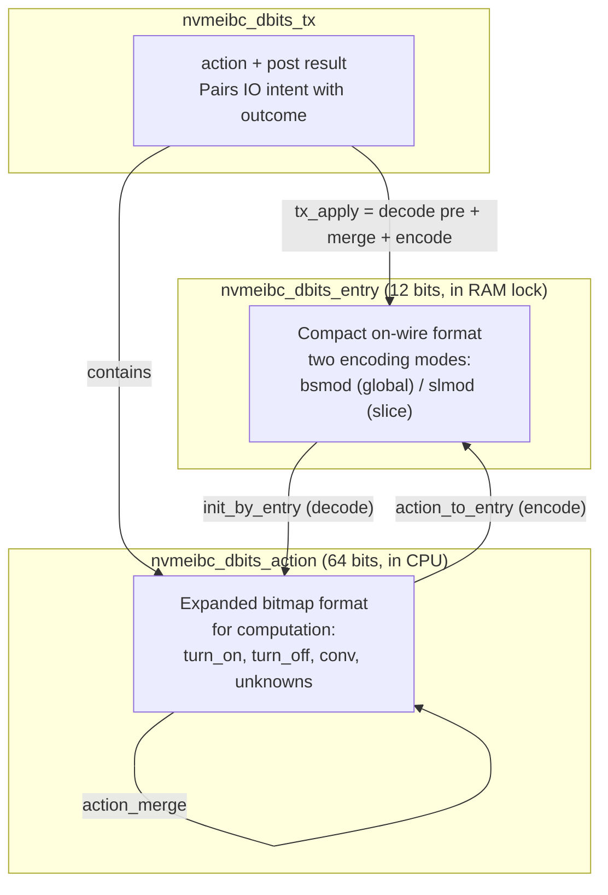
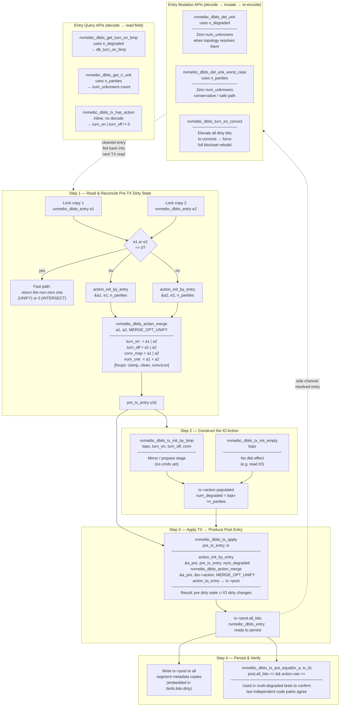

<!--
SPDX-FileCopyrightText: Copyright (c) 2026 NVIDIA CORPORATION & AFFILIATES. All rights reserved.
SPDX-License-Identifier: GPL-2.0-only OR Apache-2.0
-->

## Dirty Bits Engine — Complete Summary

### Purpose

The dirty bits engine tracks which disk segments in a protection raid have **stale data**. When a write happens and some segments can't receive the data (dead) or are being rebuilt (write-only), dirty bits record this so recovery knows which segments need attention. The engine handles encoding, decoding, merging, and applying dirty bit transitions across all RAID types.

---

### The Three Data Structures



#### 1. `nvmeibc_dbits_entry` — Storage Format (12 bits)

Lives in the RAM lock's `binfo.dirty` field, one per blockset per segment. Two encoding modes:

**Global mode (`bsmod`)** — up to 2 degraded, no per-slice info:
```
Bits [0:3]   mod_marker / is_d0_convict + is_d1_convict — mode detection + convict flags
Bits [4:7]   dead0 — first degraded seg index+1 (0xF = unknown)
Bits [8:11]  dead1 — second degraded seg index+1 (0xF = unknown)
```
Invariant: `dead0 >= dead1` (sorted descending). `0x000` = clean, `0xFF0` = double unknown.

**Slice mode (`slmod`)** — single degraded, with per-slice dirty range:
```
Bits [0:3]   dead0 — degraded seg index+1 (1..12)
Bits [4:8]   fst_slc — first dirty slice (0..31)
Bits [9:11]  len_slc — length minus 1 (0..7 = 1..8 slices)
```

Mode detection via `nvmeibc_dbits_entry_is_global_mode()`: `mod_marker ∈ {0, 0xD, 0xE, 0xF}` → global; `1..0xC` → slice.

#### 2. `nvmeibc_dbits_action` — Working Format (64 bits)

All computation happens in this unpacked form:

```c
struct nvmeibc_dbits_action {
    u16 db_turn_on_bmp;    // Bitmap: bit i = segment i is dirty
    u16 db_turn_off_bmp;   // Bitmap: bit i = segment i gets cleaned (full overwrite)
    u16 db_conv_map;       // Bitmap: bit i = segment i is a dirty convict (suspect data)
    u16 num_unknowns : 4;  // How many unknown dirty markers (0..max_parities)
    u16 num_degraded : 3;  // Ceiling for validation (n_parities or n_degraded)
    u16 has_slice_info: 1; // Can encode in slice mode (single degraded, no convicts/unknowns)
    u16 reserved     : 8;
    // All packed into u64 raw for comparison
};
```

**Decode** (`init_by_entry`): reads `dead0`/`dead1` nibbles, maps segment indices to bitmap bits, maps `0xF` to unknown count, maps convict flags to bitmap.

**Encode** (`action_to_entry`): extracts the 2 lowest-index dirty segments from bitmap, picks global vs slice mode, sorts `dead0 >= dead1`, encodes unknowns as `0xF`, sets convict bits.

#### 3. `nvmeibc_dbits_tx` — Transaction

Pairs the IO's **intent** with the **result**:

```c
struct nvmeibc_dbits_tx {
    struct nvmeibc_dbits_action action;  // What the IO wants to change
    union nvmeibc_dbits_entry post;      // Result after applying to pre-existing state
};
```

---

### The Core Algorithm: `nvmeibc_dbits_action_merge()`

#### Why it exists

A single dirty bits operation never happens in isolation. It always involves combining two pieces of information:
- **tx_apply**: merge pre-existing dirty bits (`old`) with the IO's action (`New`) to get post-IO state
- **merge_owners**: combine owner lock's dirty bits with copy-owner lock's dirty bits — take worst case
- **intersect_owners**: combine two lock copies — take best case (used for dual-lock IO path where any difference means stale)

Without merge, you'd need separate code paths for "apply turn-on", "apply turn-off", "combine with unknowns", "handle convicts" — a combinatorial explosion. The merge function handles all combinations in one algorithm.

#### The Algorithm (2 steps + fixups)

**Step 1 — Raw merge by strategy:**

| Field | MERGE_OPT_UNIFY (worst case) | MERGE_OPT_INTERSECT (best case) |
|-------|-----|------|
| `db_turn_on_bmp` | OR (any dirty = dirty) | AND (both dirty = dirty) |
| `db_turn_off_bmp` | OR | N/A (intersect has no turn-off) |
| `db_conv_map` | OR | AND |
| `num_unknowns` | ADD (both contribute) | MIN |

**Intersect with unknowns** has special cases: if one side has unknowns and the other has concrete dirty bits, prefer the concrete side (it has more information):
```c
if (New has unknowns && old doesn't) → use old's bitmaps
if (old has unknowns && New doesn't) → use New's bitmaps
if (both have unknowns) → OR bitmaps (pessimistic)
if (neither has unknowns) → AND bitmaps (true intersection)
```

**Step 2 — Fixups (critical for correctness):**

```c
// 1. Cap unknowns: segments that have concrete info can't also be unknown
resolved_bits = turn_on_bmp | turn_off_bmp;
n_max_unk = num_degraded - popcount(resolved_bits);
num_unknowns = min(num_unknowns, max(0, n_max_unk));

// 2. Apply turn-off: segments that got overwritten are no longer dirty
turn_on_bmp &= ~turn_off_bmp;

// 3. Clean convicts: only dirty segments can be convicts
conv_map &= turn_on_bmp;

// 4. Recalculate encoding mode eligibility
has_slice_info = !(n_deg > 1 || conv_map || num_unknowns);
```

The unknown capping in step 2 is the key insight: if the merge produced 4 unknowns (2+2 from unify) but the topology only allows 2 degraded segments, and 1 segment has a concrete dirty bit, then at most 1 unknown remains (`2 - 1 = 1`).

---

### API Interaction Flow

#### Write IO Path
```
1. nvmeibc_dbits_tx_init_by_bmp(tx, topo_traits, dead_bmp, writable_bmp, 0)
   → Creates action: turn_on for dead segs, turn_off for writable segs

2. nvmeibc_dbits_tx_apply(pre_entry, tx)
   → Decodes pre_entry → action_pre
   → Merges action_pre with tx.action (UNIFY)
   → Encodes result → tx.post
   → Returns tx.post.all_bits (written to lock)
```

#### Lock Merge (dual-lock IO path)
```
1. Read owner lock → entry_owner
2. Read copy-owner lock → entry_copy
3. nvmeibc_dbits_intersect_owners(entry_owner, entry_copy, topo_traits)
   → Decodes both entries with n_parities
   → Merges via INTERSECT (take best case)
   → Encodes and returns result
```

#### Recovery Worst Case
```
1. nvmeibc_dbits_tx_init_by_bmp(tx, topo_traits, dead|writable, 0, wm_convicts)
   → Turn on ALL non-RW segments + convicts for W-

2. nvmeibc_dbits_tx_apply(pre_entry, tx)
   → Merges pre with worst-case action

3. nvmeibc_dbits_del_unk_worst_case(result, topo_traits)
   → Removes unknown markers using n_parities
```

#### Entry-Level Query APIs
All follow the same pattern: decode → read field → return:
```
nvmeibc_dbits_get_turn_on_bmp(e, tt) → decode(e, n_degraded) → return a.db_turn_on_bmp
nvmeibc_dbits_get_n_unk(e, tt)       → decode(e, n_parities) → return a.num_unknowns
```

Note: `get_turn_on_bmp` uses `n_degraded` (current state), `get_n_unk` uses `n_parities` (capacity) — because unknowns can exist from a previous degradation state where `n_degraded` was higher.

#### Two variants of del_unk
```
nvmeibc_dbits_del_unk(e, tt)            → decode with n_degraded, clear unknowns, encode
nvmeibc_dbits_del_unk_worst_case(e, tt) → decode with n_parities, clear unknowns, encode
```
The `_worst_case` variant uses `n_parities` for decoding because recovery paths must handle dirty bits written under any prior degradation level.

---

### Configuration Table

| Config | Replicas | n_parities | Max unknowns | Merge sum (unk+unk) | Bits for unknowns | Max degraded | Bits for degraded |
|--------|----------|-----------|-------------|-------------------|-------------------|-------------|-------------------|
| JBOD | 1 | 0 | 0 | 0 | 0 | 0 | 0 |
| 2-mirror | 2 | 1 | 1 | 2 | 2 | 1 | 1 |
| RAID-5 (N+1) | N+1 | 1 | 1 | 2 | 2 | 1 | 1 |
| 3-mirror | 3 | 2 | 2 | 4 | 3 | 2 | 2 |
| RAID-6 (N+2) | N+2 | 2 | 2 | 4 | 3 | 2 | 2 |
| 4-mirror | 4 | 3 | 3 | 6 | 3 | 3 | 2 |
| 5-mirror | 5 | 4 | 4 | 8 | 4 | 4 | 3 |
| 6-mirror | 6 | 5 | 5 | 10 | 4 | 5 | 3 |
| 7-mirror | 7 | 6 | 6 | 12 | 4 | 6 | 3 |
| 8-mirror | 8 | 7 | 7 | 14 | 4 | 7 | 3 |

**Current field sizes:** `num_unknowns: 4 bits` (max 15), `num_degraded: 3 bits` (max 7). Sufficient for up to **8-mirror**.

**Formulas:**
- Max unknowns = `n_parities` (bounded by how many segments can be simultaneously non-readable)
- Merge sum = `2 × n_parities` (unify of two entries both at max unknowns)
- Bits for unknowns = `ceil(log2(merge_sum + 1))` (must hold transient merge sum)
- Max degraded = `n_parities`
- Bits for degraded = `ceil(log2(n_parities + 1))`



Key relationships to read from the diagram:

- **Step 1 → Step 3**: `pre_tx_entry` flows from the reconciled lock copies directly into `nvmeibc_dbits_tx_apply`. It is the "old" side of the final UNIFY merge.
- **Step 2 → Step 3**: `tx->action` is the "new" side. Both sides must use the same `num_degraded` (`BUG_ON` enforces this).
- **UNIFY is used twice**: once in Step 1 to reconcile two lock owner copies, once in Step 3 to fold the pre-tx state into the IO's action. In both cases safety demands the worst-case union.
- **Mutations feed back into Step 1**: `del_unk` and `turn_on_convict` produce a cleaned entry that gets stored back into metadata, which is then re-read as `e1`/`e2` on the next IO.
- **`n_degraded` vs `n_parities`**: queries/mutations that need precision use `n_degraded` (current state); those that must be conservative use `n_parities` (topology max). This split is visible in `del_unk` vs `del_unk_worst_case` and `get_turn_on_bmp` vs `get_n_unk`.
