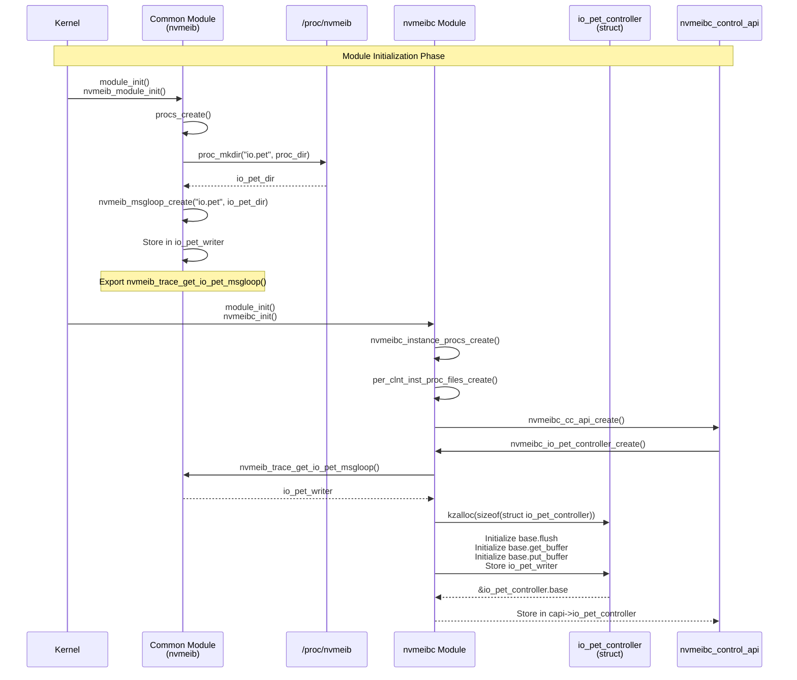
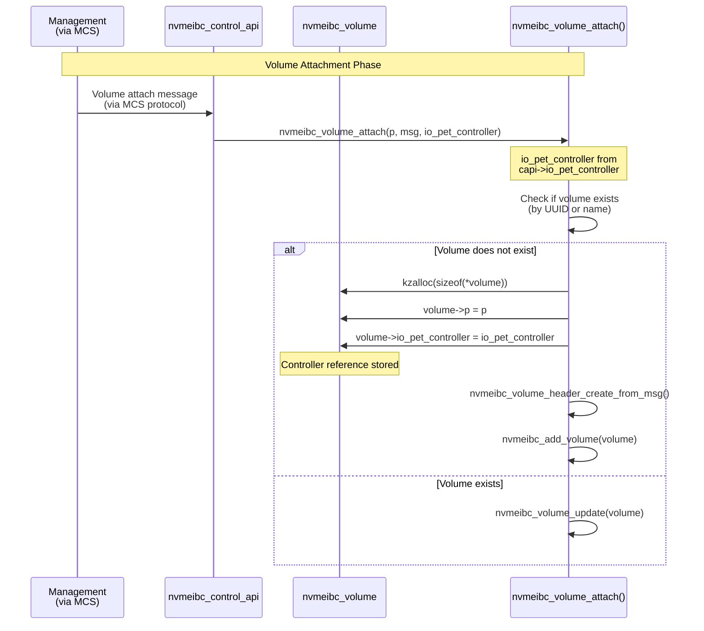
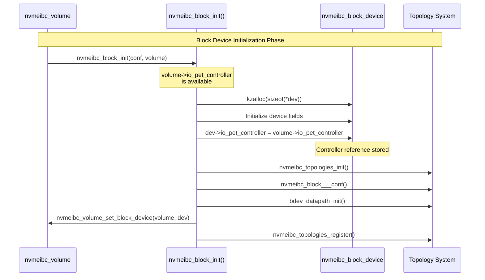
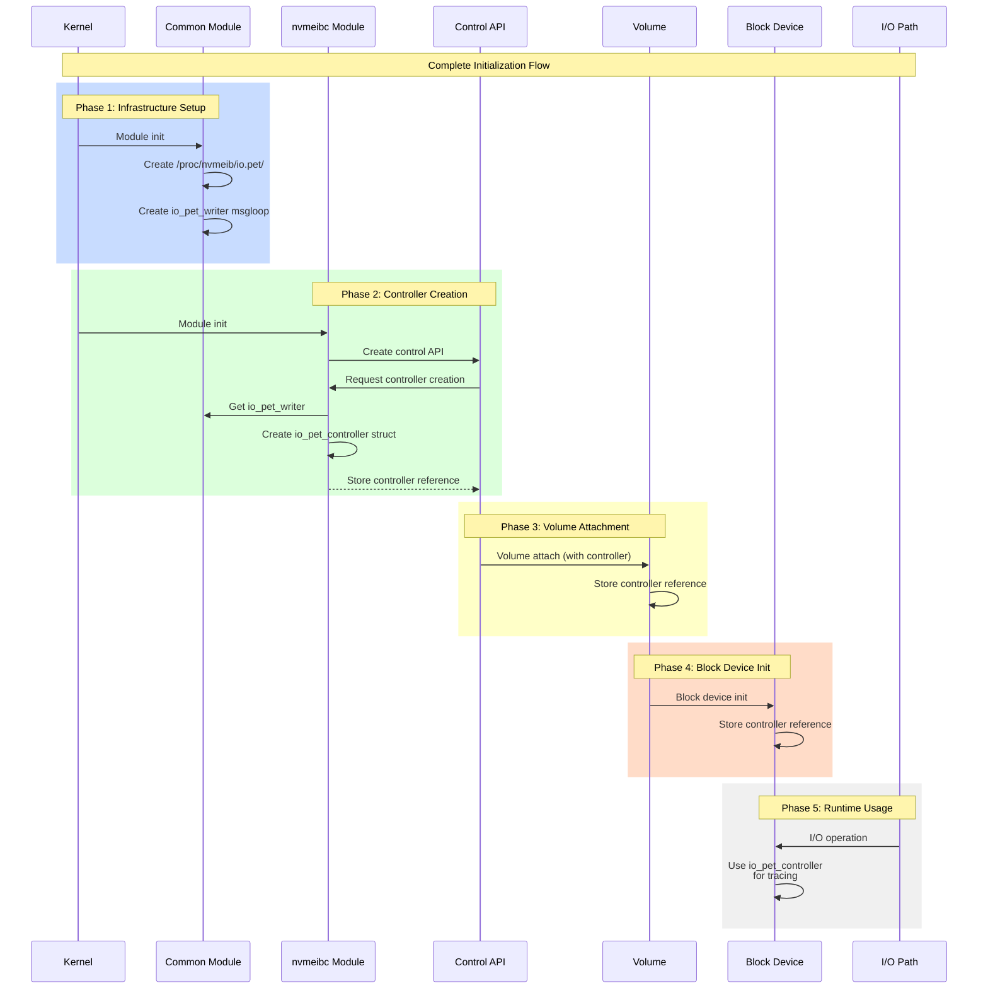

# PET Controller Initialization and Propagation Sequence Diagrams

This document describes the initialization and propagation flow of `nvmeib_pet_base_controller` derived structures through the NVMesh system.

This document was generated by AI and reviewed by human. The request to the cursor was:
1. read "pet.md" and "nvmeib_pet_specification.h" files
2. draw the call diagrams, using markdown, where nvmeib_pet_base_controller derived struct instance is initialized and used

Feel free to regenerate the file yourself.

## Overview

The PET (Per Entity Tracing) controller follows a hierarchical initialization and propagation pattern:
1. **Common Module** creates the proc filesystem infrastructure
2. **nvmeibc Module** creates the concrete controller instance
3. **Control API** stores the controller reference
4. **Volumes** receive the controller during attachment
5. **Block Devices** receive the controller from volumes during initialization

---

## Sequence Diagram 1: Controller Initialization

This diagram shows how the PET controller is initialized during module loading.



---

## Sequence Diagram 2: Controller Propagation to Volumes

This diagram shows how the controller is propagated from the control API to volumes during volume attachment.



---

## Sequence Diagram 3: Controller Propagation to Block Devices

This diagram shows how the controller is propagated from volumes to block devices during block device initialization.



---

## Sequence Diagram 4: Complete Initialization and Propagation Flow

This diagram shows the complete end-to-end flow from module initialization to block device usage.



---

## Key Data Structures

### Controller Hierarchy

```
struct nvmeib_pet_base_controller (interface)
    ├── flush()
    ├── get_buffer()
    └── put_buffer()

struct io_pet_controller (kernel implementation)
    ├── base: struct nvmeib_pet_base_controller
    ├── writer: struct msgloop_procfs_ent*
    └── cfg: { pet_buffer_size, msg_allocation_size }
```

### Storage Locations

1. **Common Module**: `io_pet_writer` (static variable)
2. **Control API**: `capi->io_pet_controller` (pointer)
3. **Volume**: `volume->io_pet_controller` (pointer)
4. **Block Device**: `dev->io_pet_controller` (pointer)

---

## Notes

- The controller is created once per nvmeibc module instance
- All volumes and block devices share the same controller instance
- The controller uses the msgloop infrastructure created by the common module
- Runtime journal layout and rotation are described in `pet.md`. Controller
  propagation is independent from whether
  an entity is still appending linearly or has rotated its suffix.
- Controller creation can fail if:
  - Memory allocation fails
  - Buffer size configuration is invalid (< 256 bytes)
  - The io_pet_writer from common module is unavailable

