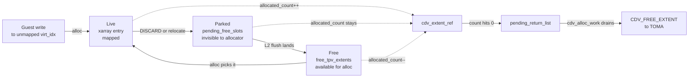
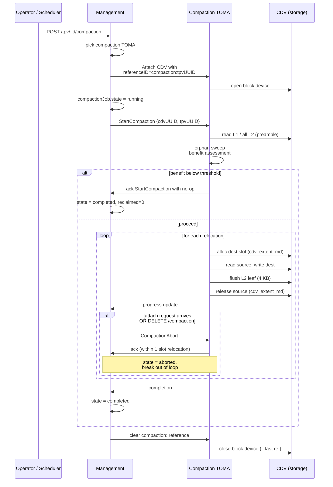
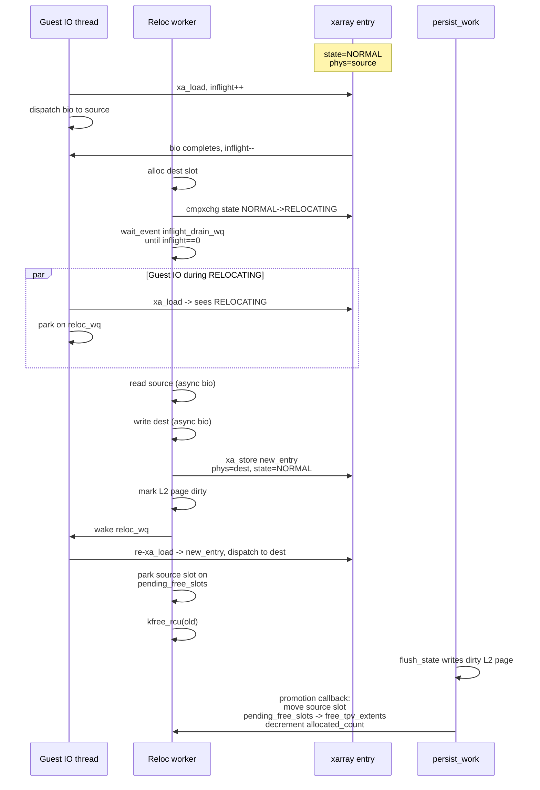
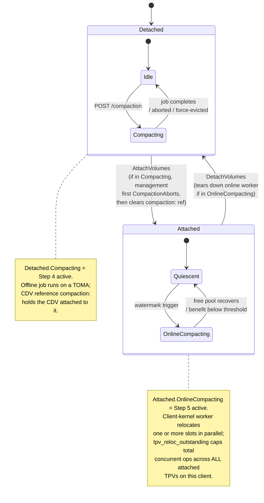

# TPV Trimming and Space Reclamation

Companion to `TPV_ThinProvisioningImplementation.md`. Terminology, structs,
and on-disk formats defined there are not re-defined here.

## Overview - purpose

A TPV's whole value proposition is that physical consumption tracks the
*written* footprint of the guest, not its virtual size. That invariant holds
trivially on first write, but it degrades over time: guest filesystems
delete files, databases drop tables, VMs are decommissioned - and without
a trimming path, the CDV extents those writes consumed stay pinned to the
TPV forever. Eventually the CDV fills up with cold data no one references.

Trimming is the inverse of allocation: it returns TPV_extents to the TPV's
free pool and, when a whole CDV extent becomes empty, returns that extent
to the CDV so a different TPV (or a different region of the same TPV) can
use it. At the extreme - when a TPV is mostly empty but its extents are
scattered across many half-full CDV extents - compaction physically
relocates live data to consolidate allocations and free whole CDV extents
that were previously pinned by a single leftover slot.

This document lays out the rollout order. Each step is usable on its own;
later steps add reclamation depth but are not prerequisites for earlier
ones being correct.

## High-Level Design

A single-page orientation for a developer coming in cold. Cross
references point forward into the per-step sections for detail;
rollout ordering is deliberately absent here.

### Glossary

Quick reference for the terms used across this doc; most are
defined at length in the main doc
`TPV_ThinProvisioningImplementation.md`.

| Term | Meaning |
|---|---|
| **CDV** | Capacity Data Volume. A regular NVMesh volume acting as a backing store for one or more TPVs. |
| **TPV** | Thin Provisioned Volume. A sparse block device whose extents are allocated on demand from a CDV. |
| **CDV_extent** | A contiguous chunk of CDV space (size `E`, typically 64 MiB) owned by a single TPV at a time. Allocated via `CDV_ALLOC_EXTENT`, freed via `CDV_FREE_EXTENT`. |
| **TPV_extent** | A slot inside a CDV_extent (size `T`, typically 64 KB); the unit of guest-visible allocation and reclamation. `n_slots = E / T`. |
| **virt_idx** | Virtual-extent index into the TPV: `virt_idx * T` is the guest byte offset. |
| **L1 / L2** | Two-level on-CDV tree mapping `virt_idx -> cdv_offset`. L1 lives in slot 0 of the TPV's first CDV_extent; L2 tables live in ordinary slots scattered across TPV-owned CDV_extents. |
| **xarray (extent_map)** | The in-memory client-side `virt_idx -> nvmeibc_tpv_extent_entry` map; authoritative while attached, rebuilt from L1/L2 on attach. |
| **cdv_extent_ref** | Per-CDV_extent tracking struct on the client: `allocated_count`, `pending_free_slots`, list membership (`cdv_extent_list` vs `pending_return_list`). |
| **free_tpv_extents** | Per-TPV pool of slots available for immediate allocation. |
| **pending_free_slots** | Per-ref list of slots logically freed but not yet L2-durable; invisible to the allocator until flushed (see Step 5 § Deferred slot visibility). |
| **pending_return_list** | Per-TPV list of refs whose `allocated_count` hit zero and are awaiting `CDV_FREE_EXTENT`. |
| **persist_work / flush_state** | Client-kernel work item that flushes dirty L1/L2 pages to CDV. |
| **`compaction:<tpvUUID>` reference** | CDV attachment reference used by management to keep a CDV attached to a compaction TOMA for the job's duration. |
| **compactionJob** | Mongo-side job-state record on the volume doc: `{state, tomaId, startedAt, progress, lastError}`. |
| **Orphan sweep** | Offline-compaction restart step: release allocator-owned slots not referenced by L1/L2 (see Step 4 § Restart and crash recovery). |

### Non-goals

This design explicitly does not address:

- **Sub-TPV_extent reclamation.** Discards smaller than `T` are
  acknowledged but produce no physical reclamation. A per-extent
  LRU bitmap is sketched in Notes / TO-DOs for future work.
- **Cross-CDV relocation.** Compaction moves slots within one CDV;
  it never migrates a TPV's data from one CDV to another.
- **Deduplication or compression.** Physical reclamation is driven
  by discard / compaction only; content-level dedup is out of
  scope.
- **Reclamation-latency guarantees to the guest.** Slot return is
  eventually-consistent relative to the guest `DISCARD`
  completion; no specific deadline.
- **Reclamation while a CDV preempt is in progress.** The TPV is
  torn down by `nvmeibc_tpv_handle_cdv_preempted` and compaction
  exits; re-attach replays the usual machinery.
- **Migration / compatibility with earlier deployments.** The
  thin-provisioning feature has no earlier deployed state to
  preserve; on-disk formats are unchanged anyway.

### What trimming is

A TPV presents a sparse block device: virtual extents that have
never been written consume no CDV capacity, and a guest write to
an unmapped virtual extent triggers on-demand allocation of a
physical slot. Trimming closes the loop: when the guest discards
a virtual extent, the physical slot that used to back it is
released so the CDV can reuse it elsewhere.

Two distinct reclamation levels:

- **Slot-level reclamation (within a TPV).** A guest-issued
  `DISCARD` covering a whole TPV_extent removes the slot from
  the guest-visible mapping (xarray erase) and parks it on the
  owning ref's `pending_free_slots`; the next `persist_work`
  flush nulls the L2 leaf and promotes the slot into
  `free_tpv_extents`, where a subsequent guest write can claim
  it. The TPV's physical footprint does not shrink yet - the CDV
  still sees the same CDV_extent as allocated to this TPV. The
  parking step is what makes the whole flow crash-safe without
  a journal; see § Core crash-safety invariants.
- **Extent-level reclamation (giving back to the CDV).** When a
  whole CDV_extent's last allocated slot is freed, the TPV
  releases the extent back to the CDV via `CDV_FREE_EXTENT`,
  and some other TPV on the same CDV can now allocate from it.

The unit of reclamation is one TPV_extent (`T` bytes, typically
64 KB or larger). Discards that don't cover a whole TPV_extent
are acknowledged to the guest but have no reclamation effect -
there is no sub-extent dirty bitmap.

### What compaction is

Slot-level reclamation produces extent-level reclamation only
when an extent happens to empty out completely. Real workloads
leave extents at partial utilization - one live slot out of
thousands keeps the whole extent pinned. Over time, a TPV
accumulates many lightly-populated CDV_extents consuming many
times their useful footprint.

Compaction is the answer: relocate live slots out of sparse
extents into dense ones, so the sparse extents can be emptied
and returned. The relocation is an atomic-ish read-write-update
sequence - read T bytes from a source slot, write them to a
fresh slot in a dense destination, flip the L2 leaf to point at
the new slot, release the source slot. Guests see the virt_idx
point at the new physical location; data is unchanged.

Two flavors:

- **Offline compaction** runs while the TPV is detached from any
  client. A management-orchestrated job attaches the CDV to a
  chosen compaction TOMA, which reads L1/L2 directly off the
  CDV, plans relocations, and executes them. Best for TPVs that
  are idle for long windows and can be worked on without
  affecting any attached workload.
- **Online compaction** runs while the TPV is attached, from
  inside the client kernel. The client already owns the
  authoritative mapping (xarray, L1/L2, allocator), so it
  executes relocations without any TOMA round-trip. Best for
  always-attached TPVs (long-lived VMs) that would never reach
  a detached state where offline could run.

The two never run simultaneously on the same TPV - offline
requires detached, online requires attached, and management
sequences the transitions.

### System responsibilities

- **Client kernel (nvmeibc).** Owns the authoritative TPV
  mapping while attached: xarray, L1/L2 tree, allocator state,
  `pending_return_list`, `pending_free_slots`. Routes
  `REQ_OP_DISCARD` to the TPV free path. Runs online compaction.
  Sends `CDV_FREE_EXTENT` to TOMA when an extent empties.
- **TOMA (nvmeibt).** Owns CDV-wide allocator state and the
  block-level access to CDV storage. Accepts `CDV_ALLOC_EXTENT`
  and `CDV_FREE_EXTENT` from clients. Serves offline compaction
  jobs when management assigns one. Pushes `CDV_CAPACITY_RESTORE`
  broadcasts when capacity frees up.
- **Management (nvmesh-management).** Consumes TOMA-side and
  client-side stats via Kafka (`CDVAllocatorStats`, `TPVStats`)
  and persists them in the volume doc. Owns the offline
  compaction REST surface (`POST / GET / DELETE
  /thinProvisioning/tpv/:id/compaction`), the job state machine
  (`compactionJob` in the volume doc), CDV attach/detach for
  compaction workers (via `compaction:<tpvUUID>` reference
  tracking), and the global off-switch. Surfaces
  `lastDetachedAt` for operators to pick compaction candidates.

**Data-structure tier (client side).** A slot moves through
three distinct states on the client (Live, Parked, Free); the
state it's in dictates who can see it. When an owning extent
empties, it transitions separately through `pending_return_list`
and is returned to TOMA via `CDV_FREE_EXTENT`:



*Figure 1: Slot lifecycle. `allocated_count` covers Live + Parked
states; the `free_tpv_extents` pool covers only the Free state.
The Parked state is what makes discard and relocation crash-safe
without a journal (§ Core crash-safety invariants).*

### Messaging summary

**Trim path (no new IB admin messages):**

- `NVMEIBC_MA_CDV_FREE_EXTENT` (existing IB admin path, sent
  from client `cdv_alloc_work`). Pre-trim the plumbing existed
  but was never fired, because there was no code path that
  could empty a CDV_extent while the TPV was running - writes
  are monotonically-allocating and the bulk-free on TPV delete
  goes through the Kafka `CDVAllocatorFreeAll` path instead.
  Trimming activates this message in the `pending_return_list`
  drain.
- `NVMEIBC_MA_CDV_ALLOC_EXTENT` (existing) - unchanged behavior;
  what's new is that capacity-restore feedback makes previously
  parked bios retry these requests.

**New messages:**

- `CDV_CAPACITY_RESTORE` - TOMA-to-client broadcast, same framing
  as `CDV_ALLOCATOR_UPDATE` with a distinct type byte. Fired
  when an extent returns to the CDV-wide free pool and at least
  one client had bios parked on `CDV_ALLOC_CDV_FULL`. Receivers
  re-arm `cdv_alloc_work` on matching TPVs.
- `StartCompaction` - management-to-TOMA, `{cdvUUID, tpvUUID,
  strategy, minReclaimableExtents}`. Starts an offline job.
- `CompactionAbort` - management-to-TOMA, `{cdvUUID, tpvUUID}`.
  Terminates an in-flight offline job at its next per-slot
  boundary.

**New Kafka messages:** none for trim (reuses `CDVAllocatorStats`
/ `TPVStats`); none for online compaction. Offline job status
flows over the TOMA control channel that carries
`StartCompaction` / `CompactionAbort`, then into the volume doc
via management.

**New references:** `compaction:<tpvUUID>` on the CDV, tracked
by `cdvTomaAutoAttach.js` reference counting. Holds the CDV
attached to the compaction TOMA for the job's duration.

### Core crash-safety invariants

Three ordering rules are the load-bearing correctness properties
across trim and compaction. Every crash-recovery story in the
document flows from these:

1. **Slot visibility is gated on L2 durability.** A physical
   slot only enters `free_tpv_extents` after the L2 page that
   used to reference it (now null for a discard, now
   redirected for a relocation) is durable on CDV. Implemented
   via per-ref `pending_free_slots` drained by the
   flush-completion callback. This is what makes both trim and
   online compaction crash-safe without a journal.
2. **Extent release is gated on L2 durability.**
   `CDV_FREE_EXTENT` for a whole extent only fires after every
   L2 leaf that used to point into that extent is durable-null
   on CDV. In practice this falls out of rule 1: the extent
   can't be on `pending_return_list` until its slots have all
   been promoted from `pending_free_slots`, which already
   requires the flushes.
3. **Offline compaction releases source only after destination
   L2 is durable.** Per-slot ordering in the offline protocol:
   allocate dest -> copy data -> durable L2 redirect -> release
   source in the allocator. Every crash window leaves at most
   one orphan slot (dest with no L2 pointer, or source with no
   L2 pointer), which the next job's orphan sweep cleans up.
   No journal.

A single phrase captures all three: **the on-CDV L2 is the
authoritative referent; a slot cannot be reused until the L2
change that released it is durable.**

### Administrator's view

**Monitoring** (already available, no new dashboards required):

- Per-CDV `runtimeStats.allocatedExtents` /
  `totalDataExtents` - watch this *decrease* as trim / compaction
  reclaim. Pre-trim this value was monotonic.
- Per-TPV `runtimeStats.tpvExtentsInUse` /
  `tpvExtentsTotal` - the TPV's physical footprint shrinking as
  guests discard.
- `runtimeStats.cdvExtents` - number of CDV_extents held by a
  TPV; shrinks as extents empty and return.

**Day-to-day operation:**

- Enable discard inside guests (filesystem `discard` mount
  option, periodic `fstrim`, or equivalent). No NVMesh-side
  action beyond confirming discard advertises correctly on the
  TPV block device.
- Online compaction runs automatically for attached TPVs based
  on watermark triggers; operator tuning is a single
  client-wide module parameter (`tpv_reloc_outstanding`,
  range 0..64; 0 disables) that caps total concurrent
  relocations across every attached TPV on this client.
- Offline compaction is operator-initiated:
    - `POST /thinProvisioning/tpv/:id/compaction` on a detached
      TPV. Optional `strategy: "in-place" | "copy"` and
      `minReclaimableExtents` threshold.
    - `GET ... /compaction` for progress.
    - `DELETE ... /compaction` to abort.
- Picking candidates: `GET
  /thinProvisioning/tpv/candidates-for-compaction?minIdleDays=N`
  lists TPVs detached for at least N days. A cron can pipe this
  into `POST /compaction` for unattended cleanup.

**Emergency controls:**

- Global off-switch for offline compaction at two levels
  (management: `settings.tpvOfflineCompactionEnabled`; TOMA
  runtime: `offline_compaction_enabled` in `oper_params[]`). Both
  default on; either one flipping off blocks new jobs without
  touching in-flight.
- Per-TPV abort (`DELETE /compaction`) terminates an in-flight
  job within one slot relocation (typically single-digit ms).

**Failure modes worth surfacing:**

- An attach request on a TPV with an active offline job waits
  for management to abort the job (bounded by the job's
  abort-ack time + management's 2 s eviction timeout).
- `POST /compaction` on an attached TPV returns
  `409 tpv-attached`; operator must detach first.
- A TOMA that dies mid-compaction leaves the job in `failed`;
  a re-run picks up via orphan sweep, no manual intervention.

### Security considerations

Trimming and compaction inherit the main doc's threat model
(`TPV_ThinProvisioningImplementation.md` §3.7) unchanged. Three
additions specific to this design:

- **Discard exposes zero, not stale data.** A guest `DISCARD`
  immediately unmaps the virt_idx (xarray erase); subsequent
  guest reads return zero from the zero-fill path, independent
  of whether the underlying CDV block has been overwritten.
  Operators who want the physical block scrubbed before reuse
  still opt in via `cdv_extent_zero_on_free` (existing TOMA
  runtime config); the satellite-volume gap noted in main doc
  §3.9 carries over to this design unchanged.
- **Offline compaction does not cross TPV boundaries.** The
  compaction TOMA operates only on slots whose
  `cdv_extent_md.tpv_uuid` matches the job's target TPV. The
  orphan sweep and benefit scan are scoped identically. No
  code path during compaction reads or writes data belonging to
  another TPV on the same CDV.
- **Online compaction stays inside the client's own mapping.**
  The relocation worker only mutates `xarray` / L1 / L2 entries
  for the TPV it is running inside. It has no access to other
  TPVs' mappings even if they share the parent CDV.

The `compaction:<tpvUUID>` CDV reference uses the existing
reference-tracking path (`cdvTomaAutoAttach.js`) and inherits its
authentication: only management (operating against MongoDB under
its own credentials) can add or clear the reference.

### Performance model

Back-of-envelope numbers for sizing and tuning; actual
measurements come from the performance tests in Step 5.

**Metadata overhead.** L2 tables are sticky-monotonic (main doc
§3.4.1); the permanent overhead of one pinned L2 slot per
`N_L2 = T / 8` virtual extents works out to one TPV_extent per
8192 virtual extents at T=64 KB - **0.012%** of virtual space. For
a 1 TiB TPV with T=64 KB, that is ~128 MiB pinned by L2 tables.

**Online compaction throughput** as a function of
`tpv_reloc_outstanding = N` and CDV round-trip time `RTT`:

  throughput_ops_per_sec ≈ N / (2 × RTT)
  throughput_bytes_per_sec ≈ N × T / (2 × RTT)

At `N = 4`, `RTT = 1 ms`, `T = 64 KB`: ~128 MB/s of live-data
churn. At `N = 16`: ~512 MB/s. Upper bound is CDV saturation. A
1 TiB sparse TPV at 10% live footprint (100 GiB of data to move)
reclaims in ~13 minutes at `N = 4`, ~3 minutes at `N = 16`.

**Offline compaction throughput.** Per relocation, the
compaction TOMA issues one T-byte read, one T-byte write, and
one 4 KB L2 page write. At T=64 KB the per-op IO mix is
64 KB in + 68 KB out on the CDV. Two regimes depending on the
CDV's bandwidth model:

- **Full-duplex** (reads and writes are separate pipes each at
  CDV_BW, typical for RDMA): the write side is the long pole,
  at 68 KB per 64 KB of live-data movement, so effective
  relocation throughput ≈ `CDV_BW × 64/68 ≈ 0.94 × CDV_BW`. On
  a 2 GB/s CDV: ~1.88 GB/s live-data movement.
- **Single-pool** (reads and writes share one 2 GB/s pool): the
  total of 132 KB per op caps effective throughput at
  `CDV_BW × 64 / 132 ≈ 0.48 × CDV_BW`, i.e. ~970 MB/s on the
  same CDV.

**Discard throughput.** `fstrim` on a TB-scale filesystem at
T=64 KB can emit ~16 M discards for 1 TiB of free space. Each
discard is cheap in isolation (xarray erase + park on
`pending_free_slots`) but `persist_work` must flush every dirty
L2 page before any of those slots are reusable. At one 4 KB
L2-page write per `N_L2 = 8192` discards, the metadata tax is
bounded: 16 M discards → at most `ceil(16M / 8192) ≈ 2 K` L2
pages, ~8 MiB of CDV metadata writes. Not throughput-limiting;
the bottleneck is the xarray erase rate, not the CDV.

**Guest IO latency impact.** For a guest virt_idx that collides
with an active relocation, the worst-case parked latency is
one T-byte CDV copy + one 4 KB L2 flush. At T=64 KB on a 2 GB/s
CDV that is ~40 µs copy + one 4 KB sync write (~200 µs on typical
RDMA), so upper bound is single-digit ms. Uncontended virt_idx
sees no latency change.

**Extent return latency.** From "guest DISCARD completes" to
"CDV_FREE_EXTENT arrives at TOMA" involves: slot park (immediate)
→ `persist_work` flush (next tick, typically ≤ 100 ms at default
cadence) → `cdv_alloc_work` drain (next scheduled run, up to
watermark-gated delay). A continuously-trimming workload sees
sub-second return latency; a sporadic trimmer may see tens of
seconds before the extent empties and returns.

---

## Rollout order

**Granularity note (applies to every step below).** The unit of
reclamation is one TPV\_extent (`T` bytes, typically 64 KB or larger).
A discard that does not cover a whole TPV\_extent is acknowledged to the
guest but produces no space reclamation - there is no sub-extent dirty
bitmap, so we cannot represent "part of this extent is now zero" in
either the xarray or the L2 leaf. In practice this means guest
filesystems with cluster / block sizes smaller than `T` will only see
reclamation from trims that happen to align to and span full TPV
extents (usually large free-run cases like `fstrim` on an idle volume,
or whole-file deletes of files at least `T` in size). Partial-extent
discard with sub-extent tracking is listed as a possible future
enhancement in *Notes / TO-Dos*.

1. **Client-side L2 null marking.** Wire `REQ_OP_DISCARD` end to end so
   trimmed virtual extents get their L2 leaf set to 0 and the TPV_extent
   goes back to `free_tpv_extents`. No CDV-side communication yet; no L2
   table reclamation yet.
2. **Return empty CDV extents to the CDV.** Once a `cdv_extent_ref`
   reaches `allocated_count == 0 && !is_l1_extent`, send
   `CDV_FREE_EXTENT` so TOMA puts the extent back in the CDV-wide free
   pool. Covers the TOMA handshake, ordering vs. allocation, and the
   recovery/orphan story.
3. **MVP gaps.** Whatever remains before we can ship trim as a supported
   feature: advertising discard geometry, capacity-accounting UI audit,
   CDV capacity-restore notification, telemetry.
4. **Offline TOMA-driven compaction.** A TOMA that owns a CDV reads live
   slots out of half-full extents, rewrites them into denser extents, and
   frees the emptied ones. Gated on a cost/benefit check to avoid write
   amplification on CDVs that don't need it. Interruptible - any client
   attach aborts the job cleanly.
5. **Online compaction.** Client-driven, per-L2-entry locking. Relocates
   one virtual extent at a time while the TPV stays attached; serializes
   only against concurrent IO to the *same* virt_idx, not the whole
   client. Targets long-running always-attached TPVs that Step 4 cannot
   reach.
6. **Last-attach statistics in management.** Surface `lastDetachedAt`
   (and related idleness metrics) in the management API / UI so operators
   - or automation - can pick the right moment to trigger an offline
   compaction.

---

## Step 1 - Client-side L2 null marking

### Goal
A guest-issued `DISCARD` (or `blkdiscard`, or `fstrim`) for a range that
covers one or more whole TPV_extents must release those extents back to
the TPV's internal free pool and zero out the L2 leaves that pointed at
them. After the flush lands, a subsequent read of the same virtual range
returns zero without touching the CDV.

### What already exists
- `nvmeibc_tpv_make_request` routes `REQ_OP_DISCARD` to
  `nvmeibc_tpv_free_extent` (TPV §3.5, §3.6).
- `nvmeibc_tpv_free_extent` already does the xarray erase, slot push,
  allocated_count decrement, and L1-excluded `pending_return_list`
  transition.
- `flush_state` already writes `cdv_offset = 0` for leaves whose xarray
  slot is empty (§3.4.1, §3.4.3).
- `cdv_offset == 0` is the documented NULL sentinel (§3.4.2).

So the leaf-nulling mechanics are in place. Step 1 is about turning that
path on end-to-end and verifying the semantics, not inventing new
structures.

### What Step 1 actually entails
1. **Advertise discard on the gendisk.** Set `max_discard_sectors`,
   `discard_granularity = tpv_extent_size_kb * 1024`, and
   `discard_alignment = 0` at `nvmeibc_tpv_attach` time. Without this,
   filesystems will not emit discards at all.
2. **Reject / split misaligned discards.** Only discards that cover a
   whole TPV_extent can free a slot. A discard that partially overlaps an
   extent must be handled as a no-op for that extent (the guest cannot
   prove the remaining bytes are dead). Easiest: split the incoming bio
   on extent boundaries in `nvmeibc_tpv_make_request` (we already split
   on extent boundaries for writes) and drop any segment shorter than
   `T`. A partial-extent discard becomes a successful bio with no state
   change.
3. **Sync-flush interaction.** In `sync_flush` mode, data-before-metadata
   ordering must still hold, but a discard has no data to write. The
   free path just marks dirty and schedules `persist_work`; no parking
   on `pending_l1_flush_bios`. The bio completes immediately; the L2
   leaf will be nulled on the next flush.
4. **Crash semantics.** If we crash between the bio completing and
   `flush_state` landing, the leaf is still non-null on disk and
   recovery re-adopts the slot as allocated (§3.8 load_state). This is
   safe: the guest saw the discard complete, but the block is simply
   re-mapped to the same offset it had before the discard. Reads return
   whatever was there pre-discard, not zero. That is *weaker* than most
   guest filesystems expect but not incorrect (discard is advisory at
   the block layer). No data corruption. Document this.
   - **Self-healing via the next fstrim.** The filesystem's notion
     of "this range is free" is stored in its own journal / free
     bitmap, independent of our discard path. A subsequent `fstrim`
     re-emits DISCARD for every currently-free range, including any
     whose first DISCARD was lost to the crash window. Our
     `free_extent` path handles a DISCARD on a mapped virtual extent
     identically the second time around. Net result: the lost
     reclamation is picked up on the next `fstrim` (or on any
     filesystem emitting per-write discards via the `discard` mount
     option). Operators running periodic `fstrim` therefore see no
     lasting capacity loss from this crash window.
   - A stronger variant for sync_flush mode - park discard bio
     completion on `pending_l1_flush_bios` until the L2 null is
     persisted - is deferred as a follow-up; users who have already
     opted into sync_flush for durability are the natural audience.
     For now, sync_flush discards share the async semantics, and
     the fstrim-idempotency property above is the mitigation.
5. **L2 tables stay put.** Per the §3.4.1 sticky-monotonic rule, an L2
   whose leaves all become null is *not* reclaimed. It stays pinned in
   its slot, contributes 1 to `allocated_count`, and prevents its
   hosting CDV extent from being returned until something else owns
   that extent. This is the deliberate limitation of Step 1: a TPV that
   gets fully trimmed still holds onto its L2-hosting CDV extents.
   Addressing this requires the L2-slot-kind tracking that §3.4.1
   explicitly removed; revisit only if profiling shows the residual
   is meaningful (worst case: one pinned CDV extent per `N_L2` virtual
   extents = 1 / 8192 with T=64 KB, i.e. 0.012%).
6. **Proc / stats.** Add counters for `stat_discard_ok`,
   `stat_discard_misaligned_skipped`. Wire into the existing
   `/proc/nvmeibc/tpv/<name>/stats`.

### Tests
- New self-test `tpv_ktest_discard`: alloc a virt range, discard it
  whole, verify `xa_load` returns NULL, verify free slot reappears,
  verify flush writes `cdv_offset = 0` to the expected leaf.
- Misaligned-discard test: discard `T/2` bytes, verify the slot stays
  allocated and no stats tick on `discard_ok`.

### Exit criteria
`blkdiscard -o <aligned> -l <N*T>` on a mounted TPV reduces
`xa` population and the free pool grows correspondingly; read-after-
discard returns zero on a running system (the post-reboot case is the
documented weaker semantics above). No CDV-side work; no TOMA changes.

---

## Step 2 - Return empty CDV extents to the CDV

### Goal
When a CDV extent's `allocated_count` hits zero and it is not the L1
extent, the client gives it back to TOMA so some other TPV on the same
CDV can use it.

### How it is communicated
The existing `NVMEIBC_MA_CDV_FREE_EXTENT` IB admin message already
exists in the client-to-TOMA vocabulary (main doc §3.7), with
allocator-side handling and fire-and-forget semantics wired up.
Pre-trim the plumbing was never actually exercised because no
running TPV ever emptied an extent (writes are monotonically
allocating and TPV delete uses the Kafka
`CDVAllocatorFreeAll` bulk path, not per-extent `CDV_FREE_EXTENT`).
Step 2 activates this message on the client side and tightens the
invariants it requires.

The existing plumbing:
- `nvmeibc_tpv_free_extent` moves the ref to `alloc->pending_return_list`.
- `cdv_alloc_work` drains `pending_return_list` *before* issuing new
  `CDV_ALLOC_EXTENT` requests - this is already coded and is exactly
  what we want for trim-driven churn (a DISCARD-heavy workload should
  not grow CDV consumption).

What remains to verify / add:

1. **Arming `cdv_alloc_work` from the free path.** `free_extent` must
   schedule `cdv_alloc_work` whenever `pending_return_list` gains an
   entry, even when the free pool is above `low_watermark` (so we do
   not wait for the next allocation to flush returns). Small change.
2. **Watermark-gated return (avoid churn).** Returning a CDV extent
   costs `n_slots` from `free_tpv_extent_count` (item 4 below purges
   the extent's slots from the free pool before the IB send). If that
   purge would drop the free pool at or below `low_watermark`, the
   return is counterproductive: `cdv_alloc_work` would immediately
   turn around and issue a `CDV_ALLOC_EXTENT` for a fresh extent,
   adding nothing. Gate the drain accordingly:
   ```
   for ref in pending_return_list:
       if free_tpv_extent_count - n_slots < high_watermark:
           break    # keep ref parked; its slots stay in the free pool
       purge ref's slots from free_tpv_extents
       send CDV_FREE_EXTENT
       free ref
   ```
   Use a `high_watermark` distinct from (and strictly greater than)
   `low_watermark` to provide hysteresis - otherwise a workload that
   hovers exactly at `low_watermark` oscillates between return and
   re-alloc. Suggested: `high_watermark = 2 * low_watermark`. A ref
   that stays parked across many `cdv_alloc_work` runs is fine; its
   slots are still usable, and it gets returned as soon as the free
   pool grows (another trim lands, or another extent becomes fully
   empty and replaces it in the returnable-but-not-urgent role).
3. **Persistence ordering.** The leaf must be nulled on the CDV
   *before* we tell TOMA we no longer own the extent. Otherwise a crash
   between "TOMA freed" and "L2 leaf nulled" leaves an orphan pointer
   in L2 that, on attach, is re-adopted by load_state into a
   CDV_extent that TOMA has since re-assigned to someone else -
   reading another TPV's data.

   The invariant is an *order*, not atomicity. Lazy flushing and lazy
   `CDV_FREE_EXTENT` sending are both fine as long as, *for the
   specific extent being returned*, every L2 leaf that used to
   reference it is durable-null on the CDV before the IB admin send.
   This is narrower than "all dirty L2 pages flushed" - an unrelated
   dirty L2 page for a different extent is not a blocker for returning
   *this* extent.

   Two implementations, from simplest to most precise:
   - **(a) Global drain, recommended default.** `cdv_alloc_work` runs
     `flush_state` to completion on all dirty pages, then drains
     `pending_return_list` in one pass. Costs a few extra milliseconds
     of flush on unrelated pages per drain cycle; no per-extent
     bookkeeping needed.
   - **(b) Per-extent check.** Each `cdv_extent_ref` tracks whether
     any L2 page that references one of its slots is still dirty
     (maintained by the allocator when `free_extent` dirties a leaf).
     `cdv_alloc_work` can then return a ref whose per-extent
     dirty-counter is zero without flushing anything else. Worth doing
     only if profiling shows (a)'s redundant flushing is material;
     until then ship (a).

   In both cases, `flush_state` must write the L2 page for the L2
   leaves, and - if the return emptied the last L2 entry for an L1
   slot - the L1 page, before the IB send. `L1 header.n_l2_tables_used`
   is unchanged by returns in Step 2 because L2 tables are
   sticky-monotonic (Step 1 item 5); only the L2-leaf pages change.
4. **Race with a concurrent allocation on the same extent.**
   `pending_return_list` holds a ref whose `allocated_count == 0`.
   If a new virtual write picks a slot on that same extent before we
   send `CDV_FREE_EXTENT`, we must cancel the return. Implementation:
   on alloc, check if the chosen slot's owning ref is on
   `pending_return_list`; if so, move it back to `cdv_extent_list`
   and proceed. Needs the allocator lock held across the
   list-membership flip.
5. **Race with a concurrent `CDV_FREE_EXTENT` in flight.** Once the
   IB message is on the wire, we cannot un-send it. The window we
   need to close: TOMA has not yet processed the free, the client
   starts allocating from slots that belong to the extent-being-
   returned. Fix: at the moment we enqueue the IB send, the
   extent's slots must be invisible to the allocator regardless of
   which list they're on. Concretely, both:
     - Remove any of the extent's slots already promoted to
       `free_tpv_extents` (the set that made `allocated_count` hit
       zero in the first place).
     - Drop any of the extent's slots still parked on its own
       `ref->pending_free_slots` list (see "Step 2 / Step 5
       unification" below): these are slots freed but awaiting
       L2 flush; since the whole extent is going away, their L2
       pages have already been flushed as part of the extent
       becoming returnable (Step 2 item 3), so no further promotion
       is needed.
   After the purge, the extent contributes zero slots to either
   list. Skipping either sub-step means we can allocate a slot
   whose backing CDV_extent is about to be reassigned.
6. **Recovery / orphan avoidance.** After a crash mid-return, there
   are three possible states:
   - **Leaves nulled, TOMA still thinks extent is ours.** On
     reattach, `CDV_LIST_EXTENTS` reports the extent; `load_state`
     walks L1/L2, finds no leaves reference it; `nvmeibc_tpv_recovery`
     sees an extent with zero references and... currently *adopts*
     it back as an empty TPV-owned extent (slots go in free pool).
     That is safe but wastes a re-return. Extend recovery: if an
     adopted extent has `allocated_count == 0` after the walk and it
     is not the L1 extent, move it immediately to
     `pending_return_list`.
   - **Leaves nulled, TOMA acked free, client died before updating
     memory.** On reattach, `CDV_LIST_EXTENTS` does not report the
     extent - nothing to adopt. L1/L2 already null. No orphan. Clean.
   - **Leaves still non-null, TOMA already acked free.** This is the
     dangerous window that ordering item 3 closes. If the ordering
     is enforced, this state is unreachable.
7. **TOMA-side idempotency.** `handle_cdv_free_extent` must accept a
   `CDV_FREE_EXTENT` for an extent it does not know about (already
   freed, or never allocated) and return success, not error. Required
   so that client retry after a dropped IB ack does not fail.

### Step 2 / Step 5 unification: `pending_free_slots`

Step 2's `free_extent` does not push slots directly to
`free_tpv_extents`. It parks them on the owning ref's
`pending_free_slots` list; the flush-completion callback in
`persist_work` promotes them once the L2 page that used to
reference them is durable-null on CDV. The data structure and
the correctness argument are spelled out in Step 5's "Deferred
slot visibility" section - it applies identically here, because
the hazard (slot reused before the L2 null is persisted, then
crash-recovery finds two virt_idx pointing at the same slot) is
symmetric between discard-driven freeing (Step 2) and
relocation-driven freeing (Step 5). The "(a) Global drain"
implementation named in item 3 above is exactly the flush-
completion callback promoting all parked slots in one pass.

### Tests
- Fill a TPV, trim a whole CDV_extent's worth of aligned virtual
  range, verify a `CDV_FREE_EXTENT` shows up on TOMA and the CDV's
  `alloc->n_allocated` decreases.
- Concurrent alloc-during-return stress: one thread trims, another
  writes. No double-owned extents (add a `cdv_extent_index`
  invariant check to `load_state`).
- Kill the client mid-return (before, during, after the IB send);
  remount; verify no orphan state via a fresh `CDV_LIST_EXTENTS`
  cross-check.

### Exit criteria
A sustained write-then-trim loop on a single TPV keeps
`CDV.n_allocated` bounded instead of monotonically growing.

---

## Step 3 - MVP gaps

With Steps 1 and 2 in, trim works end-to-end for the common case.
Remaining before we can call it shippable:

1. **Discard advertising in management and CSI.** Management's
   volume-create reply and the CSI `NodeGetVolumeStats` capability
   reporting should advertise discard support on TPVs (not on regular
   volumes, not on CDVs). CSI currently does not set `BLOCK_DISCARD`
   on TPV StorageClass mounts.
2. **Capacity accounting - already covered.** Management already
   receives per-CDV allocation stats via the `CDVAllocatorStats`
   Kafka message (emitted by TOMA from `cdv_publish_alloc_stats` in
   `toma/nvmeibt_cdv_alloc.c` after every alloc / free) and per-TPV
   physical-consumption stats via the `TPVStats` Kafka message
   (emitted by the management agent on each keepalive cycle from
   `collectAndSendTPVStats` in `management_cm/managementAgent.py`,
   reading `/proc/nvmeibc/tpv/*/status`). Both land in the volume
   doc as `runtimeStats.{allocatedExtents, totalDataExtents,
   cdvExtents, tpvExtentsInUse, tpvExtentsTotal}` via
   `handleCDVAllocatorStats` / `handleTPVStats` in
   `modules/volume.js`. The UI consuming these fields is the only
   gap to audit: verify the TPV table and CDV table actually display
   the `runtimeStats` values, and that the
   `getCDVExtentUsageHealth()` severity roll-up behaves sensibly
   once trim starts *decreasing* `allocatedExtents` (prior to
   Step 2 the value was monotonic).
3. **CDV capacity-restore notification.** Today `CDV_ALLOC_CDV_FULL`
   parks bios with no re-arm path (they time out). Now that Step 2
   can restore CDV capacity, TOMA should fire a "CDV no longer full"
   event to all attached clients with parked bios so they retry.
   Use a new message type - `CDV_CAPACITY_RESTORE` - rather than
   overloading `CDV_ALLOCATOR_UPDATE`, which carries allocator
   identity `(toma_id, generation)` and would need a discriminator
   to also convey capacity state. Same framing and transport as
   `CDV_ALLOCATOR_UPDATE` (signed with `PROTOCOL_SIGNATURE_CDV`,
   broadcast to registrants of the CDV); new message type byte.
   Client handler clears `cdv_alloc_pending` for the affected CDV
   and re-arms `cdv_alloc_work` on every TPV whose parent matches,
   the same mechanism as `CDV_ALLOCATOR_UPDATE` but without
   touching the allocator identity fields.
4. **Observability.** `/proc/nvmeibc/tpv/<name>/stats` gains
   `cdv_extents_returned` and `cdv_free_sent`. The TOMA
   `alloc_state` proc gains `free_returns_received`. Add a Python
   analysis script under `tools/` that correlates client-side
   `cdv_extents_returned` with TOMA-side `free_returns_received` so
   mismatches are visible.
5. **Kernel self-test coverage.** The two Step-1/Step-2 tests above
   plus a long-running fuzzer that random-walks alloc/write/trim and
   asserts `sum(client_allocated) == toma_n_allocated` after
   quiescence.

Everything past this point is optimization.

---

## Step 4 - Offline compaction by TOMA

### Motivation
Step 2 only frees a CDV extent when *every* slot in it becomes null.
A realistic write-heavy workload with sparse deletions leaves many
CDV extents at, say, 10% utilization - 90% of their slots are null
but the extent stays pinned because one slot is live. Aggregate
waste across a large TPV can be multiples of the useful footprint.

Compaction fixes this by relocating live slots out of sparse extents
into dense ones, then returning the emptied extents.

### Why offline, and why TOMA
- **Why offline:** the TPV's tree is authoritative and is owned by
  the attached client. Rewriting slots under a live client requires
  coordinating every in-flight IO against the mapping change -
  expensive and complex. Doing compaction when the TPV is *not*
  attached sidesteps the coherence problem entirely.
- **Why TOMA:** compaction is read-live-slot + write-dense-slot on
  the CDV itself. The operation needs block-level access to the CDV,
  and TOMA is already the natural place for block-level work on an
  NVMesh volume. No client involvement beyond "TPV is currently
  detached."

### Dependencies: management-driven attach
Compaction is a manually-triggered management job, not an autonomous
TOMA background task. That framing dissolves the "how does the
compaction TOMA get at the CDV" question that the satellite-volume
migration (`SatelliteVolumeForCDVAlloc.md` Phase 1) would otherwise
raise:

1. Operator (or, later, automation) calls a new management REST
   endpoint to start compaction on a specific TPV.
2. Management picks a compaction TOMA (any node that can host the
   CDV - same candidacy rules the normal attach path uses).
3. Management attaches the CDV to that TOMA with a new
   `referenceID = 'compaction:<tpvUUID>'`. Reference tracking
   (§5.5 of the main doc) keeps the CDV attached for the duration
   of the job.
4. Management sends a `StartCompaction` message to the compaction
   TOMA with `{cdvUUID, tpvUUID}`.
5. When the job ends (success, failure, or abort), management
   clears the `compaction:` reference, and the CDV detaches if no
   other references remain.

No new auto-attach path, no dependency on the satellite-volume
migration state, no interaction with allocator election. The
compaction TOMA is whichever node management chose and kept the CDV
attached to for the duration of the job. If it fails, management
picks a different TOMA on the next run.



*Figure 2: Offline compaction job lifecycle. The
`compaction:<tpvUUID>` CDV reference holds the CDV attached to
the compaction TOMA for the job's duration; it is the same
mechanism used by client attaches. Interruption paths (normal
abort and force-evict) are covered in § Interruptibility.*

### Management REST surface
A new volume-scoped resource (Mongo volume doc gains
`compactionJob: { state, tomaId, startedAt, progress, lastError }`):

- `POST /thinProvisioning/tpv/:id/compaction` - start a job.
  Failure modes:
    - `409 { error: "tpv-attached" }` if the TPV is currently
      attached to a client (client-side online compaction may be
      running; offline is mutually exclusive by design).
    - `409 { error: "compaction-in-progress" }` if
      `compactionJob.state` is anything but `null` / `completed` /
      `failed`.
    - `503 { error: "tpv-offline-compaction-disabled" }` if the
      global off-switch is engaged (see below).

  Accepts an optional `{ strategy: "in-place" | "copy" }` body
  (see Notes / TO-Dos for the copy strategy) and an optional
  `{ minReclaimableExtents }` override for the benefit threshold.
- `GET /thinProvisioning/tpv/:id/compaction` - current state and
  progress (bytes relocated / total, extents freed, ETA).
- `DELETE /thinProvisioning/tpv/:id/compaction` - abort. Sends
  `CompactionAbort` to the compaction TOMA and polls for release.
  Idempotent; on a no-op returns `200`.
- `GET /thinProvisioning/compaction/jobs?state=running` - list,
  for dashboards and scheduler automation.

CLI (`nvmesh tpv compact <name>`, `--strategy copy`, `--abort`) wraps
the REST surface; no kernel changes.

### Benefit assessment lives inside the job
Because the job already holds the CDV attached at the compaction
TOMA, the benefit-assessment metadata scan happens inline at job
start - no daily timer, no stale cache. Flow:

1. Management starts job, attaches CDV, sends `StartCompaction`.
2. TOMA reads the TPV's L1 and all L2 tables (metadata layout is
   public).
3. TOMA computes `pinned_extents`, `live_slots`, `dense_extents`,
   `reclaimable` (formulas below).
4. If `reclaimable < threshold`, TOMA reports `no-op` and management
   closes out the job; `compactionJob.state = completed`,
   `compactionJob.reclaimed = 0`. CDV detaches.
5. Otherwise compaction proceeds.

```
pinned_extents = count(cdv_extent_ref where allocated_count > 0)
live_slots     = sum(allocated_count over all refs)
dense_extents  = ceil(live_slots / n_slots)
reclaimable    = pinned_extents - dense_extents
```

Threshold default: `max(1, 0.1 * pinned_extents)`, overridable per
job via `minReclaimableExtents`.

### Global off-switch
Two layered kill-switches, so an operator can halt offline
compaction cluster-wide without touching individual volumes:

- **Management-side** (primary). A cluster setting -
  `settings.tpvOfflineCompactionEnabled`, default `true`. When
  `false`, `POST /thinProvisioning/tpv/:id/compaction` returns
  `503 { error: "tpv-offline-compaction-disabled" }`. In-flight
  jobs are not auto-aborted; they finish their current slot
  relocation and continue normally. To halt in-flight jobs, an
  operator uses the per-job `DELETE` endpoint. REST surface:
  `GET / PUT /settings/tpvOfflineCompaction` (admin-only).
- **TOMA-side** (belt-and-suspenders). An `oper_params[]`
  parameter named `offline_compaction_enabled`, default `1`,
  registered in the same runtime-config array as
  `cdv_extent_zero_on_free`. Toggled via
  `toma_rpc config set offline_compaction_enabled 0`. When `0`,
  the `StartCompaction` handler rejects new jobs with an
  explicit error; in-flight jobs are unaffected until their next
  batch-boundary abort check (same semantics as the management
  side).

The management switch is the one operators should reach for;
the TOMA switch exists for emergency cluster-wide halt during
upgrades or incidents where management itself is unavailable.
Both default to enabled so nothing changes for greenfield
deployments.

### Durable job state
`compactionJob` in the Mongo volume doc is the single durable
record of in-flight compaction. On management restart, jobs in
state `running` are reconciled by polling the named TOMA; if the
TOMA does not know about the job, management marks it `failed`
(crash-recovery path, below, handles on-CDV journal rollback) and
clears the `compaction:` reference so the CDV can detach. No
on-CDV-header extension needed.

### Protocol sketch
Runs on the compaction TOMA after management has attached the CDV
to it and sent `StartCompaction`. The `compactionJob` in Mongo is
already in state `running` at this point. **No journal.** Each
individual slot relocation is crash-safe on its own; on restart
the job re-assesses and picks up wherever the on-CDV state
actually is.

1. **Preamble.** Read the TPV's L1 and all L2 tables from CDV
   (metadata layout is already public). Build an in-memory
   `{virt_idx -> cdv_offset}` map and per-extent occupancy.
   Rebuild the CDV allocator's in-memory state from
   `cdv_extent_md` scans (main doc S2.4 cold recovery path).
2. **Orphan sweep.** Cross-reference allocator-owned slots for
   this `tpv_uuid` against slots referenced by L1/L2. Any slot
   owned-but-unreferenced is an orphan from a prior crashed run
   (see "Restart and crash recovery" below): release it in the
   allocator before proceeding. Any slot referenced-but-not-owned
   is a real inconsistency (never produced by the protocol) - log
   and abort the job.
3. **Benefit assessment.** Evaluate the reclaimable formulas
   against the post-sweep state. If below threshold, ack
   `StartCompaction` with `no-op`; management closes the job.
4. **Plan and relocate.** For each selected `(virt_idx, source,
   dest)` triple produced by the planner (sparsest source, dense
   but not full dest; L1 extent never a source):
   a. Allocate dest slot on the destination extent (allocator
      writes `cdv_extent_md` with new ownership before returning
      per main doc S2.7 write-before-respond).
   b. Read T bytes from source offset; write them to dest offset.
      Wait for both to be durable on CDV.
   c. Update the L2 leaf for this virt_idx on CDV (4 KB partial
      write) to point at dest. Wait for durability.
   d. Release source slot in the allocator (`cdv_extent_md`
      write-before-respond marks it free). If this was the last
      allocated slot in the source CDV_extent, release the whole
      CDV_extent to the CDV-wide free pool via the same allocator
      path that processes client-driven `CDV_FREE_EXTENT`.

   **Ordering constraint:** (c) must be durable on CDV before (d)
   starts, for the same reason as Step 2 item 3 - otherwise a
   crash leaves source slot free in the allocator while L2 still
   references it, and a subsequent allocation on the same slot
   would produce double-ownership.
5. **Batch boundaries.** Relocations are grouped into batches of
   ~1 MB live-data throughput for progress reporting and abort
   checks. Nothing about a batch is atomic on disk; the per-slot
   ordering above is the only durability contract.
6. **Complete.** On finish, TOMA reports success; management
   marks `compactionJob.state = completed`, clears the
   `compaction:` reference on the CDV, and the CDV detaches if no
   other references remain.

### Interruptibility (mandatory)
An operator-initiated attach of a TPV mid-compaction must succeed
within a bounded time. Mechanism:

1. Attach request arrives at management (normal `AttachVolumes`
   path). Management observes `compactionJob.state == running`,
   sends `CompactionAbort` to `compactionJob.tomaId` over the
   existing TOMA control channel, and polls for release.
2. TOMA's compaction loop checks a `should_abort` flag between
   individual slot relocations (bounded latency: one T-byte copy
   + one 4 KB L2-page flush + one `cdv_extent_md` write, typically
   a few ms at T=64 KB on RDMA-backed CDV). On abort, it finishes
   the current single relocation if past step 4a, or cancels
   immediately if before; in either case the on-CDV state is
   consistent (some slots relocated, some not). Acks the abort.
3. Management marks `compactionJob.state = aborted`, clears the
   `compaction:` reference on the CDV (detaching it from the
   compaction TOMA if no other references remain), and proceeds
   with the attach to wherever the client needs it.
4. Typical end-to-end abort latency: < 100 ms. Hard ceiling: one
   batch.
5. **Eviction path:** if the compaction TOMA fails to ack the
   abort within a management-side timeout (suggested 2 s),
   management force-clears the `compaction:` reference anyway and
   force-detaches the CDV from that TOMA. Any slot half-through
   the 4-step relocation protocol becomes an orphan (either a
   dest-allocated-but-unreferenced or a source-unreferenced-still-
   allocated), which the next compaction attempt's orphan sweep
   (§ Protocol step 2) silently releases. Used only when the TOMA
   is unreachable / hung; the normal abort path covers all healthy
   cases.
6. Each individual slot relocation is the atomic unit of
   progress. The aborted state is "some slots relocated, some
   not", which is indistinguishable from "partial job" from the
   attaching client's perspective.

Compaction is never resumed mid-attach. When the TPV detaches again,
the operator (or a future scheduler) starts a fresh job; benefit
assessment re-runs from scratch.

### Restart and crash recovery
No on-CDV journal. Crash-safety comes from the per-slot ordering
in the protocol (4a before 4b before 4c durable before 4d):
every crash leaves the CDV in a state where either the source or
the destination owns virt_idx, with at most one orphan slot as
residue.

On TOMA crash / force-evict / operator re-run:

1. Management polls the TOMA holding `compactionJob.tomaId`;
   when the TOMA does not know the job, management marks
   `compactionJob.state = failed` and clears the `compaction:`
   reference. The CDV detaches.
2. Operator (or scheduler) triggers a new compaction job. The
   new compaction TOMA runs the normal preamble and orphan sweep
   (Protocol steps 1-2). The sweep handles two residue classes
   produced by prior crashes:
   - **Crash between 4a and 4c durable**: dest slot is owned by
     the TPV in the allocator but not referenced by L1/L2 -> sweep
     releases it.
   - **Crash between 4c durable and 4d**: source slot is owned
     by the TPV but no longer referenced by L1/L2 -> sweep
     releases it.
3. Benefit assessment runs on the reconciled state. If the prior
   run made partial progress, the benefit value reflects that,
   and the new run proceeds from there.

There is no "rolling forward" or "rolling back" a specific
in-flight relocation: the job simply re-plans against the
current state.

### Tests
- Populate a TPV with a known-sparse pattern, detach, run compaction,
  re-attach, verify data integrity (read every written virt_idx).
- Attach-in-the-middle: start compaction, trigger attach during
  batch N, verify attach completes, verify data integrity, verify
  compaction lock released.
- Crash during each journal state, verify recovery matches the
  expected rollback / roll-forward.

---

## Step 5 - Online compaction

### Goal
Reclaim sparse CDV extents on a TPV that stays attached - without
a detach / attach cycle. Targets the long-running-VM case that
Step 4 cannot reach: TPVs whose client has held the volume open
for months and cannot tolerate any service blip.

### Why this does not need detach / attach
The coherence problem is narrower than it looks. We do not need to
quiesce the whole client - we only need to serialize *one virtual
extent at a time* against concurrent IO to that same virtual
extent. A virtual extent's mapping lives in exactly one place
(the xarray entry at `virt_idx`, mirrored on disk in one L2 leaf),
so a per-entry lock is sufficient to make relocation atomic from
the guest's perspective. Guest IO to *other* virtual extents is
unaffected.

This is also why online compaction is naturally client-driven, not
TOMA-driven: the client already owns the xarray, the allocator
free pool, the L1/L2 tree, and the bios flowing to the CDV. TOMA
adds nothing and would just need a side channel for every lock
and mapping update. Keep it all in the client.

### Design: per-L2-entry lock on the xarray value
Extend `nvmeibc_tpv_extent_entry` (the xarray value type defined
in main doc §3.3) with two fields:

```c
struct nvmeibc_tpv_extent_entry {
    u64 phys_offset;
    u32 cdv_extent_index;
    u8  state;           // NEW: NORMAL, RELOCATING
    atomic_t inflight;   // NEW: count of in-flight bios on this entry
    struct rcu_head rcu;
};
```

Plus two per-TPV waitqueues:

- `reloc_wq` - parked guest bios sleep here waiting for a
  relocation to finish (state back to NORMAL / entry swapped).
  Woken by the worker at step 10.
- `inflight_drain_wq` - the relocation worker sleeps here
  waiting for an entry's `inflight` to hit zero. Woken by bio
  completion when the decrement takes the count to zero.

IO path changes (inside `nvmeibc_tpv_make_request`, after the
existing `xa_load`):

```
entry = rcu_dereference(xa_load(extent_map, virt_idx));
if (!entry)                        /* existing unmapped path */ ...;

rcu_read_lock();
if (READ_ONCE(entry->state) == RELOCATING) {
    rcu_read_unlock();
    wait_event(tpv->reloc_wq,
               READ_ONCE(entry->state) == NORMAL || xa_load(...) != entry);
    goto retry;   /* xa_load again; entry may have been swapped */
}
atomic_inc(&entry->inflight);
rcu_read_unlock();
/* dispatch bio to entry->phys_offset */
/* on completion:
 *   if (atomic_dec_and_test(&entry->inflight))
 *       wake_up(&tpv->inflight_drain_wq);
 * Note: do NOT wake reloc_wq here - guest bios parked on
 * reloc_wq are waiting on a state transition, not an inflight
 * decrement. Waking them on every bio completion would be a
 * thundering-herd pessimization.
 */
```

### Relocation protocol (per slot)
Multiple relocations can run concurrently - on the same TPV
and across TPVs - capped by a client-wide outstanding count
(see "Concurrency cap" below). Mutual exclusion between
concurrent workers on the same virt_idx is provided entirely by
the per-entry `cmpxchg(state, NORMAL, RELOCATING)` - no TPV-wide
mutex. Two workers that happen to pick the same virt_idx (on the
same TPV) race on the cmpxchg; the loser bails. Workers on
different TPVs never touch each other's xarrays / L2 pages, so
no cross-TPV serialization is needed.

```
relocate(virt_idx, dest_ref):
  1. Allocate dest slot from dest_ref (allocator-lock held briefly);
     if no slot available, back off and retry later.
  2. entry = xa_load(extent_map, virt_idx);
     if entry == NULL:
         free dest slot; return (nothing to relocate).
  3. cmpxchg(entry->state, NORMAL, RELOCATING).
     On failure (another worker got here first, or the entry was
     freed by a concurrent DISCARD), free dest slot; return.
  4. Drain in-flight bios on the old entry:
         wait_event(tpv->inflight_drain_wq,
                    atomic_read(&entry->inflight) == 0);
     The worker sleeps off-CPU until the last bio dispatched
     against the old phys_offset completes and its end_io decrements
     inflight to zero (waking the queue). Bounded: an in-flight
     bio to the CDV is bounded by CDV latency. No new bios can
     increment inflight because the IO path reads
     `entry->state == RELOCATING` (set in step 3) and parks on
     reloc_wq instead.
  5. Submit an async CDV read of T bytes from entry->phys_offset
     into a worker-owned buffer (reuse the existing async
     tpv<->CDV bio path in nvmeibc_tpv_cdv.c). Wait on a
     `struct completion` in the read bio's end_io callback.
     The worker sleeps here - no spinning - and stays off-CPU
     for the duration of the CDV round trip.
  6. Submit an async CDV write of T bytes to the dest phys
     offset, same end_io + completion wait. On write-error,
     release dest slot and new_entry, clear RELOCATING on old
     entry via xchg, wake reloc_wq, return. (A subsequent
     relocation attempt on this virt_idx will retry.)
  7. Allocate a fresh nvmeibc_tpv_extent_entry with new phys_offset
     / cdv_extent_index / state == NORMAL / inflight == 0.
  8. old = xa_store(extent_map, virt_idx, new_entry);
     // old == entry; entry is now unreachable via xa_load.
  9. Mark the owning L2 page dirty (leaf at virt_idx % N_L2 now
     holds the new cdv_offset).
 10. wake_up(&tpv->reloc_wq) - any IO that parked on step "wait
     for state == NORMAL" now rereads xa_load and finds new_entry.
 11. Under allocator lock: park the *source* slot on
     source_ref->pending_free_slots (NOT free_tpv_extents yet -
     see "Deferred slot visibility" below). Do not decrement
     allocated_count yet; the slot is still logically allocated
     from the CDV's perspective because the on-disk L2 still
     points at it.
 12. kfree_rcu(old, rcu).
```



*Figure 3: Single-slot online relocation. The worker never holds
a TPV-wide lock; the per-entry `cmpxchg` + two waitqueues
(`reloc_wq` for guest bios, `inflight_drain_wq` for the worker)
provide the serialization. The source slot is invisible to the
allocator until the L2 flush lands - that is what makes this
crash-safe (see § Correctness for the analysis, and § Deferred
slot visibility below for why parking is mandatory).*

### Deferred slot visibility — why step 11 does not free directly

The naive version of step 11 - push source slot straight to
`free_tpv_extents` and decrement `allocated_count` - is unsound.
Consider the following race:

1. Relocation of virt_idx A moves A from source slot S to dest.
2. Step 11 pushes S onto `free_tpv_extents`. L2 page holding A's
   leaf is dirty (points at dest) but not yet flushed to CDV.
3. Guest writes virt_idx B. Allocator pops S from free pool, maps
   B -> S in xarray, writes guest data to S. L2 page holding B's
   leaf is also dirty, also not yet flushed.
4. Crash.
5. On recovery, `load_state` reads on-disk L2. A's leaf still
   says S (flush never landed). B's leaf is null (flush never
   landed). Xarray reconstructs A -> S. Guest reads A and gets
   B's data.

The fix is to defer the slot's reappearance in the free pool
until the L2 flush that commits A's new mapping has landed on
CDV. Step 11's parked slot stays on `source_ref->pending_free_slots`
and is invisible to the allocator. When `persist_work` completes
a flush cycle, it transfers all pending slots whose covering L2
page is now durable to `free_tpv_extents` and decrements their
owning refs' `allocated_count` (triggering `pending_return_list`
membership if a ref empties).

Concretely, add to `nvmeibc_cdv_extent_ref`:

```c
struct nvmeibc_cdv_extent_ref {
    /* ... existing fields ... */
    struct list_head pending_free_slots;  /* NEW: slots awaiting flush */
    u32              pending_free_count;  /* NEW: for accounting */
};
```

`flush_state` completion callback (in `persist_work`):

```
for each ref in alloc->cdv_extent_list U pending_return_list:
    for slot in ref->pending_free_slots if slot's covering L2 page
    was just flushed:
        move slot to free_tpv_extents (allocator lock held)
        decrement ref->allocated_count
        decrement ref->pending_free_count
    if ref->allocated_count == 0 and !is_l1_extent and
       ref->pending_free_count == 0 and ref not already on
       pending_return_list:
        move ref from cdv_extent_list to pending_return_list
```

The "covering L2 page was just flushed" check is easy because
`persist_work` already tracks per-L2-page dirty bitmaps (§3.4.3
partial-page flush). Each parked slot records the
`(virt_idx, l1_idx, l2_page_idx)` it was freed from; when that
page's bit clears in the dirty bitmap after a successful flush,
the slot is eligible.

For DISCARD (Step 2) this mechanism applies too - the same race
exists there. Step 2 item 3's "persistence ordering" rule is
really a consequence of deferred slot visibility: neither the
slot nor the extent can become visible as free until the L2 leaf
that used to reference them is durable-null on CDV. Unifying
Step 2 and Step 5 under `pending_free_slots` simplifies the
design: Step 2's `free_extent` becomes "park on
pending_free_slots" exactly like Step 5 step 11, and the
flush-completion callback promotes both kinds of parked slots
identically. Step 2 item 3's "(a) Global drain, recommended
default" implementation naturally falls out - a single flush
cycle promotes all pending slots and unblocks all pending
returns in one pass.

### Ordering summary after the defer-to-free fix

- Slot visible in `free_tpv_extents` => its old L2 leaf is
  durable-null (Step 2) or durable-redirected (Step 5) on CDV.
- Extent on `pending_return_list` with any pending returns to
  send => every slot that used to be allocated from it has had
  its L2 leaf flushed.
- Therefore `CDV_FREE_EXTENT` sent => all of the extent's
  formerly-referenced leaves are durable-null on CDV (Step 2's
  invariant), unchanged.

The L2 page flush is not in the IO critical path for new guest
writes: `flush_state` lands via `persist_work` (§3.4.3
partial-page flush) at its own cadence. What changed is that slot
*reuse* is gated on the flush - which only matters for relocation
and trim throughput, not guest-visible latency.

### Correctness

**Guest-visible atomicity.** Any bio the guest submits to
`virt_idx` either (a) arrives before step 3's cmpxchg and completes
against the old `phys_offset` (we waited for it in step 4), or
(b) arrives after step 3 and parks on `reloc_wq` until step 10, at
which point it retries and dispatches against the new
`phys_offset`. The guest never sees a torn read or a write to a
stale offset.

**Concurrent DISCARD.** A DISCARD on `virt_idx` arriving during
`RELOCATING` parks identically - it is just another bio waiting
for state == NORMAL. When it retries, it finds `new_entry`, and
the unified `free_extent` path (post-deferred-visibility change)
parks the destination slot on its owning ref's
`pending_free_slots`, marking the L2 leaf for this `virt_idx`
dirty-to-null. The source slot, already parked by step 11, is
unaffected. When `persist_work` flushes the L2 page, both slots
become visible in `free_tpv_extents` in the same cycle - net
result: two slots freed (one from relocation, one from discard),
matching the two physical allocations that existed at the moment
of the DISCARD. `allocated_count` on both extents is balanced
once the flush callback runs.

**Concurrent WRITE to unmapped virt_idx.** Cannot happen: the
entry exists (we xa_load'd it in step 2), so the virt_idx is
mapped. A guest write to a different virt_idx uses a different
xarray entry and is not touched by this relocation.

**Crash consistency.** Two invariants make this trivial: (i) the
source slot's data is preserved until the L2 flush commits the
new mapping; (ii) the source slot is invisible to the allocator
until that same flush lands.

Crash points:
- *Between steps 6 and 10* (data written to dest, xarray swapped,
  L2 page dirty but not flushed): on recovery, `load_state` reads
  L2 from CDV - which still reflects the pre-relocation mapping
  because the flush did not land. Source slot is re-adopted as
  the owner of virt_idx; destination slot is unreferenced and
  falls into `free_tpv_extents` via the "any slot not marked
  L1/L2/data goes into free_tpv_extents" branch of `load_state`
  (§3.4.3 reconstruction). The in-memory `pending_free_slots`
  list is irrelevant (it is in-memory only, lost on crash). One
  wasted I/O, no corruption.
- *Between step 11 and the L2 flush* (source slot parked on
  `pending_free_slots`, L2 still dirty): same recovery outcome
  as the previous bullet - on-disk L2 still points at source, so
  recovery re-adopts source. The dest slot's data on disk is
  abandoned; the dest slot itself is recovered as free.
- *Between L2 flush and flush-completion callback promoting the
  slot* (L2 page on CDV now points at dest; source slot still on
  `pending_free_slots` in memory): recovery sees the new mapping;
  source slot is unreferenced in L1/L2; `load_state` adds it to
  free pool.
- *After the callback promotes the slot, before source extent's
  CDV_FREE_EXTENT*: source slot is allocator-visible free; source
  extent may sit in `pending_return_list` awaiting `cdv_alloc_work`.
  Standard Step 2 recovery (§ Step 2 item 6) applies.
- *Torn L2 flush*: L2 pages are 4 KB-aligned; the kernel block
  layer guarantees 4 KB write atomicity. A torn write at a
  coarser granularity means the whole 4 KB page is either the old
  version or the new version. No mixed-leaf state.

The hazardous case the deferred-visibility rule prevents - source
slot reused by a concurrent guest write before the L2 flush lands,
crash, two virt_idx mapping to the same physical slot on recovery
- is unreachable because the source slot is never in
`free_tpv_extents` until after the flush.

**Ordering vs. CDV_FREE_EXTENT on the source extent.** Step 11
moves the source extent to `pending_return_list` if it emptied.
Step 2 item 3's persistence-ordering rule - L2 null persisted
before `CDV_FREE_EXTENT` - must hold here too. The L2 page whose
leaf points at the source must have been rewritten (now pointing
at dest, i.e. no longer pointing at source) before `cdv_alloc_work`
sends the free. Because Step 2's drain flushes `flush_state` first,
this is automatic - the relocation's dirty L2 page is part of
that flush.

**sync_flush interaction.** In sync_flush mode, `flush_state`
additionally gates IO completion on the L2 flush (§3.4.3). The
relocation's dirty L2 page joins the set that `flush_state`
persists before un-parking bios. No change needed.

**CDV preempt mid-relocation.** `nvmeibc_tpv_handle_cdv_preempted`
tears the TPV down (main doc §3.8 last paragraph). The relocation
worker must observe `tpv->state != TPV_ATTACHED` at each loop
iteration and bail out; the per-virt IO parking on `reloc_wq` is
flushed by `nvmeibc_tpv_detach` failing all parked bios with
-EIO (§3.8 step 5). A dest slot allocated but not yet used leaks
into the extent_map - except that the TPV is about to be torn
down entirely, so it does not matter. On re-attach, `load_state`
will reconcile.

### Trigger and planner - detailed design pending

Step 5 specifies the relocation primitive (protocol, locking,
crash consistency). The surrounding policy - *when* to relocate
and *which slot to move where* - needs a separate detailed-design
pass before implementation. The high-level shape:

**Trigger.** Compaction work kicks off when the TPV's
`free_tpv_extent_count` falls below a dedicated "compaction
watermark" following discard-driven activity. This ties
reclamation to observable pressure: we only move data when
emptying an extent would actually help the free pool. The
watermark sits above Step 2's `high_watermark` so that compaction
runs while Step 2's return drain is also active; both cooperate
to grow the free pool rather than compete. Open questions for
the detailed design: exact watermark value, hysteresis against
Step 2, and whether to gate additionally on a sparseness ratio
(to avoid pointless work on a uniformly-full TPV whose physical
footprint cannot shrink).

**Planner.** The heuristic is "move a TPV_extent from the most
empty CDV_extent to the fullest CDV_extent that still has room"
- source sparse to keep emptying it, destination dense to avoid
spreading live data further. The existing
`cdv_extent_ref.allocated_count` (main doc S3.3) already tracks
per-extent occupancy, so the raw data is present; what is open
is the query mechanism:

- **Linear scan** of `cdv_extent_list` on each compaction tick:
  O(N) where N is the number of CDV extents owned by this TPV.
  Zero maintenance cost. Fine for small N (tens to low hundreds,
  the realistic case for most deployments).
- **Auxiliary sorted index** (heap or RB-tree keyed by
  `allocated_count`): O(log N) maintenance per alloc / free
  update, O(1) or O(log N) source / destination pick. Non-zero
  per-IO cost paid on every guest write and every DISCARD -
  worth it only if profiling shows the scan is noticeable against
  real workload churn.

Linear scan is the reasonable starting point. The detailed-design
pass should measure expected N on real deployments before
committing to the auxiliary structure.

**Other items for the detailed design:**

- Ownership of the compaction worker: per-TPV kthread vs. a
  shared workqueue. Concurrent workers are safe without a
  per-TPV mutex because the per-entry cmpxchg handles mutual
  exclusion (see Relocation protocol below); the
  module-scope `tpv_reloc_outstanding` semaphore caps total
  parallelism across all attached TPVs.
- `/proc` surface for manual trigger, abort, and status.
- Observability split between "triggered by watermark", "running",
  "idle above watermark".

### Policy and throttling
Online compaction competes with the workload for CDV bandwidth
and for the free-slot pool. Guardrails:

- **Concurrency cap (primary throttle).** A module parameter
  `tpv_reloc_outstanding` (default TBD, suggested 4; range
  0..64, where 0 disables online compaction entirely) sets the
  maximum number of relocation operations in flight **across
  all TPVs attached to this client** at any one time. The
  value is a single global upper bound on the client's
  relocation concurrency; it does NOT multiply by the number of
  attached TPVs. Implemented as a module-scope counting
  semaphore (`struct semaphore` with value =
  `tpv_reloc_outstanding`) that every would-be worker - on any
  TPV - must `down()` before starting a relocation and `up()`
  after completion (or abort). A client with 50 attached TPVs
  and the default value still issues at most 4 relocation ops
  at once, apportioned by whichever workers arrive at the
  semaphore first (implicit fairness via the semaphore's FIFO
  wait queue). Throughput is naturally bounded by the CDV's own
  bandwidth: at N outstanding ops each costing ~2 * CDV_RTT of
  wait time (read + write), peak op rate is roughly
  `N / (2 * RTT)`, and slows automatically when the CDV is
  loaded. No arbitrary clock-based rate limit is needed - CDV
  latency is the regulator. Exposed via
  `/sys/module/nvmeibc/parameters/tpv_reloc_outstanding`; writes
  take effect for new ops (existing in-flight ops unaffected).
- **Back-pressure on free-pool depth.** If
  `free_tpv_extent_count <= high_watermark + n_slots`, pause -
  a guest-driven allocation is more important than a relocation.
  Pause here means the worker refuses to `down()` the semaphore
  until the pool recovers.
- **Benefit recheck.** Step 4's `reclaimable` formula runs
  periodically against the in-memory state (cheap - no metadata
  read needed, everything is in the allocator). If below
  threshold, the worker idles. Triggered on `pending_return_list`
  transitions so we notice progress cheaply.
- **Attachment age gate.** Only run online compaction when the
  TPV has been attached for at least N hours (default 24). Avoids
  compacting a volume that is about to detach anyway, where
  Step 4 is strictly cheaper.

### Coexistence with offline compaction (Step 4)
Both address different regimes and are *never active on the same
TPV at the same time* - the guard falls out of the TPV's
attachment state, which management already sequences:

- **Step 4 (offline):** runs only while the TPV is detached from
  any client. The `POST /thinProvisioning/tpv/:id/compaction`
  endpoint rejects with `409` if the TPV is currently attached
  (existing check in § Management REST surface). The CDV is
  attached to the compaction TOMA via the `compaction:<tpvUUID>`
  reference for the duration; the regular `AttachVolumes` path
  cannot run against this TPV until that reference clears.
  Best for rarely-attached TPVs an operator can schedule around
  and for post-workload bulk reclamation.
- **Step 5 (online):** runs only while the TPV is attached to a
  client. The relocation worker is a per-TPV resource whose
  lifecycle is bounded by `nvmeibc_tpv_attach` /
  `nvmeibc_tpv_detach`; on detach the worker is cancelled with
  the other per-TPV work items (§3.8 detach step 3) and any
  in-flight relocation is aborted on the way out. Bounded by
  `tpv_reloc_outstanding`, no detach needed, best for
  always-attached TPVs.

The transition between regimes is handled by management as
follows:

- **Attach request during in-flight offline job:** management
  observes `compactionJob.state == running`, sends
  `CompactionAbort` to the compaction TOMA (§ Interruptibility),
  waits for ack (or force-evicts after timeout), clears the
  `compaction:` reference, then honors the attach. The client's
  online worker spins up after attach completes. No overlap.
- **Offline job request on an attached TPV:** REST returns `409`
  with `tpv-attached`. Operator must detach first (normal
  `DetachVolumes` flow), which tears down the online worker, and
  then retry.

An always-attached TPV gets Step 5 exclusively. A
rarely-attached TPV gets Step 4 scheduled by Step 6's idleness
signal. A TPV that switches regimes gets whichever is applicable
at its current attachment state; the management-enforced
sequencing above guarantees at most one is active at any moment.



*Figure 4: TPV attachment state machine and where each
compaction flavor is eligible. Step 4 and Step 5 never overlap;
the mutual exclusion is enforced by management for Step 4 (REST
`409 tpv-attached`) and by the attach/detach lifecycle for
Step 5 (worker runs iff state is `Attached*`).*

### Tests

Correctness-critical tests:

1. **Concurrent-read integrity.** Write a known pattern to every
   virt_idx in a range. Start a thread reading the range in a
   loop and checking the pattern. Run with
   `tpv_reloc_outstanding = 16` and a dense planner input so
   relocations fire continuously against the same range.
   Expected: zero read mismatches. Run for at least 10 minutes.
2. **Concurrent-write integrity.** Same setup, but one thread
   writes monotonically increasing counter values to a single
   virt_idx while another thread reads back and verifies the
   values only ever increase (no torn value, no regression). Run
   relocation on that virt_idx repeatedly.
3. **DISCARD-during-relocation.** Pick a virt_idx. Start
   relocation. At a known point (use a debug breakpoint or
   `reloc_pause_at` proc knob), issue a DISCARD on that virt_idx
   from userspace. Resume. Verify: DISCARD completes; virt_idx
   is unmapped; both source and destination slots are in the
   free pool; `allocated_count` on both extents is consistent.
4. **Crash at each relocation step.** Add `reloc_crash_at`
   debug knob that panics at a chosen step (6, 9, 10, 11, or
   after the next L2 flush). For each choice, reboot, re-attach,
   verify every virt_idx in the range reads its last-written
   value, and verify `sum(client_allocated) == toma_n_allocated`
   after quiescence.
5. **Torn L2 write.** With fault injection into the CDV sync
   write path, corrupt the upper half of an L2 page mid-flush.
   Verify recovery's `load_state` produces a consistent mapping
   (all leaves either old or new) and no orphan slots survive.
6. **CDV preempt during relocation.** Trigger
   `NCBD_PREEMPTED` on the CDV mid-relocation. Verify the
   relocation worker exits cleanly, no double-free of slots,
   no use-after-free on `tpv` structures.
7. **Allocation contention.** While relocation is running at
   its default rate, run a workload that allocates faster than
   Step 2 can return empties. Verify the high-watermark
   back-pressure in the policy actually pauses relocation
   (observable via a new `reloc_paused_ticks` stat).
8. **Fuzz.** Random concurrent alloc / write / discard /
   relocate on a shared virt_idx range; 1 M iterations; assert
   `sum(client_allocated) == toma_n_allocated` and every
   written virt_idx returns its last-written value at the end.
9. **Perf baseline.** Measure guest 4 KB random-write latency
   (p50, p99) with relocation off (`tpv_reloc_outstanding = 0`)
   vs. on at `tpv_reloc_outstanding = 1, 4, 16, 64`. Document
   the cost-vs-reclamation-rate curve so operators have a knob
   with predictable impact.

Performance tests (not strict pass/fail but must be measured):

10. **End-to-end reclamation rate.** Populate a TPV to high
    sparseness, enable online compaction at default
    `tpv_reloc_outstanding`, measure time to reach steady-state
    dense layout. Expected shape: live footprint /
    (`tpv_reloc_outstanding` * CDV_bandwidth_per_op), asymptotic
    to CDV's saturation throughput as the knob rises.
11. **Worst-case latency amplification.** Write pattern that
    provokes many same-virt_idx writes during relocation; measure
    tail latency of parked bios. Expected: bounded by one
    T-byte copy + one CDV ack (single-digit ms at T=64 KB on
    typical RDMA CDV).

---

## Step 6 - Last-attach statistics in management

To pick the right moment for offline compaction, management needs
to tell operators / schedulers when each TPV was last active.

Fields to add to the TPV document (MongoDB `volume` collection):
- `lastAttachedAt` - ISO timestamp of the most recent
  `attachTPV` completion.
- `lastDetachedAt` - ISO timestamp of the most recent
  `detachTPV` completion. `null` while attached.
- `totalAttachSeconds` - cumulative attached time, useful for
  telling long-idle volumes apart from never-used ones.

UI surface:
- TPV table gains a "Last active" column showing relative time
  (`5 days ago`, `attached now`).
- Filter: "Detached for more than N days" to drive the compaction
  work queue.

REST:
- `GET /thinProvisioning/tpv` returns the three fields.
- `GET /thinProvisioning/tpv/candidates-for-compaction?minIdleDays=7`
  returns the eligible list (TPVs detached for at least N days,
  not currently attached, benefit-assessment hint > threshold if
  Step 4 cached it).

CLI:
- `nvmesh tpv list --idle-for 7d` mirrors the REST filter.

Scheduler hook (out of scope for this doc but enabled by it):
- A cron-style job queries the candidates endpoint nightly and
  kicks off Step-4 compaction on eligible TPVs.

No kernel changes for Step 6 - it is pure management + UI.

---

## Testing strategy

Per-step tests are listed inside each step; this section describes
cross-cutting test infrastructure that complements them. Three
layers: single-op verification, mixed-op and crash tests,
simulator tests under `nvmesh-kernel/clnt/block/unitest/tpv/`.

### 1. Single-operation verification at user level

The goal is a script that executes *one* primitive operation at a
time - allocate, write, discard, relocate - and programmatically
asserts the resulting state is exactly what the design predicts.
All three views must agree: the client's in-memory xarray, the
L1/L2 tree on the CDV, and TOMA's allocator hash.

**Observation interfaces** (already exposed per main doc S6):

| View | Source | Format |
|---|---|---|
| Client in-memory allocator | `/proc/nvmeibc/tpv/<name>/tpv_alloc.json` | JSON |
| Client extent map | `/proc/nvmeibc/tpv/<name>/extent_map` | text |
| Client per-CDV-extent refs | `/proc/nvmeibc/tpv/<name>/tpv_cdv_extents` | text |
| TOMA allocator header | `/proc/nvmesh/toma/cdv/<uuid>/alloc_state.json` | JSON |
| TOMA per-extent ownership | `/proc/nvmesh/toma/cdv/<uuid>/alloc_extents` | text |
| Management runtime stats | volume doc `runtimeStats.*` | Mongo/REST |
| L1/L2 contents on CDV | direct CDV read via debug helper | binary |

The one gap is **L1/L2 contents readback**. Add a small debug
tool - `tpv_tree_dump <cdv> <tpv-uuid>` - that reads the L1 extent
(slot 0 of the first TPV-owned CDV extent, identified via
`CDV_LIST_EXTENTS`) and walks the L2 tables, emitting JSON of
`{virt_idx: cdv_offset}`. Implementable as a userspace program
that opens the CDV block device read-only and reads at computed
offsets using the geometry published in `tpv_alloc.json`.

**Test driver: `tpv_op_inspect`** (Python or Bash):

```
tpv_op_inspect --tpv <name> --op <write|discard|reloc> --virt <idx>
```

For each op, the script:
1. Captures a "before" snapshot: JSON from all views above.
2. Executes the op (`dd`, `blkdiscard`, or a new `ioctl` on
   `/proc/nvmeibc/tpv/<name>/reloc` that triggers relocation of
   a single virt_idx).
3. Waits for persist_work to flush (expose a
   `/proc/nvmeibc/tpv/<name>/flush_now` sync knob so tests don't
   have to poll).
4. Captures an "after" snapshot.
5. Asserts invariants listed below.

**Invariants** (every assertion is a one-liner in the script):

- `xarray[virt_idx]` matches L2[virt_idx % N_L2].cdv_offset after
  decoding (`cdv_offset -> (extent_idx, slot)` per main doc S3.4.2).
- `sum(per-ref allocated_count) == count(non-null xarray entries)`
  plus L2-table slots plus L1 slot 0.
- `count(non-null xarray entries)` equals live TPVStats
  `tpvExtentsInUse`.
- TOMA's `alloc_extents` list for this `tpv_uuid` matches the
  client's `cdv_extent_list`.
- `free_tpv_extent_count` equals total slots across TPV-owned CDV
  extents minus `sum(allocated_count)`.
- For an unmapped virt_idx, L2 leaf is 0 (TPV_TREE_NULL).
- For an extent on `pending_return_list`, all its slots are
  *absent* from `free_tpv_extents` (the Step 2 purge).

**Minimum test cases** (one invocation each):

- First write to fresh TPV -> L1 extent allocated; slot 0 = L1;
  one L2 table created; one data slot allocated.
- Write to a second virt_idx sharing the same L1 entry -> no new
  L2.
- Write to a virt_idx whose `L1_idx` differs -> new L2 allocated
  from free pool; L1 header `n_l2_tables_used` incremented.
- Whole-extent discard -> xarray entry gone; slot back in free
  pool; L2 leaf = 0 after flush.
- Partial discard (T/2) -> *zero* state change.
- Last-slot-in-extent discard -> ref moved to
  `pending_return_list`; after one `cdv_alloc_work` tick,
  CDV_FREE_EXTENT sent and TOMA's `n_allocated` decremented by 1.
- Single-slot relocation (Step 5) -> xarray entry's phys_offset
  changed; source slot freed; L2 leaf updated to new cdv_offset;
  data at virt_idx unchanged on readback.

### 2. Mixed-op and crash testing

Above single-op tests catch the design-level cases; these catch
the combinatorics.

**Approach A - randomized fuzzer (`tpv_fuzz`).** A user-space
binary that opens the TPV block device and runs N pthreads:

- Writers: pick random virt_idx, write `{seed, virt_idx, counter}`
  into first 32 bytes of the extent. Record `counter` in an
  in-memory expected-state map (hash table or `u64[virt_count]`).
- Readers: pick random virt_idx, read first 32 bytes, verify
  matches expected (or zeros if never written / discarded).
- Trimmers: `BLKDISCARD` on a random aligned range. Update
  expected.
- Relocators (Step 5 phase only): issue the
  `/proc/.../reloc` ioctl for a random virt_idx.

Periodic (every M ops) consistency pass: diff expected map vs.
xarray view; fail loudly on any mismatch. Seed the RNG for
reproducible failures - dump seed + op log on assertion.

Implementation notes:
- Use `O_DIRECT` on the TPV block device so reads and writes
  bypass page cache (otherwise the page cache hides kernel
  coherence bugs).
- Rate-knob each thread to vary pressure (heavy-read/light-write
  vs. inverse).
- Emit a trace event per op into the existing NVMesh trace ring
  so failures can be post-mortemed with `pager.py`.

**Approach B - deterministic YAML scenarios.** For cases the
fuzzer would only hit by luck, a YAML file lists the exact
sequence. Example:

```yaml
- write: { virt: 0,    seed: A }
- write: { virt: 1024, seed: B }
- discard: { virt: 0 }
- assert: { virt: 0, reads: zero }
- assert: { tpv_allocated: 1 }
- reloc: { virt: 1024 }
- assert: { virt: 1024, reads: B }
- assert: { cdv_extents_freed_since_start: 0 }
```

A Python runner parses the file, issues each op, and evaluates
each assertion via the same JSON views as `tpv_op_inspect`.
Shipping scenarios live alongside the driver; CI runs them on
every build.

**Crash injection.**

Add a `/proc/nvmeibc/tpv/<name>/crash_at` write-only knob. The
kernel code at each critical point calls a `TPV_CRASH_POINT(name)`
macro that checks a per-TPV label and `BUG()`s if the label
matches. Compile-guarded behind `CONFIG_NVMESH_TPV_TEST` so it
only ships in test builds.

Crash points to instrument (at minimum):

- `discard_before_l2_flush` - Step 1 crash semantics
- `discard_after_l2_flush_before_cdv_free` - Step 2 orphan-none
  path
- `reloc_after_dest_write_before_xa_store` - Step 5
- `reloc_after_xa_store_before_l2_flush` - Step 5
- `return_after_cdv_free_before_inmem_update` - Step 2

Harness: the test driver runs inside a QEMU VM with snapshot
rollback. For each crash-point scenario:

1. Snapshot VM.
2. Run deterministic prelude (write some data).
3. Write the crash label; run the triggering op.
4. VM panics; host rolls back to a clean boot from the same CDV.
5. Remount TPV, run the post-crash consistency check (all three
   views agree, data integrity for every written virt_idx).
6. Revert snapshot for the next scenario.

For cluster-level crash testing (e.g., compaction TOMA death in
Step 4), reuse `nvmesh-cluster-sim` - kill the named TOMA process
between steps, verify management marks the job `failed` and the
CDV's `compaction:` reference clears.

**Long-soak.** Run `tpv_fuzz` for 24 h against nvmesh-cluster-sim.
Required invariants at quiescence every 1 min:

- **TOMA / client ownership identity** (per CDV owned by this TPV):
  `tpv_extents_in_use + free_tpv_slots + L1_slots + L2_slots +
   pending_free_slots  ==  n_allocated * n_slots`,
  where the left side is the client's view (xarray + pool +
  reserved + in-flight frees) and the right side is TOMA's view
  (extents owned by this TPV, times slots per extent). A
  mismatch means either the client is leaking slot accounting
  or TOMA is holding a CDV_extent the client has stopped
  referencing.
- **xarray size identity**: `xarray_size == tpv_extents_in_use`,
  i.e. every xarray entry is one live mapped slot.
- No trace-level `_NE` (error) events.
- Data integrity for every virt_idx the fuzzer ever wrote.

Leak detection: if `toma.n_allocated` grows monotonically over a
window while trim-op-count also grows, flag a leak (the fuzz
workload should reach steady state).

### 3. Simulator tests to add under `clnt/block/unitest/tpv/`

The existing `nvmeibc_tpv_simu.c/h` provides CDV-simulation
scaffolding (`tpv_cdv_sim_create`, `tpv_cdv_vol_create`,
`tpv_simu_fill_pool`, `tpv_simu_exhaust_cdv`,
`tpv_simu_release_one_cdv_extent`). New tests fit naturally as
bunitest cases in a new sibling `nvmeibc_tpv_trim_simu.c`.

Each test below is one bunitest function. Trim tests (Steps 1-3)
use the existing CDV stub from `nvmeibc_tpv_test.c`; relocation
tests (Step 5) need one new helper, `tpv_simu_read_cdv_slot`, to
verify destination contents match source after relocation.

**Step 1 / 2 - Trim mechanics:**

1. `test_trim_whole_extent` - alloc one slot, trim it, assert
   xarray empty, free pool grew, L2 leaf null after flush.
2. `test_trim_partial_extent` - trim T/2, assert no state change
   and `stat_discard_misaligned_skipped` ticked.
3. `test_trim_empties_extent` - fill a CDV extent with data slots,
   trim all, assert ref is on `pending_return_list`.
4. `test_trim_triggers_cdv_free` - run `cdv_alloc_work`, assert
   exactly one CDV_FREE_EXTENT sent (simu counter), ref freed.
5. `test_trim_watermark_parks_return` - configure low free pool;
   trim an extent; assert `pending_return_list` still holds it
   after `cdv_alloc_work` because hysteresis is not satisfied.
6. `test_trim_watermark_drains_when_pool_grows` - extension of
   (5): allocate more slots to cross `high_watermark`, trigger
   `cdv_alloc_work`, assert the parked return fires.
7. `test_trim_alloc_cancels_return` - ref on
   `pending_return_list`; allocator picks a slot on that extent;
   assert ref returns to `cdv_extent_list`, CDV_FREE not sent.
8. `test_trim_persistence_ordering` - instrument `flush_state`
   and the CDV_FREE send path; assert for every freed extent,
   the last L2-leaf-null write strictly preceded the CDV_FREE.
9. `test_trim_crash_before_l2_flush` - discard + crash (no
   flush); re-init from on-CDV state; assert slot is allocated
   again, no TOMA-side entry removed.
10. `test_trim_crash_after_l2_flush_before_cdv_free` - discard,
    flush L2, crash before CDV_FREE; re-init; assert `load_state`
    moves extent to `pending_return_list`; drain sends CDV_FREE
    exactly once.
11. `test_trim_idempotent_cdv_free` - call
    `handle_cdv_free_extent` twice for same extent; second call
    is a success no-op.
12. `test_trim_cdv_full_restore_notification` - fill CDV, park
    a bio on `CDV_ALLOC_CDV_FULL`, trim to restore capacity,
    assert the parked bio retries after the capacity-restore push
    (Step 3 item 3).
13. `test_trim_sync_flush_ordering` - sync_flush mode: issue
    discard, assert bio completes only after L2 null is on CDV
    (once Step 1 item 4's strengthening lands).
14. `test_trim_fstrim_second_pass_heals` - trim N slots with
    crash before L2 flush; re-init; re-trim the same range;
    assert all N slots reclaimed after the second pass.

**Step 4 - Offline compaction:** out of scope for this simulator.
Step 4 runs on a TOMA (not the client), requires the
management-driven job lifecycle, and needs inter-TOMA / cluster
state. The client block simulator provides none of that. Step 4
tests belong in a TOMA-side unit-test harness (if one exists for
`toma/nvmeibt_cdv_alloc.c` and related) and in `nvmesh-cluster-sim`
integration tests. Tests to add *there* (listed here for
cross-referencing, not claimed as part of this file's 24):

- Low-sparse TPV: benefit scan returns `no-op`.
- High-sparse TPV: compaction runs to completion; pinned
  extents match `dense_extents`.
- Crash pre-L2-update: orphan sweep frees the dest slot.
- Crash post-L2-update: orphan sweep frees the source slot.
- Abort between slot relocations: worker acks within one
  relocation latency.
- Force-evict unresponsive TOMA: next compaction run reconciles
  via orphan sweep.
- Global off-switch (management and TOMA sides) rejects new
  jobs with the correct status.

**Step 5 - Online compaction:**

15. `test_reloc_single_slot_no_contention` - allocate mapped
    slot, relocate, assert xarray phys updated, L2 dirty, source
    slot parked on `pending_free_slots`, then after
    `flush_state` completes assert slot promoted to
    `free_tpv_extents`, data at destination matches source
    (`tpv_simu_read_cdv_slot`).
16. `test_reloc_concurrent_read` - spawn simu "reader" issuing
    bios to the virt_idx under relocation; assert every read
    returns the correct data (no zeros, no garbage); reads park
    on `reloc_wq` as expected.
17. `test_reloc_concurrent_write` - as (16), but write +
    read-back; assert writes land at whichever phys_offset is
    current at bio dispatch time, and post-relocation reads see
    the written value.
18. `test_reloc_concurrent_discard` - spawn DISCARD during
    RELOCATING; assert DISCARD parks, completes after
    relocation, both source and destination slots end up parked
    on `pending_free_slots`, then both promoted after flush;
    `allocated_count` on both extents balanced.
19. `test_reloc_crash_before_xa_store` - crash after dest
    write, before `xa_store`; re-init; assert source still owns
    virt_idx, destination slot reclaimed as free by
    `load_state`.
20. `test_reloc_crash_before_l2_flush` - crash after
    `xa_store`, before flush; re-init; assert source still
    owns virt_idx (L2 flush did not land), destination reclaimed.
21. `test_reloc_crash_after_l2_flush` - crash after flush,
    before source-slot promotion from `pending_free_slots`;
    re-init; assert destination owns virt_idx, source slot
    reclaimed via `load_state`.
22. `test_reloc_torn_l2_write` - inject torn 4 KB write into
    the CDV sync write path; re-init; assert one consistent
    mapping (either all-old or all-new for the page), no
    orphan slots.
23. `test_reloc_cdv_preempt` - trigger
    `nvmeibc_tpv_handle_cdv_preempted` mid-relocation; assert
    worker exits cleanly, no use-after-free on the `tpv`
    struct, no double-free of the destination slot.
24. `test_reloc_watermark_backpressure` - low free pool; start
    relocation; assert worker pauses and `reloc_paused_ticks`
    increments until pool recovers.

**General / cross-cutting:**

25. `test_accounting_invariant_under_fuzz` - short (10 s)
    simu-internal fuzz: random alloc/write/discard/relocate;
    assert at the end
    `sum(allocated_count) == xarray_size + l1_l2_slots +
    pending_free_slots`.
26. `test_proc_views_agree` - after any sequence of ops, assert
    the three views (xarray, L1/L2, TOMA) emit matching
    accounting via the `/proc` helpers.

These 26 tests live alongside the existing 5 in-kernel tests from
`nvmeibc_tpv_test.c` (which cover the original alloc/free/persist/
exhaustion/double-free paths). The split: in-kernel self-tests for
single-thread algorithmic correctness; simulator tests for
concurrency, crash injection, and cross-view consistency.

---

## Reference: Observability and Configuration

Consolidated view of everything this design adds to the operator
/ developer surface. Cross-references point back at the
defining section.

### Observability inventory

| Name | Location | R/W | Introduced by |
|---|---|---|---|
| `/proc/nvmeibc/tpv/<name>/stats :: stat_discard_ok` | client /proc | read | Step 1 item 6 |
| `/proc/nvmeibc/tpv/<name>/stats :: stat_discard_misaligned_skipped` | client /proc | read | Step 1 item 6 |
| `/proc/nvmeibc/tpv/<name>/stats :: cdv_extents_returned` | client /proc | read | Step 3 item 4 |
| `/proc/nvmeibc/tpv/<name>/stats :: cdv_free_sent` | client /proc | read | Step 3 item 4 |
| `/proc/nvmeibc/tpv/<name>/stats :: reloc_paused_ticks` | client /proc | read | Step 5 Policy / Tests |
| `/proc/nvmeibc/tpv/<name>/tpv_alloc.json` | client /proc | read | existing, used by Testing §1 |
| `/proc/nvmeibc/tpv/<name>/extent_map` | client /proc | read | existing |
| `/proc/nvmeibc/tpv/<name>/tpv_cdv_extents` | client /proc | read | existing |
| `/proc/nvmeibc/tpv/<name>/flush_now` | client /proc | write | Testing §1 (sync knob) |
| `/proc/nvmeibc/tpv/<name>/reloc` | client /proc | write | Testing §1 (ioctl/write to trigger one relocation) |
| `/proc/nvmeibc/tpv/<name>/crash_at` | client /proc | write | Testing §2 (compiled in under `CONFIG_NVMESH_TPV_TEST`) |
| `/proc/nvmesh/toma/cdv/<uuid>/alloc_state.json` | TOMA /proc | read | existing |
| `/proc/nvmesh/toma/cdv/<uuid>/alloc_extents` | TOMA /proc | read | existing |
| `/proc/nvmesh/toma/cdv/<uuid>/alloc_state :: free_returns_received` | TOMA /proc | read | Step 3 item 4 |
| `/sys/module/nvmeibc/parameters/tpv_reloc_outstanding` | sysfs (module param) | read/write | Step 5 Policy |
| `CDVAllocatorStats` Kafka → `volume.runtimeStats.allocatedExtents / totalDataExtents` | Kafka → Mongo | existing | reused (Step 3 item 2 audit) |
| `TPVStats` Kafka → `volume.runtimeStats.cdvExtents / tpvExtentsInUse / tpvExtentsTotal` | Kafka → Mongo | existing | reused (Step 3 item 2 audit) |
| `volume.compactionJob :: {state, tomaId, startedAt, progress, lastError}` | Mongo | read (via REST) | Step 4 Durable job state |
| `volume.lastAttachedAt / lastDetachedAt / totalAttachSeconds` | Mongo | read (via REST) | Step 6 |
| `settings.tpvOfflineCompactionEnabled` | Mongo | read/write (via REST) | Step 4 Global off-switch |
| `POST /thinProvisioning/tpv/:id/compaction` | REST | call | Step 4 Management REST surface |
| `GET /thinProvisioning/tpv/:id/compaction` | REST | call | Step 4 Management REST surface |
| `DELETE /thinProvisioning/tpv/:id/compaction` | REST | call | Step 4 Management REST surface |
| `GET /thinProvisioning/compaction/jobs?state=running` | REST | call | Step 4 Management REST surface |
| `GET /thinProvisioning/tpv/candidates-for-compaction?minIdleDays=N` | REST | call | Step 6 |
| `GET / PUT /settings/tpvOfflineCompaction` | REST | call (admin) | Step 4 Global off-switch |

### Configuration reference

| Name | Scope | Default | Range | Set via | Defined in |
|---|---|---|---|---|---|
| `tpv_reloc_outstanding` | module-scope (global across all TPVs on the client); single shared semaphore | 4 (suggested) | 0..64 (0 disables) | `/sys/module/nvmeibc/parameters/tpv_reloc_outstanding` | Step 5 Policy |
| `offline_compaction_enabled` | per-TOMA runtime | 1 (enabled) | 0 or 1 | `toma_rpc config set offline_compaction_enabled 0` | Step 4 Global off-switch |
| `settings.tpvOfflineCompactionEnabled` | cluster-wide | `true` | bool | `PUT /settings/tpvOfflineCompaction` | Step 4 Global off-switch |
| `cdv_extent_zero_on_free` | per-TOMA runtime | 0 (off) | 0 or 1 | `toma_rpc config set cdv_extent_zero_on_free N` | main doc §3.9 (inherited) |
| `high_watermark` (Step 2 return threshold) | per-TPV | `2 * low_watermark` (suggested) | >= `low_watermark` | compile-time / future `/proc` knob | Step 2 item 2 |
| compaction watermark (Step 5 trigger) | per-TPV | TBD (detailed-design pending) | > Step 2 `high_watermark` | future `/proc` knob | Step 5 § Trigger and planner |
| `minReclaimableExtents` (offline job) | per-job | `max(1, 0.1 * pinned_extents)` | >= 1 | `POST /compaction` body | Step 4 Benefit assessment |
| `minIdleDays` (candidates filter) | per-query | operator-supplied | >= 0 | `GET /candidates-for-compaction` query param | Step 6 |
| Attachment age gate (Step 5) | per-TPV | 24 h | >= 0 | compile-time / future knob | Step 5 Policy |
| Offline batch size | per-compaction-TOMA | ~1 MB of live data | tunable by TOMA config | TOMA-side config | Step 4 Interruptibility |
| Management abort-ack timeout | cluster-wide | 2 s | tunable | management config | Step 4 Interruptibility item 5 |
| `tpv_extent_size_kb` (`T`) | per-TPV (create-time) | user-specified, power of 2 in [64..65536] KB | immutable post-create | volume-create API | main doc (inherited) |
| `cdv_extent_size_mb` (`E`) | per-CDV (create-time) | user-specified, power of 2 in [64..65536] MB | immutable post-create | volume-create API | main doc (inherited) |

---

## Notes / TO-DOs

### Alternative to offline compaction: copy-to-new-TPV

Instead of rewriting slots in place (Step 4), create a fresh TPV on the
same CDV, walk the source TPV's L1/L2, copy every live slot to a
just-allocated slot on the destination, then swap identities and delete
the source. The destination is dense by construction: its allocator
hands out slots in a single pass with no holes.

**When this is more efficient than in-place compaction:**

- **Source untouched.** The source TPV is never mutated during the
  copy. In-place compaction relies on per-slot ordering (dest
  alloc -> data copy -> durable L2 redirect -> source release)
  and an orphan-sweep pass on the next run to clean up partial
  work; copy-to-new-TPV avoids both by never writing to the
  source. On abort the destination is discarded wholesale, which
  is cheaper than walking the source's allocator looking for
  orphans.
- **No read-modify-write on L2 pages.** In-place compaction dirties
  L2 pages repeatedly as it migrates slots under them (the same L2
  page may be rewritten many times if many of its leaves move). The
  copy approach writes each destination L2 page exactly once, in
  bulk, at the end.
- **Sequential write pattern.** Destination writes land in ascending
  CDV offsets, which is friendlier to the underlying RAID than the
  scattered writes of in-place relocation.
- **Simpler abort.** Abort is "delete the partial destination" -
  no orphan sweep needed on next run, no per-op ordering to
  preserve across crashes.

**When it is worse:**

- **Peak CDV capacity.** Requires headroom equal to the live
  footprint of the source TPV *simultaneously* on the same CDV.
  In-place compaction only needs one spare dense extent at a time.
  On a near-full CDV the copy approach is simply impossible.
- **Identity swap.** The destination has a new UUID and new
  `<cdv>-mgmt` reference. Management must atomically rename the
  destination to the source's name, delete the source, and ensure
  any snapshot / backup / CSI binding that referenced the source
  by UUID either sees the swap or is torn down - otherwise we
  break external consumers. In-place compaction preserves UUID.
- **Still offline-only.** Both approaches require the source TPV
  to be detached; the copy alternative does not unlock the
  always-attached case.

**Likely verdict:** worth prototyping as a second implementation path
for the "low live footprint, plenty of CDV headroom" case - which is
common for VMs whose guest filesystem has been mostly emptied but
never trimmed. The benefit-assessment step (§ Step 4) has all the
information needed to pick between the two strategies: prefer copy
when `live_slots * T < cdv_free_bytes * safety_margin` and
`live_slots / pinned_extents * n_slots < some_ratio` (i.e. sparse
enough that rewriting amplification would dominate).

Implementation-wise, copy fits naturally into the Step 4
management-driven job framework - the REST endpoint's `strategy`
parameter selects between `in-place` and `copy`, and the same
`compactionJob` state machine (attach CDV -> compact TOMA -> detach
CDV) drives both. The only extra piece for copy is the rename-swap
at job end: atomically redirect the source TPV's `_id` / UUID (and
any external bindings) to the newly-populated destination, then
delete the source's now-empty shell. Management's volume-rename
path already exists for admin-initiated renames and can be reused.

### Other open items

- **Partial-extent discard with zero-on-read semantics.** Step 1
  drops partial-extent discards on the floor. A future enhancement
  could track a sub-extent dirty bitmap so partial discards null
  out the touched sub-range on read without requiring whole-extent
  alignment. Cost: bitmap per allocated extent, ~`T/4096` bits
  (so 16 bits for T=64 KB, 2 Ki bits = 256 bytes for T=8 MiB).
  Holding one bitmap per allocated TPV\_extent at all times is
  expensive on large TPVs - at T=64 KB, 10 TiB of allocated virtual
  space is ~160M extents = ~320 MB just for bitmaps. A small
  **LRU cache of recently-discarded bitmaps** is the pragmatic
  middle ground: discards that fall within cached extents get the
  refined treatment (sub-range nulling + zero-on-read for the
  touched bytes); evictions drop the bitmap, which conservatively
  means "assume all bits clean" and falls back to the Step-1
  whole-extent-only behavior. Cache size is a tunable (MB budget
  + max entries). An extent whose bitmap reaches all-ones can be
  promoted to a real free (null the L2 leaf, release the slot) -
  so the LRU cache also provides opportunistic real reclamation
  for sub-extent discard streams that happen to converge on the
  same extent within the cache's working set. Persistence story
  TBD: simplest is in-memory-only (bitmaps lost on detach, worst
  case regresses to Step-1 behavior), which matches the advisory
  nature of discard.
- **Compaction scheduling heuristic.** The `minIdleDays` filter in
  Step 6 is a blunt tool. A better signal is
  `pinned_extents / dense_extents` ratio from the cached benefit
  assessment - idle *and* sparse is the right target.
- **fstrim inside the guest vs. host-driven discard.** Decide
  whether the CSI node service should run a periodic `fstrim`
  inside managed volumes, or leave it to the guest. Interacts with
  encryption (LUKS passes discard through only if explicitly
  enabled).
