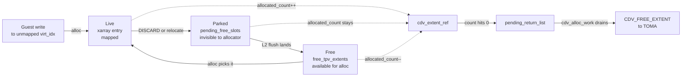
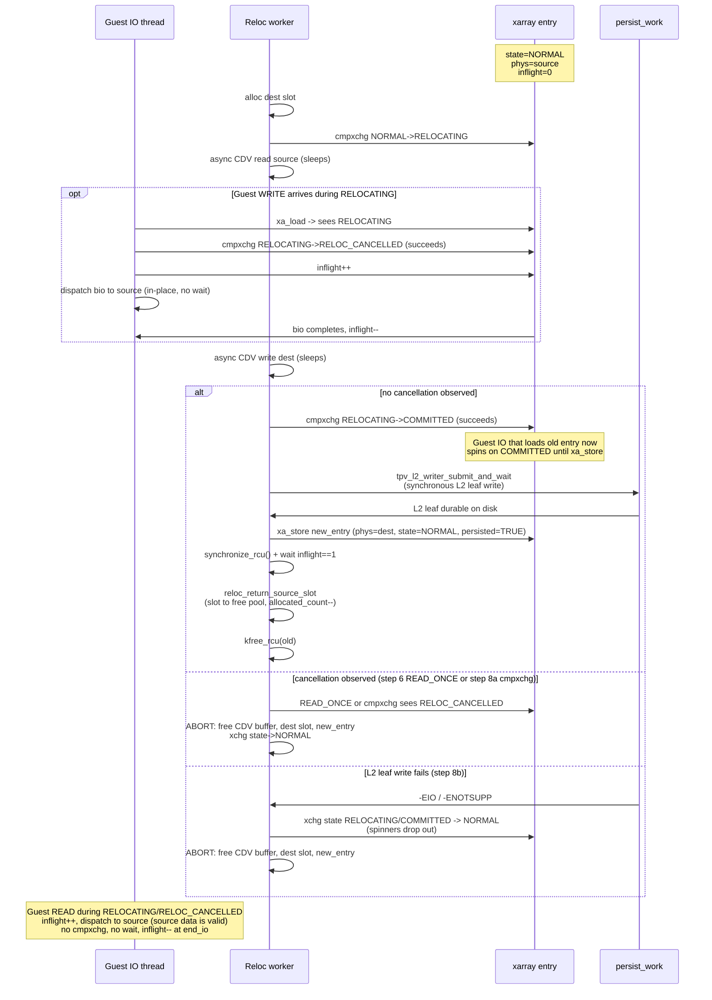
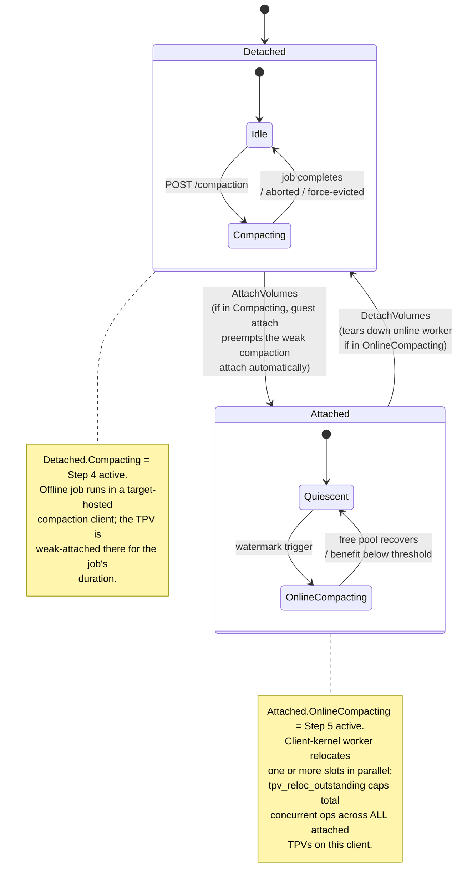

# TPV Trimming and Space Reclamation

## Table of Contents

- [Overview - purpose](#overview---purpose)
- [High-Level Design](#high-level-design)
  - [Glossary](#glossary)
  - [Non-goals](#non-goals)
  - [What trimming is](#what-trimming-is)
  - [What compaction is](#what-compaction-is)
  - [System responsibilities](#system-responsibilities)
  - [Messaging summary](#messaging-summary)
  - [Core crash-safety invariants](#core-crash-safety-invariants)
  - [Administrator's view](#administrators-view)
  - [Security considerations](#security-considerations)
  - [Performance model](#performance-model)
- [Rollout order](#rollout-order)
- [Step 1 - Client-side L2 null marking](#step-1---client-side-l2-null-marking)
  - [Goal](#goal)
  - [What already exists](#what-already-exists)
  - [What Step 1 actually entails](#what-step-1-actually-entails)
  - [Tests](#tests)
  - [Exit criteria](#exit-criteria)
- [Step 2 - Return empty CDV extents to the CDV](#step-2---return-empty-cdv-extents-to-the-cdv)
  - [Goal](#goal-1)
  - [How it is communicated](#how-it-is-communicated)
  - [Step 2 / Step 5 unification: `pending_free_slots`](#step-2--step-5-unification-pending_free_slots)
  - [Tests](#tests-1)
  - [Exit criteria](#exit-criteria-1)
- [Step 3 - MVP gaps](#step-3---mvp-gaps)
- [Step 4 - Offline compaction via target-hosted client](#step-4---offline-compaction-via-target-hosted-client)
  - [Motivation](#motivation)
  - [Why offline, and why a target-hosted client](#why-offline-and-why-a-target-hosted-client)
  - [Why standard attach (not hidden attach)](#why-standard-attach-not-hidden-attach)
  - [End-to-end flow](#end-to-end-flow)
  - [Management REST surface](#management-rest-surface)
  - [GUI placement: Targets page columns](#gui-placement-targets-page-columns)
  - [Benefit assessment](#benefit-assessment)
  - [Global off-switch](#global-off-switch)
  - [Durable job state](#durable-job-state)
  - [Protocol sketch (client worker)](#protocol-sketch-client-worker)
  - [Interruptibility](#interruptibility)
  - [Restart and crash recovery](#restart-and-crash-recovery)
  - [Tests](#tests-2)
  - [Mini-steps](#mini-steps)
- [Step 5 - Online compaction](#step-5---online-compaction)
  - [Goal](#goal-2)
  - [Why this does not need detach / attach](#why-this-does-not-need-detach--attach)
  - [Design: per-L2-entry lock on the xarray value](#design-per-l2-entry-lock-on-the-xarray-value)
  - [Relocation protocol (per slot)](#relocation-protocol-per-slot)
  - [Durability invariant - synchronous L2 commit](#durability-invariant---synchronous-l2-commit)
  - [Deferred slot visibility — DISCARD path only](#deferred-slot-visibility--discard-path-only)
  - [Ordering summary after the defer-to-free fix](#ordering-summary-after-the-defer-to-free-fix)
  - [Correctness](#correctness)
  - [Trigger and planner - detailed design pending](#trigger-and-planner---detailed-design-pending)
  - [Policy and throttling](#policy-and-throttling)
  - [Coexistence with offline compaction (Step 4)](#coexistence-with-offline-compaction-step-4)
  - [Tests](#tests-3)
- [Step 6 - Last-attach statistics in management](#step-6---last-attach-statistics-in-management)
- [Testing strategy](#testing-strategy)
  - [1. Single-operation verification at user level](#1-single-operation-verification-at-user-level)
  - [2. Mixed-op and crash testing](#2-mixed-op-and-crash-testing)
  - [3. Simulator tests to add under `clnt/block/unitest/tpv/`](#3-simulator-tests-to-add-under-clntblockunitesttpv)
- [Reference: Observability and Configuration](#reference-observability-and-configuration)
  - [Observability inventory](#observability-inventory)
  - [Configuration reference](#configuration-reference)
- [Notes / TO-DOs](#notes--to-dos)
  - [Alternative to offline compaction: copy-to-new-TPV](#alternative-to-offline-compaction-copy-to-new-tpv)
  - [Other open items](#other-open-items)

Companion to `TPV_ThinProvisioningImplementation.md`. Terminology, structs,
and on-disk formats defined there are not re-defined here.

## Overview - purpose

A TPV's whole value proposition is that physical consumption tracks the
*written* footprint of the guest, not its virtual size. That invariant holds
trivially on first write, but it degrades over time: guest filesystems
delete files, databases drop tables, VMs are decommissioned - and without
a trimming path, the CDV extents those writes consumed stay pinned to the
TPV forever. Eventually the CDV fills up with cold data no one references.

Trimming is the inverse of allocation: it returns TPV_extents to the TPV's
free pool and, when a whole CDV extent becomes empty, returns that extent
to the CDV so a different TPV (or a different region of the same TPV) can
use it. At the extreme - when a TPV is mostly empty but its extents are
scattered across many half-full CDV extents - compaction physically
relocates live data to consolidate allocations and free whole CDV extents
that were previously pinned by a single leftover slot.

This document lays out the rollout order. Each step is usable on its own;
later steps add reclamation depth but are not prerequisites for earlier
ones being correct.

## High-Level Design

A single-page orientation for a developer coming in cold. Cross
references point forward into the per-step sections for detail;
rollout ordering is deliberately absent here.

### Glossary

Quick reference for the terms used across this doc; most are
defined at length in the main doc
`TPV_ThinProvisioningImplementation.md`.

| Term | Meaning |
|---|---|
| **CDV** | Capacity Data Volume. A regular NVMesh volume acting as a backing store for one or more TPVs. |
| **TPV** | Thin Provisioned Volume. A sparse block device whose extents are allocated on demand from a CDV. |
| **CDV_extent** | A contiguous chunk of CDV space (size `E`, typically 64 MiB) owned by a single TPV at a time. Allocated via `CDV_ALLOC_EXTENT`, freed via `CDV_FREE_EXTENT`. |
| **TPV_extent** | A slot inside a CDV_extent (size `T`, typically 64 KB); the unit of guest-visible allocation and reclamation. `n_slots = E / T`. |
| **virt_idx** | Virtual-extent index into the TPV: `virt_idx * T` is the guest byte offset. |
| **L1 / L2** | Two-level on-CDV tree mapping `virt_idx -> cdv_offset`. L1 lives in slot 0 of the TPV's first CDV_extent; L2 tables live in ordinary slots scattered across TPV-owned CDV_extents. |
| **xarray (extent_map)** | The in-memory client-side `virt_idx -> nvmeibc_tpv_extent_entry` map; authoritative while attached, rebuilt from L1/L2 on attach. |
| **cdv_extent_ref** | Per-CDV_extent tracking struct on the client: `allocated_count`, `pending_free_slots`, list membership (`cdv_extent_list` vs `pending_return_list`). |
| **free_tpv_extents** | Per-TPV pool of slots available for immediate allocation. |
| **pending_free_slots** | Per-ref list of slots logically freed but not yet L2-durable; invisible to the allocator until flushed.  Used by the DISCARD path (Step 2) where the L2-null write is async; **not** used by online relocation, which writes L2 synchronously before exposing the new mapping (see Step 5 § Durability invariant). |
| **pending_return_list** | Per-TPV list of refs whose `allocated_count` hit zero and are awaiting `CDV_FREE_EXTENT`. |
| **persist_work / flush_state** | Client-kernel work item that flushes dirty L1/L2 pages to CDV. |
| **compaction attach** | Weak-reservation TPV attach issued by management to a target-hosted compaction client for the duration of an offline-compaction job; preemptible by any regular guest attach without a preempt flag. Display name `<tpv-name>-compaction`. |
| **compactionJob** | Mongo-side job-state record on the volume doc: `{state, clientId, startedAt, progress, progressUpdatedAt, lastError}`. |

### Non-goals

This design explicitly does not address:

- **Sub-TPV_extent reclamation.** Discards smaller than `T` are
  acknowledged but produce no physical reclamation. A per-extent
  LRU bitmap is sketched in Notes / TO-DOs for future work.
- **Cross-CDV relocation.** Compaction moves slots within one CDV;
  it never migrates a TPV's data from one CDV to another.
- **Deduplication or compression.** Physical reclamation is driven
  by discard / compaction only; content-level dedup is out of
  scope.
- **Reclamation-latency guarantees to the guest.** Slot return is
  eventually-consistent relative to the guest `DISCARD`
  completion; no specific deadline.
- **Reclamation while a CDV preempt is in progress.** The TPV is
  torn down by `nvmeibc_tpv_handle_cdv_preempted` and compaction
  exits; re-attach replays the usual machinery.
- **Migration / compatibility with earlier deployments.** The
  thin-provisioning feature has no earlier deployed state to
  preserve; on-disk formats are unchanged anyway.

### What trimming is

A TPV presents a sparse block device: virtual extents that have
never been written consume no CDV capacity, and a guest write to
an unmapped virtual extent triggers on-demand allocation of a
physical slot. Trimming closes the loop: when the guest discards
a virtual extent, the physical slot that used to back it is
released so the CDV can reuse it elsewhere.

Two distinct reclamation levels:

- **Slot-level reclamation (within a TPV).** A guest-issued
  `DISCARD` covering a whole TPV_extent removes the slot from
  the guest-visible mapping (xarray erase) and parks it on the
  owning ref's `pending_free_slots`; the next `persist_work`
  flush nulls the L2 leaf and promotes the slot into
  `free_tpv_extents`, where a subsequent guest write can claim
  it. The TPV's physical footprint does not shrink yet - the CDV
  still sees the same CDV_extent as allocated to this TPV. The
  parking step is what makes the whole flow crash-safe without
  a journal; see § Core crash-safety invariants.
- **Extent-level reclamation (giving back to the CDV).** When a
  whole CDV_extent's last allocated slot is freed, the TPV
  releases the extent back to the CDV via `CDV_FREE_EXTENT`,
  and some other TPV on the same CDV can now allocate from it.

The unit of reclamation is one TPV_extent (`T` bytes, typically
64 KB or larger). Discards that don't cover a whole TPV_extent
are acknowledged to the guest but have no reclamation effect -
there is no sub-extent dirty bitmap.

### What compaction is

Slot-level reclamation produces extent-level reclamation only
when an extent happens to empty out completely. Real workloads
leave extents at partial utilization - one live slot out of
thousands keeps the whole extent pinned. Over time, a TPV
accumulates many lightly-populated CDV_extents consuming many
times their useful footprint.

Compaction is the answer: relocate live slots out of sparse
extents into dense ones, so the sparse extents can be emptied
and returned. The relocation is an atomic-ish read-write-update
sequence - read T bytes from a source slot, write them to a
fresh slot in a dense destination, flip the L2 leaf to point at
the new slot, release the source slot. Guests see the virt_idx
point at the new physical location; data is unchanged.

Two flavors:

- **Offline compaction** runs while the TPV has no guest client
  attached.  A management-orchestrated job attaches the TPV to a
  target-hosted compaction client with `isCompaction=true` on
  the attach record; the client kernel does the work, the
  client's management agent reports progress to management via
  Kafka, and detach terminates the job.  **TOMA is not in the
  loop** - the attach control plane IS the compaction control
  plane.  Best for TPVs that are idle for long windows and can
  be compacted without affecting any attached workload.
- **Online compaction** runs while the TPV is attached, from
  inside the client kernel. The client already owns the
  authoritative mapping (xarray, L1/L2, allocator), so it
  executes relocations without any TOMA round-trip. Best for
  always-attached TPVs (long-lived VMs) that would never reach
  a detached state where offline could run.

The two never run simultaneously on the same TPV - offline
requires detached, online requires attached, and management
sequences the transitions.

### System responsibilities

- **Client kernel (nvmeibc).** Owns the authoritative TPV
  mapping while attached: xarray, L1/L2 tree, allocator state,
  `pending_return_list`, `pending_free_slots`. Routes
  `REQ_OP_DISCARD` to the TPV free path. Runs online compaction.
  Sends `CDV_FREE_EXTENT` to TOMA when an extent empties.
- **TOMA (nvmeibt).** Owns CDV-wide allocator state and the
  block-level access to CDV storage. Accepts `CDV_ALLOC_EXTENT`
  and `CDV_FREE_EXTENT` from clients. Serves offline compaction
  jobs when management assigns one. Pushes `CDV_CAPACITY_RESTORE`
  broadcasts when capacity frees up.
- **Management (nvmesh-management).** Consumes TOMA-side and
  client-side stats via Kafka (`CDVAllocatorStats`, `TPVStats`)
  and persists them in the volume doc. Owns the offline
  compaction REST surface (`POST / GET / DELETE
  /thinProvisioning/tpv/:id/compaction`), the job state machine
  (`compactionJob` in the volume doc), the weak TPV attach to a
  target-hosted compaction client for the job's duration, and
  the global off-switch. Surfaces `lastDetachedAt` for operators
  to pick compaction candidates.

**Data-structure tier (client side).** A slot moves through
three distinct states on the client (Live, Parked, Free); the
state it's in dictates who can see it. When an owning extent
empties, it transitions separately through `pending_return_list`
and is returned to TOMA via `CDV_FREE_EXTENT`:



*Figure 1: Slot lifecycle. `allocated_count` covers Live + Parked
states; the `free_tpv_extents` pool covers only the Free state.
The Parked state is what makes discard and relocation crash-safe
without a journal (§ Core crash-safety invariants).*

### Messaging summary

**Trim path (no new IB admin messages):**

- `NVMEIBC_MA_CDV_FREE_EXTENT` (existing IB admin path, sent
  from client `cdv_alloc_work`). Pre-trim the plumbing existed
  but was never fired, because there was no code path that
  could empty a CDV_extent while the TPV was running - writes
  are monotonically-allocating and the bulk-free on TPV delete
  goes through the Kafka `CDVAllocatorFreeAll` path instead.
  Trimming activates this message in the `pending_return_list`
  drain.
- `NVMEIBC_MA_CDV_ALLOC_EXTENT` (existing) - unchanged behavior;
  what's new is that capacity-restore feedback makes previously
  parked bios retry these requests.

**New messages:**

- `CDV_CAPACITY_RESTORE` - TOMA-to-client broadcast, same framing
  as `CDV_ALLOCATOR_UPDATE` with a distinct type byte. Fired
  when an extent returns to the CDV-wide free pool and at least
  one client had bios parked on `CDV_ALLOC_CDV_FULL`. Receivers
  re-arm `cdv_alloc_work` on matching TPVs.
(no new TOMA-bound messages for compaction - TOMA is not in
the loop)

**New Kafka messages:** none for trim (reuses
`CDVAllocatorStats` / `TPVStats`); none for online compaction.
Offline compaction adds a single client-agent-to-management
Kafka message:

- `tpvCompactionStats` - client-agent -> management, published
  at ~5 s cadence while a compaction attach is live.  Payload:
  `{tpvUUID, clientId, state, relocated, plannedRelocations,
  reclaimed}`.  Terminal values of `state` are `done`,
  `failed`, `aborted`.  Management's `handleTPVCompactionStats`
  updates `compactionJob.progress`; on terminal state, mgmt
  detaches the compaction attach and flips `compactionJob.state`.

**New attachments:** a **compaction attach** of the TPV to a
target-hosted compaction client for the job's duration. It is a
plain TPV attach flagged `isCompaction=true` on the attachment
record, with display name `<tpv-name>-compaction`. Two
management-layer rules govern it: (1) it never preempts - `POST
/compaction` on an already-attached TPV returns 409; (2) any
incoming regular attach on a TPV with a live compaction attach
triggers auto-detach of the compaction attach before the guest
attach proceeds.

### Core crash-safety invariants

Three ordering rules are the load-bearing correctness properties
across trim and compaction. Every crash-recovery story in the
document flows from these:

1. **Slot visibility is gated on L2 durability.** A physical
   slot only enters `free_tpv_extents` after the L2 page that
   used to reference it (now null for a discard, now
   redirected for a relocation) is durable on CDV. Implemented
   via per-ref `pending_free_slots` drained by the
   flush-completion callback. This is what makes both trim and
   online compaction crash-safe without a journal.
2. **Extent release is gated on L2 durability.**
   `CDV_FREE_EXTENT` for a whole extent only fires after every
   L2 leaf that used to point into that extent is durable-null
   on CDV. In practice this falls out of rule 1: the extent
   can't be on `pending_return_list` until its slots have all
   been promoted from `pending_free_slots`, which already
   requires the flushes.
3. **Offline compaction commits relocations with the L2 leaf
   write.** Compaction stays within CDV extents the TPV already
   owns; a relocation's commit is the durable write of the
   single L2 leaf pointing at the new slot. Crash before it:
   on-disk state is indistinguishable from "no relocation";
   crash after it: relocation is fully visible to any later
   attacher. No journal, no orphan sweep, no residue for a
   future run to reconcile.

A single phrase captures all three: **the on-CDV L2 is the
authoritative referent; a slot cannot be reused until the L2
change that released it is durable.**

### Administrator's view

**Monitoring** (already available, no new dashboards required):

- Per-CDV `runtimeStats.allocatedExtents` /
  `totalDataExtents` - watch this *decrease* as trim / compaction
  reclaim. Pre-trim this value was monotonic.
- Per-TPV `runtimeStats.tpvExtentsInUse` /
  `tpvExtentsTotal` - the TPV's physical footprint shrinking as
  guests discard.
- `runtimeStats.cdvExtents` - number of CDV_extents held by a
  TPV; shrinks as extents empty and return.

**Day-to-day operation:**

- Enable discard inside guests (filesystem `discard` mount
  option, periodic `fstrim`, or equivalent). No NVMesh-side
  action beyond confirming discard advertises correctly on the
  TPV block device.
- Online compaction runs automatically for attached TPVs based
  on watermark triggers; operator tuning is a single
  client-wide module parameter (`tpv_reloc_outstanding`,
  range 0..64; 0 disables) that caps total concurrent
  relocations across every attached TPV on this client.
- Offline compaction is operator-initiated:
    - `POST /thinProvisioning/tpv/:id/compaction` on a detached
      TPV. Optional `strategy: "in-place" | "copy"`.
    - `GET ... /compaction` for progress.
    - `DELETE ... /compaction` to abort.
- Picking candidates: `GET
  /thinProvisioning/tpv/candidates-for-compaction?minIdleDays=N`
  lists TPVs detached for at least N days. A cron can pipe this
  into `POST /compaction` for unattended cleanup.

**Emergency controls:**

- Global off-switch for offline compaction: cluster setting
  `settings.tpvOfflineCompactionEnabled` (default `true`).
  When flipped off, new jobs are rejected without touching
  in-flight jobs.
- Per-TPV abort (`DELETE /compaction`) terminates an in-flight
  job within one slot relocation (typically single-digit ms).

**Failure modes worth surfacing:**

- A regular guest attach on a TPV with an active offline job
  triggers the management-layer asymmetric-preempt rule:
  management auto-detaches the compaction attach first, then
  honours the guest attach. Job lands in `aborted`.
- `POST /compaction` while a job is already running returns
  `409 tpv-in-offline-compaction`; `POST` while a guest is
  attached returns `409 tpv-attached` (compaction never
  preempts).
- A compaction client (or its target node) that dies
  mid-compaction leaves the job in `failed`; a re-run just
  starts over - no sweep pass, no manual intervention.

### Security considerations

Trimming and compaction inherit the main doc's threat model
(`TPV_ThinProvisioningImplementation.md` §3.7) unchanged. Three
additions specific to this design:

- **Discard exposes zero, not stale data.** A guest `DISCARD`
  immediately unmaps the virt_idx (xarray erase); subsequent
  guest reads return zero from the zero-fill path, independent
  of whether the underlying CDV block has been overwritten.
  Operators who want the physical block scrubbed before reuse
  still opt in via `cdv_extent_zero_on_free` (existing TOMA
  runtime config); the satellite-volume gap noted in main doc
  §3.9 carries over to this design unchanged.
- **Offline compaction does not cross TPV boundaries.** The
  compaction client operates only on `cdv_extent_ref`s already
  allocated to the job's target TPV; the planner and the
  relocation worker never touch slots owned by another TPV on
  the same CDV. The benefit scan is scoped identically.
- **Online compaction stays inside the client's own mapping.**
  The relocation worker only mutates `xarray` / L1 / L2 entries
  for the TPV it is running inside. It has no access to other
  TPVs' mappings even if they share the parent CDV.

The weak compaction TPV attach uses the existing attach
subsystem and inherits its authentication: only management
(operating against MongoDB under its own credentials) can issue
or release the attach.

### Performance model

Back-of-envelope numbers for sizing and tuning; actual
measurements come from the performance tests in Step 5.

**Metadata overhead.** L2 tables are sticky-monotonic (main doc
§3.4.1); the permanent overhead of one pinned L2 slot per
`N_L2 = T / 8` virtual extents works out to one TPV_extent per
8192 virtual extents at T=64 KB - **0.012%** of virtual space. For
a 1 TiB TPV with T=64 KB, that is ~128 MiB pinned by L2 tables.

**Online compaction throughput** as a function of
`tpv_reloc_outstanding = N` and CDV round-trip time `RTT`:

  throughput_ops_per_sec ≈ N / (2 × RTT)
  throughput_bytes_per_sec ≈ N × T / (2 × RTT)

At `N = 4`, `RTT = 1 ms`, `T = 64 KB`: ~128 MB/s of live-data
churn. At `N = 16`: ~512 MB/s. Upper bound is CDV saturation. A
1 TiB sparse TPV at 10% live footprint (100 GiB of data to move)
reclaims in ~13 minutes at `N = 4`, ~3 minutes at `N = 16`.

**Offline compaction throughput.** Per relocation, the
compaction client issues one T-byte CDV read, one T-byte CDV
write, and one 4 KB synchronous L2-leaf write. At T=64 KB the
per-op IO mix is 64 KB in + 68 KB out on the CDV. Two regimes
depending on the
CDV's bandwidth model:

- **Full-duplex** (reads and writes are separate pipes each at
  CDV_BW, typical for RDMA): the write side is the long pole,
  at 68 KB per 64 KB of live-data movement, so effective
  relocation throughput ≈ `CDV_BW × 64/68 ≈ 0.94 × CDV_BW`. On
  a 2 GB/s CDV: ~1.88 GB/s live-data movement.
- **Single-pool** (reads and writes share one 2 GB/s pool): the
  total of 132 KB per op caps effective throughput at
  `CDV_BW × 64 / 132 ≈ 0.48 × CDV_BW`, i.e. ~970 MB/s on the
  same CDV.

**Discard throughput.** `fstrim` on a TB-scale filesystem at
T=64 KB can emit ~16 M discards for 1 TiB of free space. Each
discard is cheap in isolation (xarray erase + park on
`pending_free_slots`) but `persist_work` must flush every dirty
L2 page before any of those slots are reusable. At one 4 KB
L2-page write per `N_L2 = 8192` discards, the metadata tax is
bounded: 16 M discards → at most `ceil(16M / 8192) ≈ 2 K` L2
pages, ~8 MiB of CDV metadata writes. Not throughput-limiting;
the bottleneck is the xarray erase rate, not the CDV.

**Guest IO latency impact.** For a guest virt_idx that collides
with an active relocation, the worst-case parked latency is
one T-byte CDV copy + one 4 KB L2 flush. At T=64 KB on a 2 GB/s
CDV that is ~40 µs copy + one 4 KB sync write (~200 µs on typical
RDMA), so upper bound is single-digit ms. Uncontended virt_idx
sees no latency change.

**Extent return latency.** From "guest DISCARD completes" to
"CDV_FREE_EXTENT arrives at TOMA" involves: slot park (immediate)
→ `persist_work` flush (next tick, typically ≤ 100 ms at default
cadence) → `cdv_alloc_work` drain (next scheduled run, up to
watermark-gated delay). A continuously-trimming workload sees
sub-second return latency; a sporadic trimmer may see tens of
seconds before the extent empties and returns.

---

## Rollout order

**Granularity note (applies to every step below).** The unit of
reclamation is one TPV\_extent (`T` bytes, typically 64 KB or larger).
A discard that does not cover a whole TPV\_extent is acknowledged to the
guest but produces no space reclamation - there is no sub-extent dirty
bitmap, so we cannot represent "part of this extent is now zero" in
either the xarray or the L2 leaf. In practice this means guest
filesystems with cluster / block sizes smaller than `T` will only see
reclamation from trims that happen to align to and span full TPV
extents (usually large free-run cases like `fstrim` on an idle volume,
or whole-file deletes of files at least `T` in size). Partial-extent
discard with sub-extent tracking is listed as a possible future
enhancement in *Notes / TO-Dos*.

1. **Client-side L2 null marking.** Wire `REQ_OP_DISCARD` end to end so
   trimmed virtual extents get their L2 leaf set to 0 and the TPV_extent
   goes back to `free_tpv_extents`. No CDV-side communication yet; no L2
   table reclamation yet.
2. **Return empty CDV extents to the CDV.** Once a `cdv_extent_ref`
   reaches `allocated_count == 0 && !is_l1_extent`, send
   `CDV_FREE_EXTENT` so TOMA puts the extent back in the CDV-wide free
   pool. Covers the TOMA handshake, ordering vs. allocation, and the
   recovery/orphan story.
3. **MVP gaps.** Whatever remains before we can ship trim as a supported
   feature: advertising discard geometry, capacity-accounting UI audit,
   CDV capacity-restore notification, telemetry.
4. **Offline client-driven compaction.** A target-hosted client reads
   live slots out of half-full extents and rewrites them into denser
   extents the same TPV already owns; an emptied source extent returns
   to the CDV via the existing Step 2 drain.  Triggered entirely
   through the attach control plane: `isCompaction=true` on the attach
   record routes the client into the compaction worker; removing the
   attach stops it.  Management observes progress via a periodic
   `TPVCompactionStats` Kafka message from the client agent.  TOMA is
   not in the loop.  Interruptible: any regular guest attach preempts
   the compaction attach via the management-layer asymmetric rule.
5. **Online compaction.** Client-driven, per-L2-entry locking. Relocates
   one virtual extent at a time while the TPV stays attached; serializes
   only against concurrent IO to the *same* virt_idx, not the whole
   client. Targets long-running always-attached TPVs that Step 4 cannot
   reach.
6. **Last-attach statistics in management.** Surface `lastDetachedAt`
   (and related idleness metrics) in the management API / UI so operators
   - or automation - can pick the right moment to trigger an offline
   compaction.

---

## Step 1 - Client-side L2 null marking

### Goal
A guest-issued `DISCARD` (or `blkdiscard`, or `fstrim`) for a range that
covers one or more whole TPV_extents must release those extents back to
the TPV's internal free pool and zero out the L2 leaves that pointed at
them. After the flush lands, a subsequent read of the same virtual range
returns zero without touching the CDV.

### What already exists
- `nvmeibc_tpv_make_request` routes `REQ_OP_DISCARD` to
  `nvmeibc_tpv_free_extent` (TPV §3.5, §3.6).
- `nvmeibc_tpv_free_extent` already does the xarray erase, slot push,
  allocated_count decrement, and L1-excluded `pending_return_list`
  transition.
- `flush_state` already writes `cdv_offset = 0` for leaves whose xarray
  slot is empty (§3.4.1, §3.4.3).
- `cdv_offset == 0` is the documented NULL sentinel (§3.4.2).

So the leaf-nulling mechanics are in place. Step 1 is about turning that
path on end-to-end and verifying the semantics, not inventing new
structures.

### What Step 1 actually entails
1. **Advertise discard on the gendisk.** Set `max_discard_sectors`,
   `discard_granularity = tpv_extent_size_kb * 1024`, and
   `discard_alignment = 0` at `nvmeibc_tpv_attach` time. Without this,
   filesystems will not emit discards at all.
2. **Reject / split misaligned discards.** Only discards that cover a
   whole TPV_extent can free a slot. A discard that partially overlaps an
   extent must be handled as a no-op for that extent (the guest cannot
   prove the remaining bytes are dead). Easiest: split the incoming bio
   on extent boundaries in `nvmeibc_tpv_make_request` (we already split
   on extent boundaries for writes) and drop any segment shorter than
   `T`. A partial-extent discard becomes a successful bio with no state
   change.
3. **Sync-flush interaction.** In `sync_flush` mode, data-before-metadata
   ordering must still hold, but a discard has no data to write. The
   free path just marks dirty and schedules `persist_work`; no parking
   on `pending_l1_flush_bios`. The bio completes immediately; the L2
   leaf will be nulled on the next flush.
4. **Crash semantics.** If we crash between the bio completing and
   `flush_state` landing, the leaf is still non-null on disk and
   recovery re-adopts the slot as allocated (§3.8 load_state). This is
   safe: the guest saw the discard complete, but the block is simply
   re-mapped to the same offset it had before the discard. Reads return
   whatever was there pre-discard, not zero. That is *weaker* than most
   guest filesystems expect but not incorrect (discard is advisory at
   the block layer). No data corruption. Document this.
   - **Self-healing via the next fstrim.** The filesystem's notion
     of "this range is free" is stored in its own journal / free
     bitmap, independent of our discard path. A subsequent `fstrim`
     re-emits DISCARD for every currently-free range, including any
     whose first DISCARD was lost to the crash window. Our
     `free_extent` path handles a DISCARD on a mapped virtual extent
     identically the second time around. Net result: the lost
     reclamation is picked up on the next `fstrim` (or on any
     filesystem emitting per-write discards via the `discard` mount
     option). Operators running periodic `fstrim` therefore see no
     lasting capacity loss from this crash window.
   - A stronger variant for sync_flush mode - park discard bio
     completion on `pending_l1_flush_bios` until the L2 null is
     persisted - is deferred as a follow-up; users who have already
     opted into sync_flush for durability are the natural audience.
     For now, sync_flush discards share the async semantics, and
     the fstrim-idempotency property above is the mitigation.
5. **L2 tables stay put.** Per the §3.4.1 sticky-monotonic rule, an L2
   whose leaves all become null is *not* reclaimed. It stays pinned in
   its slot, contributes 1 to `allocated_count`, and prevents its
   hosting CDV extent from being returned until something else owns
   that extent. This is the deliberate limitation of Step 1: a TPV that
   gets fully trimmed still holds onto its L2-hosting CDV extents.
   Addressing this requires the L2-slot-kind tracking that §3.4.1
   explicitly removed; revisit only if profiling shows the residual
   is meaningful (worst case: one pinned CDV extent per `N_L2` virtual
   extents = 1 / 8192 with T=64 KB, i.e. 0.012%).
6. **Proc / stats.** Add counters for `stat_discard_ok`,
   `stat_discard_misaligned_skipped`. Wire into the existing
   `/proc/nvmeibc/tpv/<name>/stats`.

### Tests
- New self-test `tpv_ktest_discard`: alloc a virt range, discard it
  whole, verify `xa_load` returns NULL, verify free slot reappears,
  verify flush writes `cdv_offset = 0` to the expected leaf.
- Misaligned-discard test: discard `T/2` bytes, verify the slot stays
  allocated and no stats tick on `discard_ok`.

### Exit criteria
`blkdiscard -o <aligned> -l <N*T>` on a mounted TPV reduces
`xa` population and the free pool grows correspondingly; read-after-
discard returns zero on a running system (the post-reboot case is the
documented weaker semantics above). No CDV-side work; no TOMA changes.

---

## Step 2 - Return empty CDV extents to the CDV

### Goal
When a CDV extent's `allocated_count` hits zero and it is not the L1
extent, the client gives it back to TOMA so some other TPV on the same
CDV can use it.

### How it is communicated
The existing `NVMEIBC_MA_CDV_FREE_EXTENT` IB admin message already
exists in the client-to-TOMA vocabulary (main doc §3.7), with
allocator-side handling and fire-and-forget semantics wired up.
Pre-trim the plumbing was never actually exercised because no
running TPV ever emptied an extent (writes are monotonically
allocating and TPV delete uses the Kafka
`CDVAllocatorFreeAll` bulk path, not per-extent `CDV_FREE_EXTENT`).
Step 2 activates this message on the client side and tightens the
invariants it requires.

The existing plumbing:
- `nvmeibc_tpv_free_extent` moves the ref to `alloc->pending_return_list`.
- `cdv_alloc_work` drains `pending_return_list` *before* issuing new
  `CDV_ALLOC_EXTENT` requests - this is already coded and is exactly
  what we want for trim-driven churn (a DISCARD-heavy workload should
  not grow CDV consumption).

What remains to verify / add:

1. **Arming `cdv_alloc_work` from the free path.** `free_extent` must
   schedule `cdv_alloc_work` whenever `pending_return_list` gains an
   entry, even when the free pool is above `low_watermark` (so we do
   not wait for the next allocation to flush returns). Small change.
2. **Watermark-gated return (avoid churn).** Returning a CDV extent
   costs `n_slots` from `free_tpv_extent_count` (item 4 below purges
   the extent's slots from the free pool before the IB send). If that
   purge would drop the free pool at or below `low_watermark`, the
   return is counterproductive: `cdv_alloc_work` would immediately
   turn around and issue a `CDV_ALLOC_EXTENT` for a fresh extent,
   adding nothing. Gate the drain accordingly:
   ```
   for ref in pending_return_list:
       if free_tpv_extent_count - n_slots < high_watermark:
           break    # keep ref parked; its slots stay in the free pool
       purge ref's slots from free_tpv_extents
       send CDV_FREE_EXTENT
       free ref
   ```
   Use a `high_watermark` distinct from (and strictly greater than)
   `low_watermark` to provide hysteresis - otherwise a workload that
   hovers exactly at `low_watermark` oscillates between return and
   re-alloc. Suggested: `high_watermark = 2 * low_watermark`. A ref
   that stays parked across many `cdv_alloc_work` runs is fine; its
   slots are still usable, and it gets returned as soon as the free
   pool grows (another trim lands, or another extent becomes fully
   empty and replaces it in the returnable-but-not-urgent role).
3. **Persistence ordering.** The leaf must be nulled on the CDV
   *before* we tell TOMA we no longer own the extent. Otherwise a crash
   between "TOMA freed" and "L2 leaf nulled" leaves an orphan pointer
   in L2 that, on attach, is re-adopted by load_state into a
   CDV_extent that TOMA has since re-assigned to someone else -
   reading another TPV's data.

   The invariant is an *order*, not atomicity. Lazy flushing and lazy
   `CDV_FREE_EXTENT` sending are both fine as long as, *for the
   specific extent being returned*, every L2 leaf that used to
   reference it is durable-null on the CDV before the IB admin send.
   This is narrower than "all dirty L2 pages flushed" - an unrelated
   dirty L2 page for a different extent is not a blocker for returning
   *this* extent.

   Two implementations, from simplest to most precise:
   - **(a) Global drain, recommended default.** `cdv_alloc_work` runs
     `flush_state` to completion on all dirty pages, then drains
     `pending_return_list` in one pass. Costs a few extra milliseconds
     of flush on unrelated pages per drain cycle; no per-extent
     bookkeeping needed.
   - **(b) Per-extent check.** Each `cdv_extent_ref` tracks whether
     any L2 page that references one of its slots is still dirty
     (maintained by the allocator when `free_extent` dirties a leaf).
     `cdv_alloc_work` can then return a ref whose per-extent
     dirty-counter is zero without flushing anything else. Worth doing
     only if profiling shows (a)'s redundant flushing is material;
     until then ship (a).

   In both cases, `flush_state` must write the L2 page for the L2
   leaves, and - if the return emptied the last L2 entry for an L1
   slot - the L1 page, before the IB send. `L1 header.n_l2_tables_used`
   is unchanged by returns in Step 2 because L2 tables are
   sticky-monotonic (Step 1 item 5); only the L2-leaf pages change.
4. **Race with a concurrent allocation on the same extent.**
   `pending_return_list` holds a ref whose `allocated_count == 0`.
   If a new virtual write picks a slot on that same extent before we
   send `CDV_FREE_EXTENT`, we must cancel the return. Implementation:
   on alloc, check if the chosen slot's owning ref is on
   `pending_return_list`; if so, move it back to `cdv_extent_list`
   and proceed. Needs the allocator lock held across the
   list-membership flip.
5. **Race with a concurrent `CDV_FREE_EXTENT` in flight.** Once the
   IB message is on the wire, we cannot un-send it. The window we
   need to close: TOMA has not yet processed the free, the client
   starts allocating from slots that belong to the extent-being-
   returned. Fix: at the moment we enqueue the IB send, the
   extent's slots must be invisible to the allocator regardless of
   which list they're on. Concretely, both:
     - Remove any of the extent's slots already promoted to
       `free_tpv_extents` (the set that made `allocated_count` hit
       zero in the first place).
     - Drop any of the extent's slots still parked on its own
       `ref->pending_free_slots` list (see "Step 2 / Step 5
       unification" below): these are slots freed but awaiting
       L2 flush; since the whole extent is going away, their L2
       pages have already been flushed as part of the extent
       becoming returnable (Step 2 item 3), so no further promotion
       is needed.
   After the purge, the extent contributes zero slots to either
   list. Skipping either sub-step means we can allocate a slot
   whose backing CDV_extent is about to be reassigned.
6. **Recovery / orphan avoidance.** After a crash mid-return, there
   are three possible states:
   - **Leaves nulled, TOMA still thinks extent is ours.** On
     reattach, `CDV_LIST_EXTENTS` reports the extent; `load_state`
     walks L1/L2, finds no leaves reference it; `nvmeibc_tpv_recovery`
     sees an extent with zero references and... currently *adopts*
     it back as an empty TPV-owned extent (slots go in free pool).
     That is safe but wastes a re-return. Extend recovery: if an
     adopted extent has `allocated_count == 0` after the walk and it
     is not the L1 extent, move it immediately to
     `pending_return_list`.
   - **Leaves nulled, TOMA acked free, client died before updating
     memory.** On reattach, `CDV_LIST_EXTENTS` does not report the
     extent - nothing to adopt. L1/L2 already null. No orphan. Clean.
   - **Leaves still non-null, TOMA already acked free.** This is the
     dangerous window that ordering item 3 closes. If the ordering
     is enforced, this state is unreachable.
7. **TOMA-side idempotency.** `handle_cdv_free_extent` must accept a
   `CDV_FREE_EXTENT` for an extent it does not know about (already
   freed, or never allocated) and return success, not error. Required
   so that client retry after a dropped IB ack does not fail.

### Step 2 / Step 5 unification: `pending_free_slots`

Step 2's `free_extent` does not push slots directly to
`free_tpv_extents`. It parks them on the owning ref's
`pending_free_slots` list; the flush-completion callback in
`persist_work` promotes them once the L2 page that used to
reference them is durable-null on CDV. The data structure and
the correctness argument are spelled out in Step 5's "Deferred
slot visibility" section - it applies identically here, because
the hazard (slot reused before the L2 null is persisted, then
crash-recovery finds two virt_idx pointing at the same slot) is
symmetric between discard-driven freeing (Step 2) and
relocation-driven freeing (Step 5). The "(a) Global drain"
implementation named in item 3 above is exactly the flush-
completion callback promoting all parked slots in one pass.

### Tests
- Fill a TPV, trim a whole CDV_extent's worth of aligned virtual
  range, verify a `CDV_FREE_EXTENT` shows up on TOMA and the CDV's
  `alloc->n_allocated` decreases.
- Concurrent alloc-during-return stress: one thread trims, another
  writes. No double-owned extents (add a `cdv_extent_index`
  invariant check to `load_state`).
- Kill the client mid-return (before, during, after the IB send);
  remount; verify no orphan state via a fresh `CDV_LIST_EXTENTS`
  cross-check.

### Exit criteria
A sustained write-then-trim loop on a single TPV keeps
`CDV.n_allocated` bounded instead of monotonically growing.

---

## Step 3 - MVP gaps

With Steps 1 and 2 in, trim works end-to-end for the common case.
Remaining before we can call it shippable:

1. **Discard advertising in management and CSI.** Management's
   volume-create reply and the CSI `NodeGetVolumeStats` capability
   reporting should advertise discard support on TPVs (not on regular
   volumes, not on CDVs). CSI currently does not set `BLOCK_DISCARD`
   on TPV StorageClass mounts.
2. **Capacity accounting - already covered.** Management already
   receives per-CDV allocation stats via the `CDVAllocatorStats`
   Kafka message (emitted by TOMA from `cdv_publish_alloc_stats` in
   `toma/nvmeibt_cdv_alloc.c` after every alloc / free) and per-TPV
   physical-consumption stats via the `TPVStats` Kafka message
   (emitted by the management agent on each keepalive cycle from
   `collectAndSendTPVStats` in `management_cm/managementAgent.py`,
   reading `/proc/nvmeibc/tpv/*/status`). Both land in the volume
   doc as `runtimeStats.{allocatedExtents, totalDataExtents,
   cdvExtents, tpvExtentsInUse, tpvExtentsTotal}` via
   `handleCDVAllocatorStats` / `handleTPVStats` in
   `modules/volume.js`. The UI consuming these fields is the only
   gap to audit: verify the TPV table and CDV table actually display
   the `runtimeStats` values, and that the
   `getCDVExtentUsageHealth()` severity roll-up behaves sensibly
   once trim starts *decreasing* `allocatedExtents` (prior to
   Step 2 the value was monotonic).
3. **CDV capacity-restore notification.** Today `CDV_ALLOC_CDV_FULL`
   parks bios with no re-arm path (they time out). Now that Step 2
   can restore CDV capacity, TOMA should fire a "CDV no longer full"
   event to all attached clients with parked bios so they retry.
   Use a new message type - `CDV_CAPACITY_RESTORE` - rather than
   overloading `CDV_ALLOCATOR_UPDATE`, which carries allocator
   identity `(toma_id, generation)` and would need a discriminator
   to also convey capacity state. Same framing and transport as
   `CDV_ALLOCATOR_UPDATE` (signed with `PROTOCOL_SIGNATURE_CDV`,
   broadcast to registrants of the CDV); new message type byte.
   Client handler clears `cdv_alloc_pending` for the affected CDV
   and re-arms `cdv_alloc_work` on every TPV whose parent matches,
   the same mechanism as `CDV_ALLOCATOR_UPDATE` but without
   touching the allocator identity fields.
4. **Observability.** `/proc/nvmeibc/tpv/<name>/stats` gains
   `cdv_extents_returned` and `cdv_free_sent`. The TOMA
   `alloc_state` proc gains `free_returns_received`. Add a Python
   analysis script under `tools/` that correlates client-side
   `cdv_extents_returned` with TOMA-side `free_returns_received` so
   mismatches are visible.
5. **Kernel self-test coverage.** The two Step-1/Step-2 tests above
   plus a long-running fuzzer that random-walks alloc/write/trim and
   asserts `sum(client_allocated) == toma_n_allocated` after
   quiescence.

Everything past this point is optimization.

---

## Step 4 - Offline compaction via target-hosted client

### Motivation
Step 2 only frees a CDV extent when *every* slot in it becomes null.
A realistic write-heavy workload with sparse deletions leaves many
CDV extents at, say, 10% utilization - 90% of their slots are null
but the extent stays pinned because one slot is live. Aggregate
waste across a large TPV can be multiples of the useful footprint.

Compaction fixes this by relocating live slots out of sparse extents
into dense ones, then returning the emptied extents.

### Why offline, and why a target-hosted client
- **Why offline:** the TPV's tree is authoritative and is owned by
  the attached client. Rewriting slots under a live guest client
  requires coordinating every in-flight IO against the mapping
  change - expensive and complex. Doing compaction when no guest is
  attached sidesteps the coherence problem. Step 5 removes this
  constraint by adding per-entry locking on top of the same
  relocation primitive; Step 4 is the staging ground.
- **Why a target-hosted client** (as opposed to TOMA itself, or a
  standalone userspace helper):
  - The client kernel module already has every moving part the job
    needs - L1/L2 reader, xarray, allocator, CDV bio path, and IB
    admin for `CDV_ALLOC_EXTENT` / `CDV_FREE_EXTENT`. TOMA would
    have to reimplement all of it; a userspace helper would have to
    duplicate the parsers and bring its own CDV I/O layer.
  - The relocation primitive is exactly the one Step 5 online
    compaction wraps with a per-entry lock. Shipping it once in the
    client unifies the two features; shipping it in TOMA would
    mean writing the same code twice in two languages.
  - **CDV-offline blast radius stays contained.** A hang in the
    compaction path stays in the compaction client's kernel on
    the target node; other CDVs on the node, the CDV's elected
    allocator TOMA, and the allocators of other TPVs on this
    CDV all remain responsive.
  - **Why target-only:** the compaction client needs CDV (and,
    in split mode, meta-CDV) access across *every* chunk of the
    volume, which is the reachability profile of a target node
    attach.  Management picks the compaction client either by
    operator specification (`POST` body `client`) or at random
    from currently-up target nodes - no candidacy set, no
    headroom gating.  Since the CDV is already reachable on the
    compaction host for target-side I/O, operator-level access
    to `/dev/nvmesh/<cdv>` already exists there; compaction
    adds no new blast radius.

### Why standard attach (not hidden attach)
An earlier draft proposed attaching the TPV in a "hidden" mode that
brought up L1/L2 + allocator in the client kernel without
registering a gendisk. Two problems:

1. Hidden attach does not change the client's reachability to CDV
   chunks; the normal fan-out is what makes a multi-chunk CDV
   accessible. A weaker attach would not simplify the reachability
   side of the problem - it would just hide the resulting gendisk.
2. The compaction host is a target node that already has the CDV
   attached locally for target-side I/O. A root user there can
   already read or write `/dev/nvmesh/<cdv>` directly. Exposing
   `/dev/nvmesh/<tpv>-compaction` as a normal gendisk therefore
   adds no incremental blast radius; the sensitive surface is
   already present.

Standard attach is the right primitive: it reuses the entire
attach lifecycle, and the display-name suffix plus Targets-page
column (below) make the operational intent visible. What makes
the attach "compaction-only" is at management / GUI layer, not
in the kernel.

**Asymmetric preemption (management-layer rule).** The compaction
attach itself never preempts: if the TPV is already attached to a
guest, `POST /compaction` fails with `409 tpv-attached`. The
reverse is automatic: when a regular attach request arrives at
management for a TPV that has a live compaction attachment,
management silently detaches the compaction attach before
honoring the guest attach. This is a management-layer rule on the
attachment record (`isCompaction=true`), not a kernel reservation
mode. The kernel sees two ordinary attach / detach operations.

### End-to-end flow
Compaction is a manually-triggered management job driven
entirely through the attach control plane.  **TOMA is not in
the loop** - it does no compaction work, holds no compaction
state, and exchanges no compaction-specific messages.  The
attach record is the job controller: its presence means the
job exists, its progress counters track it, and removing the
attach stops the job.

1. Operator (or automation) calls
   `POST /thinProvisioning/tpv/:id/compaction` with an optional
   `{ client, aggressiveness }` body.
2. Management picks a **compaction client** (any target node -
   the compaction work runs in the target-hosted NVMesh client
   kernel): either the hostname supplied in the `client` field,
   or a random currently-up target node if the field is absent.
   Management enforces the per-client cap
   `settings.tpvOfflineCompactionMaxJobsPerClient` (default 4)
   by counting `compactionJob` rows whose `state` is in the
   non-terminal set `{pending, attaching, running, aborting}`
   per `clientId`:
   - **Explicit `client`:** if that node is down, return
     `503 client-not-available`; if it is up but already at the
     max, return `503 client-busy`.
   - **Random:** take the set of currently-up target nodes
     whose in-flight count is strictly below the max; pick one
     at random.  If empty, return `503 no-client-available`.

   No transport-side concurrency state, no queue.
3. Management attaches the TPV to the compaction client via a
   standard `attachVolume` / `attachTPV` path.  The Kafka
   attach payload that reaches the client's management agent
   carries two new fields:
   - `isCompaction=true` (flags the attachment for the
     management-layer asymmetric-preempt rule; also routes the
     client-side post-attach handler into the compaction
     trigger);
   - `aggressiveness` (the parallelism cap for the worker).

   The attachment record on the client doc also stores
   `compactionJobId` for cleanup.  Display name
   `<tpv-name>-compaction` renders on the Targets page's
   Compaction Attachments column.  The standard `attachTPV`
   path auto-attaches the parent CDV (and meta-CDV in split
   mode) via the usual `tpv:<tpvUUID>` reference; no new CDV
   reference is introduced.
4. The compaction client's userspace management agent sees the
   attach instruction with `isCompaction=true`, drives the
   normal kernel attach, waits for `state_loaded`, then writes
   `aggressiveness=N` to
   `/proc/nvmeibc/tpv/<tpv-name>/compaction`.  The kernel picks
   up that write and schedules `tpv_compaction_run` on a work
   queue.
5. The compaction worker loops: assess -> pick sparsest
   `cdv_extent_ref` as source and a dense-but-not-full
   `cdv_extent_ref` as dest (both already allocated to this
   TPV, so no per-slot allocator round-trip) -> relocate slots
   one at a time by reading source, writing dest, and rewriting
   the single L2 leaf.  When a source extent's
   `allocated_count` reaches zero, the existing Step 2 drain
   (`pending_return_list` -> `cdv_alloc_work` ->
   `CDV_FREE_EXTENT`) returns it to the CDV - the same path
   everyday discards use, which the TOMA
   `n_free_returns_received` counter already observes.
6. The agent polls `/proc/nvmeibc/tpv/<n>/compaction` at ~5 s
   cadence while the attach is in place, and publishes a
   `TPVCompactionStats` Kafka message (client agent ->
   management) carrying `{tpvUUID, clientId, state,
   relocated, plannedRelocations, reclaimed}`.  Terminal
   states are `done`, `failed`, `aborted`.
7. Management's `handleTPVCompactionStats` updates
   `compactionJob.progress` on every tick.  When `state` is
   terminal, it marks `compactionJob.state` accordingly and
   issues a detach for the compaction attach.
8. **Termination** can come from any of three paths, all of
   which resolve through detach:
   - Watermark met (or planner exhausted) -> worker exits ->
     agent publishes `state=done` -> mgmt detaches.
   - Operator `DELETE /compaction` -> mgmt issues detach ->
     kernel's detach path calls
     `nvmeibc_tpv_abort_any_compaction_for()` -> worker exits
     -> agent publishes `state=aborted`.
   - Guest attach arrives for a TPV with a live compaction
     attach -> management's attach handler auto-detaches the
     compaction attach (asymmetric-preempt rule) -> same exit
     as above.
9. Crash recovery: if the compaction client or its agent dies
   mid-job, no further `TPVCompactionStats` Kafka arrives.
   Mgmt's reconciliation task marks jobs whose
   `progressUpdatedAt` is older than a deadline as `failed`
   and force-detaches the compaction attach.

```mermaid
sequenceDiagram
    participant Op as Operator
    participant Mgmt as Management
    participant Agent as Compaction Client Agent<br/>(userspace, target-hosted)
    participant Kernel as Compaction Client Kernel
    participant CDV as CDV storage
    participant AllocTOMA as Allocator TOMA<br/>(for this CDV)

    Op->>Mgmt: POST /tpv/:id/compaction<br/>{client?, aggressiveness?}
    Mgmt->>Mgmt: pick client (specified or random);<br/>compactionJob.state=attaching
    Mgmt->>Agent: attachTPV {isCompaction=true,<br/>aggressiveness, displayName=<tpv>-compaction}
    Agent->>Kernel: standard attach; wait for state_loaded
    Kernel->>CDV: standard CDV attach
    Agent->>Kernel: write 'aggressiveness=N' to<br/>/proc/nvmeibc/tpv/<name>/compaction
    Kernel->>Kernel: schedule tpv_compaction_run on WQ
    loop relocation batches (up to aggressiveness in parallel)
        Kernel->>CDV: read source slot, write dest slot, rewrite L2 leaf
        Kernel->>Kernel: in-memory: return source slot to source_ref
        Kernel->>AllocTOMA: CDV_FREE_EXTENT (only when source extent empties)
    end
    loop every ~5s while attach is live
        Agent->>Kernel: read /proc/.../compaction (state + counters)
        Agent->>Mgmt: TPVCompactionStats Kafka<br/>(state, relocated, planned, reclaimed)
        Mgmt->>Mgmt: update compactionJob.progress
    end
    alt watermark met or no-more-moves
        Kernel->>Kernel: worker exits (state=done)
        Agent->>Mgmt: TPVCompactionStats state=done
    else operator DELETE
        Mgmt->>Agent: detachTPV (compaction attach)
        Agent->>Kernel: detach; abort flag set; worker exits
        Agent->>Mgmt: TPVCompactionStats state=aborted
    else guest attach preempts
        Mgmt->>Mgmt: isCompaction=true -> auto-detach first
        Mgmt->>Agent: detachTPV (compaction attach)
        Agent->>Kernel: detach; worker exits
        Agent->>Mgmt: TPVCompactionStats state=aborted
        Mgmt->>Mgmt: then honour guest attach
    end
    Mgmt->>Agent: detachTPV (if not already)
    Mgmt->>Mgmt: compactionJob.state=completed/aborted/failed
```

*Figure 2: Offline compaction job lifecycle.  The attach record
is the control plane: `isCompaction=true` triggers the work on
attach; removing the attach stops the work.  TOMA is not
involved - the only TOMA traffic is the pre-existing
`CDV_FREE_EXTENT` tail from the client when a source extent
empties, identical to discard-driven return.*

### Management REST surface
A new volume-scoped resource (Mongo volume doc gains):

```
compactionJob: {
    state,         // pending | attaching | running | aborting |
                   // completed | failed | aborted
    clientId,      // target node hosting the compaction client
    startedAt,
    progress: {
        relocated,          // slot relocations completed so far
        plannedRelocations, // slots the planner expects to
                            //   relocate to cross the
                            //   high_watermark, computed at
                            //   first /proc read and fixed for
                            //   the run
        reclaimed,          // CDV extents returned so far
    },
    progressUpdatedAt,      // timestamp of last stats tick;
                            //   used by startup reconciliation
    lastError,
}
```

- `POST /thinProvisioning/tpv/:id/compaction` - start a job.
  Body (all optional):
    - `client` - hostname of a specific target node to run on.
      If omitted, management picks a random currently-up
      target node.  Lets an operator dedicate a node to
      compaction work.
    - `aggressiveness` - max number of slot relocations to
      run in parallel within this job. Default 4.

  Failure modes:
    - `409 { error: "tpv-attached" }` if the TPV is currently
      attached to a guest. Compaction never preempts - the
      operator must detach first.
    - `409 { error: "tpv-in-offline-compaction" }` if
      `compactionJob.state` is anything but null / completed /
      failed / aborted.
    - `503 { error: "client-not-available" }` if the `client`
      field named a host that is currently down.
    - `503 { error: "client-busy" }` if the `client` field
      named an up host whose in-flight compaction count
      already equals
      `settings.tpvOfflineCompactionMaxJobsPerClient`.
      Operator retries later or picks a different node.
    - `503 { error: "no-client-available" }` if the `client`
      field is absent and every currently-up target node is
      already at max jobs (or none is up at all).
    - `503 { error: "tpv-offline-compaction-disabled" }` if the
      global off-switch is engaged (see below).
- `GET /thinProvisioning/tpv/:id/compaction` - current state and
  progress (bytes relocated / total, extents freed, ETA).
- `DELETE /thinProvisioning/tpv/:id/compaction` - abort.  Issues
  a detach for the compaction attach; the client's detach path
  aborts the in-kernel worker, the agent publishes a final
  `TPVCompactionStats` with `state=aborted`, and management
  flips `compactionJob.state` accordingly.  Idempotent.
- `GET /thinProvisioning/compaction/jobs?state=running` - list for
  dashboards and scheduler automation.

CLI (`nvmesh tpv compact <name> [--client HOST] [--aggressiveness N]
[--abort]`) wraps the REST surface; no kernel changes.

**Asymmetric-preempt rule (recap).** Compaction never preempts:
`POST` on an attached TPV fails immediately. But a regular
`attachVolume` / `attachTPV` arriving on a TPV with a live
compaction attach is handled by management detaching the
compaction attach first (flagged by `isCompaction=true` on the
attachment record) and then proceeding with the guest attach.
The compaction job lands in state `aborted`.

### GUI placement
With TOMA out of the loop, a compaction attach is just another
client attach - the compaction client happens to run on a target
node, but from the control-plane perspective nothing differs from a
regular attach.  Render everything in the existing **Clients** page
(CDV-Mgmt Attachments column stays there, unchanged from today; no
new Targets-page columns).

**Compaction attachments on the Clients page.**  When a TPV is
attached with `isCompaction=true`, render its entry in the Attached
Volumes list as:

```
<tpv-name>(<pct>%) <spinner-icon>
```

where:

- `<pct>` is `floor((compactionJob.progress.relocated /
  compactionJob.progress.plannedRelocations) * 100)`, clamped to
  `[0, 100]`.  If `plannedRelocations == 0` (pre-flight still
  running), show `0%`.
- `<spinner-icon>` is a small compaction-in-progress glyph
  (existing icon set; any "work-in-progress" style will do).
  Removed when the compaction attach terminates and becomes a
  regular attach (which never happens in this design - terminal
  state always produces a detach - but the render rule is
  conditional on `isCompaction=true` so it degrades gracefully if
  a future change keeps the attach alive after terminal).

Example: `tpv_test1(73%) *`.

The same progress must be available via:

- REST `GET /thinProvisioning/tpv/:id/compaction` - the returned
  `compactionJob` carries a `percent` field derived as above.
- REST `GET /thinProvisioning/compaction/jobs` - each job entry
  carries `percent`.
- CLI `nvmesh tpv compact show <name>` - prints the `percent`
  field alongside `state` and raw counters.

`percent` is computed on the management side so callers don't have
to replicate the floor/clamp logic.

### Benefit assessment and planner
Both live in the compaction client at `RECOVER_START` time. No
allocator round-trip is needed: L1 / L2 are already in memory
from the standard attach, and every `cdv_extent_ref` the TPV
owns is already tracked locally.

**Termination condition.** The default signal is
`free_tpv_extent_count <= high_watermark` - the same watermark
Step 2 uses to return empty CDV extents, so the bookkeeping is
already there:

```
if free_tpv_extent_count <= high_watermark:
    no work to do (send RECOVER_FINISH(no-op) and stop)
```

If this holds at `RECOVER_START`, the worker sends
`RECOVER_FINISH(no-op)` immediately and management marks
`compactionJob.state = completed, progress.reclaimed = 0`. The
same check runs after every freed source extent; compaction
stops as soon as the pool is back under the watermark.

**Benefit metrics (reported for logs / UI, not used as a gate):**

```
pinned_extents = count(cdv_extent_ref where allocated_count > 0)
live_slots     = sum(allocated_count over all refs)
dense_extents  = ceil(live_slots / n_slots)
reclaimable    = pinned_extents - dense_extents
```

**Planner (per relocation):**

1. Sort the TPV's `cdv_extent_ref`s by `allocated_count`
   ascending. Skip refs where `allocated_count == n_slots`
   (full - nothing to put in and nothing to take out) and set
   them aside. Skip the L1 ref (never a source).
2. The **source** is the least-used non-full non-L1 ref.
3. The **dest** is the most-used non-full ref that still has
   at least one free slot. If no such ref exists (every
   non-full ref IS the source, i.e., the TPV is already as
   dense as it can be), the worker is done - emit
   `RECOVER_FINISH`.
4. Pick any live slot in the source, relocate it to a free
   slot in the dest (see Protocol sketch). When the source's
   `allocated_count` hits 0, Step 2's drain returns the whole
   CDV extent to the CDV; the worker drops the ref from its
   planning list and re-evaluates the termination condition
   before picking the next source.

Full refs are "put to the side" in the sense that the planner
excludes them from both source and dest roles - they contribute
nothing to reclamation and cannot receive slots. They rejoin the
ref list implicitly on future discards if their usage drops.

Up to `aggressiveness` relocations proceed in parallel; the
planner hands out `(virt_idx, source_ref, dest_ref)` triples to
each worker thread and advances its source/dest cursors under a
per-TPV planner lock.

### Global settings and off-switch
All compaction admission state lives in management:

- **`settings.tpvOfflineCompactionEnabled`** - cluster-wide
  enable, default `true`.  When `false`, `POST` returns
  `503 tpv-offline-compaction-disabled`.  In-flight jobs are
  unaffected; to halt them, the operator uses `DELETE`.  REST:
  `GET / PUT /settings/tpvOfflineCompaction` (admin-only).
- **`settings.tpvOfflineCompactionMaxJobsPerClient`** - cap on
  simultaneous non-terminal compaction jobs per target node,
  default 4.  Counted by scanning the `compactionJob`
  collection.  Used by the admission check at `POST` time (see
  End-to-end flow step 2).  Raising / lowering it does not
  affect running jobs, only future admissions.

There is no kernel-side or TOMA-side cap: management is the
single source of truth.

### Durable job state
`compactionJob` in the Mongo volume doc is the single durable
record of in-flight compaction.  On management restart, jobs in
state `attaching`, `running`, or `aborting` are reconciled by
checking `progressUpdatedAt`: if the timestamp is older than a
deadline (default 30 s), the client-side agent has stopped
reporting and the job is presumed dead; management marks it
`failed` and force-detaches the compaction attach on
`compactionJob.clientId`.  No on-CDV journal extension is
needed - the crash-recovery story below shows why.

### Protocol sketch (client worker)
Runs in the compaction client kernel after the userspace
management agent writes `aggressiveness=N` to
`/proc/nvmeibc/tpv/<name>/compaction` (which happens on a
standard TPV attach when the attach record carries
`isCompaction=true`).  The `compactionJob` in Mongo is in state
`running` at this point.
**No journal. No orphan sweep.** The L2 leaf write is the sole
commit point per relocation: a crash or preempt before it leaves
the CDV exactly as it was before the relocation started; a crash
or preempt after it leaves the CDV with the relocation fully
committed. No intermediate states need to be reconciled.

1. **Preamble.** L1 and all L2 tables are already in memory from
   the standard TPV attach; walk the allocator's
   `cdv_extent_ref` list to compute per-extent occupancy and
   initial `free_tpv_extent_count`. Spawn the **L2 writer
   thread** with a per-L2-page serialization queue (see step
   3c). Compute `plannedRelocations` (the number of slot moves
   the planner projects will be needed to cross
   `high_watermark`) and publish via the proc file so the agent
   can report `M of N`.
2. **Pre-flight check.** If `free_tpv_extent_count <=
   high_watermark`, there is nothing to do: publish
   `state=done` in the proc file and exit.
3. **Plan and relocate.** Driven by the planner (see Benefit
   assessment and planner). For each `(virt_idx, source_ref,
   dest_ref)` triple - sparsest-first source, densest-but-not-
   full dest; L1 ref never used as source; both refs already
   allocated to this TPV, so no IB admin round-trip is needed:
   a. Pick a free dest slot from `dest_ref`'s in-memory free
      pool and remove it from that pool (worker-local; no
      concurrent allocator in offline mode).
   b. CDV read of T bytes from source offset; CDV write to dest
      offset. Wait for both data writes to be durable.
   c. Submit a leaf-change request to the per-TPV **L2 writer
      thread** for (virt_idx, new phys). The L2 writer owns the
      4 KB page RMW: it reads the covering L2 page, updates the
      leaf, and issues a synchronous CDV write. Requests for
      different L2 pages run in parallel; requests targeting the
      same page are queued and serialized. The worker blocks on
      a completion for this specific request before proceeding.
      **This is the only commit point.**
   d. In-memory bookkeeping: decrement
      `source_ref->allocated_count` and return the source slot
      to `source_ref`'s free pool. If `allocated_count` hits
      zero, the existing Step 2 machinery moves the ref to
      `pending_return_list`; `cdv_alloc_work` drains it with
      `CDV_FREE_EXTENT` in the usual way.

   No per-slot allocator traffic: compaction stays within CDV
   extents the TPV already owns.  The only allocator admin
   traffic is the tail `CDV_FREE_EXTENT` fired by the Step 2
   drain when a source extent happens to empty (sent via the
   existing IB admin path from the client to the CDV's elected
   allocator TOMA - identical to discard-driven returns).

   After each freed source extent, re-check the termination
   condition: `free_tpv_extent_count <= high_watermark` ->
   publish `state=done` in the proc file and exit.
4. **Batch boundaries.** Relocations are grouped for abort
   checks and proc-file counter updates (~1 MB live-data per
   batch).  Batches are not atomic on disk; each relocation's
   durability contract stands alone.  Up to `aggressiveness`
   relocations proceed concurrently.  The userspace agent reads
   the proc file at ~5 s cadence and publishes
   `TPVCompactionStats` Kafka; management applies to
   `compactionJob.progress`.
5. **Complete.** Worker exits when either the termination
   condition is met or no dense-but-not-full ref remains to
   receive slots.  The proc file reflects `state=done`; the
   agent's next tick publishes that terminal state; management
   detaches the TPV and marks `compactionJob.state = completed`.

### Interruptibility
All three paths resolve through detach.  The client kernel's
detach path already calls
`nvmeibc_tpv_abort_any_compaction_for(tpv)`; the worker flips
its abort flag on the next batch boundary and exits.  No
abort-specific Kafka, no RECOVER_ABORT, no TOMA round-trip.

1. **Operator abort.** `DELETE /thinProvisioning/tpv/:id/compaction`
   -> management issues a detach for the compaction attach ->
   client's detach path aborts the worker -> worker exits at
   the next batch boundary (a few ms at T=64 KB on RDMA-backed
   CDV) -> agent publishes `TPVCompactionStats state=aborted`.
   Hard ceiling: one batch, typically < 100 ms.
2. **Preempt by regular guest attach (asymmetric rule).** A
   regular `attachVolume` / `attachTPV` arriving at management
   for a TPV with a live compaction attach (attachment record
   has `isCompaction=true`) triggers the management-layer
   auto-detach of the compaction attach first; everything
   after that is identical to path 1.  Management marks
   `compactionJob.state = aborted` and honours the guest
   attach as if no compaction had ever been in flight.
3. **Eviction / force-evict.** If the compaction client or its
   agent is unresponsive beyond the reconciliation deadline
   (no `progressUpdatedAt` update within 30 s), management
   uses its **existing force-detach primitive** - the same
   path that cleans up after a dead client today - which
   clears the attachment record and any CDV-side `tpv:`
   reference without requiring the dead node to acknowledge.
   The job is marked `failed`.  Any relocation in flight when
   the eviction lands is discarded: the L2 leaf was either
   durable (relocation committed, visible to the next
   attacher) or not (relocation never happened, source still
   authoritative).  No residue on the CDV either way.

Each individual slot relocation is the atomic unit of progress.
The aborted state is "some slots relocated, some not",
indistinguishable from "partial job" from the subsequent
attacher's perspective. Compaction is never resumed mid-attach;
when the TPV detaches again the operator (or a future scheduler)
starts a fresh job and benefit assessment re-runs from scratch.

### Restart and crash recovery
No on-CDV journal. No orphan sweep. The single L2 leaf write per
relocation is the sole durability commit:

- **Crash before the L2 leaf write lands.** The on-CDV state is
  identical to "relocation never started." Source slot still
  holds the authoritative data (L2 still points at it). The dest
  slot received a data write but nothing references it; the
  worker-local "this slot is reserved as a relocation target"
  bookkeeping was in memory only and is gone. On restart the dest
  slot rejoins its ref's free pool (rebuilt from the on-disk
  scan), and its stale bytes get overwritten on the next
  legitimate allocation.
- **Crash after the L2 leaf write lands.** The relocation is
  committed: L2 points at dest, dest slot holds the data. The
  only thing potentially lost is step 3d's in-memory bookkeeping
  that returns the source slot to its ref's free pool; the
  on-disk scan on restart rebuilds the pool correctly anyway
  (no L2 leaf references the source slot, so it joins the free
  pool).

Management restart: scan volumes with `compactionJob.state in
{attaching, running, aborting}`; for each, check whether
`progressUpdatedAt` has advanced within the last 30 s.  If
not, mark the job `failed` and force-detach the TPV from
`compactionJob.clientId`.  Operator re-runs compaction when
convenient; the fresh job re-assesses from current on-disk
state with no knowledge of the prior run.

### Tests
- Populate a TPV with a known-sparse pattern, detach, run
  compaction, re-attach, verify data integrity (read every written
  virt_idx).
- Preempt-in-the-middle: start compaction, issue a regular guest
  attach mid-batch, verify the guest attach succeeds bounded, the
  compaction task reaches `aborted`, and data is intact.
- Abort-in-the-middle: start compaction, `DELETE` the job, verify
  worker exits at the next batch boundary and
  `compactionJob.state = aborted`.
- Crash before the L2 leaf write lands (inject at the CDV sync
  write path): restart, verify on-disk state is identical to
  pre-compaction and data is intact at every virt_idx.
- Crash after the L2 leaf write lands but before step-3d
  in-memory bookkeeping: restart, verify the on-disk scan
  rebuilds consistent free pools and data is intact at every
  virt_idx (including the just-relocated one).
- Re-run after a crashed prior run: verify benefit assessment
  succeeds on fresh on-disk state and additional relocations
  proceed with no knowledge of the prior run.
- Client selection: `POST` with an explicit `client` field
  lands on that host; `POST` without it lands on a random up,
  not-at-max target node; `POST` naming a down host returns
  `503 client-not-available`; `POST` naming a busy host
  returns `503 client-busy`; `POST` without `client` when
  every up target node is at max returns
  `503 no-client-available`.
- Pre-flight no-op: populate a TPV already under
  `high_watermark`, run compaction, verify the worker exits
  immediately with `state=done` and no relocations occur.
- Planner ordering: inject a TPV with a mixed-density ref
  list including full refs; verify full refs never act as
  source or dest and relocation always flows least-used ->
  most-used.
- Aggressiveness: run with `aggressiveness=1` and `=8`,
  verify in-flight relocation count stays within the cap.
- Per-client admission cap: fire
  `tpvOfflineCompactionMaxJobsPerClient + 2` jobs at one
  explicitly-named target node; verify exactly the cap admits
  and the remainder return `503 client-busy`.  Same workload
  with random selection and only one up target verifies
  `no-client-available` once the cap is hit.
- Asymmetric preempt: attempt `POST /compaction` on an
  already-attached TPV, verify `409 tpv-attached`. Then start
  compaction on a detached TPV, issue a regular attach, verify
  the compaction attach is auto-detached and
  `compactionJob.state = aborted`.

### Mini-steps
Seven committable units.  TOMA is not in the loop, so the
original 4.3-4.5 (client IB admin dispatcher, TOMA
recovery-type, mgmt<->TOMA Kafka) are retired; two
attach-plane trigger steps replace them.

| # | Scope |
|---|---|
| 4.1 | Client: relocation primitive (`clnt/tpv/nvmeibc_tpv_compaction.c`). `tpv_reloc_one(tpv, virt_idx, dest_ref)` + per-TPV L2 writer thread with per-page serialization.  Selftest in the existing sandbox.  Shared verbatim with Step 5. |
| 4.2 | Client: assessment + job loop (`tpv_compaction_run`).  Watermark-based termination; planner sorts sparsest-first, skips L1 and full refs. |
| 4.3 | Client: `/proc/nvmeibc/tpv/<n>/compaction` trigger.  Write `aggressiveness=N` kicks `tpv_compaction_run` on a work queue; write `abort` sets the abort flag; read returns state + progress counters + plannedRelocations.  Detach path already calls `nvmeibc_tpv_abort_any_compaction_for`. |
| 4.4 | Client agent (userspace): on attach with `isCompaction=true`, wait for `state_loaded`, write `aggressiveness=N` to `/proc/.../compaction`; while attach remains, poll the proc file every ~5 s and publish `TPVCompactionStats` Kafka; on terminal state, publish one final tick and stop. |
| 4.5 | Mgmt: `compactionJob` schema, REST endpoints (`client`, `aggressiveness` body params), target-node selection (explicit or random-up), `isCompaction=true` attach with `<tpv>-compaction` display name, asymmetric-preempt rule (auto-detach compaction attach on any new regular attach), `handleTPVCompactionStats` progress ingestion + auto-detach on terminal, `tpvOfflineCompactionEnabled` + `tpvOfflineCompactionMaxJobsPerClient` settings. |
| 4.6 | Crash / restart reconciliation using `progressUpdatedAt` freshness; preempt-by-attach terminal state. |
| 4.7 | GUI: render compaction attachments on the Clients page as `<tpv>(<pct>%) <icon>`.  Add a **Compact** action on the TPV page that opens a modal (target-client picker, aggressiveness input).  No Targets-page changes - CDV-Mgmt column stays where it is today. |
| 4.8 | CLI (`nvmesh tpv compact <name> [--client HOST] [--aggressiveness N] [--abort]`) + `tests/compaction_smoke_test.sh` end-to-end, `compaction_same_node_attach_test.sh`, `compaction_chaos_test.sh`. |

Critical path: 4.1 -> 4.2 -> 4.3 -> 4.4 -> 4.5 -> 4.8.
Parallel: 4.6 and 4.7 once 4.5 lands.

---

## Step 5 - Online compaction

### Goal
Reclaim sparse CDV extents on a TPV that stays attached - without
a detach / attach cycle. Targets the long-running-VM case that
Step 4 cannot reach: TPVs whose client has held the volume open
for months and cannot tolerate any service blip.

### Relationship to the density-aware allocator (baseline)
Fresh writes never cause fragmentation. The density-aware
allocator maintains `cdv_extent_list` sorted ascending by
`allocated_count` and picks from the densest non-full extent on
every fresh `alloc_extent`, so guest writes after a DISCARD/TRIM
land back on the sparsest extents and naturally reconsolidate.
Online compaction is therefore a *reactive* layer: it runs only
when the accumulated effect of free_extent (DISCARD) plus the
client's virtual-address pattern leaves the live slots scattered
across more CDV extents than the live-slot count warrants.
In particular, a TPV that has never been trimmed, or that was
trimmed and then rewritten in the same virtual range, does not
need online compaction at all.

### Why this does not need detach / attach
The coherence problem is narrower than it looks. We do not need to
quiesce the whole client - we only need to serialize *one virtual
extent at a time* against concurrent IO to that same virtual
extent. A virtual extent's mapping lives in exactly one place
(the xarray entry at `virt_idx`, mirrored on disk in one L2 leaf),
so a per-entry abort protocol is sufficient to make relocation
atomic from the guest's perspective. Guest IO to *other* virtual
extents is unaffected, and guest IO to the same virt_idx is never
blocked: the worker yields and the guest proceeds in-place.

This is also why online compaction is naturally client-driven, not
TOMA-driven: the client already owns the xarray, the allocator
free pool, the L1/L2 tree, and the bios flowing to the CDV. TOMA
adds nothing and would just need a side channel for every lock
and mapping update. Keep it all in the client.

### Guest writes always win - abort on conflict
A guest write to a virt_idx that is being relocated must never
wait. Blocking a guest write behind a maintenance operation is
unacceptable for the always-attached workloads Step 5 targets.
Instead, the worker is *optionally* opportunistic: it announces
intent, does the copy, then at commit time verifies that no guest
write landed concurrently. On conflict the worker aborts - frees
the destination slot, returns the entry to `NORMAL`, and leaves
the guest write to proceed in place against the original slot.
The guest write adds a single atomic cmpxchg to its hot path; it
never spins, waits, or retries. The worker retries the same
virt_idx later when guest traffic eases, or moves on to another
one.

This inverts the role of the per-entry lock versus the
"park and wait" design considered in earlier drafts of Step 5.
The outcome is a strictly better latency model for the guest and
a slightly higher retry rate for the worker under contention,
which is the right trade-off for a maintenance background job.

### Design: abort-on-conflict state machine
Extend `nvmeibc_tpv_extent_entry` (the xarray value type defined
in main doc §3.3) with two new fields: a state and an inflight
counter.

```c
struct nvmeibc_tpv_extent_entry {
    u64 phys_offset;
    u32 cdv_extent_index;
    u8  state;          // NEW: NORMAL | RELOCATING | RELOC_CANCELLED | COMMITTED
    atomic_t inflight;  // NEW: bios currently dispatched against phys_offset
    struct rcu_head rcu;
};
```

`inflight` lets the worker drain in-flight guest bios against the
*old* entry before the source slot is parked for reclaim; without
it a guest read dispatched during RELOCATING could still be in
flight when a later L2 flush promotes the source slot back to the
free pool and another allocation reuses it, corrupting the
reader. The drain happens **after** commit (not before the copy,
as in earlier drafts) - see the Relocation protocol below.

State transitions (all via cmpxchg):

| From            | To               | Who          | When                                                    |
|-----------------|------------------|--------------|---------------------------------------------------------|
| NORMAL          | RELOCATING       | worker       | start of a reloc attempt                                |
| RELOCATING      | RELOC_CANCELLED  | guest write  | guest write arrives mid-reloc (cancels commit)          |
| RELOCATING      | COMMITTED        | worker       | commit point, immediately before `xa_store(new_entry)`  |
| RELOC_CANCELLED | NORMAL           | worker       | abort path, dest slot freed                             |
| RELOCATING      | NORMAL           | worker       | abort from CDV read/write error                         |
| COMMITTED       | *freed via rcu*  | worker       | old entry unreachable from xarray; `kfree_rcu` after    |

`COMMITTED` is a *latch* that becomes visible before the
corresponding `xa_store` and therefore blocks any post-commit
cancellation: once the worker's `cmpxchg(RELOCATING, COMMITTED)`
has succeeded, a guest's `cmpxchg(RELOCATING, RELOC_CANCELLED)`
cannot succeed (state is no longer RELOCATING), so the guest
cannot dispatch a write to a source slot that is about to be
parked. Guests observing `COMMITTED` re-`xa_load` until the new
entry is visible (a bounded-cycles spin; `xa_store` follows the
worker's cmpxchg within a handful of instructions and is made
globally visible by the xarray's internal locking).

IO path (inside `nvmeibc_tpv_make_request`, after the existing
`xa_load`):

```
retry:
  rcu_read_lock();
  entry = rcu_dereference(xa_load(extent_map, virt_idx));
  if (!entry) { rcu_read_unlock(); ...unmapped path... }

  state = READ_ONCE(entry->state);

  if (state == COMMITTED) {
      /* Old entry latched; new entry is or will very shortly
       * be the live mapping. Spin-retry xa_load until visible. */
      rcu_read_unlock();
      cpu_relax();
      goto retry;
  }

  if (is_write_bio && state == RELOCATING) {
      /* Cancel the in-flight reloc. If the cmpxchg succeeds,
       * the worker's step-8 commit cmpxchg will fail and the
       * worker will abort (source stays live). If the cmpxchg
       * fails, the state has already moved to COMMITTED (worker
       * beat us) - loop and find the new entry. */
      if (cmpxchg(&entry->state, RELOCATING, RELOC_CANCELLED)
          != RELOCATING) {
          rcu_read_unlock();
          goto retry;
      }
      /* fall through: dispatch to source (entry->phys_offset) */
  }

  /* Reads during RELOCATING / RELOC_CANCELLED are safe: the
   * source slot holds the current durable data (worker has only
   * copied it, not committed). The inflight bump + worker drain
   * at step 10 ensures the source slot is not promoted to the
   * free pool until this bio has completed.                   */

  atomic_inc(&entry->inflight);
  rcu_read_unlock();
  submit_bio(...phys_offset = entry->phys_offset...);
  /* end_io:
   *     if (atomic_dec_and_test(&entry->inflight))
   *         wake_up(&tpv->inflight_drain_wq);
   */
```

Fast path: one `READ_ONCE`, one `atomic_inc`. Contention path
(guest write + `RELOCATING`): one `cmpxchg` and a re-`xa_load`
on failure. No guest I/O ever blocks.

### Relocation protocol (per slot)
Multiple relocations can run concurrently - on the same TPV
and across TPVs - capped by a client-wide outstanding count
(see "Concurrency cap" below). Mutual exclusion between
concurrent workers on the same virt_idx is provided entirely by
the per-entry `cmpxchg(state, NORMAL, RELOCATING)` - no TPV-wide
mutex. Two workers that happen to pick the same virt_idx (on the
same TPV) race on the cmpxchg; the loser bails. Workers on
different TPVs never touch each other's xarrays / L2 pages, so
no cross-TPV serialization is needed.

```
relocate(virt_idx, dest_ref):
  1. Allocate dest slot from dest_ref (allocator-lock held briefly);
     if no slot available, back off and retry later.
  2. entry = xa_load(extent_map, virt_idx);
     if entry == NULL:
         free dest slot; return (nothing to relocate).
  3. cmpxchg(entry->state, NORMAL, RELOCATING).
     On failure (another worker got here first, or the entry was
     freed by a concurrent DISCARD, or a guest write is already
     modifying it), free dest slot; return ABORTED.
  4. Submit an async CDV read of T bytes from entry->phys_offset
     into a worker-owned buffer (reuse the existing async
     tpv<->CDV bio path in nvmeibc_tpv_cdv.c). Wait on a
     `struct completion` in the read bio's end_io callback.
     The worker sleeps here - no spinning - and stays off-CPU
     for the duration of the CDV round trip.
  5. Submit an async CDV write of T bytes to the dest phys
     offset, same end_io + completion wait. On write-error,
     goto abort.
  6. if (READ_ONCE(entry->state) == RELOC_CANCELLED)
         goto abort;
     A guest write arrived during steps 4-5 and modified the
     source slot concurrently; our buffer may be stale. The
     guest write is already durable at source; we discard the
     work.
  7. Allocate a fresh nvmeibc_tpv_extent_entry with new phys_offset
     / cdv_extent_index / state == NORMAL / inflight == 0 /
     persisted == TRUE (the L2 leaf will be on disk before this
     entry is reachable - see step 8b).
  8a. Latch commit:
         if (cmpxchg(&entry->state, RELOCATING, COMMITTED) !=
             RELOCATING) goto abort;
      The cmpxchg is a full memory barrier; once it succeeds, any
      subsequent guest cmpxchg(RELOCATING, RELOC_CANCELLED) will
      fail, so no guest write can be dispatched to the source slot
      after this point. The xarray still holds the OLD entry;
      readers that load it observe state == COMMITTED and
      spin-retry (no concurrent guest mapping change is possible).
  8b. SYNCHRONOUSLY write the L2 leaf to disk via
      tpv_l2_writer_submit_and_wait(virt_idx, dest_phys).  This is
      the durability commit point: on-disk L2 now says
      virt_idx -> dest_phys.  On error, force state back to NORMAL
      (so spinners drop out), free new_entry, return dest slot;
      goto abort.  See "Durability invariant" below for why this
      must precede xa_store.
  8c. Publish:
         old = xa_store(extent_map, virt_idx, new_entry);
      old == entry; entry is now unreachable via future xa_load
      (readers that already loaded old still see state == COMMITTED
      and spin-retry until the next xa_load returns new_entry).
  9. Drain guest bios against the old entry, then return the
     source slot:
         synchronize_rcu();     /* no new xa_load returns old */
         wait_event(tpv->inflight_drain_wq,
                    atomic_read(&entry->inflight) == 1);
     Under allocator lock, return the source slot to
     free_tpv_extents and decrement source_ref->allocated_count
     directly (no parking).  Safe because step 8b made on-disk L2
     point at dest_phys; src_phys is no longer needed for any
     crash-recovery scenario.  If allocated_count drops to 0 and
     !is_l1_extent, move source_ref to pending_return_list.
 10. kfree_rcu(old, rcu).
     return COMMITTED.

abort:
  - xchg(&entry->state, NORMAL) - restores the original entry.
    The pre-xchg value is RELOCATING (step-5 CDV-write error
    with state still RELOCATING) or RELOC_CANCELLED (guest write
    cancelled us). Never COMMITTED - a successful commit does
    not take the abort path.
  - Free the T-byte CDV-read buffer allocated at step 4.
  - Free the fresh new_entry if allocated (step 7).
  - Return the dest slot to the free pool (decrement
    dest_ref->allocated_count under allocator lock).
  - wake_up(&tpv->inflight_drain_wq) defensively in case a
    concurrent worker is also draining. (No-op when nothing
    waits.)
  - return ABORTED.
```

The worker treats `ABORTED` as a soft failure: it counts the
event in `/proc/.../compaction` (see `aborts_by_write_conflict`
below) and moves on to the next candidate. The same virt_idx
becomes a candidate again if guest traffic stays quiet long
enough and the TPV's wastage ratio is still above the arm
threshold.



*Figure 3: Single-slot online relocation with abort-on-conflict
and synchronous L2 commit.  A guest WRITE that arrives during
RELOCATING flips state to RELOC_CANCELLED via a single cmpxchg
and proceeds in-place against the source slot; it never waits.
The worker's step-8a commit cmpxchg(RELOCATING, COMMITTED) then
fails and the worker aborts.  Once COMMITTED, no subsequent
guest can reach RELOC_CANCELLED; guest IO that loads the old
entry observes state == COMMITTED and spin-retries until step
8c's xa_store publishes new_entry.  The synchronous L2 leaf
write at step 8b runs inside this spin window so that on-disk
L2 reflects dest_phys before any reader is allowed to dispatch
against it; this is what makes online compaction crash-safe
without depending on `sync_flush` (see § Durability invariant
below).  Guest READs ignore state entirely (source data is
valid through the copy); they bump `inflight` so the worker's
step-9 drain knows when the source slot can be returned.*

### Durability invariant - synchronous L2 commit

The relocation protocol's correctness rests on a single ordering
rule: **on-disk L2 must point at `dest_phys` before any guest IO
can dispatch a write to `dest_phys`.**  The protocol enforces
this with two interlocking gates:

**Gate 1 - the COMMITTED spin (step 8a -> 8c).**
After `cmpxchg(state, RELOCATING, COMMITTED)` and before
`xa_store(new_entry)`, the xarray still holds the *old* entry
with `state == COMMITTED`.  `nvmeibc_tpv_make_request` retries
on COMMITTED:

```c
if (state == NVMEIBC_TPV_ENTRY_COMMITTED) {
    rcu_read_unlock();
    cpu_relax();
    goto retry_load;
}
```

So all guest IO (read AND write) is blocked for the duration of
step 8b's L2 write - regardless of `sync_flush` mode.  This is
unconditional by design: `sync_flush` controls *durability of
acknowledged writes*, not *consistency of an in-progress mapping
change*; there is no safe `sync_flush=off` variant of this
window because letting guest writes land on `src_phys` while L2
is committing to `dest_phys` would lose those writes on the
crash-recovery path (L2 says dest, guest write went to src,
recovery returns the pre-relocation contents of dest).
The cost is one ~4 KiB synchronous CDV write of latency per
relocation; on RDMA fabrics the spin is microseconds.

**Gate 2 - `persisted=TRUE` at publication (step 8c).**
Because step 8b has already made the L2 leaf durable, `new_entry`
is published with `persisted = TRUE`.  After `xa_store`, guest IO
loading new_entry takes the normal-mapped path and dispatches
straight to `dest_phys`, which matches what on-disk L2 already
says.  `nvmeibc_tpv_make_request`'s sync_flush gate
(`if (sync_flush && is_write && !persisted)` -> park on
`pending_l1_flush_bios`) is short-circuited by `persisted=TRUE`,
so no sync_flush dependency exists in the relocation path.

**Crash analysis (any window):**

| Crash window | On-disk L2 | src_phys data | dest_phys data | Recovery reads |
|---|---|---|---|---|
| Before step 4 (data copy) | virt -> src | original | undefined | original via src - correct |
| After step 5, before step 8a | virt -> src | original | identical copy | original via src - correct |
| After step 8a, before step 8b | virt -> src | original | identical copy | original via src - correct (state=COMMITTED in memory is lost on reboot, recovery rebuilds xarray from L2) |
| After step 8b, before step 8c | virt -> dest | unchanged | identical copy | identical via dest - correct |
| After step 8c, any later | virt -> dest | (slot returned to free pool) | newest data | correct |

There is no window in which on-disk L2 disagrees with the
visible xarray mapping.

**Why `sync_flush` still applies elsewhere.**
The sync_flush gate at `nvmeibc_tpv_make_request:479` (park bio
on `pending_l1_flush_bios` iff `sync_flush && is_write &&
!persisted`) remains the durability mechanism for the
**allocation** path, where `nvmeibc_tpv_alloc_extent` returns a
fresh entry with `persisted=FALSE` and the L2 leaf for it is
async-flushed by `persist_work`.  The relocation path no longer
produces a `persisted=FALSE` entry, so the gate is never
triggered during online compaction.  This is the desired
property: `sync_flush` controls per-TPV alloc-then-write
durability semantics, while online compaction is unconditionally
crash-safe.

**Implementation note.**  `tpv_l2_writer_submit_and_wait` is
served by a single per-TPV kthread (`tpv_l2w/<name>`) spawned in
`tpv_compaction_init` and torn down in `tpv_compaction_destroy`.
Both online and offline compaction submit through the same queue;
the writer serializes 4 KiB L2-page writes so concurrent
relocations targeting different leaves of the same page do not
clobber each other.  Online compaction refuses to run if init
failed to spawn the writer.

### Deferred slot visibility — DISCARD path only

> **Note.**  Online relocation no longer uses this deferred-visibility
> mechanism: step 8b's synchronous L2 write makes the L2 leaf
> durable *before* `xa_store` exposes the new mapping, so step 9
> can return the source slot directly via
> `reloc_return_source_slot` (see § Durability invariant above).
> The discussion below applies to the **DISCARD** path (Step 2),
> where the L2-null write is still asynchronous and the slot must
> stay invisible to the allocator until the flush lands.

The naive version of "free directly" - push the freed slot
straight to `free_tpv_extents` and decrement `allocated_count` -
is unsound for asynchronously-flushed L2 updates.  Consider the
following race:

1. DISCARD of virt_idx A nulls A's xarray entry and queues an L2
   leaf null-write.
2. The naive path pushes A's slot S onto `free_tpv_extents`. L2
   page holding A's leaf is dirty (says null) but not yet flushed
   to CDV.
3. Guest writes virt_idx B. Allocator pops S from free pool, maps
   B -> S in xarray, writes guest data to S. L2 page holding B's
   leaf is also dirty, also not yet flushed.
4. Crash.
5. On recovery, `load_state` reads on-disk L2. A's leaf still
   says S (null-flush never landed). B's leaf is null (flush
   never landed). Xarray reconstructs A -> S. Guest reads A and
   gets B's data.

The fix is to defer the slot's reappearance in the free pool
until the L2 flush that commits A's new mapping has landed on
CDV. Step 11's parked slot stays on `source_ref->pending_free_slots`
and is invisible to the allocator. When `persist_work` completes
a flush cycle, it transfers all pending slots whose covering L2
page is now durable to `free_tpv_extents` and decrements their
owning refs' `allocated_count` (triggering `pending_return_list`
membership if a ref empties).

Concretely, add to `nvmeibc_cdv_extent_ref`:

```c
struct nvmeibc_cdv_extent_ref {
    /* ... existing fields ... */
    struct list_head pending_free_slots;  /* NEW: slots awaiting flush */
    u32              pending_free_count;  /* NEW: for accounting */
};
```

`flush_state` completion callback (in `persist_work`):

```
for each ref in alloc->cdv_extent_list U pending_return_list:
    for slot in ref->pending_free_slots if slot's covering L2 page
    was just flushed:
        move slot to free_tpv_extents (allocator lock held)
        decrement ref->allocated_count
        decrement ref->pending_free_count
    if ref->allocated_count == 0 and !is_l1_extent and
       ref->pending_free_count == 0 and ref not already on
       pending_return_list:
        move ref from cdv_extent_list to pending_return_list
```

The "covering L2 page was just flushed" check is easy because
`persist_work` already tracks per-L2-page dirty bitmaps (§3.4.3
partial-page flush). Each parked slot records the
`(virt_idx, l1_idx, l2_page_idx)` it was freed from; when that
page's bit clears in the dirty bitmap after a successful flush,
the slot is eligible.

For DISCARD (Step 2) this mechanism applies too - the same race
exists there. Step 2 item 3's "persistence ordering" rule is
really a consequence of deferred slot visibility: neither the
slot nor the extent can become visible as free until the L2 leaf
that used to reference them is durable-null on CDV. Unifying
Step 2 and Step 5 under `pending_free_slots` simplifies the
design: Step 2's `free_extent` becomes "park on
pending_free_slots" exactly like Step 5 step 11, and the
flush-completion callback promotes both kinds of parked slots
identically. Step 2 item 3's "(a) Global drain, recommended
default" implementation naturally falls out - a single flush
cycle promotes all pending slots and unblocks all pending
returns in one pass.

### Ordering summary after the defer-to-free fix

- Slot visible in `free_tpv_extents` => its old L2 leaf is
  durable-null (Step 2) or durable-redirected (Step 5) on CDV.
- Extent on `pending_return_list` with any pending returns to
  send => every slot that used to be allocated from it has had
  its L2 leaf flushed.
- Therefore `CDV_FREE_EXTENT` sent => all of the extent's
  formerly-referenced leaves are durable-null on CDV (Step 2's
  invariant), unchanged.

The L2 page flush is not in the IO critical path for new guest
writes: `flush_state` lands via `persist_work` (§3.4.3
partial-page flush) at its own cadence. What changed is that slot
*reuse* is gated on the flush - which only matters for relocation
and trim throughput, not guest-visible latency.

### Correctness

**Guest-visible atomicity (writes).** A guest write to `virt_idx`
observes one of three states on the `xa_load`ed entry:
- `NORMAL`: dispatch to `entry->phys_offset`; no interaction
  with any worker.
- `RELOCATING`: cmpxchg to `RELOC_CANCELLED`. On success, the
  worker's step-8 commit cmpxchg will fail and the worker will
  abort without swapping the xarray entry; the guest write lands
  at the source slot which remains the durable home. On failure
  (worker beat us to `COMMITTED`), re-`xa_load` - now visible
  new entry - and dispatch to its phys_offset (dest).
- `COMMITTED`: re-`xa_load` (bounded spin) until the new entry
  is visible.
The guest never waits on a worker. Between "worker commits" and
"guest bio dispatched to dest", the `xa_store` becomes globally
visible via the xarray's internal locking - a handful of CPU
cycles.

**Guest-visible atomicity (reads).** Reads dispatch to
`entry->phys_offset` regardless of state and bump `inflight`
inside `rcu_read_lock`. The source slot's *data* is valid for
the full RELOCATING/COMMITTED window (the copy in step 5
captured it; no guest write can modify source after commit
because RELOC_CANCELLED can no longer be reached), so a read
in flight sees a consistent snapshot. The source *slot* stays
allocated (not reusable) until the worker's step-10 drain
releases it, so the bio cannot be misdirected by a subsequent
reallocation.

**Concurrent DISCARD.** A DISCARD on `virt_idx` arriving during
`RELOCATING` behaves like a guest write for cancellation
purposes: it cmpxchgs `RELOCATING` -> `RELOC_CANCELLED` (the
worker will abort at its step 8) and proceeds to `xa_erase` the
entry, pushing the source slot onto `pending_free_slots` via the
unified `free_extent` path (Step 2 / Step 5 deferred visibility).
If the cmpxchg fails because the worker already committed, the
DISCARD re-`xa_load`s and erases `new_entry` instead, parking the
dest slot on its owning ref's `pending_free_slots`; the source
slot is already parked by the worker's step 10. In both cases
one flush cycle promotes exactly one slot to `free_tpv_extents`
and balances `allocated_count` against the matching L2 leaf
update.

**Concurrent WRITE to unmapped virt_idx.** Cannot happen: the
entry exists (we xa_load'd it in step 2), so the virt_idx is
mapped. A guest write to a different virt_idx uses a different
xarray entry and is not touched by this relocation.

**Crash consistency.** Two invariants make this trivial: (i) the
source slot's data is preserved until the L2 flush commits the
new mapping; (ii) the source slot is invisible to the allocator
until that same flush lands.

Crash points:
- *Between steps 6 and 10* (data written to dest, xarray swapped,
  L2 page dirty but not flushed): on recovery, `load_state` reads
  L2 from CDV - which still reflects the pre-relocation mapping
  because the flush did not land. Source slot is re-adopted as
  the owner of virt_idx; destination slot is unreferenced and
  falls into `free_tpv_extents` via the "any slot not marked
  L1/L2/data goes into free_tpv_extents" branch of `load_state`
  (§3.4.3 reconstruction). The in-memory `pending_free_slots`
  list is irrelevant (it is in-memory only, lost on crash). One
  wasted I/O, no corruption.
- *Between step 11 and the L2 flush* (source slot parked on
  `pending_free_slots`, L2 still dirty): same recovery outcome
  as the previous bullet - on-disk L2 still points at source, so
  recovery re-adopts source. The dest slot's data on disk is
  abandoned; the dest slot itself is recovered as free.
- *Between L2 flush and flush-completion callback promoting the
  slot* (L2 page on CDV now points at dest; source slot still on
  `pending_free_slots` in memory): recovery sees the new mapping;
  source slot is unreferenced in L1/L2; `load_state` adds it to
  free pool.
- *After the callback promotes the slot, before source extent's
  CDV_FREE_EXTENT*: source slot is allocator-visible free; source
  extent may sit in `pending_return_list` awaiting `cdv_alloc_work`.
  Standard Step 2 recovery (§ Step 2 item 6) applies.
- *Torn L2 flush*: L2 pages are 4 KB-aligned; the kernel block
  layer guarantees 4 KB write atomicity. A torn write at a
  coarser granularity means the whole 4 KB page is either the old
  version or the new version. No mixed-leaf state.

The hazardous case the deferred-visibility rule prevents - source
slot reused by a concurrent guest write before the L2 flush lands,
crash, two virt_idx mapping to the same physical slot on recovery
- is unreachable because the source slot is never in
`free_tpv_extents` until after the flush.

**Ordering vs. CDV_FREE_EXTENT on the source extent.** Step 11
moves the source extent to `pending_return_list` if it emptied.
Step 2 item 3's persistence-ordering rule - L2 null persisted
before `CDV_FREE_EXTENT` - must hold here too. The L2 page whose
leaf points at the source must have been rewritten (now pointing
at dest, i.e. no longer pointing at source) before `cdv_alloc_work`
sends the free. Because Step 2's drain flushes `flush_state` first,
this is automatic - the relocation's dirty L2 page is part of
that flush.

**sync_flush interaction.** In sync_flush mode, `flush_state`
additionally gates IO completion on the L2 flush (§3.4.3). The
relocation's dirty L2 page joins the set that `flush_state`
persists before un-parking bios. No change needed.

**CDV preempt mid-relocation.** `nvmeibc_tpv_handle_cdv_preempted`
tears the TPV down (main doc §3.8 last paragraph). The relocation
worker must observe `tpv->state != TPV_ATTACHED` at each loop
iteration and bail out. No guest bios are parked waiting for the
worker (abort-on-conflict guarantees never-block semantics), so
no bio drain is required on the preempt path. Any half-completed
relocation - dest slot allocated, CDV I/O in progress, xarray
not swapped - simply never commits; `nvmeibc_tpv_detach` tears
down the entire TPV including the xarray and allocator state.
On re-attach, `load_state` reconstructs from the on-disk L2
tree, which still points at the source slot (the uncommitted
relocation was never reflected in L2), and the dest slot - which
was never recorded on disk - falls into `free_tpv_extents` via
the "any slot not marked L1/L2/data" branch of `load_state`.

### Trigger and planner

**Fragmentation signal (wastage ratio).** Every TPV maintains
two cheap counters in its allocator that are already needed for
the density-aware sort:

- `cdv_extents_count`      - number of CDV extents owned.
- `live_slots`             - sum of `allocated_count` across
                             all refs on `cdv_extent_list`.

The wastage ratio is

```
wastage = 1 - live_slots / (cdv_extents_count * n_slots_per_cdv_extent)
```

`wastage == 0` means every CDV extent is full; `wastage >> 0`
means the TPV is holding more extents than its live slots warrant.
Compaction can only reduce `cdv_extents_count` - it cannot increase
`live_slots` - so wastage is exactly the fraction of work
compaction could eliminate if it ran to completion.

**Arm / disarm with hysteresis.** Two tunables, exposed per-TPV
via `tpvConfig` (settable on update) and as global defaults:

- `compaction_arm_high_pct`  (default 30): arm the background
                              worker when wastage climbs above
                              this value.
- `compaction_arm_low_pct`   (default 15): disarm when wastage
                              falls below. The disarm threshold
                              must be strictly less than the arm
                              threshold; validation refuses an
                              inverted pair.

Why hysteresis: without a gap, the background worker would
oscillate between armed and disarmed every few slot moves, as
each reclaimed extent transiently rebalances the ratio. A low/high
split of 15/30 gives the worker room to finish a useful batch of
reclamations before the signal drops it back to idle.

**Re-check trigger.** The worker does not poll wastage on a
timer; it reevaluates on meaningful events:

- Every Nth `free_extent` call (N=1024 by default), to detect
  a DISCARD burst that just pushed wastage above arm.
- On the `pending_return_list` drain completion, because that is
  where Step 2 itself reduces `cdv_extents_count`; after a
  successful drain wastage may have fallen below disarm.
- A module-scope periodic ticker (default every 5 min) as a belt-
  and-braces check; wastage rarely changes without one of the
  two event triggers above, but a drifting workload that writes
  slowly and trims rarely might otherwise miss a disarm.

None of these block guest I/O; all are O(1) computations against
the in-memory counters.

**Planner.** The density-aware allocator already keeps
`cdv_extent_list` sorted ascending by `allocated_count`. The
online planner reads the same list:

- **Source (sparse):** head of `cdv_extent_list` (smallest
  `allocated_count > 0`, `!is_l1_extent`, `!on_pending_return_list`).
  Draining this ref first maximises the chance it transitions to
  empty-returnable and frees a whole CDV extent.
- **Destination (dense):** tail of `cdv_extent_list` among refs
  with `allocated_count < n_slots`. Packing into an
  already-dense extent keeps the invariant tight and avoids
  spreading live data across new extents.

Picking by walking the list is O(N) per candidate; N is the
number of CDV extents owned by this TPV (tens to low hundreds in
practice). Zero maintenance cost - the sort invariant is
already maintained by the allocator. No auxiliary structure is
needed.

**Worker ownership.** Per-TPV `struct delayed_work`,
`online_compaction_work`, first armed from
`nvmeibc_tpv_load_state_work_fn` *after* `state_loaded = true`
(not from raw attach), and cancelled at detach alongside the
existing `persist_work` / `cdv_alloc_work`. Arming before
`state_loaded` would read a zero or half-populated
`cdv_extent_list` and miscompute wastage.

Each invocation of the work function attempts **at most one
relocation** and then re-queues itself with a short delay
(tunable, default 10 ms) while armed and wastage is still above
disarm; it exits the function entirely when the TPV disarms,
and is re-armed by the event triggers above. The per-invocation
bound is important for fairness: with the client-wide
`tpv_reloc_outstanding` semaphore shared across all attached
TPVs, a work function that grabbed multiple semaphore slots in
one invocation would monopolise the client's reloc budget and
starve peers. One-reloc-per-invocation gives implicit round
robin via the semaphore's FIFO wait queue. This also avoids a
dedicated kthread per TPV while giving the background worker
its own backoff cadence independent of other per-TPV work.

**Aggressiveness.** Background online compaction runs at
aggressiveness 1 (fully serial) by default, which maps to a
single `delayed_work` item per TPV that does one relocation per
invocation. Operators who want faster convergence on a specific
TPV can raise its per-TPV aggressiveness to N, which queues N
concurrent `delayed_work` items for that TPV (each still doing
one relocation per invocation). All online workers across all
attached TPVs share the client-wide `tpv_reloc_outstanding`
semaphore, so the global cap applies regardless of per-TPV
aggressiveness.

**Split-mode scope.** In split-mode TPVs online compaction runs
**only on the data allocator side**. The metadata allocator
carries a small, latency-sensitive L2-table footprint whose
fragmentation savings do not justify even the low-aggressiveness
cost of moving slots during guest I/O. Metadata-side reclaim
remains offline (Step 4) and event-driven; the online path
treats the metadata allocator's wastage signal as "always below
arm" so the worker never fires against it. The wastage
computation and the planner both scope strictly to the data
allocator.

**`/proc` surface.** Per-TPV `/proc/nvmeibc/tpv/<name>/compaction`
gains an `online:` section:

- `online.state` - one of
  `idle_below_arm` (wastage below arm_low_pct; worker idle),
  `armed_running` (wastage at or above arm_low_pct and worker is
   eligible to run; concurrent reloc ops are gated by
   `tpv_reloc_outstanding`),
  `idle_disabled` (operator turned it off; see below).
- `online.wastage_pct` - current value of the signal.
- `online.arm_high_pct` / `online.arm_low_pct` - effective
  thresholds (per-TPV override or global default).
- `online.relocations_ok` / `online.aborts_by_write_conflict` /
  `online.aborts_by_other` - lifetime counters since attach.

Operators can disable online compaction on a TPV via either the
per-TPV config toggle or a write to `/proc/.../compaction`
(`online=disable` / `online=enable`). In the disabled state the
worker never fires regardless of wastage; offline (Step 4) is
still available.

**No backflow to management.** Online-compaction state - wastage
ratio, armed/idle/disabled flag, per-attach counters - is
deliberately **not** pushed back to the management server via
Kafka, not reflected in the volume document, and not surfaced in
the CLI or GUI as a live readout. Three reasons:

1. *Ephemeral per attach.* When a TPV detaches and re-attaches
   (including to a different client), every field listed above
   resets: `live_slots` is rebuilt from `load_state`,
   `online_armed` starts false, all counters start at zero. A
   mirror in MongoDB would be stale the moment the next attach
   lands.
2. *No management-side decisions depend on it.* Offline
   compaction has a `compactionJob` state machine (pending /
   running / aborted / ...) because management drives the
   lifecycle - start, poll, preempt, abort, reconcile. Online
   compaction has no lifecycle: the kernel arms and disarms on
   its own signal, never asks management for anything, and has
   nothing to report that would change a management decision.
   Any mirror would be decorative.
3. *Keepalive cost.* Adding online fields to the
   `TPVCompactionStats` keepalive would pay per-TPV, per-tick
   serialization / Kafka / handler cost on every attached TPV
   forever - even when wastage is pinned at zero and nothing is
   happening - solely to drive a display. The hot path stays
   leaner without it.

Observability therefore flows one direction only: the kernel
exposes state via `/proc/nvmeibc/tpv/<name>/compaction`; a
scraping layer (NVMesh monitor / exporter) harvests those files
on whatever cadence it chooses. The exporter roadmap - covering
CDV / TPV / trimming / online-compaction signals collectively -
is scoped in `TPV_ThinProvisioningImplementation.md` § 6.4
"Monitor / Exporter Integration"; when it ships, the online-
compaction counters land alongside the wastage, `pending_return_list`
depth, allocator watermarks, and the rest of the per-TPV / per-CDV
signals already exposed via `/proc`.

Configuration is one-direction in the opposite sense: the
management server stores the per-TPV thresholds and enable flag
(`tpvConfig.onlineCompactionEnabled`,
`tpvConfig.onlineCompactionArmHighPct`,
`tpvConfig.onlineCompactionArmLowPct`) and delivers them to the
kernel on the attach payload. Persistent durable state lives
where it has always lived; ephemeral runtime state lives in
`/proc`.

### Policy and throttling
Online compaction competes with the workload for CDV bandwidth
and for the free-slot pool. The wastage-ratio arm/disarm handles
*whether* to run; the following additional guardrails tune *how
hard* while armed:

- **Concurrency cap (primary throttle).** A module parameter
  `tpv_reloc_outstanding` (default 4; range 0..64, where 0
  disables online compaction entirely) sets the maximum number
  of relocation operations in flight **across all TPVs attached
  to this client** at any one time. The value is a single global
  upper bound on the client's relocation concurrency; it does
  NOT multiply by the number of attached TPVs. Implemented as a
  module-scope counting semaphore (`struct semaphore` with value
  = `tpv_reloc_outstanding`) that every would-be worker - on any
  TPV - must `down()` before starting a relocation and `up()`
  after completion (or abort). A client with 50 attached TPVs
  and the default value still issues at most 4 relocation ops
  at once, apportioned by whichever workers arrive at the
  semaphore first (implicit fairness via the semaphore's FIFO
  wait queue). Throughput is naturally bounded by the CDV's own
  bandwidth: at N outstanding ops each costing ~2 * CDV_RTT of
  wait time (read + write), peak op rate is roughly
  `N / (2 * RTT)`, and slows automatically when the CDV is
  loaded. No arbitrary clock-based rate limit is needed - CDV
  latency is the regulator. Exposed via
  `/sys/module/nvmeibc/parameters/tpv_reloc_outstanding`; writes
  take effect for new ops (existing in-flight ops unaffected).
- **Abort-on-conflict is the latency throttle.** Guest writes
  that collide with an in-flight relocation cancel the worker,
  not the other way around (§ Guest writes always win). Under a
  bursty guest write workload the worker naturally backs off to
  near-zero effective throughput because most of its attempts
  abort; under a read-heavy or idle workload it proceeds at full
  cap. No explicit rate-limiter is needed for guest-latency
  protection beyond the cmpxchg.
- **Back-pressure on free-pool depth.** If
  `free_tpv_extent_count <= high_watermark + n_slots`, pause -
  a guest-driven allocation is more important than a relocation.
  Pause here means the worker refuses to `down()` the semaphore
  until the pool recovers.

Note: earlier drafts of this section specified an "attachment
age gate" (only run after 24h of continuous attachment). That
gate is dropped. The wastage signal already gates on a signal
that is zero for a freshly-attached TPV that has not accumulated
trim-driven fragmentation; waiting an additional 24h gains
nothing and denies reclamation to workloads that fragment
quickly after attach.

### Coexistence with offline compaction (Step 4)
Both address different regimes and are *never active on the same
TPV at the same time* - the guard falls out of the TPV's
attachment state, which management already sequences:

- **Step 4 (offline):** runs only while no *guest* client is
  attached.  The TPV is attached to a target-hosted compaction
  client with `isCompaction=true` (§ End-to-end flow); any
  regular guest attach triggers the management-layer
  asymmetric-preempt rule (auto-detach compaction attach
  first).  Best for rarely-attached TPVs an operator can
  schedule around and for post-workload bulk reclamation.
  Step 5 is a superset of Step 4's relocation primitive: they
  share the CDV read/write + L2-dirty-mark + parked-slot
  plumbing; Step 5 adds the per-entry state field, the abort-
  on-conflict cmpxchg dance, and the post-commit
  `synchronize_rcu()` + inflight drain needed for guest-I/O
  coexistence. Step 4 can ignore all three because no guest I/O
  is in flight during an offline run.
- **Step 5 (online):** runs only while the TPV is attached to a
  guest client. The relocation worker is a per-TPV resource
  whose lifecycle is bounded by `nvmeibc_tpv_attach` /
  `nvmeibc_tpv_detach`; on detach the worker is cancelled with
  the other per-TPV work items (§3.8 detach step 3) and any
  in-flight relocation is aborted on the way out. Bounded by
  `tpv_reloc_outstanding`, no detach needed, best for
  always-attached TPVs.

The transition between regimes falls out of the attach subsystem:

- **Guest attach arrives during in-flight offline job.** The
  management-layer asymmetric-preempt rule auto-detaches the
  compaction attach first.  The client kernel's detach path
  aborts the worker; the agent publishes a final
  `TPVCompactionStats` with `state=aborted`; management marks
  `compactionJob.state = aborted`.  The guest's online worker
  spins up after the guest attach completes.  No overlap, no
  explicit abort coordination needed.
- **Offline job request on a guest-attached TPV.** REST returns
  `409 tpv-attached`.  The operator detaches first.

An always-attached TPV gets Step 5 exclusively. A
rarely-attached TPV gets Step 4 scheduled by Step 6's idleness
signal. A TPV that switches regimes gets whichever is applicable
at its current attachment state; the management-enforced
sequencing above guarantees at most one is active at any moment.



*Figure 4: TPV attachment state machine and where each
compaction flavor is eligible. Step 4 and Step 5 never overlap;
the mutual exclusion is enforced by management for Step 4 (REST
`409 tpv-attached`) and by the attach/detach lifecycle for
Step 5 (worker runs iff state is `Attached*`).*

### Tests

Correctness-critical tests:

1. **Concurrent-read integrity.** Write a known pattern to every
   virt_idx in a range. Start a thread reading the range in a
   loop and checking the pattern. Run with
   `tpv_reloc_outstanding = 16` and a dense planner input so
   relocations fire continuously against the same range.
   Expected: zero read mismatches. Run for at least 10 minutes.
2. **Concurrent-write integrity.** Same setup, but one thread
   writes monotonically increasing counter values to a single
   virt_idx while another thread reads back and verifies the
   values only ever increase (no torn value, no regression). Run
   relocation on that virt_idx repeatedly.
3. **DISCARD-during-relocation.** Pick a virt_idx. Start
   relocation. At a known point (use a debug breakpoint or
   `reloc_pause_at` proc knob), issue a DISCARD on that virt_idx
   from userspace. Resume. Verify: DISCARD completes; virt_idx
   is unmapped; both source and destination slots are in the
   free pool; `allocated_count` on both extents is consistent.
4. **Crash at each relocation step.** Add `reloc_crash_at`
   debug knob that panics at a chosen step (6, 9, 10, 11, or
   after the next L2 flush). For each choice, reboot, re-attach,
   verify every virt_idx in the range reads its last-written
   value, and verify `sum(client_allocated) == toma_n_allocated`
   after quiescence.
5. **Torn L2 write.** With fault injection into the CDV sync
   write path, corrupt the upper half of an L2 page mid-flush.
   Verify recovery's `load_state` produces a consistent mapping
   (all leaves either old or new) and no orphan slots survive.
6. **CDV preempt during relocation.** Trigger
   `NCBD_PREEMPTED` on the CDV mid-relocation. Verify the
   relocation worker exits cleanly, no double-free of slots,
   no use-after-free on `tpv` structures.
7. **Allocation contention.** While relocation is running at
   its default rate, run a workload that allocates faster than
   Step 2 can return empties. Verify the high-watermark
   back-pressure in the policy actually pauses relocation
   (observable via a new `reloc_paused_ticks` stat).
8. **Fuzz.** Random concurrent alloc / write / discard /
   relocate on a shared virt_idx range; 1 M iterations; assert
   `sum(client_allocated) == toma_n_allocated` and every
   written virt_idx returns its last-written value at the end.
9. **Perf baseline.** Measure guest 4 KB random-write latency
   (p50, p99) with relocation off (`tpv_reloc_outstanding = 0`)
   vs. on at `tpv_reloc_outstanding = 1, 4, 16, 64`. Document
   the cost-vs-reclamation-rate curve so operators have a knob
   with predictable impact.

Performance tests (not strict pass/fail but must be measured):

10. **End-to-end reclamation rate.** Populate a TPV to high
    sparseness, enable online compaction at default
    `tpv_reloc_outstanding`, measure time to reach steady-state
    dense layout. Expected shape: live footprint /
    (`tpv_reloc_outstanding` * CDV_bandwidth_per_op), asymptotic
    to CDV's saturation throughput as the knob rises.
11. **Worst-case latency amplification.** Write pattern that
    provokes many same-virt_idx writes during relocation; measure
    tail latency of parked bios. Expected: bounded by one
    T-byte copy + one CDV ack (single-digit ms at T=64 KB on
    typical RDMA CDV).

---

## Step 6 - Last-attach statistics in management

To pick the right moment for offline compaction, management needs
to tell operators / schedulers when each TPV was last active.

Fields to add to the TPV document (MongoDB `volume` collection):
- `lastAttachedAt` - ISO timestamp of the most recent
  `attachTPV` completion.
- `lastDetachedAt` - ISO timestamp of the most recent
  `detachTPV` completion. `null` while attached.
- `totalAttachSeconds` - cumulative attached time, useful for
  telling long-idle volumes apart from never-used ones.

UI surface:
- TPV table gains a "Last active" column showing relative time
  (`5 days ago`, `attached now`).
- Filter: "Detached for more than N days" to drive the compaction
  work queue.

REST:
- `GET /thinProvisioning/tpv` returns the three fields.
- `GET /thinProvisioning/tpv/candidates-for-compaction?minIdleDays=7`
  returns the eligible list (TPVs detached for at least N days,
  not currently attached, benefit-assessment hint > threshold if
  Step 4 cached it).

CLI:
- `nvmesh tpv list --idle-for 7d` mirrors the REST filter.

Scheduler hook (out of scope for this doc but enabled by it):
- A cron-style job queries the candidates endpoint nightly and
  kicks off Step-4 compaction on eligible TPVs.

No kernel changes for Step 6 - it is pure management + UI.

---

## Testing strategy

Per-step tests are listed inside each step; this section describes
cross-cutting test infrastructure that complements them. Three
layers: single-op verification, mixed-op and crash tests,
simulator tests under `nvmesh-kernel/clnt/block/unitest/tpv/`.

### 1. Single-operation verification at user level

The goal is a script that executes *one* primitive operation at a
time - allocate, write, discard, relocate - and programmatically
asserts the resulting state is exactly what the design predicts.
All three views must agree: the client's in-memory xarray, the
L1/L2 tree on the CDV, and TOMA's allocator hash.

**Observation interfaces** (already exposed per main doc S6):

| View | Source | Format |
|---|---|---|
| Client in-memory allocator | `/proc/nvmeibc/tpv/<name>/tpv_alloc.json` | JSON |
| Client extent map | `/proc/nvmeibc/tpv/<name>/extent_map` | text |
| Client per-CDV-extent refs | `/proc/nvmeibc/tpv/<name>/tpv_cdv_extents` | text |
| TOMA allocator header | `/proc/nvmesh/toma/cdv/<uuid>/alloc_state.json` | JSON |
| TOMA per-extent ownership | `/proc/nvmesh/toma/cdv/<uuid>/alloc_extents` | text |
| Management runtime stats | volume doc `runtimeStats.*` | Mongo/REST |
| L1/L2 contents on CDV | direct CDV read via debug helper | binary |

The one gap is **L1/L2 contents readback**. Add a small debug
tool - `tpv_tree_dump <cdv> <tpv-uuid>` - that reads the L1 extent
(slot 0 of the first TPV-owned CDV extent, identified via
`CDV_LIST_EXTENTS`) and walks the L2 tables, emitting JSON of
`{virt_idx: cdv_offset}`. Implementable as a userspace program
that opens the CDV block device read-only and reads at computed
offsets using the geometry published in `tpv_alloc.json`.

**Test driver: `tpv_op_inspect`** (Python or Bash):

```
tpv_op_inspect --tpv <name> --op <write|discard|reloc> --virt <idx>
```

For each op, the script:
1. Captures a "before" snapshot: JSON from all views above.
2. Executes the op (`dd`, `blkdiscard`, or a new `ioctl` on
   `/proc/nvmeibc/tpv/<name>/reloc` that triggers relocation of
   a single virt_idx).
3. Waits for persist_work to flush (expose a
   `/proc/nvmeibc/tpv/<name>/flush_now` sync knob so tests don't
   have to poll).
4. Captures an "after" snapshot.
5. Asserts invariants listed below.

**Invariants** (every assertion is a one-liner in the script):

- `xarray[virt_idx]` matches L2[virt_idx % N_L2].cdv_offset after
  decoding (`cdv_offset -> (extent_idx, slot)` per main doc S3.4.2).
- `sum(per-ref allocated_count) == count(non-null xarray entries)`
  plus L2-table slots plus L1 slot 0.
- `count(non-null xarray entries)` equals live TPVStats
  `tpvExtentsInUse`.
- TOMA's `alloc_extents` list for this `tpv_uuid` matches the
  client's `cdv_extent_list`.
- `free_tpv_extent_count` equals total slots across TPV-owned CDV
  extents minus `sum(allocated_count)`.
- For an unmapped virt_idx, L2 leaf is 0 (TPV_TREE_NULL).
- For an extent on `pending_return_list`, all its slots are
  *absent* from `free_tpv_extents` (the Step 2 purge).

**Minimum test cases** (one invocation each):

- First write to fresh TPV -> L1 extent allocated; slot 0 = L1;
  one L2 table created; one data slot allocated.
- Write to a second virt_idx sharing the same L1 entry -> no new
  L2.
- Write to a virt_idx whose `L1_idx` differs -> new L2 allocated
  from free pool; L1 header `n_l2_tables_used` incremented.
- Whole-extent discard -> xarray entry gone; slot back in free
  pool; L2 leaf = 0 after flush.
- Partial discard (T/2) -> *zero* state change.
- Last-slot-in-extent discard -> ref moved to
  `pending_return_list`; after one `cdv_alloc_work` tick,
  CDV_FREE_EXTENT sent and TOMA's `n_allocated` decremented by 1.
- Single-slot relocation (Step 5) -> xarray entry's phys_offset
  changed; source slot freed; L2 leaf updated to new cdv_offset;
  data at virt_idx unchanged on readback.

### 2. Mixed-op and crash testing

Above single-op tests catch the design-level cases; these catch
the combinatorics.

**Approach A - randomized fuzzer (`tpv_fuzz`).** A user-space
binary that opens the TPV block device and runs N pthreads:

- Writers: pick random virt_idx, write `{seed, virt_idx, counter}`
  into first 32 bytes of the extent. Record `counter` in an
  in-memory expected-state map (hash table or `u64[virt_count]`).
- Readers: pick random virt_idx, read first 32 bytes, verify
  matches expected (or zeros if never written / discarded).
- Trimmers: `BLKDISCARD` on a random aligned range. Update
  expected.
- Relocators (Step 5 phase only): issue the
  `/proc/.../reloc` ioctl for a random virt_idx.

Periodic (every M ops) consistency pass: diff expected map vs.
xarray view; fail loudly on any mismatch. Seed the RNG for
reproducible failures - dump seed + op log on assertion.

Implementation notes:
- Use `O_DIRECT` on the TPV block device so reads and writes
  bypass page cache (otherwise the page cache hides kernel
  coherence bugs).
- Rate-knob each thread to vary pressure (heavy-read/light-write
  vs. inverse).
- Emit a trace event per op into the existing NVMesh trace ring
  so failures can be post-mortemed with `pager.py`.

**Approach B - deterministic YAML scenarios.** For cases the
fuzzer would only hit by luck, a YAML file lists the exact
sequence. Example:

```yaml
- write: { virt: 0,    seed: A }
- write: { virt: 1024, seed: B }
- discard: { virt: 0 }
- assert: { virt: 0, reads: zero }
- assert: { tpv_allocated: 1 }
- reloc: { virt: 1024 }
- assert: { virt: 1024, reads: B }
- assert: { cdv_extents_freed_since_start: 0 }
```

A Python runner parses the file, issues each op, and evaluates
each assertion via the same JSON views as `tpv_op_inspect`.
Shipping scenarios live alongside the driver; CI runs them on
every build.

**Crash injection.**

Add a `/proc/nvmeibc/tpv/<name>/crash_at` write-only knob. The
kernel code at each critical point calls a `TPV_CRASH_POINT(name)`
macro that checks a per-TPV label and `BUG()`s if the label
matches. Compile-guarded behind `CONFIG_NVMESH_TPV_TEST` so it
only ships in test builds.

Crash points to instrument (at minimum):

- `discard_before_l2_flush` - Step 1 crash semantics
- `discard_after_l2_flush_before_cdv_free` - Step 2 orphan-none
  path
- `reloc_after_dest_write_before_xa_store` - Step 5
- `reloc_after_xa_store_before_l2_flush` - Step 5
- `return_after_cdv_free_before_inmem_update` - Step 2

Harness: the test driver runs inside a QEMU VM with snapshot
rollback. For each crash-point scenario:

1. Snapshot VM.
2. Run deterministic prelude (write some data).
3. Write the crash label; run the triggering op.
4. VM panics; host rolls back to a clean boot from the same CDV.
5. Remount TPV, run the post-crash consistency check (all three
   views agree, data integrity for every written virt_idx).
6. Revert snapshot for the next scenario.

For cluster-level crash testing (e.g., compaction-client death
in Step 4), reuse `nvmesh-cluster-sim` - kill the target-hosted
compaction client between steps, verify that no further
`TPVCompactionStats` Kafka arrives, management's reconciliation
marks the job `failed` after the staleness deadline, and the
compaction attach is force-detached.

**Long-soak.** Run `tpv_fuzz` for 24 h against nvmesh-cluster-sim.
Required invariants at quiescence every 1 min:

- **TOMA / client ownership identity** (per CDV owned by this TPV):
  `tpv_extents_in_use + free_tpv_slots + L1_slots + L2_slots +
   pending_free_slots  ==  n_allocated * n_slots`,
  where the left side is the client's view (xarray + pool +
  reserved + in-flight frees) and the right side is TOMA's view
  (extents owned by this TPV, times slots per extent). A
  mismatch means either the client is leaking slot accounting
  or TOMA is holding a CDV_extent the client has stopped
  referencing.
- **xarray size identity**: `xarray_size == tpv_extents_in_use`,
  i.e. every xarray entry is one live mapped slot.
- No trace-level `_NE` (error) events.
- Data integrity for every virt_idx the fuzzer ever wrote.

Leak detection: if `toma.n_allocated` grows monotonically over a
window while trim-op-count also grows, flag a leak (the fuzz
workload should reach steady state).

### 3. Simulator tests to add under `clnt/block/unitest/tpv/`

The existing `nvmeibc_tpv_simu.c/h` provides CDV-simulation
scaffolding (`tpv_cdv_sim_create`, `tpv_cdv_vol_create`,
`tpv_simu_fill_pool`, `tpv_simu_exhaust_cdv`,
`tpv_simu_release_one_cdv_extent`). New tests fit naturally as
bunitest cases in a new sibling `nvmeibc_tpv_trim_simu.c`.

Each test below is one bunitest function. Trim tests (Steps 1-3)
use the existing CDV stub from `nvmeibc_tpv_test.c`; relocation
tests (Step 5) need one new helper, `tpv_simu_read_cdv_slot`, to
verify destination contents match source after relocation.

**Step 1 / 2 - Trim mechanics:**

1. `test_trim_whole_extent` - alloc one slot, trim it, assert
   xarray empty, free pool grew, L2 leaf null after flush.
2. `test_trim_partial_extent` - trim T/2, assert no state change
   and `stat_discard_misaligned_skipped` ticked.
3. `test_trim_empties_extent` - fill a CDV extent with data slots,
   trim all, assert ref is on `pending_return_list`.
4. `test_trim_triggers_cdv_free` - run `cdv_alloc_work`, assert
   exactly one CDV_FREE_EXTENT sent (simu counter), ref freed.
5. `test_trim_watermark_parks_return` - configure low free pool;
   trim an extent; assert `pending_return_list` still holds it
   after `cdv_alloc_work` because hysteresis is not satisfied.
6. `test_trim_watermark_drains_when_pool_grows` - extension of
   (5): allocate more slots to cross `high_watermark`, trigger
   `cdv_alloc_work`, assert the parked return fires.
7. `test_trim_alloc_cancels_return` - ref on
   `pending_return_list`; allocator picks a slot on that extent;
   assert ref returns to `cdv_extent_list`, CDV_FREE not sent.
8. `test_trim_persistence_ordering` - instrument `flush_state`
   and the CDV_FREE send path; assert for every freed extent,
   the last L2-leaf-null write strictly preceded the CDV_FREE.
9. `test_trim_crash_before_l2_flush` - discard + crash (no
   flush); re-init from on-CDV state; assert slot is allocated
   again, no TOMA-side entry removed.
10. `test_trim_crash_after_l2_flush_before_cdv_free` - discard,
    flush L2, crash before CDV_FREE; re-init; assert `load_state`
    moves extent to `pending_return_list`; drain sends CDV_FREE
    exactly once.
11. `test_trim_idempotent_cdv_free` - call
    `handle_cdv_free_extent` twice for same extent; second call
    is a success no-op.
12. `test_trim_cdv_full_restore_notification` - fill CDV, park
    a bio on `CDV_ALLOC_CDV_FULL`, trim to restore capacity,
    assert the parked bio retries after the capacity-restore push
    (Step 3 item 3).
13. `test_trim_sync_flush_ordering` - sync_flush mode: issue
    discard, assert bio completes only after L2 null is on CDV
    (once Step 1 item 4's strengthening lands).
14. `test_trim_fstrim_second_pass_heals` - trim N slots with
    crash before L2 flush; re-init; re-trim the same range;
    assert all N slots reclaimed after the second pass.

**Step 4 - Offline compaction:** out of scope for this simulator.
Step 4 runs on a TOMA (not the client), requires the
management-driven job lifecycle, and needs inter-TOMA / cluster
state. The client block simulator provides none of that. Step 4
tests belong in a TOMA-side unit-test harness (if one exists for
`toma/nvmeibt_cdv_alloc.c` and related) and in `nvmesh-cluster-sim`
integration tests. Tests to add *there* (listed here for
cross-referencing, not claimed as part of this file's 24):

- Low-sparse TPV: benefit scan returns `no-op`.
- High-sparse TPV: compaction runs to completion; pinned
  extents match `dense_extents`.
- Crash pre-L2-update: on-disk state identical to
  pre-relocation; data intact.
- Crash post-L2-update: relocation committed; on-disk scan on
  restart rebuilds consistent free pools; data intact.
- Abort between slot relocations: worker acks within one
  relocation latency.
- Force-evict unresponsive compaction client: next run just
  starts over; no residue to reconcile.
- Global off-switch (management and TOMA sides) rejects new
  jobs with the correct status.

**Step 5 - Online compaction:**

15. `test_reloc_single_slot_no_contention` - allocate mapped
    slot, relocate, assert xarray phys updated, L2 dirty, source
    slot parked on `pending_free_slots`, then after
    `flush_state` completes assert slot promoted to
    `free_tpv_extents`, data at destination matches source
    (`tpv_simu_read_cdv_slot`).
16. `test_reloc_concurrent_read` - spawn simu "reader" issuing
    bios to the virt_idx under relocation; assert every read
    returns the correct data (no zeros, no garbage); reads
    dispatch without blocking (abort-on-conflict: reads never
    park) and the worker's step-10 drain waits for inflight
    to reach zero before parking the source slot.
17. `test_reloc_concurrent_write` - as (16), but write +
    read-back; assert writes land at whichever phys_offset is
    current at bio dispatch time, and post-relocation reads see
    the written value.
18. `test_reloc_concurrent_discard` - spawn DISCARD during
    RELOCATING; assert DISCARD cmpxchgs state to
    `RELOC_CANCELLED` and proceeds immediately with
    `xa_erase`; the worker observes cancellation at step 8 and
    aborts; the DISCARDed source slot lands on
    `pending_free_slots`, destination slot returned to free
    pool; after flush the source is promoted to
    `free_tpv_extents` and `allocated_count` is balanced.
    (Mirror test for the race where worker commits before
    DISCARD's cmpxchg: DISCARD re-`xa_load`s, finds new entry,
    erases it; dest slot lands on `pending_free_slots`;
    source slot parked by worker step 10; same net result.)
19. `test_reloc_crash_before_xa_store` - crash after dest
    write, before `xa_store`; re-init; assert source still owns
    virt_idx, destination slot reclaimed as free by
    `load_state`.
20. `test_reloc_crash_before_l2_flush` - crash after
    `xa_store`, before flush; re-init; assert source still
    owns virt_idx (L2 flush did not land), destination reclaimed.
21. `test_reloc_crash_after_l2_flush` - crash after flush,
    before source-slot promotion from `pending_free_slots`;
    re-init; assert destination owns virt_idx, source slot
    reclaimed via `load_state`.
22. `test_reloc_torn_l2_write` - inject torn 4 KB write into
    the CDV sync write path; re-init; assert one consistent
    mapping (either all-old or all-new for the page), no
    orphan slots.
23. `test_reloc_cdv_preempt` - trigger
    `nvmeibc_tpv_handle_cdv_preempted` mid-relocation; assert
    worker exits cleanly, no use-after-free on the `tpv`
    struct, no double-free of the destination slot.
24. `test_reloc_watermark_backpressure` - low free pool; start
    relocation; assert worker pauses and `reloc_paused_ticks`
    increments until pool recovers.

**General / cross-cutting:**

25. `test_accounting_invariant_under_fuzz` - short (10 s)
    simu-internal fuzz: random alloc/write/discard/relocate;
    assert at the end
    `sum(allocated_count) == xarray_size + l1_l2_slots +
    pending_free_slots`.
26. `test_proc_views_agree` - after any sequence of ops, assert
    the three views (xarray, L1/L2, TOMA) emit matching
    accounting via the `/proc` helpers.

These 26 tests live alongside the existing 5 in-kernel tests from
`nvmeibc_tpv_test.c` (which cover the original alloc/free/persist/
exhaustion/double-free paths). The split: in-kernel self-tests for
single-thread algorithmic correctness; simulator tests for
concurrency, crash injection, and cross-view consistency.

---

## Reference: Observability and Configuration

Consolidated view of everything this design adds to the operator
/ developer surface. Cross-references point back at the
defining section.

### Observability inventory

| Name | Location | R/W | Introduced by |
|---|---|---|---|
| `/proc/nvmeibc/tpv/<name>/stats :: stat_discard_ok` | client /proc | read | Step 1 item 6 |
| `/proc/nvmeibc/tpv/<name>/stats :: stat_discard_misaligned_skipped` | client /proc | read | Step 1 item 6 |
| `/proc/nvmeibc/tpv/<name>/stats :: cdv_extents_returned` | client /proc | read | Step 3 item 4 |
| `/proc/nvmeibc/tpv/<name>/stats :: cdv_free_sent` | client /proc | read | Step 3 item 4 |
| `/proc/nvmeibc/tpv/<name>/stats :: reloc_paused_ticks` | client /proc | read | Step 5 Policy / Tests |
| `/proc/nvmeibc/tpv/<name>/tpv_alloc.json` | client /proc | read | existing, used by Testing §1 |
| `/proc/nvmeibc/tpv/<name>/extent_map` | client /proc | read | existing |
| `/proc/nvmeibc/tpv/<name>/tpv_cdv_extents` | client /proc | read | existing |
| `/proc/nvmeibc/tpv/<name>/flush_now` | client /proc | write | Testing §1 (sync knob) |
| `/proc/nvmeibc/tpv/<name>/reloc` | client /proc | write | Testing §1 (ioctl/write to trigger one relocation) |
| `/proc/nvmeibc/tpv/<name>/crash_at` | client /proc | write | Testing §2 (compiled in under `CONFIG_NVMESH_TPV_TEST`) |
| `/proc/nvmesh/toma/cdv/<uuid>/alloc_state.json` | TOMA /proc | read | existing |
| `/proc/nvmesh/toma/cdv/<uuid>/alloc_extents` | TOMA /proc | read | existing |
| `/proc/nvmesh/toma/cdv/<uuid>/alloc_state :: free_returns_received` | TOMA /proc | read | Step 3 item 4 |
| `/sys/module/nvmeibc/parameters/tpv_reloc_outstanding` | sysfs (module param) | read/write | Step 5 Policy |
| `CDVAllocatorStats` Kafka → `volume.runtimeStats.allocatedExtents / totalDataExtents` | Kafka → Mongo | existing | reused (Step 3 item 2 audit) |
| `TPVStats` Kafka → `volume.runtimeStats.cdvExtents / tpvExtentsInUse / tpvExtentsTotal` | Kafka → Mongo | existing | reused (Step 3 item 2 audit) |
| `volume.compactionJob :: {state, clientId, startedAt, progress, progressUpdatedAt, lastError}` | Mongo | read (via REST) | Step 4 Durable job state |
| `volume.lastAttachedAt / lastDetachedAt / totalAttachSeconds` | Mongo | read (via REST) | Step 6 |
| `settings.tpvOfflineCompactionEnabled` | Mongo | read/write (via REST) | Step 4 Global off-switch |
| `POST /thinProvisioning/tpv/:id/compaction` | REST | call | Step 4 Management REST surface |
| `GET /thinProvisioning/tpv/:id/compaction` | REST | call | Step 4 Management REST surface |
| `DELETE /thinProvisioning/tpv/:id/compaction` | REST | call | Step 4 Management REST surface |
| `GET /thinProvisioning/compaction/jobs?state=running` | REST | call | Step 4 Management REST surface |
| `GET /thinProvisioning/tpv/candidates-for-compaction?minIdleDays=N` | REST | call | Step 6 |
| `GET / PUT /settings/tpvOfflineCompaction` | REST | call (admin) | Step 4 Global off-switch |

### Configuration reference

| Name | Scope | Default | Range | Set via | Defined in |
|---|---|---|---|---|---|
| `tpv_reloc_outstanding` | module-scope (global across all TPVs on the client); single shared semaphore | 4 (suggested) | 0..64 (0 disables) | `/sys/module/nvmeibc/parameters/tpv_reloc_outstanding` | Step 5 Policy |
| `settings.tpvOfflineCompactionEnabled` | cluster-wide | `true` | bool | `PUT /settings/tpvOfflineCompaction` | Step 4 Global settings and off-switch |
| `settings.tpvOfflineCompactionMaxJobsPerClient` | cluster-wide | 4 | >= 1 | admin REST setting | Step 4 Global settings and off-switch |
| `aggressiveness` (offline job) | per-job | 4 | >= 1 | `POST /compaction` body | Step 4 End-to-end flow |
| `cdv_extent_zero_on_free` | per-TOMA runtime | 0 (off) | 0 or 1 | `toma_rpc config set cdv_extent_zero_on_free N` | main doc §3.9 (inherited) |
| `high_watermark` (Step 2 return threshold) | per-TPV | `2 * low_watermark` (suggested) | >= `low_watermark` | compile-time / future `/proc` knob | Step 2 item 2 |
| compaction watermark (Step 5 trigger) | per-TPV | TBD (detailed-design pending) | > Step 2 `high_watermark` | future `/proc` knob | Step 5 § Trigger and planner |
| `tpvConfig.onlineCompactionEnabled` | per-TPV (mutable) | `true` | bool | volume-create / `POST /volumes/tpv/update` | Step 5 Phase D |
| `tpvConfig.onlineCompactionArmHighPct` | per-TPV (mutable) | 30 | 1..100, strictly > ArmLowPct | volume-create / `POST /volumes/tpv/update` | Step 5 Phase D |
| `tpvConfig.onlineCompactionArmLowPct` | per-TPV (mutable) | 15 | 0..99, strictly < ArmHighPct | volume-create / `POST /volumes/tpv/update` | Step 5 Phase D |
| `minIdleDays` (candidates filter) | per-query | operator-supplied | >= 0 | `GET /candidates-for-compaction` query param | Step 6 |
| Attachment age gate (Step 5) | per-TPV | 24 h | >= 0 | compile-time / future knob | Step 5 Policy |
| Offline batch size | per-compaction-client | ~1 MB of live data | client module parameter | client-side config | Step 4 Interruptibility |
| Management abort-ack timeout | cluster-wide | 2 s | tunable | management config | Step 4 Interruptibility item 5 |
| `tpv_extent_size_kb` (`T`) | per-TPV (create-time) | user-specified, power of 2 in [64..65536] KB | immutable post-create | volume-create API | main doc (inherited) |
| `cdv_extent_size_mb` (`E`) | per-CDV (create-time) | user-specified, power of 2 in [64..65536] MB | immutable post-create | volume-create API | main doc (inherited) |

---

## Notes / TO-DOs

### Alternative to offline compaction: copy-to-new-TPV

Instead of rewriting slots in place (Step 4), create a fresh TPV on the
same CDV, walk the source TPV's L1/L2, copy every live slot to a
just-allocated slot on the destination, then swap identities and delete
the source. The destination is dense by construction: its allocator
hands out slots in a single pass with no holes.

**When this is more efficient than in-place compaction:**

- **Source untouched.** The source TPV is never mutated during the
  copy. In-place compaction mutates the source's L2 leaves as it
  goes (though without an orphan-sweep requirement, since the L2
  write is the sole commit point); copy-to-new-TPV avoids any
  source mutation altogether. On abort the destination is
  discarded wholesale, which is even cheaper than in-place's
  "partial progress stays, future run picks up."
- **No read-modify-write on L2 pages.** In-place compaction dirties
  L2 pages repeatedly as it migrates slots under them (the same L2
  page may be rewritten many times if many of its leaves move). The
  copy approach writes each destination L2 page exactly once, in
  bulk, at the end.
- **Sequential write pattern.** Destination writes land in ascending
  CDV offsets, which is friendlier to the underlying RAID than the
  scattered writes of in-place relocation.
- **Simpler abort.** Abort is "delete the partial destination."
  (In-place is also simple under the revised design - the L2
  leaf is the only commit point, so abort is "stop now";
  copy-to-new-TPV remains simpler still by discarding a whole
  scratch volume.)

**When it is worse:**

- **Peak CDV capacity.** Requires headroom equal to the live
  footprint of the source TPV *simultaneously* on the same CDV.
  In-place compaction only needs one spare dense extent at a time.
  On a near-full CDV the copy approach is simply impossible.
- **Identity swap.** The destination has a new UUID and new
  `<cdv>-mgmt` reference. Management must atomically rename the
  destination to the source's name, delete the source, and ensure
  any snapshot / backup / CSI binding that referenced the source
  by UUID either sees the swap or is torn down - otherwise we
  break external consumers. In-place compaction preserves UUID.
- **Still offline-only.** Both approaches require the source TPV
  to be detached; the copy alternative does not unlock the
  always-attached case.

**Likely verdict:** worth prototyping as a second implementation path
for the "low live footprint, plenty of CDV headroom" case - which is
common for VMs whose guest filesystem has been mostly emptied but
never trimmed. The benefit-assessment step (§ Step 4) has all the
information needed to pick between the two strategies: prefer copy
when `live_slots * T < cdv_free_bytes * safety_margin` and
`live_slots / pinned_extents * n_slots < some_ratio` (i.e. sparse
enough that rewriting amplification would dominate).

Implementation-wise, copy fits naturally into the Step 4
management-driven job framework - the REST endpoint's `strategy`
parameter selects between `in-place` and `copy`, and the same
`compactionJob` state machine (attach TPV on compaction client ->
run worker -> detach TPV) drives both. The only extra piece for
copy is the rename-swap
at job end: atomically redirect the source TPV's `_id` / UUID (and
any external bindings) to the newly-populated destination, then
delete the source's now-empty shell. Management's volume-rename
path already exists for admin-initiated renames and can be reused.

### Other open items

- **Partial-extent discard with zero-on-read semantics.** Step 1
  drops partial-extent discards on the floor. A future enhancement
  could track a sub-extent dirty bitmap so partial discards null
  out the touched sub-range on read without requiring whole-extent
  alignment. Cost: bitmap per allocated extent, ~`T/4096` bits
  (so 16 bits for T=64 KB, 2 Ki bits = 256 bytes for T=8 MiB).
  Holding one bitmap per allocated TPV\_extent at all times is
  expensive on large TPVs - at T=64 KB, 10 TiB of allocated virtual
  space is ~160M extents = ~320 MB just for bitmaps. A small
  **LRU cache of recently-discarded bitmaps** is the pragmatic
  middle ground: discards that fall within cached extents get the
  refined treatment (sub-range nulling + zero-on-read for the
  touched bytes); evictions drop the bitmap, which conservatively
  means "assume all bits clean" and falls back to the Step-1
  whole-extent-only behavior. Cache size is a tunable (MB budget
  + max entries). An extent whose bitmap reaches all-ones can be
  promoted to a real free (null the L2 leaf, release the slot) -
  so the LRU cache also provides opportunistic real reclamation
  for sub-extent discard streams that happen to converge on the
  same extent within the cache's working set. Persistence story
  TBD: simplest is in-memory-only (bitmaps lost on detach, worst
  case regresses to Step-1 behavior), which matches the advisory
  nature of discard.
- **Compaction scheduling heuristic.** The `minIdleDays` filter in
  Step 6 is a blunt tool. A better signal is
  `pinned_extents / dense_extents` ratio from the cached benefit
  assessment - idle *and* sparse is the right target.
- **fstrim inside the guest vs. host-driven discard.** Decide
  whether the CSI node service should run a periodic `fstrim`
  inside managed volumes, or leave it to the guest. Interacts with
  encryption (LUKS passes discard through only if explicitly
  enabled).
