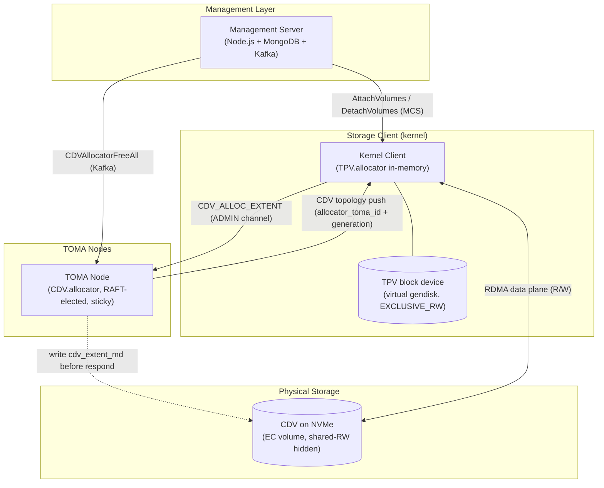
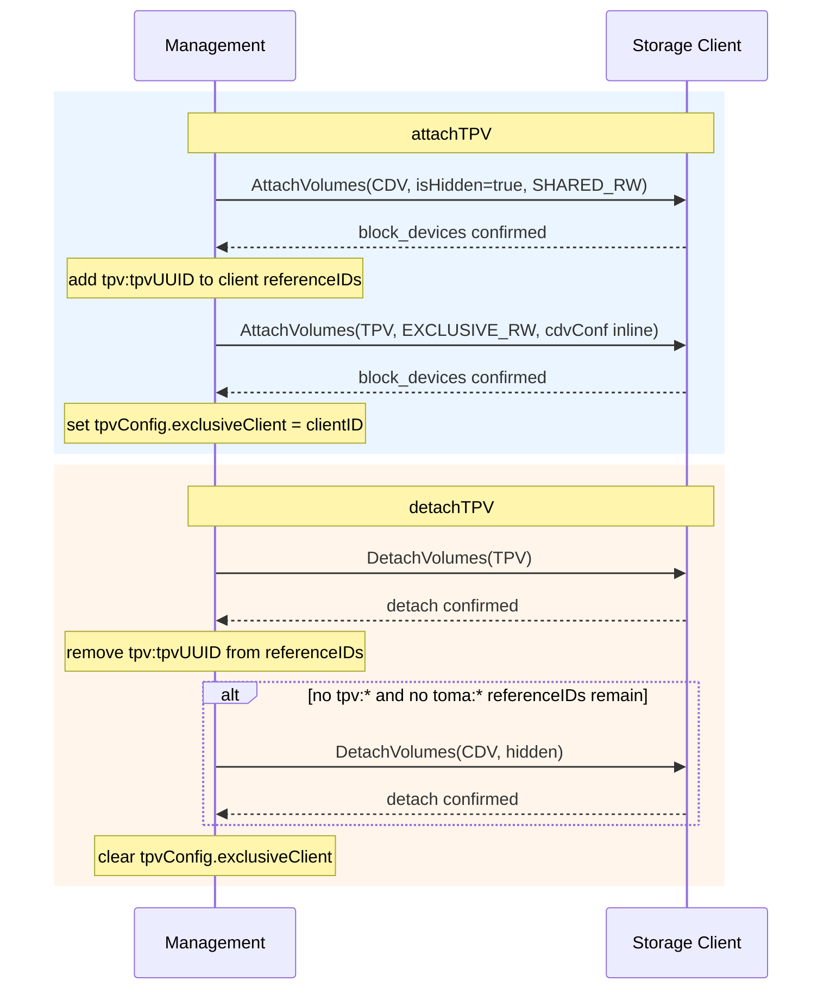
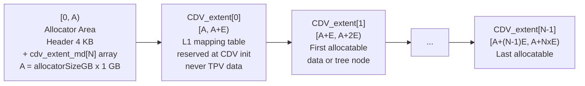
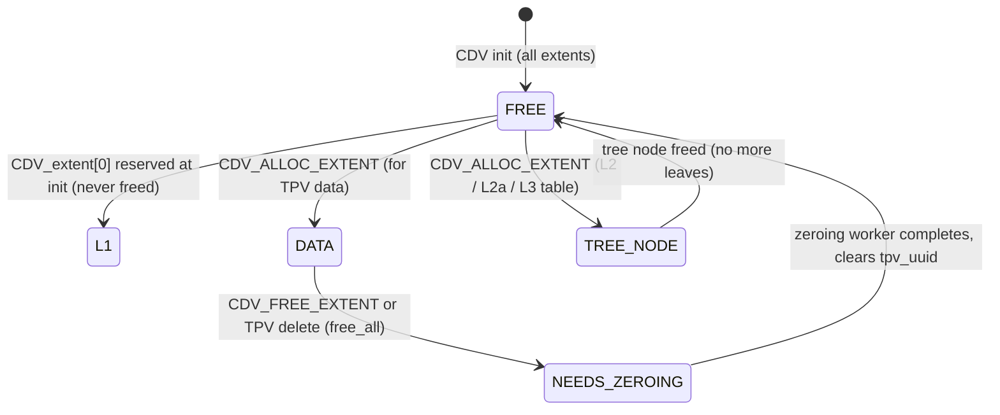
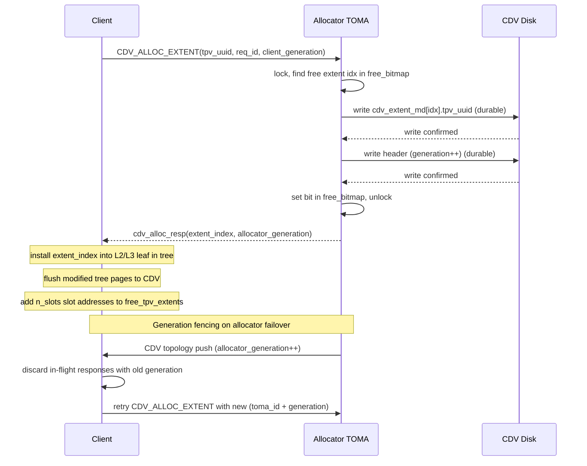
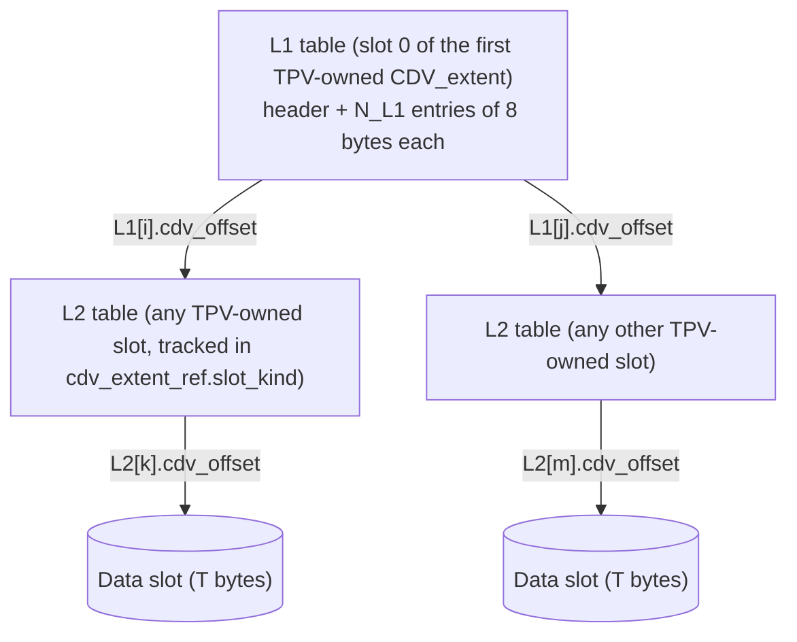
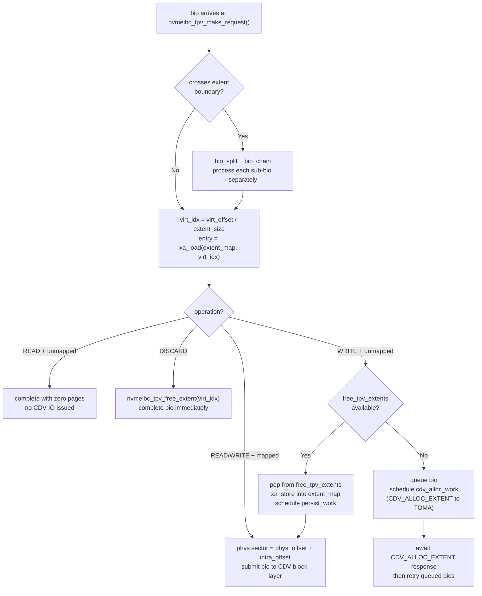
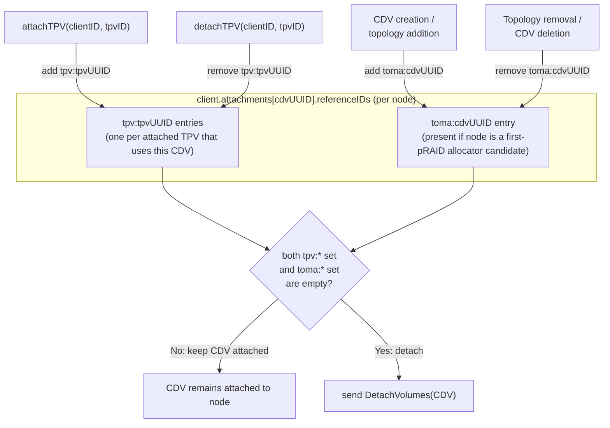

# Thin Provisioning Implementation Plan — v3

Based on: *2026-03 Minimal Extensible Thin Provisioned Volumes.md*

Authoritative merged document. Supersedes ThinProvisioningImplementation1.md and ThinProvisioningImplementation2.md.

---

## Terminology

| Term | Meaning |
|------|---------|
| **CDV** | Carrier Direct Volume — thick-provisioned shared volume holding capacity for TPVs |
| **CDV\_extent** | Allocation unit carved from CDV; size is configurable per-CDV (`cdvExtentSizeMB`), power-of-2, between 64 MB and 64 GB |
| **TPV** | Thin-Provisioned Volume — virtual volume riding on a CDV, exclusively attached to one client |
| **TPV\_extent** | Fine-grained allocation unit within the TPV; size is configurable per-TPV (`tpvExtentSizeKB`), power-of-2, between 64 KB and 64 MB |
| **CDV.allocator** | Central allocator running on a TOMA node; manages CDV\_extent allocation |
| **TPV.allocator** | Client-local allocator; manages TPV\_extent sparse map within already-allocated CDV\_extents |

---

## Architecture Decisions (resolved)

1. **CDV.allocator placement**: Dedicated TOMA node (central, not distributed).
2. **CDV.allocator persistence**: A configurable area at the start of the CDV of size `allocatorSizeGB` GB (default 1 GB). Max addressable data extents = $(\texttt{allocatorSizeGB} \times 1\,\text{GB} - 4\,\text{KB}) / 24$ (see §2.2). Decoupled from `cdvExtentSizeMB` so the allocator area size can be chosen independently of the allocation granularity.
3. **Management → kernel channel**: Existing MCS over Kafka (`AttachVolumes` / `DetachVolumes` / `UpdateVolume` messages extended with new fields).
4. **CDV attach mode**: Hidden shared-RW to clients with a TPV on that CDV (so the kernel thin-provisioning code can access CDV data); non-hidden shared-RW to TOMA nodes that are candidate allocators (so TOMA can perform block I/O to the allocator metadata area).
5. **TPV\_extent size**: Variable — configurable per-TPV at creation time (`tpvExtentSizeKB`). Different TPVs on the same CDV may use different TPV\_extent sizes.
6. **TPV.Delete**: Force-reclaim from CDV.allocator via Kafka message to TOMA (no client attach needed).
7. **MongoDB modeling**: Extend existing `volumes` collection; no new collections.
8. **CDV\_extent allocation requests**: Client → TOMA allocator via the per-disk ADMIN channel (new opcode). TOMA notifies management only when CDV reaches 90% capacity via existing TOMA→management Kafka path.
9. **TPV.allocator state persistence**: Centralized in CDV\_extent[0] (the first data CDV\_extent, at CDV byte offset `A`), which is reserved at CDV init as the **L1 table**. The L1 table is a flat array of 16-byte entries (8B `extent_index` pointer + 8B `debug_meta`). The first half of the L1 table points to **L2 tables**; each L2 entry is a leaf pointing to a data CDV\_extent (2-level path, common case). The second half of L1 points to **L2a tables**, each of whose entries points to an **L3 table**, whose leaves point to data CDV\_extents (3-level path, rarely needed). L2/L2a/L3 tables are CDV\_extents allocated from the pool when first needed. Data CDV\_extents contain **no per-extent metadata** — all virtual→physical mapping lives in the tree. TPV UUID is the sole identifier for TOMA-side ownership tracking (`cdv_extent_md`).
10. **Allocator identity**: `(allocator_toma_id, allocator_generation)` are two fields carried in the existing RAFT-replicated pRAID topology record (the CDV's first-pRAID `topo_ctx`). They reach every TOMA through the standard `AppendEntries` → follower-apply pipeline — no parallel channel, no custom retry. Further propagation to clients uses the CDV topology push TOMAs already send. Allocator role is sticky — changes only when the current TOMA leaves the RAFT group, not on RAFT leader rotation. See §2.6 and `EmbedAllocatorInRaft.md`.
11. **New allocator selection rule**: Chosen from TOMAs hosting a RW-enabled disk segment in the CDV's first pRAID. One candidate → chosen by default. Multiple candidates → chosen at random by the RAFT leader (avoids bias).
12. **Allocation transactionality**: Allocator writes `cdv_extent_md` durably to CDV disk **before** sending the allocation response (write-before-respond). Generation fencing discards stale-generation responses on the client.
13. **CDV attach/detach lifecycle — auto-managed only**: CDV attachments are exclusively auto-managed by management; `POST /clients/attach` and `POST /clients/detach` reject CDV volumes with an error. Two independent reasons trigger CDV attachment to a node; both must be absent before the CDV is detached:
    - **TOMA reason** (`toma:<cdvUUID>` referenceID): node hosts a RW disk segment in the CDV's first pRAID (i.e., is a candidate allocator). TOMA attachment is added by `attachCDVToAllTomaNodes()` when the first TPV on the CDV is attached to any client; it is removed by `onTPVDetached()` when the last active TPV is detached. Topology changes (`onTopologyUpdate()`) add/remove the TOMA ref for nodes that enter/leave the first pRAID. CDV deletion also triggers `detachCDVFromAllNodes()` as a defensive cleanup before the volume record is removed.
    - **TPV client reason** (`tpv:<tpvUUID>` referenceID): node has a TPV backed by this CDV attached to it. Added by `attachTPV()` step `attachCDV`; removed by `detachTPV()` or `cleanupTPVReferencesForDetachedClient()` when the TPV is detached.
    - A node that is both a TOMA candidate and hosts an active TPV will hold both refs simultaneously. TOMA attachment runs first within `attachTPV()` (so the CDV is non-hidden when the client's `tpv:` ref is added); a node is only detached when both refs are removed.
    - **Hidden/non-hidden for mixed nodes**: if a node is simultaneously a TOMA candidate and a TPV client, it should have `isHidden=false` so TOMA can perform block I/O to the allocator area. Running `attachCDVToAllTomaNodes()` before `attachCDV()` in `attachTPV()` achieves this for the first TPV on a TOMA node. If the CDV was already attached hidden (from an earlier TPV on the same node), the `toma:` ref update via `updateOnlyRefIdIfPossible` preserves the existing `isHidden=true`. This edge case is accepted as a known limitation; in practice TOMA nodes are dedicated storage nodes and do not run TPVs.
14. **CDV hidden-attach orchestration**: Management orchestrates. When a TPV is attached to a client, `attachTPV()` in `modules/client.js` first ensures all TOMA nodes have the CDV (non-hidden), then sends a hidden CDV `AttachVolumes` message to the TPV client, then sends the TPV `AttachVolumes` message.
15. **RAID level for CDVs**: No restriction. User chooses RAID level freely (EC is recommended but not enforced by the UI or backend).
16. **REST API for CDV/TPV creation**: Both CDV and TPV creation reuse `POST /volumes/save` with `volumeClass` and the appropriate config sub-object in the payload. The backend `createVolume` handler branches on `volumeClass`.
17. **TOMA zeroing IO path**: The background zeroing worker issues zero-writes via the normal TOMA IO path to the EC volume. No special block-zero command path is needed.
18. **Encryption scope & zero-on-free default**: **CDVs and their `<CDV>-mgmt` satellite volumes are never created with NVMesh volume-level encryption** — neither carries an `isEncrypted` flag and management refuses to enable encryption on either. Encryption is handled exclusively at the TPV level (per-TPV LUKS overlay on the client; see Part 5). A TPV-layer rekey makes stale data at the CDV physical offsets cryptographically unreadable to the next TPV that allocates the slot. The satellite holds only allocator metadata (TPV UUIDs, extent indices) — no user data — so leaving it plaintext is by design and not a regression vs. the previous in-CDV layout. Zero-on-free on TPV delete is therefore not required for the typical encrypted deployment and is **disabled by default**. It can be enabled per-TOMA via the `cdv_extent_zero_on_free` runtime config parameter (`toma_rpc config set cdv_extent_zero_on_free 1`) for unencrypted or stricter-isolation deployments. See §3.9 for the release-path details.

---



*Figure 7: System architecture layers. Management orchestrates attach/detach; TOMA runs the CDV.allocator with write-before-respond persistence; clients hold TPV.allocator state in-memory and access the CDV directly over RDMA.*

---

## Part 1 — Management Layer

### 1.1 MongoDB Schema — Volume Model Extensions

File: `nvmesh-management/validationSchemes/definitions/volume.js`

Add the following fields to the existing volume validation schema:

```js
// Class discriminator — added alongside existing 'type' field (METADATA_VOLUME / DATA_VOLUME)
volumeClass: {
    type: String,
    enum: ['REGULAR', 'CDV', 'TPV'],
    default: 'REGULAR',
},

// CDV-specific fields (present when volumeClass === 'CDV')
cdvConfig: {
    maxTPVs:          { type: Number, default: 512 },   // mutable cap on hosted TPVs; default 512
    cdvExtentSizeMB:  { type: Number, required: true }, // power-of-2, 64–65536 MB
    allocatorSizeGB:  { type: Number, default: 1 },     // allocator area size in GB; integer >= 1
},

// TPV-specific fields (present when volumeClass === 'TPV')
tpvConfig: {
    cdvId:               { type: String, required: true },  // _id of parent CDV
    cdvUUID:             { type: String, required: true },
    tpvExtentSizeKB:     { type: Number, required: true }, // power-of-2, 64–65536 KB
    // Constraint: tpvExtentSizeKB <= cdv.cdvConfig.cdvExtentSizeMB * 1024
    virtualSizeGB:       { type: Number, required: true },  // current virtual size
    maxVirtualSizeGB:    { type: Number, default: 1000 },   // hard cap (1 TB default)
    exclusiveClient:     { type: String, default: null },   // clientID when attached
    exclusiveClientUUID: { type: String, default: null },
},
```

Also add a `tpvCount` field to CDV records (not in the schema definition above, managed directly by `createTPV` / `deleteTPVs`):

```js
tpvCount: { type: Number, default: 0 },  // tracked via $inc; never set directly
```

The `capacity` field on a TPV record holds the *virtual* capacity. Physical capacity consumed is tracked via CDV.allocator on-disk state, not in MongoDB.

### 1.2 REST API — New and Modified Endpoints

#### CDV creation — extends existing `POST /volumes/save`

No new endpoint. CDV creation goes through the existing `POST /volumes/save` with `volumeClass: 'CDV'` and `cdvConfig` in the body. The `createVolume()` handler in `modules/volume.js` validates the CDV-specific fields (see §1.4). The frontend `VolumesService.create(volume)` requires no changes.

#### TPV creation — extends existing `POST /volumes/save`

TPV creation also goes through `POST /volumes/save` with `volumeClass: 'TPV'` and `tpvConfig` in the body. The `createVolume()` handler performs the cross-document validation (CDV lookup, `tpvCount` cap check, `tpvCount` increment) when it sees `volumeClass === 'TPV'`.

#### New endpoints in `routes/volumes.js`

```
POST /volumes/tpv/update
  Body: { _id, name?, description?, tpvConfig.maxVirtualSizeGB? }
  → Mutable fields only: name, description, maxVirtualSizeGB.
  → volumeClass and tpvConfig.cdvId are immutable.

POST /volumes/tpv/delete
  Body: [ _id, ... ]  (array of TPV _id strings)
  → Requires tpvConfig.exclusiveClient === null for each (must be detached).
  → Sends CDVAllocatorFreeAll Kafka message to TOMA for each TPV.
  → Decrements CDV.tpvCount via $inc.
  → Deletes TPV record.
  → Errors reported same as regular volume delete (no disabled-button precondition in UI).

POST /volumes/tpv/extend
  Body: { tpvId, newSizeGB }
  → Validates newSizeGB > current && <= tpvConfig.maxVirtualSizeGB.
  → Updates tpvConfig.virtualSizeGB + capacity.
  → If TPV is currently attached (exclusiveClient !== null), sends UpdateVolume
    Kafka message to client with updated virtualSizeGB.
```

CDV create, update, delete, and extend all use the existing `/volumes` endpoints (`POST /volumes/save`, `POST /volumes/update`, `POST /volumes/delete`, `POST /volumes/extend`). The `updateVolume()` handler in `modules/volume.js` branches on `volumeClass === 'CDV'` to apply CDV-specific update logic: `maxTPVs` is mutable; `cdvExtentSizeMB` and `allocatorSizeGB` are immutable and ignored if present in the payload. If `maxTPVs` is set below the current `tpvCount`, the update is accepted — existing excess TPVs are unaffected, and new TPV creation is blocked until `tpvCount` drops below the new limit. Backend enforces "all TPVs must be deleted first" for CDV delete and returns a standard error if violated; no special UI handling.

#### Modified endpoints

`POST /clients/attach` — when `volumeClass === 'TPV'`:
1. Reject if `tpvConfig.exclusiveClient !== null` (already attached elsewhere).
2. Call `client.js:attachTPV(clientID, tpvID)` — see §1.4 for full orchestration.
3. Set `tpvConfig.exclusiveClient = clientID`.

`POST /clients/detach` — when `volumeClass === 'TPV'`:
1. Call `client.js:detachTPV(clientID, tpvID)`.
2. After client confirms detach, clear `tpvConfig.exclusiveClient`.

### 1.3 Kafka/MCS Message Changes

Files in `nvmesh-management/models/kafkaMessages/`

#### Extend `VolumeMessage.js`

```js
// Added to VolumeMessage.toJSON() when volume.volumeClass is set:
volumeClass: volume.volumeClass || 'REGULAR',
tpvConfig:   volume.tpvConfig   || null,
cdvConfig:   volume.cdvConfig   || null,
isHidden:    volume.isHidden    || false,  // CDV hidden-attach flag
```

#### Extend `AttachVolumes.js`

When attaching a TPV, include the full CDV configuration inline:

```js
{
    messageType: 'AttachVolumes',
    payload: {
        volumes: [
            {
                ...tpvVolumeConf,
                volumeClass: 'TPV',
                tpvConfig: { ... },
                cdvConf: {
                    uuid:   cdv.uuid,
                    name:   cdv.name,
                    chunks: cdv.chunks,
                    // ... full CDV volume configuration
                }
            }
        ]
    }
}
```

The CDV hidden-attach is sent as a *separate* `AttachVolumes` message before this one (§1.4). The `cdvConf` inline field is provided so the kernel can cross-check it has the correct CDV already attached.

#### New message: `CDVAllocatorFreeAll.js`

Sent from management to TOMA when a TPV is deleted (force-reclaim all CDV\_extents owned by that TPV):

```js
// payload:
{
    cdvUUID: string,
    tpvUUID: string,
}
```

#### New message: `CDVCapacityWarning.js` (TOMA → management)

TOMA sends this when the CDV.allocator finds fewer than 10% of extents free:

```js
// payload:
{
    cdvUUID:      string,
    usedExtents:  number,
    totalExtents: number,
}
```

`CDVAllocatorRequest` and `CDVAllocatorResponse` are **not** management-layer messages — they flow directly between the client kernel and TOMA via the ADMIN channel.

### 1.4 Module Changes

#### `modules/volume.js`

Extend `createVolume()` to handle CDV and TPV:

```js
// After existing field validation:
if (volumeData.volumeClass === consts.volumeClass.CDV) {
    const { cdvExtentSizeMB, allocatorSizeGB, maxTPVs } = volumeData.cdvConfig || {};

    if (!consts.cdvExtentSizeMBValues.includes(cdvExtentSizeMB))
        throw new Error('cdvExtentSizeMB must be a power-of-2 between 64 and 65536 MB');
    if (!Number.isInteger(allocatorSizeGB) || allocatorSizeGB < 1)
        throw new Error('allocatorSizeGB must be a positive integer (minimum 1)');

    volumeData.tpvCount = 0;
    volumeData.cdvConfig.maxTPVs = maxTPVs ?? 512;
    volumeData.cdvConfig.allocatorSizeGB = allocatorSizeGB ?? 1;

    // After volume is created and chunk layout is known:
    await cdvTomaAutoAttach.initCDV(createdVolume);   // §5
}

if (volumeData.volumeClass === consts.volumeClass.TPV) {
    const { cdvId, tpvExtentSizeKB, virtualSizeGB, maxVirtualSizeGB } = volumeData.tpvConfig || {};

    const cdv = await db.volumes.findOne({ _id: cdvId, volumeClass: 'CDV' });
    if (!cdv) throw new Error('Parent CDV not found');
    if (cdv.tpvCount >= cdv.cdvConfig.maxTPVs)
        throw new Error(`CDV is at capacity (${cdv.cdvConfig.maxTPVs} TPVs)`);
    if (virtualSizeGB > cdv.capacity)
        throw new Error('virtualSizeGB cannot exceed parent CDV capacity');

    if (!consts.tpvExtentSizeKBValues.includes(tpvExtentSizeKB))
        throw new Error('tpvExtentSizeKB must be a power-of-2 between 64 and 65536 KB');
    if (tpvExtentSizeKB > cdv.cdvConfig.cdvExtentSizeMB * 1024)
        throw new Error(`tpvExtentSizeKB (${tpvExtentSizeKB}) cannot exceed cdvExtentSizeMB * 1024`);

    volumeData.tpvConfig.cdvUUID = cdv.uuid;
    volumeData.capacity = virtualSizeGB;
    volumeData.status = 'initializing';

    // Insert TPV record, then atomically increment CDV.tpvCount:
    await db.volumes.updateOne({ _id: cdvId }, { $inc: { tpvCount: 1 } });
}

// Strip class-specific configs from records that don't need them:
if (!volumeData.volumeClass || volumeData.volumeClass === consts.volumeClass.REGULAR) {
    delete volumeData.cdvConfig;
    delete volumeData.tpvConfig;
}
```

Extend `updateVolume()` to handle CDV-specific fields, and add new exported functions `updateTPV`, `deleteTPVs`, `extendTPV`:

```js
// In updateVolume(), branch on volumeClass === 'CDV':
//   Mutable: name, description, cdvConfig.maxTPVs
//   Immutable: cdvExtentSizeMB, allocatorSizeGB — strip from payload before update
//   If maxTPVs < current tpvCount: accept; no error.
//     Existing TPVs are unaffected; createTPV will reject new ones until tpvCount < maxTPVs.

async function updateTPV({ _id, name, description, tpvConfig }, user) {
    // Mutable: name, description, tpvConfig.maxVirtualSizeGB
    // volumeClass and tpvConfig.cdvId are immutable — ignore if present in payload
}

async function deleteTPVs(ids, user) {
    // For each id:
    //   1. Load TPV; error if not found or not TPV class
    //   2. Require tpvConfig.exclusiveClient === null
    //   3. sendCDVAllocatorFreeAll(cdvUUID, tpvUUID)  [via modules/kafka.js]
    //   4. db.volumes.updateOne({ _id: cdvId }, { $inc: { tpvCount: -1 } })
    //   5. db.volumes.deleteOne({ _id })
    // Return aggregate result (same shape as existing deleteVolumes)
}

async function extendTPV({ tpvId, newSizeGB }, user) {
    // 1. Load TPV
    // 2. Validate: newSizeGB > current && <= tpvConfig.maxVirtualSizeGB
    // 3. Update: tpvConfig.virtualSizeGB, capacity
    // 4. If exclusiveClient !== null: send UpdateVolume MCS Kafka message with new virtualSizeGB
}
```

Add a `$lookup` aggregation for TPV queries to denormalize `tpvConfig.cdvName`:

```js
// Appended to the MongoDB aggregation pipeline only when filter includes
// volumeClass: 'TPV', to avoid overhead on regular volume fetches:
{ $lookup: {
    from: 'volume',
    localField: 'tpvConfig.cdvId',
    foreignField: '_id',
    as: '_cdv',
    pipeline: [{ $project: { name: 1 } }]
}},
{ $addFields: { 'tpvConfig.cdvName': { $arrayElemAt: ['$_cdv.name', 0] } }},
{ $unset: '_cdv' }
```

#### `modules/client.js`

Add `attachTPV(clientID, tpvID, opts)`:
1. Load TPV and parent CDV from MongoDB.
2. Inspect `client.attachments[cdvUUID].referenceIDs` for an existing `tpv:<tpvUUID>` or `toma:<cdvUUID>` entry.
3. If CDV is **not** already attached to this client, send `AttachVolumes` for CDV with `isHidden: true` and `reservation.mode = SHARED_READ_WRITE`. Wait for `block_devices` confirmation.
4. Add `tpv:<tpvUUID>` to `client.attachments[cdvUUID].referenceIDs`.
5. Send `AttachVolumes` for TPV with `reservation.mode = EXCLUSIVE_READ_WRITE` and `cdvConf` inline.
6. Set `tpvConfig.exclusiveClient = clientID`.

Add `detachTPV(clientID, tpvID, opts)`:
1. Send `DetachVolumes` for TPV.
2. After confirmation, remove `tpv:<tpvUUID>` from `client.attachments[cdvUUID].referenceIDs`.
3. If no other `tpv:*` referenceID remains (all TPVs relying on this CDV have detached from this client) **and** no `toma:*` referenceID exists — the CDV is no longer required on this client — send a hidden `DetachVolumes` for the CDV.
4. Clear `tpvConfig.exclusiveClient`.



*Figure 4: TPV attach/detach orchestration. The CDV is hidden-attached before the TPV is attached. The CDV is detached only when all TPV and TOMA references for that CDV are gone from this client.*

#### Involuntary TPV detach — CDV cleanup requirement

**Critical invariant:** A client that loses access to a TPV **must also lose access to the underlying CDV** (unless it still holds other `tpv:*` or `toma:*` references on that CDV). Writes to a TPV are physically performed on the CDV — the TPV is a virtual entity with no storage of its own. Leaving the CDV attached after TPV detach would allow an evicted client to continue issuing RDMA writes into the CDV, corrupting other TPVs.

TOMA cannot enforce this on its own. The CDV reference tracking (`tpv:<tpvUUID>` entries in `client.attachments[cdvUUID].referenceIDs`) and the `tpvConfig.exclusiveClient` marker are MongoDB constructs managed entirely by the management layer. Therefore **management must handle CDV cleanup in every code path that can detach a TPV**, not only the normal user-initiated detach.

All three involuntary detach paths in `modules/client.js` call `cleanupTPVReferencesForDetachedClient()`, which clears `tpvConfig.exclusiveClient`, removes `tpv:<tpvUUID>` referenceIDs from the CDV attachment, and conditionally detaches the CDV when no `tpv:*` or `toma:*` references remain:

- **Preemption** (`detachPreemptedClients`) — `cleanupTPVState` step calls `cleanupTPVReferencesForDetachedClient` for every preempted client.
- **Stale client cleanup** (`removeAlreadyDetachedAttachments`) — `cleanupTPVState` step calls `cleanupTPVReferencesForDetachedClient` after reservation update.
- **Client deletion** (`deleteClient`) — fire-and-forget call to `cleanupTPVReferencesForDetachedClient` after `findOneAndDelete`.

#### `modules/kafka.js`

- Register consumer handler for `CDVCapacityWarning` messages from TOMA. On receipt: trigger CDV extend flow (reuse existing volume extend logic).
- Add `sendCDVAllocatorFreeAll(cdvUUID, tpvUUID)` — publishes `CDVAllocatorFreeAll` message to TOMA.

### 1.5 UI Changes

See Part 8 for complete file-by-file implementation detail. Summary:

- **Regular Volumes table (`/volumes`)**: Two filter checkboxes to the right of the Delete/Rebuild buttons: "Show regular volumes" and "Show CDVs", both checked by default. TPVs are never shown in this table (they have their own page).
- **Create/Edit Volume dialog**: "Use as CDV" toggle appears on new-volume forms. When toggled on, CDV-specific fields appear (`cdvExtentSizeMB`, `allocatorSizeGB`, `maxTPVs`). In edit mode, `cdvExtentSizeMB` and `allocatorSizeGB` are shown read-only; `maxTPVs` remains editable. Any RAID level is allowed.
- **New "Thin Provisioning" sidebar section** (top-level, after Volumes): one sub-item "TPV List" at `/thin-provisioning/tpv`.
- **TPV list page**: FiltSortTable with columns Name, Parent CDV, Virtual Size, Max Size, Client, Status. Parent CDV column is filterable.
- **Attach dialog**: Informational note when selecting a TPV to attach.

---

## Part 1.5 — Allocator Satellite Volume (`<CDV>-mgmt`)

### 1.5.1 Problem Statement — Why a Satellite Volume

The original design (§2.6, §2.7) relied on two claims to keep a replaced-but-still-alive allocator from corrupting the CDV's allocator area:

1. A server-side `nvmeibt_raft_is_raft_valid()` gate on `handle_cdv_alloc_extent`.
2. Client-side generation fencing that discards stale allocator responses.

Neither prevents the actual write. The RAFT-majority gate only fires when *this* TOMA is in a minority partition; a normally-running ex-allocator that was replaced by topology change is still in the RAFT majority and its local `alloc->allocator_toma_id`/`allocator_generation` cache remains unchanged until it is either restarted or receives a `CDV_ALLOCATOR_NOTIFY`, which §2.6 explicitly sends **only to the new allocator**. In that window a stale allocator will continue accepting `CDV_ALLOC_EXTENT` requests, pick a "free" extent index from its own in-memory state, and issue `cdv_async_write_record` / `cdv_async_write_header` to `[0, A)` — concurrently with the new allocator doing the same. Both writes can succeed, both clients see success responses, and the on-disk allocator state is corrupted (two TPVs assigned the same extent index, oscillating header generations, or cross-TPV data exposure once the duplicated extent is written).

Client-side generation fencing only discards stale **responses** on the client; it does not stop the old allocator's disk I/O. There is no mechanism in NVMesh today that fences the CDV itself against writes from a node that has been logically replaced.

### 1.5.2 How NVMesh Actually Enforces Exclusivity — Preemption

NVMesh enforces `EXCLUSIVE_READ_WRITE` via per-volume **preemption**, not via target-side identity or MR fencing:

- Management owns a monotonic `reservation.version` per volume (`modules/client.js` `getTransitionQuery`).
- On a reservation change, management publishes `ReservationModeChange` (Kafka, `ManagementToTOMA.reservationModeChange`, `modules/client.js:1510` `sendReservationModeChangeMessageToAllTargets`) carrying the new version to every TOMA serving the volume.
- TOMA stores the new version in `active_reservation_mode_version` per segment (`toma/nvmeibt_seg_active.h:148`, `toma/nvmeibt_register.h:198`).
- Every client I/O carries a `reservation_mode_version` (`toma/clnt/nvmeibt_client_protocol.h:389`). On each request TOMA compares: **if TOMA's version is higher than the client's, the I/O is rejected at the target.**
- Clients that remain valid are told the new version via a topology push and bump their local cache; preempted clients are not notified and continue to issue I/O at the old version, which the target then rejects.

This is a real server-side admission check — not sender-trusted — keyed on a monotonic version rather than on identity. It is whole-volume in its scope.

### 1.5.3 Options Considered

**Option A — per-range exclusivity on the CDV.** Mark `[0, A)` of the CDV as reservation-fenced for the allocator TOMA while `[A, end)` stays shared-RW for TPV clients. Because `reservation_mode_version` is per-volume and not per-range or per-client-identity, implementing this would require one of: a per-offset-range reservation version in the target admission path, a per-client-identity reservation version, or a rule that the allocator TOMA may never also be a TPV client of the same CDV. All three are new, load-bearing extensions to the core exclusivity mechanism, touching the data-plane hot path.

**Option B — satellite allocator volume.** Introduce a dedicated small volume whose only purpose is to hold what would otherwise live in `[0, A)` of the CDV. The satellite is held `EXCLUSIVE_READ_WRITE` by the current allocator TOMA. Re-election is a plain preempt on the satellite: management bumps `reservation.version`, the new allocator attaches at the new version, and the old allocator's writes are rejected at the target by the existing version check. TPV clients hold attachments to the CDV, which has an independent `reservation.version`, and are not affected.

**Decision: Option B.** Option B uses the existing preemption mechanism at its native granularity (per-volume, whole-attachment) on a volume whose purpose matches exactly what the mechanism supports. Option A requires inventing a new dimension of reservation versioning inside the target I/O admission path and has no standalone benefit. The cost of Option B is management-layer coupling between two volumes and a placement constraint — ordinary work in well-covered code.

### 1.5.4 Implementation Spec

#### 1.5.4.1 Volume layout

- Every CDV has a **satellite volume** named `<CDV>-mgmt`. It is `1 GiB` in size (matches today's default `allocatorSizeGB = 1`). Future sizing parity: if `allocatorSizeGB` becomes tunable, the satellite volume size tracks it one-for-one.
- The CDV itself **no longer reserves `[0, A)` for the allocator**. The CDV's user-visible capacity equals its on-disk data capacity; the leading allocator-area region is gone from the CDV on-disk layout. All user-facing presentations of CDV size (UI, CLI, REST, mNDU, CSI) show the CDV capacity without any satellite overhead.
- The satellite volume holds exactly what used to live in `[0, A)`: the 4 KB header and the `cdv_extent_md[]` array. Offset math in `nvmeibt_cdv_alloc.c` is relative to the satellite volume's offset 0 (not to the CDV's offset 0). Data extents now start at CDV offset `0`.

#### 1.5.4.2 Naming and sizing constraints

- **CDV name limit: 16 characters.** `<CDV>-mgmt` is therefore ≤ 21 characters, well within NVMesh's volume name limit. Enforced in the create-CDV path (REST validation + UI form validation).
- `<CDV>-mgmt` is a reserved suffix; regular volume creation rejects names ending in `-mgmt`.

#### 1.5.4.3 Lifecycle — atomic create / delete, CDV-only extend

- **Create.** `POST /volumes/save` for a CDV allocates `capacity + 1 GiB` of raw disk capacity and writes **both** documents (`<CDV>` and `<CDV>-mgmt`) in a single Mongo operation. If either write fails the operation is rolled back before any Kafka traffic is emitted. No state is published to TOMA/clients until both volumes are durable.
- **Delete.** Deleting a CDV deletes both volumes in one operation. Users cannot delete the satellite independently; the satellite has no delete affordance in UI or REST (see §1.5.4.5).
- **Extend.** Volume-extend on a CDV extends **only** the CDV. The satellite size is fixed at creation (1 GiB covers ~44.7M extents — sufficient for any realistic CDV). This keeps the Mongo update path single-document.
- **Resize-down / encryption / other mutations** on the CDV do not touch the satellite.

This "allocate raw + write two docs + single rollback" discipline keeps the Mongo transactional surface the same as today's single-volume create path — which is important because NVMesh Mongo writes are not multi-document atomic.

#### 1.5.4.4 Attach discipline — allocator-driven, not management-driven

- **TOMAs no longer auto-attach CDVs.** The existing `cdvTomaAutoAttach` mechanism (Part 5) was motivated by the need to give TOMA write access to `[0, A)`. With the allocator area moved to the satellite, the CDV itself requires no TOMA attachment. The auto-attach module becomes allocator-volume-scoped (see below) and CDV attachment is driven solely by TPV client flows.
- **Allocator-initiated attach.** When RAFT elects an allocator TOMA (§2.6 election), the elected TOMA sends a new Kafka message `TOMAToManagement.attachSatelliteRequest(cdvUUID, tomaHostname)` to management. Management responds by:
  1. Bumping the satellite's `reservation.version` and publishing `ReservationModeChange` to all targets of the satellite with `reservationMode = EXCLUSIVE_READ_WRITE`.
  2. Attaching the satellite to the requesting TOMA in `EXCLUSIVE_READ_WRITE` with `preempt = true`, `isDetachOthers = true`. This reuses the existing preempt path (`modules/client.js:3513-3539`) verbatim — the prior allocator, if any, is the "other" client being preempted.
- **No REST attach.** `POST /clients/attachVolumes` rejects any attach to a `-mgmt` volume. The satellite is attachable only via the internal Kafka request above. The UI never surfaces an attach control for satellites.
- **Detach on re-election.** When a new allocator is elected, the old allocator's satellite attachment is preempted by the new allocator's attach request (above). No explicit detach message is required — preemption is the mechanism.
- **Detach on TOMA failure.** Standard stale-client cleanup (`removeAlreadyDetachedAttachments`) applies; the satellite follows the same rules as any other EXCLUSIVE_READ_WRITE volume.

#### 1.5.4.5 UI presentation

- The satellite appears in the **Volumes table as a child row beneath its CDV**, named `<CDV>-mgmt`. It shows the same status columns as any volume (health, attached targets, capacity).
- **No selection checkbox** for satellite rows — bulk-delete cannot target it.
- **No edit button** — the satellite is not editable.
- No create flow exposes satellites; they only come into existence via CDV creation.
- The Thin Provisioning page does not show satellites at all; they belong to the CDV and are a CDV implementation detail.

#### 1.5.4.6 TOMA kernel changes

- All code in `toma/nvmeibt_cdv_alloc.c` that currently reads/writes the CDV's `[0, A)` range (`cdv_async_write_record`, `cdv_async_write_header`, `cdv_ondisk_scan`, `cdv_ondisk_scan_async`) now operates on the satellite volume. Offsets become relative to the satellite: header at offset 0; `cdv_extent_md[i]` at offset `4096 + i * sizeof(cdv_extent_md)`.
- The satellite's UUID is resolved at allocator-initialization time from the CDV's management metadata (delivered in the topology push for the CDV, which now also carries `allocator_volume_uuid`).
- On-disk header layout is unchanged — it's just at a different physical location.

#### 1.5.4.7 Client kernel changes

- **None.** Clients attach the CDV exactly as today, at `SHARED_READ_WRITE`. TPVs continue to allocate CDV extents via `CDV_ALLOC_EXTENT` on the admin channel. Clients do not attach the satellite and are not aware of it.
- Offset translation in `nvmeibc_tpv.c` changes by a constant: the first CDV data extent is now at CDV offset `0` instead of `A`. This is a single `A = 0` simplification in `tpv_cdv_offset_for_extent` and related helpers.

#### 1.5.4.8 Correctness argument

- The allocator area can only be written by a holder of the satellite's `EXCLUSIVE_READ_WRITE` reservation at the current `reservation.version`.
- Re-election bumps the version via the standard preempt path. The old allocator's I/O carries the old version; the target rejects it per §1.5.2. No identity cache, no notification, and no cooperation from the old allocator is required.
- The node-may-also-be-a-TPV-client concern dissolves: the TPV client attaches the CDV, which has an independent `reservation.version`. Preempting the satellite does not touch the CDV.
- The RAFT-majority gate and the `CDV_ALLOCATOR_NOTIFY` monotonicity guard in §2.6 become defense-in-depth rather than the primary safety argument. §2.6 / §2.7 will be revised in a follow-up to reflect this.

### 1.5.5 What This Supersedes

- **§2.2 On-Disk Format:** The allocator area moves out of the CDV and into the satellite. The `allocatorSizeGB` CDV property is replaced by the fixed-1-GiB satellite size; `cdvConfig.allocatorSizeGB` becomes obsolete (retained in the schema only for pre-migration volumes, if any).
- **§2.6 Election and Identity Propagation:** Election unchanged. Identity propagation simplifies: no need for `CDV_ALLOCATOR_NOTIFY` unicast; the attach-satellite Kafka request + preempt is the propagation mechanism. The on-disk header-generation monotonicity guard stays as belt-and-suspenders but is not safety-critical.
- **§2.7 Split-Brain Protection:** Write-before-respond stays. The RAFT-majority gate (`nvmeibt_raft_is_raft_valid`) stays but is no longer load-bearing — the reservation-version check at the target is the authority.
- **Part 5 CDV Auto-Attachment:** Becomes "Allocator Volume Attachment" and applies only to the satellite. The CDV is no longer auto-attached to TOMAs.

---

## Part 2 — TOMA: CDV.allocator

### 2.1 Overview

The CDV.allocator is a role held by exactly one TOMA at any time. It owns all CDV\_extent allocation and reclamation, persists its state in the first `allocatorSizeGB` GB of the CDV (a configurable property, default 1 GB), and is the sole authority on which extents are free, allocated, or pending zeroing.

**Communication**: Clients send allocation requests to the allocator TOMA via the **per-disk ADMIN channel** — the same channel already used for journal range queries, resource location, and other control-plane operations. No Kafka is involved in the allocation hot path.

**Discovery**: The identity of the current allocator TOMA (`allocator_toma_id`) is included in the CDV topology that TOMAs already push to subscribing clients at attach time and whenever it changes.

**Election**: RAFT-committed state. Sticky — does not change when the RAFT leader rotates, only when the current allocator TOMA leaves the RAFT group (§2.6).

### 2.2 On-Disk Format (Allocator Area)

The allocator area occupies the first `allocatorSizeGB` GB of the CDV (bytes `0` to `A`). Data CDV\_extents follow immediately after. Two independent size parameters:

- $A = \texttt{allocatorSizeGB} \times 1\,\text{GB}$ — allocator area size (configurable CDV property, default 1 GB)
- $E = \texttt{cdvExtentSizeMB} \times 1\,\text{MB}$ — CDV\_extent size (configurable CDV property)

```
[0 .. A)       CDV.allocator: header (4 KB) + cdv_extent_md[N] array
               where A = allocatorSizeGB * 1 GB
[A   .. A+E)   CDV_extent[0]  — L1 mapping table (reserved at CDV init; never available for TPV data)
[A+E .. A+2E)  CDV_extent[1]  — first allocatable extent (data or tree node)
...
Data CDV_extents contain only user data — no per-extent metadata headers.
```



*Figure 1: CDV physical layout. The allocator area (A bytes) holds only metadata. CDV_extent[0] is permanently the L1 mapping table root. All allocatable data extents start at CDV_extent[1] and contain no embedded headers.*

`cdv_extent_md[i]` describes CDV\_extent $i$, at CDV byte offset $A + i \times E$. CDV\_extent[0] is always `CDV_EXTENT_L1`.

#### Header

```c
#define CDV_ALLOC_MAGIC    0xCDVA110C
#define CDV_ALLOC_HDR_SIZE 4096

union cdv_alloc_header {
    struct {
        u32 magic;              // CDV_ALLOC_MAGIC
        u32 version;
        u64 allocator_size_gb;  // A in GB; verify config match on recovery
        u64 cdv_extent_size_mb; // E in MB; verify config match on recovery
        u64 total_extents;      // number of data CDV_extents = (CDV_capacity - A) / E
        u64 allocated_extents;
        u64 generation;         // incremented on every flush to disk
    };
    u8 _pad[CDV_ALLOC_HDR_SIZE];
};
```

#### Per-extent metadata

```c
// Flat array of cdv_extent_md[total_extents] immediately following the header.
// cdv_extent_md[i] → CDV_extent at CDV byte offset A + i * E.
// cdv_extent_md[0] always has extent_type = CDV_EXTENT_L1.

enum cdv_extent_type : u8 {
    CDV_EXTENT_FREE = 0,  // available for allocation
    CDV_EXTENT_L1   = 1,  // CDV_extent[0]: L1 mapping table root
    CDV_EXTENT_L2   = 2,  // L2 table (2-level path leaf → data)
    CDV_EXTENT_L2A  = 3,  // L2a table (3-level path: → L3 → data)
    CDV_EXTENT_L3   = 4,  // L3 table (3-level path leaf → data)
    CDV_EXTENT_DATA = 5,  // data extent owned by a TPV
};

struct cdv_extent_md {
    u8  tpv_uuid[16];    // owning TPV UUID (DATA extents); all-zero for table/free extents
    u8  extent_type;     // cdv_extent_type enum
    u8  flags;           // bit 0: NEEDS_ZEROING before reuse
    u8  reserved[6];
};
// sizeof(cdv_extent_md) = 24 bytes (unchanged)
//
// Max addressable extents = (A - 4 KB) / 24
// where A = allocatorSizeGB * 1 GB
//
// Examples (default A = 1 GB):
//   allocatorSizeGB=1 → ~44.7M extents addressable
//   allocatorSizeGB=4 → ~178.9M extents addressable
//
// Actual extents present depends on CDV physical capacity:
//   total_extents = (CDV_capacity_bytes - A) / E
//   CDV_extent[0] is always L1; first allocatable extent is CDV_extent[1].
```

### 2.3 In-Memory State

New file: `toma/nvmeibt_cdv_allocator.c`

```c
struct cdv_allocator {
    u64                   cdv_uuid_hi, cdv_uuid_lo;
    u64                   allocator_size_gb;   // A; constant after init
    u64                   cdv_extent_size_mb;  // E; constant after init
    u64                   total_extents;
    unsigned long        *free_bitmap;          // 1 bit per extent, in RAM
    struct cdv_extent_md *extent_md;            // RAM mirror of on-disk array
    spinlock_t            lock;
    struct list_head      needs_zeroing_list;
    struct work_struct    zeroing_work;
};

// alloc():     find first clear bit, set it, write extent_md, flush header (generation++)
// free():      clear bit, set NEEDS_ZEROING, enqueue zeroing_work
// free_all():  scan extent_md, free all extents where tpv_uuid matches
```



*Figure 6: CDV extent lifecycle. DATA extents carry tpv_uuid in cdv_extent_md. NEEDS_ZEROING prevents reuse until the background zeroing worker clears the extent. CDV_extent[0] (L1) is assigned at CDV init and is permanent.*

### 2.4 Cold Recovery (TOMA restart)

Runs after CDV EC cold recovery completes, while IO gates are still closed:

1. Read `cdv_alloc_header` from CDV offset 0; validate magic.
2. Read `cdv_extent_md[total_extents]` array.
3. Reconstruct `free_bitmap` and `needs_zeroing_list` from on-disk state.
4. Open IO gates; resume allocator service.

### 2.5 CDV Topology: Allocator Identity

Extend the CDV topology payload sent by TOMA to subscribing clients during `DD_STG_TOMA_REREG`:

```c
struct nvmeibc_cdv_toma_topology {
    // ... existing topology fields ...
    u8  allocator_toma_id[...];   // node ID of the current CDV.allocator TOMA
    u64 allocator_generation;     // epoch counter; increments on every allocator change
};
```

The client stores `(allocator_toma_id, allocator_generation)` in its `nvmeibc_tpv` struct. When the allocator changes, TOMA pushes an updated topology to all CDV subscribers using the existing topology-update mechanism.

### 2.6 Allocator Election and Identity Propagation

**Allocator identity is two fields on the RAFT-replicated first-pRAID topology record.** `allocator_toma_id` and `allocator_generation` are added to `nvmeibt_praid_topo_ctx` (and its wire/persist analog `nvmeibt_praid_serialized_topo`), travel in the TOPO TLV of the existing `AppendEntries` commit path, and are applied on every TOMA through the standard `applied_praid_lot` update. There is no parallel message and no custom retry logic.

**Election (RAFT leader only):**
1. `nvmeibt_topology_calc_topology()` runs only on the leader. For every CDV pRAID with `stripe_idx == 0` and `PRAID_REGISTRANTS_SYNC_CMD_STABLE`, the leader builds a candidate list from alive RAFT members (the current candidate source is segment owners; the migration to RAFT members is tracked separately and does not affect this design).
2. `cdv_alloc_elect(cdv_uuid, candidates, out_new_identity)`:
   - Current `allocator_toma_id` still in candidates → sticky, no mutation.
   - Otherwise pick one candidate (random tie-break) → stage `(new_toma_id, current_gen + 1)` into `calculated_praid_lot.topo_ctx`.
3. The staged `calculated_praid_lot` is promoted to `baseline_praid_lot` via the existing `nvmeibt_praid_leader_we_have_a_new_baseline()`, serialized into `praid_wire_topo`, shipped in the next `AppendEntries`, and — on majority-ack — applied on every follower's `applied_praid_lot`.

**Identity apply — every TOMA, leader and followers:**
1. In the topology-apply hook for the CDV pRAID (`update_applied_topology` path), diff `applied_praid_lot.topo_ctx.allocator_*` against the previously applied values for this pRAID.
2. Generation increased and `allocator_toma_id == my_hostname`, local state not `ACTIVE`:
   - Transition `cdv_alloc_hash[cdv_uuid]` to `AWAITING_SATELLITE_ATTACH`.
   - Fire `cdv_send_attach_satellite_request()` — Stage A of the satellite-attach handshake (§1.5.4.4).
3. Generation increased and `allocator_toma_id != my_hostname`, previous was this node:
   - Demote: transition to `NOT_ALLOCATOR`, drain the I/O WQ, close cached fds, clear satellite state.
4. Generation unchanged, or `allocator_toma_id` points elsewhere and was already not us: no-op.

Because this hook runs inside the deterministic, linearized topology-apply path — which every TOMA traverses for every committed topology change and which is replayed on restart — every TOMA converges on the same allocator identity at the same committed log index.

**Client propagation is unchanged** (§2.5). When a TOMA serving a client applies the new topology, it pushes the updated `(allocator_toma_id, allocator_generation)` to its subscribed clients as part of the existing CDV topology push.

```mermaid
sequenceDiagram
    participant L as RAFT Leader TOMA
    participant F as Followers (incl. elected allocator)
    participant M as Management
    participant C as Client

    Note over L: topology_calc_topology → cdv_alloc_elect
    L->>L: calculated_praid_lot.topo_ctx.<br/>allocator_toma_id = chosen<br/>allocator_generation++
    L->>F: AppendEntries (TOPO TLV carries<br/>new allocator fields)
    F->>F: persist + apply<br/>(applied_praid_lot)
    F-->>L: ACK (majority commits)

    Note over F: topology-apply hook on every TOMA
    rect rgb(240,240,240)
        Note over F: On the elected TOMA only:<br/>state → AWAITING_SATELLITE_ATTACH
        F->>M: attachSatelliteRequest (Stage A)
        M-->>F: attachSatelliteResponse (Stage B)
        F->>F: scan satellite; state → ACTIVE
    end

    F->>C: CDV topology push (new allocator + gen)
    C->>F: CDV_ALLOC_EXTENT
    F-->>C: CDV_ALLOC_OK | WRONG_GEN
```

*Figure 9: Election and identity propagation via RAFT topology. The leader writes the new `(allocator_toma_id, allocator_generation)` into the same topology record that carries every other pRAID state change. RAFT delivers it to every follower reliably and in log order. The elected allocator detects its new role inside the apply hook and fires Stage A of the satellite-attach handshake.*

**Correctness and failure modes.**
- **Delivery reliability is RAFT's.** Once committed, the log entry is delivered to every follower; a disconnected follower catches up on reconnect. The "unicast was dropped and Stage A never fired" failure mode that motivated this design cannot occur: either the entry is committed and every follower eventually applies it, or it is not committed and no TOMA acts on it.
- **Monotonicity is by log order.** Only the leader writes `allocator_generation`, as part of the atomic topology commit. Followers apply in log order; a late-arriving older-generation entry is impossible.
- **Cold start.** After a full cluster restart the first elected leader runs `calc_topology` and re-writes the identity if needed. The newly-elected allocator's first topology-apply delivers the committed identity and fires Stage A normally — no special recovery path.
- **Split-brain.** A partitioned minority TOMA cannot commit new topology entries; `handle_cdv_alloc_extent` fails the `nvmeibt_raft_has_majority()` gate (§2.7). The satellite's EXCLUSIVE_READ_WRITE hold (§1.5.4.8) blocks any residual data write from a stale allocator.

**Re-election on allocator departure** is mechanically identical to the initial election, driven by the RAFT-member candidate set: when the old allocator leaves the RAFT group, the sticky rule no longer matches, a new candidate is picked, `allocator_generation++` is staged into `calculated_praid_lot.topo_ctx`, and the commit propagates to every TOMA. The old allocator — if it comes back later — receives the higher-generation entry through catch-up replication and demotes itself in the same topology-apply hook.

**What this supersedes.** The following mechanisms from earlier iterations of this design collapse into the single RAFT-replicated field and the single topology-apply hook:
- `RAFT_MSG_CDV_ALLOC_NOTIFY` unicast and `nvmeibt_raft_send_cdv_alloc_notify` / `handle_notify` plumbing.
- `nvmeibt_cdv_alloc_send_notify_to_elected` + the `cdv_alloc_set_generation` post-send call introduced to patch a self-apply race.
- `cdv_alloc_elect`'s `out_proposed_gen` out-param (introduced by commit `0f4db106` to preserve `handle_notify` as the sole generation writer).
- The receive-side monotonicity guard in `handle_notify`.
- The cold-recovery contract that elect()'s sticky rule might be invoked against an empty local state after full-cluster restart — the RAFT-committed identity makes the bootstrap explicit.

Detailed migration plan, code-changes-by-file, and phased delivery are in `EmbedAllocatorInRaft.md`.

### 2.7 Allocation Transactionality and Split-Brain Protection

#### Write-before-respond

```
alloc():
  1. Lock allocator.
  2. Find free extent idx in free_bitmap.
  3. Write cdv_extent_md[idx] = {tpv_uuid, flags=0} to CDV disk. Wait for completion.
  4. Increment generation; write header to CDV disk. Wait for completion.
  5. Set bit in free_bitmap (RAM).
  6. Unlock.
  7. Send cdv_alloc_resp to client.
```



*Figure 5: Write-before-respond allocation protocol. Both the extent metadata and the header are written durably to disk before the response is sent. Generation fencing discards stale responses after allocator failover.*

Crash scenarios:
- Before step 3: client gets no response, retries. New allocator sees extent as free. Consistent.
- Between step 3 and step 7: client gets no response, retries. New allocator cold-recovers, finds extent allocated to this TPV. Client retries, gets a new extent. The first extent is "orphaned" — NVCK detects it (`tpv_uuid` set in `cdv_extent_md` but no corresponding leaf entry in the L1/L2/L3 tree). Recovery: clear the orphaned `cdv_extent_md` entry and return the extent to the free pool.

#### Generation fencing

Every `cdv_alloc_resp` carries `allocator_generation`. After re-election, clients receive topology with `allocator_generation++`. Clients discard responses with stale generation and retry with the new allocator.

If a partitioned old allocator writes `cdv_extent_md` entries, the new allocator sees them during cold recovery and skips those extents. They become orphans detected by NVCK.

#### Free path transactionality

```
free():
  1. Set cdv_extent_md[idx].flags |= NEEDS_ZEROING. Persist to disk.
  2. Keep bit set in free_bitmap (not yet reusable).
  3. Enqueue zeroing_work.
  4. Zeroing completes.
  5. Clear cdv_extent_md[idx].tpv_uuid. Persist to disk.
  6. Clear bit in free_bitmap (now reusable).
```

On crash between steps 1 and 5: cold recovery sees NEEDS\_ZEROING → re-enqueues zeroing before marking extent free.

### 2.8 CDV\_extent Allocation Protocol (ADMIN Channel)

New opcodes (add to `nvmeibc_config_ops` enum):

```c
NVMEIBC_MA_CDV_ALLOC_EXTENT = 0x20,
NVMEIBC_MA_CDV_FREE_EXTENT  = 0x21,
```

Message structs:

```c
// NVMEIBC_MA_CDV_ALLOC_EXTENT request:
struct nvmeibc_cdv_alloc_req {
    u8  tpv_uuid[16];
    u8  cdv_uuid[16];
    u64 req_id;              // monotonically increasing per-TPV, for idempotency
    u64 client_generation;   // allocator_generation the client believes is current
};

// Response:
struct nvmeibc_cdv_alloc_resp {
    u64 req_id;
    u64 extent_index;        // data CDV_extent index i; CDV byte offset = A + i * E
    u64 allocator_generation;
    u8  status;              // 0=OK, 1=CDV_FULL, 2=WRONG_GENERATION, 3=ERROR
};

// NVMEIBC_MA_CDV_FREE_EXTENT request:
struct nvmeibc_cdv_free_req {
    u8  tpv_uuid[16];
    u8  cdv_uuid[16];
    u64 extent_index;
};
```

Client sends to the admin channel of a disk belonging to the `allocator_toma_id` node. TOMA-side dispatches to `cdv_allocator_alloc()` / `cdv_allocator_free()`.

On `CDV_FULL`: TOMA sends `CDVCapacityWarning` to management. Client pauses write IOs needing new allocation until a topology push signals capacity is available.

On `WRONG_GENERATION`: Client re-fetches CDV topology via TOMA subscription, then retries.

### 2.9 Recovery Changes to Existing TOMA Code

In `toma/nvmeibt_recovery.c`:
- After EC recovery completes, before IO gates open: call `cdv_allocator_cold_recovery(cdv_uuid)`.
- Background scrubbing: skip unallocated extents by checking `free_bitmap[extent_idx]`.

### 2.10 TPV Preemption via CDV Preemption (CRITICAL GAP)

#### 2.10.1 The actual problem

A TPV is a virtual volume with no storage of its own. All TPV data writes land on the underlying **CDV**. Consequently, fencing a TPV from a misbehaving client at the TPV layer would be ineffective: the client can no longer be told "stop writing to TPV X" in any meaningful way — it can only be told "stop writing to the CDV." Any force-detach of a TPV from a client must therefore translate into a **preemption of that client's CDV attachment**, using the standard NVMesh preemption mechanism described in §1.5.2.

The earlier version of this section proposed a bespoke "per-TPV fencing cookie" stored in the CDV allocator header and validated by TOMA on every ALLOC request. That design fenced the *allocation control path* but not the *data path* — the stale client could still issue RDMA writes to CDV extents it had already mapped in its TPV extent_map, because those writes go directly from client to CDV segments, not through TOMA. The design is therefore replaced.

#### 2.10.2 Intended flow

When a TPV's exclusive holder becomes non-responsive and must be displaced:

1. Management detects the need to preempt (new attach request with `preempt=true`, or stale-client cleanup, or involuntary detach — same paths as today).
2. Management **preempts the stale client's CDV attachment**, not the TPV attachment: bumps `cdv.reservation.version`, publishes `ReservationModeChange` to every TOMA serving the CDV, and pushes the new version to every non-preempted client attached to the CDV via the existing topology mechanism.
3. The stale client's subsequent CDV RDMA writes carry the old version and are rejected at the target per §1.5.2. The client eventually observes I/O errors, marks the CDV `NCBD_PREEMPTED`, and stops issuing I/O.
4. Management clears `tpvConfig.exclusiveClient`, removes the `tpv:<tpvUUID>` reference on the stale client's CDV attachment, and (if no other `tpv:*` references remain) removes the CDV attachment record — exactly as today.
5. The new client then attaches the TPV and the CDV cleanly.

This reuses the preemption mechanism at its native granularity and closes the data-path fencing hole the cookie design would have left open.

#### 2.10.3 Critical gap — per-client CDV preemption on a SHARED_READ_WRITE volume

The CDV is attached `SHARED_READ_WRITE` by potentially many TPV clients. We need to preempt *one* of them (the stale holder of some TPV) while leaving the others untouched. **Today's mechanism does not support this.** Code investigation (`nvmesh-management/modules/client.js:1510, 1955, 2905-2951, 3513-3539`, `toma/nvmeibt_seg_active.h:148`, `toma/nvmeibt_register.c:1015-1031, 2552`, `clnt/nvmeibc_block.c:1079-1091`) found:

- `reservation.version` is bumped volume-wide.
- Target-side `active_reservation_mode_version` is per-segment, with **zero per-client context** in the I/O admission comparison. A version bump that reaches the target rejects every client whose register is still at the old version, not just the intended one.
- `ReservationModeChange` Kafka messages are only sent on transitions to `NONE`, not during preempt. The current preempt-on-exclusive safety comes from the new attacher's **register** request carrying the new version, bumping `highest_reservation_mode_version` at the target — a flow that has no analogue when no new attach is happening.
- Preempted clients receive status `'P'` on the next I/O response, enter `NCBD_PREEMPTED`, stop issuing I/O, and wait for management-driven `DetachVolumes` to recover. No auto-reattach.
- No existing test exercises "preempt one SHARED client, keep another SHARED client alive" on the same volume.

Three candidate designs for closing this gap. **This list is not exhaustive; better options should be explored before implementation commits.** Each has open questions that need answers in its own right.

##### Option P1 — Management-layer only, with survivor auto-reattach

Lift the current restriction that `ReservationModeChange` is only sent on transitions to NONE: emit it during preempt too. On TPV force-detach:

1. Management bumps the CDV's `reservation.version` and publishes `ReservationModeChange` to every TOMA of the CDV.
2. Management removes the stale client's `(client, CDV)` attachment from Mongo (strips all `tpv:*` references, detaches CDV).
3. Targets raise `highest_reservation_mode_version`. Every stale-version register becomes non-registrable; in-flight I/O from anyone at the old version gets `'P'`.
4. Survivor clients go through `NCBD_PREEMPTED` transiently and auto-reattach at the new version. This path does not exist today and must be built: on `'P'`, a survivor consults management ("am I still a valid attachment?") and, if yes, detaches and re-attaches the CDV + TPVs without operator intervention.

*Pros:* Minimal target-side surgery. Reuses the existing `'P'` path. Keeps the reservation-version contract intact.

*Cons:* Every preempt causes a transient I/O stall for *all* survivor clients on the CDV. Survivor auto-reattach is a new client-kernel code path with its own correctness concerns (idempotency, fencing, dirty state). Bounded but non-zero user-visible impact on every force-detach event.

*Open questions:* Can the auto-reattach re-establish TPV state without a user-visible I/O error? How long does the stall last under load? Does anything in the block layer break when `NCBD_PREEMPTED` is used as a transient state rather than a terminal one?

##### Option P2 — Per-client register version at the target

Extend `active_registrant` with a per-registrant `registrant_reservation_version`, and change the I/O-admission comparison to reject a registrant only if its own recorded version is below a per-registrant threshold that management can raise selectively. Preempting one client then means: bump the threshold for that registrant only; leave all others alone.

*Pros:* No stall on survivor clients. Clean model — per-client preemption becomes a first-class primitive and is useful beyond thin provisioning.

*Cons:* Real target-side change in the I/O hot path. New state in `active_registrants_hash`. New message type from management to target ("raise registrant X's threshold"). Ripples into mNDU compatibility, simulator coverage, recovery paths, and every place that reads `active_reservation_mode_version` today.

*Open questions:* Where exactly in the I/O admission path does this predicate live? Is the per-registrant threshold durable (RAFT-replicated) or soft? What happens on TOMA failover?

##### Option P3 — Direct client-revoke message

Bypass the reservation-version machinery entirely for this case. Add a new Kafka message `RevokeClientFromVolume(clientID, volumeUUID)` to TOMA. Handler removes that specific entry from the volume's `active_registrants`, so subsequent I/O from that client (or that client's re-register) is refused until management re-admits.

*Pros:* Narrow surgical change. Reservation versions and their invariants remain untouched. No survivor stall. Composable with future work.

*Cons:* Introduces a second admission concept parallel to reservation versions — two mechanisms doing overlapping jobs. Subtle interactions with normal detach/reattach and with stale-client cleanup (`removeAlreadyDetachedAttachments`) need to be worked out so that a revoked client cannot silently re-attach through a different code path. Requires the target to know how to surface a revocation to the affected client (probably via existing `'P'`-style response or a new status code).

*Open questions:* How does the revoked client learn it was revoked in a way distinguishable from a general I/O error? Is `active_registrants` the right level, or should revocation live at a higher level so it survives re-register storms?

##### Summary

| | Target-side change | Survivor impact | Novelty in admission path |
|---|---|---|---|
| P1 | none | transient stall + auto-reattach | new client-kernel path, not target |
| P2 | significant (per-registrant state + predicate) | none | new first-class primitive |
| P3 | moderate (new message, new removal path) | none | parallel admission concept |

**Before committing to any of P1/P2/P3, we should explicitly look for better options.** Possibilities worth investigating include: leveraging MCS re-attach semantics already present in the NDU/hot-upgrade code paths (Part 11) to preempt without a `'P'` transition; per-attachment rather than per-registrant version tracking if `active_registrants_hash` already carries enough to do so cheaply; or an entirely management-layer approach that simply treats a force-detached TPV's CDV references as stale and lets the normal stale-client cleanup path do the work (if the cleanup path can be made authoritative on its own).

**Until this gap is closed, the design has a known correctness hole:** a stale TPV client that ignores `DetachVolumes` can continue issuing RDMA writes to CDV extents it has already mapped, with no mechanism in place to stop it at the target. The satellite-volume work (§1.5) closes the allocator-side stale-writer hole; this section closes the client-side one. Both are required for the thin-provisioning feature to be correct under adversarial or buggy-client conditions.

#### 2.10.4 Superseded

The following are no longer part of the design:

- Per-TPV fencing cookie table in the CDV allocator header.
- `ForceDetachTPV` Kafka message as a distinct mechanism.
- TOMA-side revocation of CDV segment registrations for a stale client.
- Client-side cookie presentation in `CDV_ALLOC_EXTENT` requests.

All of these are replaced by the single "preempt the CDV from the stale client" flow above.

### 2.11 NVCK Support

Add a check to NVCK that:
- Reads `cdv_alloc_header` and `cdv_extent_md` array.
- Verifies `allocated_extents` counter matches the count of non-zero UUID entries.
- Reports extents in `NEEDS_ZEROING` state.
- Reports extents whose `tpv_uuid` no longer exists in management.
- Reports orphaned extents: `extent_type == CDV_EXTENT_DATA` and `tpv_uuid` set in `cdv_extent_md` but no corresponding leaf entry in the L1/L2/L3 tree. Safe to reclaim: clear `cdv_extent_md` entry and return extent to free pool.
- Verifies RAFT-committed `allocator_toma_id` matches the TOMA currently serving alloc requests on the ADMIN channel.

---

## Part 3 — Kernel Client: TPV Datapath

### 3.1 New Kernel Subdirectory: `clnt/tpv/`

Files:
- `nvmeibc_tpv.h` — data structures
- `nvmeibc_tpv.c` — volume attach/detach, block device registration
- `nvmeibc_tpv_allocator.c` — TPV\_extent map, alloc/free
- `nvmeibc_tpv_io.c` — IO dispatch, zero-read, write-allocate
- `nvmeibc_tpv_persist.c` — allocator state serialization to/from CDV
- `nvmeibc_tpv_recovery.c` — cold recovery of allocator state

### 3.2 New Volume Class Handling

In `nvmeibc_main_capi_manipulate_vols.inc.c`, parse `volumeClass` from the MCS `AttachVolumes` message:

```c
enum nvmeibc_volume_class {
    NVC_REGULAR = 0,
    NVC_CDV     = 1,
    NVC_TPV     = 2,
};
```

Add `volume_class` and `is_hidden` to `nvmeibc_volume_header`.

**CDV attach path** (`volume_class == NVC_CDV && is_hidden == 1`):
- Perform full existing volume attach (discovery, IO channels, etc.).
- Do **not** register a block device with the OS (`gendisk`). CDV is accessible internally as `nvmeibc_volume *` but invisible to user space.
- Store the CDV volume pointer in a per-client CDV registry keyed by CDV UUID.

**TPV attach path** (`volume_class == NVC_TPV`): delegated to `nvmeibc_tpv_attach()` in `clnt/tpv/nvmeibc_tpv.c` (§3.8).

### 3.3 Core Data Structures

```c
// A single mapping entry: virtual_extent_index → physical byte offset in CDV.
// phys_offset == 0 means unmapped (CDV offset 0 is inside the allocator area and is
// never a valid TPV_extent location — safe sentinel).
struct nvmeibc_tpv_extent_entry {
    u64 phys_offset;
};

// Sparse map: xarray keyed by virtual extent index → nvmeibc_tpv_extent_entry*.
struct nvmeibc_tpv_allocator {
    struct xarray    extent_map;
    spinlock_t       lock;
    u32              tpv_extent_size_kb;
    u64              virtual_extents_total;

    struct list_head cdv_extent_list;      // nvmeibc_cdv_extent_ref entries
    u64              cdv_extents_count;

    struct list_head free_tpv_extents;     // available physical TPV_extent slots
    u64              free_tpv_extent_count;

    u64              low_watermark;        // schedule CDV alloc when count drops below
                                           // default: 50 MB / tpv_extent_size
};

struct nvmeibc_cdv_extent_ref {
    u64              extent_index;         // data CDV_extent index i
    u64              allocated_count;      // TPV_extents in use within this CDV_extent
    struct list_head node;
};

struct nvmeibc_tpv {
    struct nvmeibc_volume        *cdv_vol;
    struct nvmeibc_tpv_allocator  allocator;
    struct nvmeibc_block_device  *block_dev;
    char                          tpv_uuid[37];
    u64                           virtual_size;         // bytes
    atomic_t                      state;                // ATTACHING / ATTACHED / DETACHING

    // CDV.allocator identity — learned from CDV topology at attach time,
    // updated via topology push when allocator changes.
    u8                            allocator_toma_id[...];
    u64                           allocator_generation;
    spinlock_t                    allocator_id_lock;

    struct work_struct            cdv_alloc_work;
    atomic_t                      cdv_alloc_pending;

    struct work_struct            persist_work;
    spinlock_t                    persist_lock;
    bool                          dirty;
};
```

### 3.4 Allocator State Persistence Format (per-TPV L1/L2 Tree)

Each TPV owns a private 2-level mapping tree that is persisted inside CDV\_extents allocated to that TPV. There is **no CDV-wide metadata region** beyond the TOMA CDV.allocator area `[0, A)`; everything from `A` on is TPV-owned. Per-TPV ownership is required because different TPVs on the same CDV may use different `tpvExtentSizeKB` values (and therefore different slot sizes, L1/L2 fanout, etc.), so a single shared tree cannot encode all of them.

Let $T = \texttt{tpvExtentSizeKB} \times 1024$ (per-TPV slot size in bytes), $E = \texttt{cdvExtentSizeMB} \times 1024^2$ (CDV\_extent size in bytes), $A = \texttt{allocatorSizeGB} \times 1024^3$ (allocator area size in bytes, CDV-wide).

$n_{\text{slots}} = E / T$ — slots per CDV\_extent. Slot $s$ within (1-based) data CDV\_extent $i$ occupies CDV bytes $[A + (i-1) \times E + s \times T,\; A + (i-1) \times E + (s+1) \times T)$.

#### Baseline: dedicated tree extent (historical — superseded by §3.4.1 and §3.4.2)

The first implementation allocated a dedicated CDV\_extent ("tree extent") per TPV at first-write time. Slot 0 held the L1 table (with a `tpv_l1_header` for recovery identification); slots 1+ held L2 tables.

This cost one full CDV\_extent of physical space per TPV regardless of TPV size — ~50% overhead for a small TPV. See §3.4.1 for the replacement.

#### 3.4.1 Dynamic L2 placement — no dedicated tree extent

Client-only change. The first CDV\_extent allocated to the TPV is a normal data extent. Its **slot 0** is reserved for the L1 table and its `tpv_l1_header`; all remaining $n_{\text{slots}} - 1$ slots are data slots entering `free_tpv_extents` alongside the rest of the TPV's free pool.

L2 tables are allocated lazily from the same free pool any time `flush_state` needs to write an L1\_idx whose L2 slot has not been assigned yet. Each L2 table consumes exactly one TPV\_extent slot — on any CDV\_extent owned by the TPV.

Each `nvmeibc_cdv_extent_ref` carries a per-slot usage bitmap:

```c
#define TPV_SLOT_DATA  0
#define TPV_SLOT_L2    1

struct nvmeibc_cdv_extent_ref {
    u64           extent_index;
    u64           allocated_count;     /* data + L2 slots */
    unsigned long *slot_kind;          /* bitmap: 0 = data, 1 = L2 */
    u64           l2_slot_count;       /* count of bits set in slot_kind */
    /* ... */
};
```

Slot 0 of the extent holding L1 is marked separately (a dedicated `is_l1_extent` flag on the ref and `l1_slot_index == 0`) because it is pinned for the lifetime of the TPV.

**Free-extent rule.** `CDV_FREE_EXTENT` is sent to TOMA only when the ref's data-slot count reaches zero **and** `l2_slot_count == 0` **and** `is_l1_extent == false`. A data-empty extent that still pins L2 tables stays attached and waits for the L2 tables to be relocated (compaction) or for the TPV to be deleted.

**First-write cost**: 1 CDV\_extent (down from 2). For a TPV that only ever has one mapped virtual extent, the L1 header, one L2 table, and the single data slot all live in the same CDV\_extent (slots 0, 1, and some slot ≥ 2 respectively).

#### 3.4.2 Compact 8-byte tree entry — direct CDV byte offset

Client-only change. The 16-byte `{extent_index, debug_meta}` entry is replaced by a single `u64 cdv_offset` holding the raw CDV byte offset of the referenced object (either a data slot or an L2 table).

```c
struct tpv_tree_entry { u64 cdv_offset; };   /* 0 = TPV_TREE_NULL (unmapped) */

/* For an L1 entry pointing at an L2 table:
 *     cdv_offset = A + (extent_idx - 1) * E + slot * T
 * For an L2 leaf pointing at a data slot:
 *     cdv_offset = A + (data_idx   - 1) * E + slot * T
 */
```

0 is a safe null sentinel because a valid L1-entry or L2-leaf pointer always satisfies `cdv_offset >= A > 0`.

Consequences:

- $N_{L1} = (T - \texttt{sizeof}(\texttt{tpv\_l1\_header})) / 8$ (was $T/16$-ish)
- $N_{L2} = T / 8$ (was $T/16$)
- Max addressable virtual extents per 2-level tree quadruples.
- `flush_state` encodes a single u64 per leaf; `load_state` decodes `extent_idx = (cdv_offset - A) / E + 1`, `slot = ((cdv_offset - A) % E) / T`.
- The `debug_meta` field is retired; `/proc/extent_map` still prints the derived `extent_idx, slot`.

The on-disk format changes break compatibility — `TPV_L1_VERSION` is bumped. Because TPV is not yet GA, existing dev volumes are reformatted rather than migrated.

#### 3.4.3 Partial-page L1/L2 flush — 4 KB writes instead of full T-byte rewrites

Client-only change.  Today `nvmeibc_tpv_flush_state()` rebuilds each touched table in a vmalloc'd buffer and writes the entire T-byte slot back to CDV — a single 16-byte (or 8-byte post-§3.4.2) leaf change triggers a T-byte write.  For T = 64 KB that is a 4096× amplification on the L2 write plus another T-byte L1 write whenever a new L1 index becomes non-null.  For a 4 KB data write to an unmapped extent the worst-case metadata cost is ~2 × T per leaf.

The CDV block device sector is 4 KB.  An L2 page of 4 KB covers `4096 / sizeof(entry)` leaves (256 with 16-byte entries, 512 with 8-byte entries).  The fix is to write only the 4 KB pages that actually changed:

1. **Per-table dirty-page bitmap.**  Attach a small `unsigned long *dirty_pages` bitmap (`ceil(T / 4096)` bits, typically 16 bits for T = 64 KB) to each in-memory L2 slot.  Maintain a sibling bitmap for the L1 extent's slot 0.
2. **Allocator sets the bit.**  Every `alloc_extent` / `free_extent` that changes leaf `L2[j]` sets bit `j × sizeof(entry) / 4096` in the owning L2's `dirty_pages`.  Creating a new L2 table (persist_get_or_alloc_l2_phys) sets the bit for the page holding `L1[L1_idx]` in the L1 dirty bitmap.  A header-field change (`n_l2_tables_used`) sets bit 0 of the L1 dirty bitmap.
3. **Flush writes only dirty pages.**  `flush_state` iterates each L1/L2 table, performs a coalesced 4 KB-page write per set bit (or merges adjacent set bits into a single bio), then clears the bitmap on successful write.
4. **Full-rewrite paths untouched.**  First-ever write of a new L2 table still writes the full T bytes (bitmap starts all-ones for a freshly allocated L2 slot).  The cache-cold `load_state` reads full T-byte buffers — dirty tracking is flush-side only.

Write amplification drops from ~2 × T to 4–8 KB of metadata per 4 KB data write to an unmapped extent — the metadata budget is now proportional to the sector size, not the TPV extent size.

Crash-consistency is unchanged: a torn 4 KB write leaves some leaves stale but every individual entry fits inside a single 4 KB page, so no entry is split across a write boundary.  Ordering (L2 before L1 pointer update; data before L2 in sync_flush mode) is preserved by the per-table dirty tracking — we still flush modified L2 pages before rewriting the L1 pointer that references them.

Mostly orthogonal to §3.4.1 and §3.4.2.  Best landed after §3.4.2 so the dirty-page bookkeeping is written once against the final entry size.

#### Combined tree layout (after both changes)

```c
#define TPV_L1_MAGIC    0x5450564C31544142ULL   /* "TPVL1TAB" */
#define TPV_L1_VERSION  2                       /* bumped by §3.4.2 */

struct tpv_l1_header {                          /* 64 bytes, slot 0 of L1 extent */
    u64 magic;
    u64 version;
    u8  tpv_uuid[16];
    u64 l1_extent_index;                        /* CDV_extent holding this L1 */
    u64 n_l2_tables_used;                       /* active L2 tables */
    u8  reserved[16];
};

struct tpv_tree_entry { u64 cdv_offset; };      /* 8 bytes */
```

#### Address translation (both changes applied)

For virtual extent index $V$:

$$
\begin{aligned}
L1_{\text{idx}} &= \lfloor V / N_{L2} \rfloor \\
L2_{\text{idx}} &= V \bmod N_{L2} \\
\texttt{off}_{L2} &= L1[L1_{\text{idx}}].\texttt{cdv\_offset} \\
\texttt{off}_{\text{data}} &= L2[L2_{\text{idx}}].\texttt{cdv\_offset}
\end{aligned}
$$

where $N_{L2} = T / 8$. `cdv_offset == 0` means the entry is null (unmapped virtual range for leaves; absent L2 table for L1 entries). Recovering `{extent_idx, slot}` from a non-null `cdv_offset`: `extent_idx = (cdv_offset − A) / E + 1`, `slot = ((cdv_offset − A) % E) / T`.



*Figure 2: Post-change tree layout. The L1 table lives in slot 0 of the first data extent allocated to the TPV; L2 tables are ordinary T-byte slots scattered across any TPV-owned CDV\_extents; both kinds of entries are 8-byte CDV byte offsets.*

#### Reconstruction at attach time (`nvmeibc_tpv_persist.c`)

```c
// nvmeibc_tpv_load_state():
//
// 1. Query TOMA via CDV_LIST_EXTENTS to get all CDV_extents owned by this TPV.
// 2. For each extent in the list, read slot 0 and probe for (magic, tpv_uuid).
//    The matching extent is the L1 extent; its header gives n_l2_tables_used.
// 3. Walk L1: for each non-null entry:
//      off_L2 = L1[i].cdv_offset
//      Read T bytes at CDV offset off_L2 → L2 table.
//      Mark the (extent_idx, slot) containing that L2 as TPV_SLOT_L2 in cdv_extent_ref.
//      For each non-null L2 leaf:
//          V          = i * N_L2 + j
//          phys       = L2[j].cdv_offset
//          (ext, slot)= decode(phys)
//          xa_store(&alloc->extent_map, V, {phys_offset=phys, cdv_extent_index=ext})
//          Mark (ext, slot) TPV_SLOT_DATA in that cdv_extent_ref.
// 4. For each TOMA-reported extent, any slot not marked L1/L2/data goes into
//    free_tpv_extents.
// 5. Open IO gates.
```

On flush: rewrite only modified L2 tables; rewrite the L1 extent only when L1 entries or the header change (e.g. a new L2 table is allocated).

### 3.5 IO Path

```c
// nvmeibc_tpv_io.c

static blk_qc_t nvmeibc_tpv_make_request(struct request_queue *q, struct bio *bio)
{
    struct nvmeibc_tpv *tpv = q->queuedata;
    u64 virt_offset = bio->bi_iter.bi_sector << 9;
    u64 extent_size = (u64)tpv->allocator.tpv_extent_size_kb << 10;

    // For each extent-aligned segment of the bio:
    //   virt_idx = virt_offset / extent_size
    //   entry    = xa_load(&tpv->allocator.extent_map, virt_idx)
    //
    //   READ  + entry == NULL → complete bio with zero pages (no CDV IO)
    //   WRITE + entry == NULL → nvmeibc_tpv_alloc_extent(tpv, virt_idx, &entry)
    //                           then fall through to mapped case
    //   mapped                → rewrite bio sector to (entry->phys_offset + intra_extent_offset)
    //                           submit to cdv_vol's block layer
    //   DISCARD               → nvmeibc_tpv_free_extent(tpv, virt_idx)
    //                           complete bio immediately
}
```

Bios crossing extent boundaries must be split using `bio_split` / `bio_chain`.



*Figure 10: TPV IO dispatch path. Reads to unmapped extents return zeroes without touching the CDV. Writes to unmapped extents trigger CDV_extent allocation. Bios crossing extent boundaries are split before processing.*

### 3.6 TPV\_extent Alloc / Free

```c
// nvmeibc_tpv_allocator.c

int nvmeibc_tpv_alloc_extent(struct nvmeibc_tpv *tpv, u64 virt_idx,
                              struct nvmeibc_tpv_extent_entry **out)
{
    // 1. Lock allocator.
    // 2. Pop one entry from free_tpv_extents.
    //    If empty: return -EAGAIN, queue bio for retry after CDV_extent arrives.
    // 3. Build tpv_extent_entry (phys_offset from free entry).
    // 4. xa_store into extent_map at virt_idx.
    // 5. Decrement free_tpv_extent_count.
    // 6. If free_tpv_extent_count < low_watermark: schedule cdv_alloc_work.
    // 7. Mark dirty (schedule persist_work).
    // 8. Unlock, return entry.
}

int nvmeibc_tpv_free_extent(struct nvmeibc_tpv *tpv, u64 virt_idx)
{
    // 1. xa_erase from extent_map.
    // 2. Enqueue physical offset onto free_tpv_extents.
    // 3. Decrement allocated_count for the parent CDV_extent in cdv_extent_list.
    // 4. If allocated_count drops to 0:
    //      remove from cdv_extent_list, send CDVAllocatorFree to TOMA.
    // 5. Mark dirty.
}
```

### 3.7 CDV\_extent Request from Client

When `cdv_alloc_work` fires (see §2.8 for message structs):

1. Look up `(allocator_toma_id, allocator_generation)` from `nvmeibc_tpv`. Find admin channel to a disk belonging to that TOMA.
2. Send `NVMEIBC_MA_CDV_ALLOC_EXTENT`. Set `cdv_alloc_pending = 1`.
3. On response:
   - `WRONG_GENERATION`: re-fetch CDV topology, update `(allocator_toma_id, allocator_generation)`, retry.
   - `CDV_FULL`: pause write IOs awaiting allocation; resume on topology push after management extends CDV.
   - `OK`: Compute group index `G` for this CDV\_extent assignment. Install `resp.extent_index` into the appropriate L2 or L3 leaf in the tree (allocating an L2/L2a/L3 table CDV\_extent first if the slot's parent table does not yet exist). Flush the modified tree pages to CDV. Add all $n_{\text{slots}}$ physical slot addresses $A + \text{resp.extent\_index} \times E + s \times T$ for $s \in [0,\, n_{\text{slots}})$ to `free_tpv_extents`. Add CDV\_extent reference to `cdv_extent_list`. Clear `cdv_alloc_pending`. Retry queued bios.

When returning a CDV\_extent (all TPV\_extents freed): send `NVMEIBC_MA_CDV_FREE_EXTENT`.

> **Security note:** `CDV_FREE_EXTENT` from the client, and `CDVAllocatorFreeAll` from management on TPV delete, both invoke the TOMA-side release path described in §3.9. On DISCARD (TRIM) the TPV immediately unmaps the virtual extent so reads from the TPV return zeros from the zero-fill path, independent of what is on the CDV. Whether the underlying CDV blocks are scrubbed before reuse is controlled by the `cdv_extent_zero_on_free` TOMA runtime config (Architecture Decision #18); by default the blocks are not rewritten and are overwritten only when the next TPV allocates that slot. This is acceptable for the default deployment assumption that TPVs are encrypted, rendering stale data cryptographically unreadable after rekey. Operators with a different threat model should enable `cdv_extent_zero_on_free`.

### 3.8 Attach / Detach

**Attach** (`nvmeibc_tpv_attach`):
1. Look up CDV in per-client CDV registry; assert it is attached and hidden.
2. Allocate `nvmeibc_tpv`.
3. Call `nvmeibc_tpv_load_state()` (§3.4); IO stays gated.
4. For any tree inconsistency detected during load (e.g., `cdv_extent_md` records a DATA extent for this TPV but no corresponding leaf exists in the tree): call `nvmeibc_tpv_recovery()` to reconcile.
5. Set watermark; schedule initial CDV\_extent request if `free_tpv_extent_count == 0`.
6. Register block device. Open IO gates.

**Detach** (`nvmeibc_tpv_detach`):
1. Pause block device (quiesce IO).
2. Flush dirty allocator state to CDV (synchronous persist).
3. Unregister block device.
4. Free `extent_map` and `cdv_extent_list`.
5. Notify management via MCS that detach is complete.

### 3.9 TPV.Delete

From management (no client attach needed):
1. Verify `tpvConfig.exclusiveClient === null`.
2. Send `CDVAllocatorFreeAll(cdvUUID, tpvUUID, allocatorSizeGB, cdvExtentSizeMB)` to TOMA.
3. TOMA iterates its in-memory allocator for this CDV and releases every extent owned by `tpvUUID`. The release path is gated by the `cdv_extent_zero_on_free` TOMA runtime config parameter (registered in `oper_params[]`, settable via `toma_rpc`):
   - **`cdv_extent_zero_on_free = 0` (default):** TOMA writes a free on-disk record for each extent, removes it from the allocator's in-memory list, and decrements `n_allocated`. The CDV physical blocks are not rewritten; stale data remains visible at those offsets until the next allocation overwrites them.
   - **`cdv_extent_zero_on_free != 0`:** TOMA persists an `ALLOCATED|NEEDS_ZEROING` record (geometry carried in the record's `reserved2` area, not CRC-covered), dispatches a background zero write (1 MiB chunks on the per-CDV I/O work queue), and leaves the entry in the allocator's extent list — blocking reallocation of that slot. When the zero completes, `cdv_zero_finalize` writes a free record, removes the entry, and decrements `n_allocated` and `n_pending_zeroing`.
4. Management deletes the TPV record and decrements `CDV.tpvCount`.

`NEEDS_ZEROING` on-disk records are honored on allocator scan regardless of the current flag value, so toggling `cdv_extent_zero_on_free` off does not strand extents that were previously marked for zeroing.

There is no CDV-level encryption; encryption is at the TPV level (see Architecture Decision #18). `cdv_extent_zero_on_free` therefore defaults to **off** — operators who need stale-data scrubbing for an untrusted-multi-tenant deployment can opt in via `toma_rpc config set cdv_extent_zero_on_free 1`.

#### Design gap: zero-on-free is non-functional after the satellite-volume migration

After Phase 1 of `SatelliteVolumeForCDVAlloc.md` retired the CDV auto-attach to TOMA nodes, the allocator TOMA no longer has the CDV's block device open. `cdv_zero_execute` writes to CDV data-extent offsets, which requires `/dev/nvmesh/<cdv>` to be available on the allocator TOMA — which it is not in the default deployment.

The kernel-side opener (`cdv_worker_open_cdv_fd_for_zeroing` in `toma/nvmeibt_cdv_alloc.c`) returns `-ENODEV` when the CDV is not attached locally, causing `cdv_zero_execute` to fail gracefully: the freed extent stays in `NEEDS_ZEROING` state on the satellite and is **not reused**. No silent corruption, but if `cdv_extent_zero_on_free` is enabled, every freed extent is permanently lost capacity.

**Status:** known limitation. Acceptable while `cdv_extent_zero_on_free` is off-by-default (the only justification for ever turning it on is unencrypted multi-tenant deployments, and that combination is not currently supported). To re-enable zero-on-free post-migration, options include:

1. Add a separate auto-attach path that attaches the CDV (not the satellite) to the elected allocator TOMA when zero-on-free is enabled.
2. Move the zeroing work to a TOMA that does host the CDV (e.g., a first-pRAID owner) via a new Kafka instruction.
3. Have the client kernel zero the extent before releasing it (TPV side instead of TOMA side).

The `cdv_zero_execute` worker logs a one-shot warning per CDV when invoked in this state so operators can see the behavior in traces.

### 3.10 TPV Grow

`POST /volumes/tpv/extend` sends `UpdateVolume` MCS to client:
- Client receives new `virtual_size`.
- Updates `tpv->virtual_size` and `allocator.virtual_extents_total`.
- Calls `set_capacity(gendisk, new_sectors)` to inform the OS.
- No allocator state flush needed for grow (new extents start unmapped = read-as-zero).

---

## Part 4 — Testing

### Unit / Integration Tests (management)

Add to `nvmesh-management/test/`:

- `test/tpv_lifecycle.js` — create CDV, create TPV, attach, detach, delete TPV, delete CDV
- `test/tpv_quota.js` — attempt to create 513th TPV on a CDV, expect rejection
- `test/tpv_extend.js` — extend TPV, verify schema update; verify UpdateVolume MCS is sent if attached
- `test/tpv_attach_hidden_cdv.js` — verify CDV hidden-attach message precedes TPV exclusive-attach message

### Bad-Path Tests (kernel)

- Crash after write to TPV\_extent but before tree flush → recovery on re-attach re-walks the L1/L2/L3 tree; the unflushed mapping entry is absent, leaving that virtual extent unmapped (reads return zero). Physical slot is not visible in the tree and may be reclaimed if the parent data CDV\_extent shows no other mapped slots.
- `cdv_alloc_req` in-flight when allocator TOMA crashes → RAFT elects new allocator, client receives topology update, retries. New allocator cold-recovered; `req_id` provides idempotency.
- CDV\_extent allocated by TOMA (`cdv_extent_md` updated) but client crashes before installing the tree leaf → on re-attach, `cdv_extent_md` shows the extent as owned by this TPV but no L2/L3 leaf exists. NVCK detects as orphan; recovery clears the `cdv_extent_md` entry.
- TPV detach races with ongoing write → verify IO drains before tree state flushes.
- Force-delete TPV while 511 other TPVs are active on same CDV → TOMA scans only matching extents, no cross-TPV interference.

### Scale Tests

- 512 clients simultaneously attached to distinct TPVs on one CDV.
- CDV at 90% capacity: `CDVCapacityWarning` fires, management extends CDV, TOMA resumes allocation.
- 1000 concurrent writes across a single TPV: validate no allocator lock contention deadlock.

---

## Part 5 — CDV Auto-Attachment to TOMA Nodes

### 5.1 Rationale

A CDV should be attached to a given node whenever **either** of two independent reasons holds:

1. **TOMA reason** — the node has a disk segment in the CDV's first pRAID, so its TOMA may need to act as the CDV allocator. This is true regardless of disk segment status.
2. **TPV reason** — a TPV on that client uses this CDV for physical storage.

The CDV is detached from a node only when **both** reasons are gone. A node may be a TOMA and also host TPVs, or it may be one without the other.

### 5.2 Attachment Reference Tracking

The existing `referenceIDs` array on `client.attachments[volumeUUID]` tracks why a volume is attached. Two namespaced prefixes for CDV:

- `"tpv:<tpvUUID>"` — CDV attached because a TPV on this client uses it. Set by `attachTPV`, cleared by `detachTPV` or involuntary-detach cleanup.
- `"toma:<cdvUUID>"` — CDV attached because this node is a candidate allocator. Set at CDV creation and on topology additions. Cleared on topology removals or CDV deletion. **Not** affected by TPV attach/detach.

The two reference classes have **independent lifecycles**. CDV is detached from a node only when both classes are empty (handled by `detachVolumes` ref logic).



*Figure 9: CDV attachment reference tracking. Two independent reference classes prevent premature CDV detach. TPV detach only removes `tpv:` refs — it never touches `toma:` refs. A CDV is detached from a node only when all references of both classes are cleared.*

### 5.3 Determining the TOMA Node Set

All nodes that have any disk segment in the CDV's first pRAID chunk, **regardless of segment status** (NORMAL, INITIALIZING, DEAD, etc.):

```js
// modules/cdvTomaAutoAttach.js
_firstPRaidNodeIds(cdv) {
    if (!cdv.chunks || !cdv.chunks[0]) return [];
    const firstChunk = cdv.chunks[0];
    return [...new Set(
        firstChunk.pRaids
            .flatMap(pRaid => pRaid.diskSegments)
            .map(seg => seg.node_id)
    )];
}
```

### 5.4 Module: `modules/cdvTomaAutoAttach.js`

```js
class CDVTomaAutoAttach {
    // Attaches CDV to all first-pRAID nodes. Idempotent.
    // Called at CDV creation and at startup reconciliation.
    async attachCDVToAllTomaNodes(cdv)

    // Queries all CDVs and calls attachCDVToAllTomaNodes for each.
    // Run once at startup to recover from missed creation-time attaches.
    async reconcileAllCDVs()

    // Computes delta between previousNodeIds and current first-pRAID nodes,
    // attaches new nodes, detaches removed nodes.
    // Called after a pRAID segment change on a CDV's first chunk.
    async reconcileFirstPRaidAttachments(cdv, previousNodeIds)

    // Removes toma: referenceID from all first-pRAID nodes.
    // Called only during CDV deletion.
    async detachCDVFromAllNodes(cdv)

    async attachCDVToNode(cdv, nodeId)
    //   → attachVolumes() with referenceID = `toma:${cdv.uuid}`,
    //     reservation = SHARED_READ_WRITE, isHidden = false

    maybeDetachCDVFromNode(cdv, nodeId)
    //   → detachVolumes() with referenceID = `toma:${cdv.uuid}`
    //   → actual DetachVolumes sent only if no other refs (tpv:* or toma:*) remain
}
```

**No `onTPVDetached` method.** TPV detach only removes `tpv:` refs — it never triggers removal of `toma:` refs. The `toma:` lifecycle is managed entirely by creation, topology changes, and CDV deletion.

### 5.5 `toma:` Reference Lifecycle

| Event | Action | Code path |
|---|---|---|
| CDV created (chunks allocated) | Add `toma:` ref on all first-pRAID nodes | `volume.js` `saveVolumes` → `attachCDVToAllTomaNodes` |
| Management startup | Reconcile `toma:` refs for all CDVs | `bootstrapper.js` → `reconcileAllCDVs` |
| Disk segment added/removed in first pRAID | Add/remove `toma:` ref on affected nodes | `volume.js` `handleSegmentChangeInPRaid` → `reconcileFirstPRaidAttachments` |
| CDV deleted | Remove `toma:` ref from all nodes | `volume.js` delete path → `detachCDVFromAllNodes` |

### 5.6 `tpv:` Reference Lifecycle

| Event | Action | Code path |
|---|---|---|
| TPV attached to client | Add `tpv:` ref on that client | `client.js` `attachTPV` → `attachVolumes` with `tpv:<tpvUUID>` |
| TPV detached from client | Remove `tpv:` ref on that client | `client.js` `detachTPV` → `detachVolumes` with `tpv:<tpvUUID>` |
| Involuntary detach (preemption, stale, deletion) | Remove `tpv:` ref on that client | `client.js` `cleanupTPVReferencesForDetachedClient` |

In all cases, `detachVolumes` sends an actual kernel `DetachVolumes` message for the CDV only when the `tpv:` removal leaves zero referenceIDs (no `tpv:*` and no `toma:*`) on that client.

### 5.7 CDV Deletion

In the CDV delete path:
1. Verify all TPVs are deleted (backend check; returns error if not).
2. Detach CDV from all TOMA-attached nodes (clear `toma:<cdvUUID>` referenceIDs via `detachCDVFromAllNodes`).
3. Proceed with volume delete.

### 5.8 Edge Cases

- **Node failure**: TOMA attach timeout — management marks attachment as stale and proceeds with CDV delete or allocator re-election regardless. CDV is EC and tolerates node loss.
- **New node joins with first-pRAID segment**: Triggered by `handleSegmentChangeInPRaid` → `reconcileFirstPRaidAttachments`.
- **CDV extend**: Adds new pRAIDs (chunks[1], ...). TOMA attachment is keyed to `chunks[0]` only; no change needed.
- **Multiple CDVs on same node**: Each generates an independent `toma:<cdvUUID>` referenceID; a node may hold multiple CDV TOMA attachments.
- **Management crash during TPV detach**: `tpv:` ref may be stranded on the client. This is a pre-existing gap in all referenceID-based tracking. The `toma:` refs are unaffected — they persist correctly and are reconciled at next startup.
- **Management crash during CDV creation**: `toma:` refs may not have been added yet. `reconcileAllCDVs` at startup fixes this.

---

## Part 6 — Observability: proc Files

### 6.1 Client-Side: TPV Allocator State

Using existing `nvmeib_public_proc_create` from `common_public/nvmeib_public_procfs.h`.

**Directory**: `/proc/nvmesh/volumes/<tpv_name>/tpv/`

Created in `nvmeibc_tpv.c` when the TPV block device is registered.

#### `tpv_alloc` — allocator summary (text)

```
virtual_size_gb:       200
virtual_extents_total: 409600
tpv_extent_size_kb:    512
cdv_extent_size_mb:    1024
cdv_extents_count:     3
free_tpv_extents:      1842
low_watermark:         102
mapped_extents:        4294
cdv_alloc_pending:     0
dirty:                 1
allocator_toma_id:     <node-id>
allocator_generation:  2
```

Fill callback: `nvmeibc_tpv_proc_fill_alloc(tpv, buf, len)`.

#### `tpv_cdv_extents` — per-CDV\_extent breakdown (text)

```
extent_index  allocated  total_slots
0             1024       2048
1             2048       2048
4             222        2048
```

Fill callback: `nvmeibc_tpv_proc_fill_cdv_extents(tpv, buf, len)` — walks `cdv_extent_list`.

#### `tpv_alloc.json` — machine-readable JSON version

Combines both views for tooling consumption.

### 6.2 TOMA-Side: CDV Allocator State

**Directory**: `/proc/nvmesh/toma/cdv/<cdv_name>/`

Created in `toma/nvmeibt_cdv_allocator.c` when the allocator is initialized.

#### `alloc_state` — allocator header summary (text)

```
cdv_name:             mycdv
cdv_extent_size_mb:   1024
total_extents:        1000
allocated_extents:    6
free_extents:         992
needs_zeroing:        2
generation:           47
is_local_allocator:   1
allocator_toma_id:    <node-id>
allocator_generation: 2
```

#### `alloc_extents` — per-extent ownership table (text, allocated only)

```
extent_index  tpv_uuid                              flags
0             550e8400-e29b-41d4-a716-446655440000  -
1             550e8400-e29b-41d4-a716-446655440000  needs_zeroing
4             7a3f9c21-1234-5678-abcd-ef0123456789  -
```

#### `alloc_state.json` — machine-readable JSON version

### 6.3 Python Analysis Scripts

- **`tools/tpv_inspect.py`**: Reads `/proc/nvmesh/volumes/*/tpv/tpv_alloc.json` from a node and produces a summary of all TPV allocator states.
- **`tools/cdv_inspect.py`**: Reads `/proc/nvmesh/toma/cdv/*/alloc_state.json` from a TOMA node and cross-checks: `allocated_extents` vs. actual non-free row count, `tpv_uuid` values vs. management REST API, orphaned extents.

---

## Part 7 — Simulator Updates

### 7.1 TOMA Simulator (`toma/nvmeibt_toma_simu.h/.c`)

Add CDV allocator state:

```c
struct toma_cdv_alloc_sim {
    u8               cdv_uuid[16];
    u64              cdv_extent_size_mb;
    u64              total_extents;
    unsigned long   *free_bitmap;
    struct {
        u8  tpv_uuid[16];
        u8  flags;
    } *extent_md;
    bool             is_local_allocator;
    u64              allocator_generation;
    spinlock_t       lock;
};
```

Add ADMIN channel opcode handlers:

```c
case NVMEIBC_MA_CDV_ALLOC_EXTENT:
    return toma_sim_handle_cdv_alloc(toma, req, resp);
case NVMEIBC_MA_CDV_FREE_EXTENT:
    return toma_sim_handle_cdv_free(toma, req, resp);
```

`toma_sim_handle_cdv_alloc()`:
1. Check `req->client_generation == alloc_sim->allocator_generation`; if not, return `WRONG_GENERATION`.
2. Find first clear bit in `free_bitmap`. If none, return `CDV_FULL`.
3. Write `extent_md[idx].tpv_uuid = req->tpv_uuid` (simulates write-before-respond).
4. Set bit in `free_bitmap`.
5. Fill `resp->extent_index = idx`, `resp->allocator_generation`, `resp->status = OK`.

Add `toma_sim_trigger_allocator_failover(cdv_uuid)` — simulates allocator TOMA death, picks new random TOMA instance, increments `allocator_generation`, pushes updated topology to subscribed client simulators.

Extend `toma_msg_q_to_client` message types to include `CDV_TOPOLOGY_UPDATE` carrying `allocator_toma_id` and `allocator_generation`.

### 7.2 Management Simulator (`mgmt/nvmeibm_mgmt_simu.h/.c`)

Add CDV and TPV volume descriptors to the config database:

```c
struct sim_cdv_config {
    u8   cdv_uuid[16];
    u32  allocator_size_gb;  // default 1
    u32  cdv_extent_size_mb;
    u32  capacity_mb;
    u32  max_tpvs;
};

struct sim_tpv_config {
    u8   tpv_uuid[16];
    u8   cdv_uuid[16];
    u32  tpv_extent_size_kb;
    u64  virtual_size_mb;
};
```

Extend `nvmeibm_mcs_simu` to emit `AttachVolumes` messages when `mgmt_sim_attach_tpv(client_id, tpv_uuid)` is called:
1. Look up TPV → find parent CDV.
2. Emit `AttachVolumes` for CDV with `is_hidden=true`, `reservation.mode=SHARED_READ_WRITE`.
3. After CDV attach confirmed: emit `AttachVolumes` for TPV with `cdvConf` inline and `volumeClass=TPV`.

Add `mgmt_sim_attach_cdv_to_toma_nodes(cdv_uuid)` — simulates TOMA auto-attach on CDV creation.

### 7.3 Client Simulator

Add to `clientSimulator`:

```c
struct sim_tpv_state {
    u8                   tpv_uuid[16];
    u8                   cdv_uuid[16];
    struct nvmeibc_tpv  *tpv;
};

struct sim_tpv_state tpvs[MAX_SIM_TPVS];
int                  n_tpvs;
```

Helpers:

```c
int  clientSim_attach_tpv(clientSimulator *c, u8 *tpv_uuid);
int  clientSim_tpv_write_verify(clientSimulator *c, u8 *tpv_uuid,
                                u64 lba, u64 len, u8 pattern);
void clientSim_tpv_crash(clientSimulator *c, u8 *tpv_uuid);
```

### 7.4 RAM Disk Simulator

No structural changes — CDV allocator area is plain readable/writable memory in the simulated disk.

Add initializer helper:

```c
void ramDiskSim_init_cdv_allocator(ramDiskSimulator *rd,
                                   u32 allocator_size_gb,
                                   u32 cdv_extent_size_mb,
                                   u64 total_extents);
```

### 7.5 New Simulator Test Scenarios

**`test_tpv_lifecycle.c`**: Create CDV (`cdvExtentSizeMB=64`) → TOMA attach → create/attach TPV (`tpvExtentSizeKB=512`) → write pattern → detach (verify flush) → re-attach (verify reconstruction) → delete TPV (verify zeroing/reclaim).

**`test_tpv_allocator_recovery.c`**: Write data → `clientSim_tpv_crash` (no flush) → re-attach (verify `load_state` re-walks L1/L2/L3 tree and reconstructs extent_map) → verify read-back. Also test orphan case: TOMA allocated extent (`cdv_extent_md` updated) but client crashed before installing the tree leaf → verify NVCK detects orphan and `cdv_extent_md` entry is cleared.

**`test_tpv_allocator_election.c`**: Attach CDV + TPVs → `toma_sim_trigger_allocator_failover` → verify topology update received → verify subsequent CDV\_extent requests reach new allocator → verify stale-generation requests rejected with `WRONG_GENERATION` and retried.

**`test_tpv_watermark.c`**: Small CDV (2 CDV\_extents) → write until low-watermark fires CDV\_extent request → verify ADMIN channel request reaches TOMA → write until 90% full → verify `CDVCapacityWarning` fires → extend CDV → verify allocation resumes.

---

## Part 8 — UI Implementation Detail

### 8.1 consts.js

File: `nvmesh-management/consts.js`

Add to `componentsPages` object (~line 1029):

```js
tpv: 'tpv',
```

Add new const groups:

```js
consts.volumeClass = {
    REGULAR: 'REGULAR',
    CDV:     'CDV',
    TPV:     'TPV',
};

// Valid power-of-2 values for CDV and TPV extent sizes
consts.cdvExtentSizeMBValues  = [64, 128, 256, 512, 1024, 2048, 4096, 8192, 16384, 32768, 65536];
consts.tpvExtentSizeKBValues  = [64, 128, 256, 512, 1024, 2048, 4096, 8192, 16384, 32768, 65536];
```

### 8.2 Express Route — Thin Provisioning Page

New file: `nvmesh-management/routes/thinProvisioning.js`

```js
/*
 * SPDX-FileCopyrightText: Copyright (c) 2026 NVIDIA CORPORATION & AFFILIATES. All rights reserved.
 * SPDX-License-Identifier: Apache-2.0
 */

var express = require('express');
var consts  = require('../consts.js');
var router  = express.Router();

router.get('/tpv', function(req, res) {
    var renderData = {};
    if (req.headers['x-pjax'])
        renderData.layout = false;

    renderData.user = { email: req.user.email, isAdmin: req.user.role === consts.userRoles.ADMIN };
    renderData.componentName = consts.componentsPages.tpv;

    res.render('react', renderData);
});

module.exports = router;
```

File: `nvmesh-management/app.js` — mount alongside existing routers:

```js
const thinProvisioningRouter = require('./routes/thinProvisioning.js');
app.use('/thin-provisioning', thinProvisioningRouter);
```

### 8.3 Router Registration

File: `public/javascripts/components/Router.jsx`

Add to `componentsRegistry`:

```js
[consts.componentsPages.tpv]: `${pagesFolder}/thinProvisioning/ThinProvisioning.js`,
```

### 8.4 Sidebar — New "Thin Provisioning" Section

File: `public/javascripts/components/shared/Sidebar.jsx`

Insert a new top-level entry after the Volumes entry in the `links` array:

```jsx
{
    icon: 'fa-cubes',
    caption: 'Thin Provisioning',
    adminOnly: false,
    subItems: [
        {
            url: '/thin-provisioning/tpv',
            icon: 'fa fa-database',
            caption: 'TPV List',
        }
    ]
},
```

### 8.5 Regular Volumes Table — CDV Filter Checkboxes

File: `public/javascripts/components/pages/volumes/Volumes.jsx`

Add two filter checkboxes **to the right of the Delete/Rebuild buttons** in the toolbar. Both are checked by default. TPVs are not shown in this table at all (they have their own page).

```jsx
// State (add near other useState declarations):
const [showRegular, setShowRegular] = useState(true);
const [showCDVs,    setShowCDVs]    = useState(true);

// Filter applied to the loadVolumes call:
const volumeClassFilter = useMemo(() => {
    const classes = [];
    if (showRegular) classes.push(consts.volumeClass.REGULAR, null, undefined);
    if (showCDVs)    classes.push(consts.volumeClass.CDV);
    // TPVs are excluded — they live on /thin-provisioning/tpv
    return { volumeClass: { $in: classes } };
}, [showRegular, showCDVs]);

// In the toolbar JSX, to the right of the Rebuild button:
<label style={{ marginLeft: 16, fontWeight: 'normal', cursor: 'pointer' }}>
    <input
        type="checkbox"
        checked={showRegular}
        onChange={e => setShowRegular(e.target.checked)}
        style={{ marginRight: 4 }}
    />
    Regular volumes
</label>
<label style={{ marginLeft: 8, fontWeight: 'normal', cursor: 'pointer' }}>
    <input
        type="checkbox"
        checked={showCDVs}
        onChange={e => setShowCDVs(e.target.checked)}
        style={{ marginRight: 4 }}
    />
    CDVs
</label>
```

Pass `volumeClassFilter` into the `loadVolumes` call as an additional filter. For CDV rows, show TPV count as a sub-label in the Capacity column:

```jsx
// In the Capacity column value renderer:
{volume.volumeClass === consts.volumeClass.CDV && volume.cdvConfig && (
    <small className="text-muted"> ({volume.tpvCount || 0}/{volume.cdvConfig.maxTPVs} TPVs)</small>
)}
```

### 8.6 Create/Edit Volume Dialog — CDV Toggle

File: `public/javascripts/components/pages/volumes/createEditModal/CreateEditVolumeModal.jsx`

#### Dropdown constants (add near top of file)

```js
// Power-of-2 values from 64 MB to 64 GB for CDV extent size
const CDV_EXTENT_SIZE_OPTIONS = [64, 128, 256, 512, 1024, 2048, 4096, 8192, 16384, 32768, 65536].map(mb => ({
    value: mb,
    label: mb >= 1024 ? `${mb / 1024} GB` : `${mb} MB`,
}));
```

#### useForm default values

The existing `useForm({ mode: 'all', defaultValues: volume })` call already receives `volume` as defaults. Since `volumeClass` and `cdvConfig` are now fields on volume records, they populate automatically. For new volumes `volumeClass` defaults to `'REGULAR'` and `cdvConfig.allocatorSizeGB` defaults to `1`.

#### CDV toggle (create only)

Insert **after the name/description block and before the RAID level selector**:

```jsx
{isCreate && (
    <FormControl label="Carrier Direct Volume (CDV)">
        <Controller
            name="volumeClass"
            control={control}
            render={({ field }) => (
                <Toggle
                    checked={field.value === 'CDV'}
                    onChange={checked => field.onChange(checked ? 'CDV' : 'REGULAR')}
                    label="Use this volume as a CDV for thin provisioning"
                />
            )}
        />
    </FormControl>
)}
{!isCreate && volume.volumeClass === consts.volumeClass.CDV && (
    <div className="alert alert-info">This volume is a Carrier Direct Volume (CDV).</div>
)}
```

`volumeClass` is immutable after creation — toggle is hidden in edit mode.

#### CDV-specific fields (conditional)

```jsx
{formData.volumeClass === consts.volumeClass.CDV && (
    <fieldset className="cdv-config">
        <legend>CDV Configuration</legend>

        <FormControl
            label="CDV Extent Size"
            hint="Allocation unit carved from the CDV. Power-of-2, 64 MB – 64 GB.">
            <Controller
                name="cdvConfig.cdvExtentSizeMB"
                control={control}
                rules={{ required: formData.volumeClass === consts.volumeClass.CDV }}
                render={({ field }) => (
                    <Select
                        {...field}
                        options={CDV_EXTENT_SIZE_OPTIONS}
                        placeholder="Select CDV extent size"
                    />
                )}
            />
        </FormControl>

        <FormControl
            label="Allocator Size (GB)"
            hint="Space reserved at the start of the CDV for allocator metadata. Integer >= 1, default 1 GB. Determines how many CDV extents can be tracked: (allocatorSizeGB * 1 GB - 4 KB) / 24.">
            <Controller
                name="cdvConfig.allocatorSizeGB"
                control={control}
                rules={{
                    required: formData.volumeClass === consts.volumeClass.CDV,
                    validate: v => (Number.isInteger(Number(v)) && Number(v) >= 1) || 'Must be a positive integer',
                }}
                render={({ field }) => (
                    <Input type="number" min={1} {...field} />
                )}
            />
        </FormControl>

        <FormControl
            label="Max TPVs"
            hint="Maximum number of TPVs this CDV can host. Default 512. Can be changed after creation. If lowered below the current TPV count, existing TPVs are unaffected; new TPV creation is blocked until the count drops below the new limit.">
            <Controller
                name="cdvConfig.maxTPVs"
                control={control}
                render={({ field }) => (
                    <Input type="number" min={1} {...field} />
                )}
            />
        </FormControl>
    </fieldset>
)}
```

No special submit-path fork needed. The existing `VolumesService.create(buildVolumePayload(data))` sends the full payload including `volumeClass: 'CDV'` and `cdvConfig`. The backend `createVolume` handler branches on `volumeClass` (§1.4).

### 8.7 TPV Table Page

New file: `public/javascripts/components/pages/thinProvisioning/ThinProvisioning.jsx`

```jsx
/*
 * SPDX-FileCopyrightText: Copyright (c) 2026 NVIDIA CORPORATION & AFFILIATES. All rights reserved.
 * SPDX-License-Identifier: Apache-2.0
 */

/* global React, consts */

import FiltSortTable from '../../filtsort-table/FiltSortTable.jsx';
import { useAlerts } from '../../core/Alert.jsx';
import { useConfirmationDialog } from '../../shared/ConfirmationDialog.jsx';
import { VolumesService } from '../../services/api/volumes.service.js';
import { extractErrorMsg } from '../../utils.js';
import NewButton from '../../shared/NewButton.jsx';
import CreateTPVModal from './CreateTPVModal.jsx';

const { useRef, useState, useEffect } = React;

const ThinProvisioning = () => {
    const { successAlert, errorAlert } = useAlerts();
    const [confirm] = useConfirmationDialog();
    const [selectedTPVs, setSelectedTPVs] = useState([]);
    const [showCreateModal, setShowCreateModal] = useState(false);
    const [editTPV, setEditTPV] = useState({});
    const tableRef = useRef();

    useEffect(() => {
        const interval = setInterval(() => reloadTable(false), 3000);
        return () => clearInterval(interval);
    }, []);

    const reloadTable = (deselectMissingRows = true) => {
        if (tableRef.current) {
            tableRef.current.reloadRows(deselectMissingRows);
            tableRef.current.reloadTotal();
        }
    };

    const columns = [
        { name: 'Name',         field: 'name',                      placeholder: 'Search by Name' },
        { name: 'Parent CDV',   field: 'tpvConfig.cdvId',           placeholder: 'Filter by CDV',
          value: tpv => tpv.tpvConfig?.cdvName || tpv.tpvConfig?.cdvId },
        { name: 'Virtual Size', field: 'tpvConfig.virtualSizeGB',   placeholder: 'Filter by Size',
          value: tpv => `${tpv.tpvConfig?.virtualSizeGB ?? '—'} GB` },
        { name: 'Max Size',     field: 'tpvConfig.maxVirtualSizeGB',
          value: tpv => `${tpv.tpvConfig?.maxVirtualSizeGB ?? '—'} GB` },
        { name: 'Client',       field: 'tpvConfig.exclusiveClient',
          value: tpv => tpv.tpvConfig?.exclusiveClient || <em>Detached</em> },
        { name: 'Status',       field: 'status', value: tpv => tpv.status },
    ];

    const loadTPVs = async(filter, sort, page, count) => {
        return await VolumesService.loadVolumes(
            { ...filter, volumeClass: consts.volumeClass.TPV },
            sort, page, count
        );
    };

    const loadTotal = async(filter) => {
        return await VolumesService.loadTotal({ ...filter, volumeClass: consts.volumeClass.TPV });
    };

    const deleteSelected = async() => {
        const names = selectedTPVs.map(t => t.name).join(', ');
        const confirmed = await confirm({ message: `Delete TPV(s): ${names}?` });
        if (!confirmed) return;

        const response = await VolumesService.deleteTPV(selectedTPVs.map(t => t._id));
        if (response.success) {
            successAlert('TPV(s) deleted');
            reloadTable();
        } else {
            errorAlert(extractErrorMsg(response.error));
        }
    };

    return (
        <div>
            <div className="page-header">
                <h1>Thin-Provisioned Volumes</h1>
                <div className="actions">
                    <NewButton onClick={() => { setEditTPV({}); setShowCreateModal(true); }} label="New TPV" />
                    <button
                        className="btn btn-danger"
                        disabled={!selectedTPVs.length}
                        onClick={deleteSelected}>
                        Delete
                    </button>
                </div>
            </div>

            <FiltSortTable
                ref={tableRef}
                columns={columns}
                loadRows={loadTPVs}
                loadTotal={loadTotal}
                onSelectionChange={setSelectedTPVs}
                onRowDoubleClick={tpv => { setEditTPV(tpv); setShowCreateModal(true); }}
            />

            {showCreateModal && (
                <CreateTPVModal
                    tpv={editTPV}
                    onClose={() => setShowCreateModal(false)}
                    onSuccess={() => {
                        setShowCreateModal(false);
                        reloadTable();
                        successAlert('TPV saved');
                    }}
                />
            )}
        </div>
    );
};

export default ThinProvisioning;
```

### 8.8 TPV Create/Edit Modal

New file: `public/javascripts/components/pages/thinProvisioning/CreateTPVModal.jsx`

```jsx
/*
 * SPDX-FileCopyrightText: Copyright (c) 2026 NVIDIA CORPORATION & AFFILIATES. All rights reserved.
 * SPDX-License-Identifier: Apache-2.0
 */

/* global React, ReactHookForm, consts */

import Modal from '../../core/Modal.jsx';
import FormControl from '../../core/FormControl.jsx';
import Input from '../../core/Input.jsx';
import Select from '../../core/Select.jsx';
import { VolumesService } from '../../services/api/volumes.service.js';
import { extractErrorMsg } from '../../utils.js';

const { useForm, Controller } = ReactHookForm;
const { useState, useEffect } = React;

// Power-of-2 values from 64 KB to 64 MB for TPV extent size
const TPV_EXTENT_SIZE_OPTIONS = [64, 128, 256, 512, 1024, 2048, 4096, 8192, 16384, 32768, 65536].map(kb => ({
    value: kb,
    label: kb >= 1024 ? `${kb / 1024} MB` : `${kb} KB`,
}));

const CreateTPVModal = ({ tpv = {}, onClose, onSuccess }) => {
    const isCreate = !tpv._id;
    const [cdvOptions, setCdvOptions] = useState([]);
    const [isSubmitting, setIsSubmitting] = useState(false);
    const [submitError, setSubmitError] = useState(null);

    const { register, handleSubmit, formState, control, watch } = useForm({
        mode: 'all',
        defaultValues: {
            name:                          tpv.name || '',
            description:                   tpv.description || '',
            'tpvConfig.cdvId':             tpv.tpvConfig?.cdvId || '',
            'tpvConfig.tpvExtentSizeKB':   tpv.tpvConfig?.tpvExtentSizeKB || '',
            'tpvConfig.virtualSizeGB':     tpv.tpvConfig?.virtualSizeGB || '',
            'tpvConfig.maxVirtualSizeGB':  tpv.tpvConfig?.maxVirtualSizeGB || 1000,
        }
    });

    const selectedCdvId = watch('tpvConfig.cdvId');
    const selectedCdv   = cdvOptions.find(c => c.value === selectedCdvId);

    useEffect(() => {
        VolumesService.getCDVs().then(res =>
            setCdvOptions(res.map(cdv => ({
                value: cdv._id,
                label: `${cdv.name} (${cdv.tpvCount || 0}/${cdv.cdvConfig?.maxTPVs} TPVs, ${cdv.capacity} GB)`,
                cdv,
            })))
        );
    }, []);

    const onSubmit = handleSubmit(async (data) => {
        setIsSubmitting(true);
        setSubmitError(null);

        const payload = {
            name:        data.name,
            description: data.description,
            volumeClass: consts.volumeClass.TPV,
            tpvConfig: {
                cdvId:            data['tpvConfig.cdvId'],
                tpvExtentSizeKB:  Number(data['tpvConfig.tpvExtentSizeKB']),
                virtualSizeGB:    Number(data['tpvConfig.virtualSizeGB']),
                maxVirtualSizeGB: Number(data['tpvConfig.maxVirtualSizeGB']),
            },
        };

        const response = isCreate
            ? await VolumesService.create(payload)
            : await VolumesService.updateTPV({ _id: tpv._id, ...payload });

        if (response.success) {
            onSuccess();
        } else {
            setSubmitError(extractErrorMsg(response.error));
        }
        setIsSubmitting(false);
    });

    return (
        <Modal
            title={isCreate ? 'Create TPV' : `Edit TPV: ${tpv.name}`}
            onClose={onClose}
            footer={
                <>
                    <button className="btn btn-default" onClick={onClose}>Cancel</button>
                    <button
                        className="btn btn-primary"
                        onClick={onSubmit}
                        disabled={!formState.isValid || isSubmitting}>
                        {isCreate ? 'Create' : 'Update'}
                    </button>
                </>
            }>

            <FormControl label="Name" error={formState.errors.name?.message}>
                <Input {...register('name', { required: 'Name is required' })} />
            </FormControl>

            <FormControl label="Description">
                <Input {...register('description')} />
            </FormControl>

            <FormControl label="Parent CDV" error={formState.errors['tpvConfig.cdvId']?.message}>
                <Controller
                    name="tpvConfig.cdvId"
                    control={control}
                    rules={{ required: 'Parent CDV is required' }}
                    render={({ field }) => (
                        <Select
                            {...field}
                            options={cdvOptions}
                            placeholder="Select CDV"
                            isDisabled={!isCreate}
                        />
                    )}
                />
                {selectedCdv && (
                    <small className="text-muted">
                        CDV extent: {selectedCdv.cdv.cdvConfig?.cdvExtentSizeMB} MB
                    </small>
                )}
            </FormControl>

            <FormControl
                label="TPV Extent Size"
                hint={selectedCdv
                    ? `Power-of-2, 64 KB – ${selectedCdv.cdv.cdvConfig?.cdvExtentSizeMB * 1024} KB (<= CDV extent size)`
                    : 'Power-of-2, 64 KB – 64 MB'}
                error={formState.errors['tpvConfig.tpvExtentSizeKB']?.message}>
                <Controller
                    name="tpvConfig.tpvExtentSizeKB"
                    control={control}
                    rules={{
                        required: 'TPV extent size is required',
                        validate: v => {
                            const cdvMB = selectedCdv?.cdv.cdvConfig?.cdvExtentSizeMB;
                            if (cdvMB && v > cdvMB * 1024)
                                return `Cannot exceed CDV extent size (${cdvMB * 1024} KB)`;
                            return true;
                        },
                    }}
                    render={({ field }) => (
                        <Select
                            {...field}
                            options={TPV_EXTENT_SIZE_OPTIONS.filter(o =>
                                !selectedCdv || o.value <= selectedCdv.cdv.cdvConfig?.cdvExtentSizeMB * 1024
                            )}
                            placeholder="Select TPV extent size"
                            isDisabled={!isCreate}
                        />
                    )}
                />
            </FormControl>

            <FormControl
                label="Virtual Size (GB)"
                hint={selectedCdv ? `Max: ${selectedCdv.cdv.capacity} GB (parent CDV capacity)` : undefined}
                error={formState.errors['tpvConfig.virtualSizeGB']?.message}>
                <Input
                    type="number"
                    min={1}
                    {...register('tpvConfig.virtualSizeGB', {
                        required: 'Virtual size is required',
                        min: { value: 1, message: 'Must be at least 1 GB' },
                        validate: v => {
                            if (selectedCdv && Number(v) > selectedCdv.cdv.capacity)
                                return `Cannot exceed parent CDV capacity (${selectedCdv.cdv.capacity} GB)`;
                            return true;
                        },
                    })}
                />
            </FormControl>

            <FormControl label="Max Virtual Size (GB)" hint="Hard cap for future grows (default: 1000 GB).">
                <Input
                    type="number"
                    min={1}
                    {...register('tpvConfig.maxVirtualSizeGB', {
                        min: { value: 1, message: 'Must be at least 1 GB' },
                    })}
                />
            </FormControl>

            {submitError && <div className="alert alert-danger">{submitError}</div>}
        </Modal>
    );
};

export default CreateTPVModal;
```

Note: TPV create calls `VolumesService.create(payload)` (same as CDV) — both go through `POST /volumes/save`.

### 8.9 VolumesService Additions

File: `public/javascripts/components/services/api/volumes.service.js`

```js
// Add to the VolumesService object:

async updateTPV(tpv) {
    return await apiService.post('/tpv/update', tpv);
},

async deleteTPV(tpvIds) {
    return await apiService.post('/tpv/delete', tpvIds);
},

async extendTPV(payload) {
    return await apiService.post('/tpv/extend', payload);
},

async getCDVs(filter = {}) {
    return await apiService.get('/all/0/0', {
        filter: { ...filter, volumeClass: 'CDV' },
        projection: {}
    });
},
```

CDV creation uses the existing `create(volume)` method. TPV creation also uses the existing `create(volume)` method. Only update, delete, and extend need new methods (because they have different endpoint paths or payload shapes).

### 8.10 Route Handlers in volumes.js

File: `nvmesh-management/routes/volumes.js`

```js
// POST /volumes/tpv/update
router.post('/tpv/update', isAdminRole, async function(req, res) {
    try {
        const result = await volumeModule.updateTPV(req.body, req.user);
        createAuditRequestLog(req, 'updateTPV');
        res.json(result);
    } catch (err) {
        res.json({ success: false, error: err.message });
    }
});

// POST /volumes/tpv/delete
router.post('/tpv/delete', isAdminRole, async function(req, res) {
    try {
        const result = await volumeModule.deleteTPVs(req.body, req.user);
        createAuditRequestLog(req, 'deleteTPV');
        res.json(result);
    } catch (err) {
        res.json({ success: false, error: err.message });
    }
});

// POST /volumes/tpv/extend
router.post('/tpv/extend', isAdminRole, async function(req, res) {
    try {
        const result = await volumeModule.extendTPV(req.body, req.user);
        createAuditRequestLog(req, 'extendTPV');
        res.json(result);
    } catch (err) {
        res.json({ success: false, error: err.message });
    }
});
```

### 8.11 Attach Dialog — TPV Informational Note

File: `public/javascripts/components/pages/clients/AttachDetachModal.jsx`

When a TPV is selected in the volume list, show an informational banner (no functional change):

```jsx
{vol.volumeClass === consts.volumeClass.TPV && (
    <div className="alert alert-info" style={{ marginTop: 4, padding: '4px 8px', fontSize: '0.85em' }}>
        <i className="fa fa-info-circle" />{' '}
        CDV <strong>{vol.tpvConfig?.cdvName || vol.tpvConfig?.cdvId}</strong> will
        also be attached as a hidden volume to provide physical storage.
    </div>
)}
```

`tpvConfig.cdvName` is populated by the backend via a `$lookup` aggregation (§1.4).

---

## Part 9 — File Checklist

### New files

- `nvmesh-management/routes/thinProvisioning.js` — Express GET handler for `/thin-provisioning/tpv`
- `nvmesh-management/modules/cdvTomaAutoAttach.js` — CDV auto-attach to TOMA nodes
- `nvmesh-management/models/kafkaMessages/CDVAllocatorFreeAll.js` — Kafka message: force-reclaim all TPV extents
- `nvmesh-management/models/kafkaMessages/CDVCapacityWarning.js` — Kafka message: CDV near-full notification from TOMA
- `public/javascripts/components/pages/thinProvisioning/ThinProvisioning.jsx` — TPV list page
- `public/javascripts/components/pages/thinProvisioning/ThinProvisioning.js` — Compiled output
- `public/javascripts/components/pages/thinProvisioning/CreateTPVModal.jsx` — TPV create/edit dialog
- `public/javascripts/components/pages/thinProvisioning/CreateTPVModal.js` — Compiled output
- `nvmesh-kernel/clnt/tpv/nvmeibc_tpv.h` — TPV data structures
- `nvmesh-kernel/clnt/tpv/nvmeibc_tpv.c` — TPV attach/detach, block device
- `nvmesh-kernel/clnt/tpv/nvmeibc_tpv_allocator.c` — TPV extent map, alloc/free
- `nvmesh-kernel/clnt/tpv/nvmeibc_tpv_io.c` — TPV IO dispatch
- `nvmesh-kernel/clnt/tpv/nvmeibc_tpv_persist.c` — TPV allocator state persistence
- `nvmesh-kernel/clnt/tpv/nvmeibc_tpv_recovery.c` — TPV cold recovery
- `nvmesh-kernel/toma/nvmeibt_cdv_allocator.c` — TOMA CDV.allocator implementation
- `nvmesh-kernel/clnt/block/unitest/test_tpv_lifecycle.c` — Simulator test
- `nvmesh-kernel/clnt/block/unitest/test_tpv_allocator_recovery.c` — Simulator test
- `nvmesh-kernel/clnt/block/unitest/test_tpv_allocator_election.c` — Simulator test
- `nvmesh-kernel/clnt/block/unitest/test_tpv_watermark.c` — Simulator test
- `nvmesh-kernel/tools/tpv_inspect.py` — Python observability script
- `nvmesh-kernel/tools/cdv_inspect.py` — Python observability script

### Modified files

- `nvmesh-management/consts.js` — Add `componentsPages.tpv`, `volumeClass`, extent size value arrays
- `nvmesh-management/app.js` — Mount `thinProvisioningRouter` at `/thin-provisioning`
- `nvmesh-management/modules/volume.js` — CDV/TPV branching in `createVolume` and `updateVolume`; new `updateTPV`, `deleteTPVs`, `extendTPV`; `cdvName` `$lookup` for TPV queries
- `nvmesh-management/modules/client.js` — Add `attachTPV`, `detachTPV` helpers
- `nvmesh-management/modules/kafka.js` — Add `CDVCapacityWarning` consumer; add `sendCDVAllocatorFreeAll`
- `nvmesh-management/routes/volumes.js` — Add `/tpv/update`, `/tpv/delete`, `/tpv/extend` handlers
- `nvmesh-management/validationSchemes/definitions/volume.js` — Add `volumeClass`, `cdvConfig`, `tpvConfig`, `tpvCount` fields
- `nvmesh-management/models/kafkaMessages/VolumeMessage.js` — Add `volumeClass`, `tpvConfig`, `cdvConfig`, `isHidden` fields
- `nvmesh-management/models/kafkaMessages/AttachVolumes.js` — Add `cdvConf` inline for TPV attaches
- `public/javascripts/components/Router.jsx` — Add `tpv` -> `ThinProvisioning.js` entry
- `public/javascripts/components/shared/Sidebar.jsx` — Add "Thin Provisioning" top-level nav section
- `public/javascripts/components/pages/volumes/Volumes.jsx` — Add filter checkboxes (Show regular volumes / Show CDVs); CDV TPV count sub-label
- `public/javascripts/components/pages/volumes/createEditModal/CreateEditVolumeModal.jsx` — CDV toggle + CDV config fieldset
- `public/javascripts/components/services/api/volumes.service.js` — Add `updateTPV`, `deleteTPV`, `extendTPV`, `getCDVs`
- `public/javascripts/components/pages/clients/AttachDetachModal.jsx` — TPV informational banner
- `nvmesh-kernel/clnt/nvmeibc_main_capi_manipulate_vols.inc.c` — Parse `volumeClass`, `is_hidden`; route CDV/TPV attach
- `nvmesh-kernel/toma/nvmeibt_recovery.c` — Call `cdv_allocator_cold_recovery` after EC recovery
- `nvmesh-kernel/common_public/nvmeib_public_procfs.h` — (If needed) no struct changes expected
- `nvmesh-kernel/clnt/block/unitest/toma/nvmeibt_toma_simu.h/.c` — Add CDV allocator sim state, ADMIN channel handlers, failover trigger
- `nvmesh-kernel/clnt/block/unitest/mgmt/nvmeibm_mgmt_simu.h/.c` — Add CDV/TPV config descriptors, MCS message generation
- `nvmesh-kernel/clnt/block/unitest/nvmesh_sim.h` — Add `sim_tpv_state` to client simulator

---

## Part 5 — TPV Encryption

### 5.1 Overview

TPV encryption follows architecture decision #18: encryption is at the TPV level, not the CDV level. The CDV stores raw (unencrypted) extents; each TPV independently manages its own LUKS container within the CDV extents it has been allocated.

The management-side workflow mirrors regular volume encryption as closely as possible: the same "Encryption" dropdown button (Init Encryption, Add/Rotate/Delete Passphrase, Acknowledge Error), the same REST endpoints (`POST /volumes/initEncryption`, etc.), the same Kafka message types, and the same TOMA-side `cryptsetup` execution pattern. The differences are confined to (a) TOMA selection, (b) shadow device creation mechanism, and (c) a pre-allocation step during TPV creation.

### 5.2 How Regular Volume Encryption Works (reference)

For comparison, the regular volume encryption flow:

```
UI (Volumes.jsx)                   Encrypt dropdown → Init Encryption
  ↓
VolumesService.initEncryption()    POST /volumes/initEncryption
  ↓
routes/volumes.js                  Audit log + call encryptionModule
  ↓
volumeEncryption.js                runEncryptionCommand():
  ├─ Fetch volume by UUID          Verify isEncrypted, !isInitialized
  ├─ chooseTOMAForEncryption()     Round-robin across zone TOMAs
  ├─ setEncryptionCommand()        DB: status = PENDING_SEND, $inc commandIndex
  ├─ sendEncryptionCommandToTOMA() Build InitEncryption Kafka message, send to TOMA_COMMANDS topic
  └─ updateLastCommandSent()       DB: status = SENT
  ↓
TOMA (nvmeibt_kafka.c)             toma_CMD_handler():
  ├─ Validate bootTime, volume     Check encrypt_idx, no concurrent op
  ├─ Create shadow volume          Attach same chunks as e_<name>
  ├─ Write passphrase to file      /root/nvmesh_toma_tmp/old_passphrase_<shadow>
  ├─ cryptsetup luksFormat          On /dev/nvmesh/e_<name>
  ├─ Cleanup                        Detach shadow, delete passphrase file
  └─ Send response via Kafka       encryptionCommandResponse to management topic
  ↓
kafkaRouter.js                     Route to volumeEncryption.handleCommandResponse()
  ↓
volumeEncryption.js                DB: status = EXECUTED, isInitialized = true, isReady = true
```

**Key TOMA details:**
- Shadow volume `e_<name>` is created by re-attaching the same disk chunks as a separate block device
- `cryptsetup luksFormat --sector-size=4096 --key-slot=<slot> --key-size=<keySize> --key-file=<file> /dev/nvmesh/e_<name>`
- Passphrase ops (add/rotate/delete) use the same shadow mechanism with `luksAddKey`, `luksChangeKey`, `luksRemoveKey`
- TOMA response codes: `SUCCESS(1)`, `CMD_ERR(2)`, `TOMA_ERR(3)`, `UNSEEN(4)`, `MANUAL_ACTION_NEEDED(5)`

### 5.3 TPV Encryption — Architecture Decisions

19. **No CDV-level encryption**: The CDV remains unencrypted. Each TPV independently manages its own LUKS container within its allocated CDV extents. This means different TPVs on the same CDV can have different encryption keys.
20. **LUKS header location**: The LUKS header occupies the first bytes of the TPV's virtual address space, which maps to the TPV's first CDV data extent. The default encryption header size is 16 MB — well within the minimum CDV extent size of 64 MB.
21. **First-extent pre-allocation**: When a TPV is created with `isEncrypted: true`, management pre-allocates the first CDV data extent for the TPV via `CDV_ALLOC_EXTENT` IB admin message. This guarantees backing storage for the LUKS header before encryption init. The allocated extent index is stored in `tpvConfig.firstExtentIndex`.
22. **TOMA selection for TPV encryption**: Instead of zone-based round-robin (regular volumes), TPV encryption commands are sent to a TOMA node that has the parent CDV attached. This ensures `/dev/nvmesh/<cdv_name>` exists locally for shadow device creation.
23. **Shadow device for TPVs**: TOMA creates a `dm-linear` device mapping from the CDV's block device at the correct byte offset, rather than creating a shadow-volume re-attach (which requires chunks). The dm-linear device is sized to the CDV extent size and points to the offset `A + firstExtentIndex × E` within the CDV.
24. **Reuse existing REST endpoints**: The same encryption endpoints (`POST /volumes/initEncryption`, `addPassphrase`, etc.) work for both regular volumes and TPVs. The `volumeEncryption.js` module detects TPV via `volumeClass === 'TPV'` and branches TOMA selection and Kafka payload accordingly.
25. **Reuse existing Kafka message types**: The existing `initEncryption`, `addPassphrase`, `deletePassphrase`, `rotatePassphrase` message types are extended with optional fields (`cdvName`, `cdvUUID`, `cdvByteOffset`, `shadowSizeSectors`). TOMA checks for the presence of `cdvName` to decide between shadow-volume and dm-linear execution paths.

### 5.4 TPV Encryption Flow

```
UI (ThinProvisioning.jsx)          Encrypt dropdown → Init Encryption
  ↓
VolumesService.initEncryption()    POST /volumes/initEncryption  (same endpoint)
  ↓
routes/volumes.js                  Audit log + call encryptionModule  (same route handler)
  ↓
volumeEncryption.js                runEncryptionCommand():
  ├─ Fetch volume by UUID          Verify isEncrypted, !isInitialized
  ├─ chooseTOMAForEncryption()     ← NEW BRANCH: for TPV, pick TOMA with parent CDV attached
  ├─ setEncryptionCommand()        DB: status = PENDING_SEND, $inc commandIndex  (unchanged)
  ├─ sendEncryptionCommandToTOMA() ← EXTENDED: include cdvName, cdvByteOffset in payload
  └─ updateLastCommandSent()       DB: status = SENT  (unchanged)
  ↓
TOMA (nvmeibt_kafka.c)             toma_CMD_handler():
  ├─ Validate bootTime             (unchanged)
  ├─ Detect TPV mode               Check payload.cdvName presence
  ├─ Create dm-linear shadow       dmsetup create tpv_enc_<tpv_name> ...
  │                                 "0 <sectors> linear /dev/nvmesh/<cdv_name> <start_sector>"
  ├─ Write passphrase to file      (unchanged)
  ├─ cryptsetup luksFormat          On /dev/mapper/tpv_enc_<tpv_name>
  ├─ Cleanup                        dmsetup remove tpv_enc_<tpv_name>, delete passphrase file
  └─ Send response via Kafka       encryptionCommandResponse  (unchanged)
  ↓
kafkaRouter.js                     Route to volumeEncryption.handleCommandResponse()  (unchanged)
  ↓
volumeEncryption.js                DB: status = EXECUTED, isInitialized = true, isReady = true  (unchanged)
```

### 5.5 CDV Extent Pre-allocation for Encrypted TPVs

When `createTPV()` in `modules/volume.js` sees `isEncrypted: true`:

1. After CDV validation, before inserting the TPV record, management sends a `CDV_ALLOC_EXTENT` IB admin message to the CDV allocator TOMA requesting one extent for the new TPV's UUID.
2. The TOMA allocator responds with the extent index.
3. The extent index is stored in `tpvConfig.firstExtentIndex`.
4. The TPV record is inserted with `isReady: false` and `encryption: { isInitialized: false }`.

**Failure handling**: If the pre-allocation fails (TOMA unavailable, CDV full), the TPV creation fails with an error. The user must ensure CDV has capacity before creating encrypted TPVs.

**Byte offset calculation** (for the Kafka message to TOMA):
```
A = cdvConfig.allocatorSizeGB × 1 GiB
E = cdvConfig.cdvExtentSizeMB × 1 MiB
cdvByteOffset = A + firstExtentIndex × E
shadowSizeSectors = E / 512
```

### 5.6 TOMA Selection for TPV Encryption

**New function: `chooseTOMAForTPVEncryption(tpvVolume, callback)`** in `volumeEncryption.js`:

1. Look up the parent CDV via `tpvConfig.cdvId`.
2. Find TOMA nodes that have the CDV attached (query `server` collection for nodes in the CDV's first pRAID with `tomaStatus === UP`).
3. Pick one (prefer the current CDV allocator TOMA if available, else random from candidates).
4. Return the selected TOMA with its `bootTime` and `topics`.

**Integration**: `chooseTOMAForEncryption()` gains a branch:
```js
if (volume.volumeClass === consts.volumeClass.TPV) {
    return scope.chooseTOMAForTPVEncryption(volume, callback);
}
// ... existing zone round-robin for regular volumes
```

### 5.7 Kafka Message Changes

The existing `EncryptionCommandMessage` base class gains optional CDV fields for TPV mode:

```js
// Added to EncryptionCommandMessage.toJSON() payload when cdvName is set:
payload.cdvName = this.cdvName;            // CDV volume name (for /dev/nvmesh/<cdvName>)
payload.cdvUUID = this.cdvUUID;            // CDV UUID
payload.cdvByteOffset = this.cdvByteOffset; // byte offset within CDV for dm-linear start
payload.shadowSizeSectors = this.shadowSizeSectors; // dm-linear size in 512-byte sectors
```

`volumeEncryption.js` populates these fields only for TPV volumes (when `volumeClass === 'TPV'`). For regular volumes the fields are absent, and TOMA falls back to the existing shadow-volume path.

### 5.8 TOMA Changes (nvmeibt_kafka.c, nvmeibt_recovery.c)

#### New shadow path: dm-linear

When `start_encrypt_action()` detects `cdvName` in the parsed payload:

1. Verify `/dev/nvmesh/<cdvName>` exists (CDV is attached to this TOMA).
2. Construct the dm-linear table string: `"0 <shadowSizeSectors> linear /dev/nvmesh/<cdvName> <startSector>"` where `startSector = cdvByteOffset / 512`.
3. Run: `dmsetup create tpv_enc_<volumeName> --table "<table>"`.
4. Wait for `/dev/mapper/tpv_enc_<volumeName>` to appear.
5. Run `cryptsetup` on `/dev/mapper/tpv_enc_<volumeName>` (same command construction as regular encryption).
6. On completion (success or failure), run `dmsetup remove tpv_enc_<volumeName>`.

The rest of the flow (passphrase file handling, response building, error codes) is identical to regular encryption.

#### New struct fields in `encrypt_cmd_t`:
```c
char cdv_name[MAX_VOL_NAME_LEN];       // empty for regular volumes
char cdv_uuid[UUID_STR_LEN];
uint64_t cdv_byte_offset;
uint64_t shadow_size_sectors;
```

#### Parsing (parse_CMD):
- Extract optional `cdvName`, `cdvUUID`, `cdvByteOffset`, `shadowSizeSectors` from JSON payload.
- If `cdvName[0] != '\0'`, set `is_tpv_encryption = true`.

### 5.9 Management Module Changes

#### `modules/volume.js` — `createTPV()`

Add `isEncrypted` handling:

```js
// After CDV validation, before insertTPVRecord:
function preAllocateFirstExtent(next) {
    if (!volume.isEncrypted) return next();
    // Send CDV_ALLOC_EXTENT to TOMA for this TPV's UUID
    // On success: store extent index in tpvConfig.firstExtentIndex
    // On failure: fail TPV creation with error
}
```

TPV record changes when `isEncrypted`:
```js
isReady: !volume.isEncrypted,   // false if encrypted (wait for init)
isEncrypted: !!volume.isEncrypted,
encryption: volume.isEncrypted ? {
    headerSize: volume.encryption?.headerSize || 16,
    isInitialized: false,
} : undefined,
```

#### `modules/volumeEncryption.js` — `chooseTOMAForEncryption()`

Branch on `volume.volumeClass === 'TPV'` to use `chooseTOMAForTPVEncryption()` instead of zone round-robin.

#### `modules/volumeEncryption.js` — `sendEncryptionCommandToTOMA()`

When building the Kafka message for a TPV, compute and include CDV geometry:

```js
if (dbVolume.volumeClass === consts.volumeClass.TPV) {
    // Look up parent CDV to get cdvConfig and CDV name
    const cdv = await volumeCollection.findOne({ _id: dbVolume.tpvConfig.cdvId });
    const A = cdv.cdvConfig.allocatorSizeGB * 1024 * 1024 * 1024;
    const E = cdv.cdvConfig.cdvExtentSizeMB * 1024 * 1024;
    encryptionObj.cdvName = cdv._id;
    encryptionObj.cdvUUID = cdv.uuid;
    encryptionObj.cdvByteOffset = A + dbVolume.tpvConfig.firstExtentIndex * E;
    encryptionObj.shadowSizeSectors = E / 512;
}
```

#### `modules/volumeEncryption.js` — `verifyEncryptionCommand()`

No changes needed — the existing checks (`isEncrypted`, `isInitialized`, `action`) apply identically to TPVs.

### 5.10 UI Changes

#### `ThinProvisioning.jsx`

Add the Encryption dropdown and modals, mirroring `Volumes.jsx`:

**New imports:**
```jsx
import { DropdownButton, DropdownButtonItem } from '../../shared/DropdownButton.jsx';
import InitEncryptionModal from '../volumes/InitEncryptionModal.jsx';
import PassphraseModal from '../volumes/PassphraseModal.jsx';
```

**New state variables:**
```jsx
const [showInitEncryptionModal, setShowInitEncryptionModal] = useState(false);
const [showPassphraseModal, setShowPassphraseModal] = useState(false);
const [initData, setInitData] = useState({});
const [passphraseCommandName, setPassphraseCommandName] = useState('');
const [passphraseData, setPassphraseData] = useState({});
```

**New handlers** (identical pattern to `Volumes.jsx`):
- `handleInitEncryption()` — open InitEncryptionModal with `{ slot: 1, keySize: 512 }`
- `handleInitEncryptionSubmit(data)` — call `VolumesService.initEncryption(payload)`
- `handleAddPassphrase()`, `handleRotatePassphrase()`, `handleDeletePassphrase()` — open PassphraseModal
- `handlePassphraseSubmit(data)` — route to `VolumesService.addPassphrase/rotatePassphrase/deletePassphrase`
- `handleAckEncryptionError()` — call `VolumesService.acknowledgeEncryptionError(payload)`

**Toolbar addition** (after the Delete button):
```jsx
<DropdownButton label="Encryption"
    disabled={!currUser.isAdmin || !selectedTPVs.length || selectedTPVs.some(v => !v.isEncrypted)}>
    <DropdownButtonItem label="Init Encryption" onClick={handleInitEncryption}
        disabled={selectedTPVs.some(v => !v.isEncrypted || v.encryption.isInitialized ||
            [consts.encryptionCommandStatuses.SENT, consts.encryptionCommandStatuses.PENDING_SEND]
                .includes(v.encryption.command?.status))}/>
    <DropdownButtonItem label="Add Passphrase" onClick={handleAddPassphrase}
        disabled={isPassphraseCmdDisabled}/>
    <DropdownButtonItem label="Rotate Passphrase" onClick={handleRotatePassphrase}
        disabled={isPassphraseCmdDisabled}/>
    <DropdownButtonItem label="Delete Passphrase" onClick={handleDeletePassphrase}
        disabled={isPassphraseCmdDisabled}/>
    <DropdownButtonItem label="Acknowledge Error" onClick={handleAckEncryptionError}
        disabled={selectedTPVs.some(v => !v.isEncrypted ||
            !v.encryption.command?.response?.error ||
            !!v.encryption.command?.response?.acknowledged)}/>
</DropdownButton>
```

**New column** — add `Encryption` status column showing init state / command status.

#### `CreateTPVModal.jsx`

Add encryption toggle (same pattern as `CreateEditVolumeModal.jsx`):

```jsx
<div className="form-group">
    <label>Encrypted</label>
    <input type="checkbox" {...register('isEncrypted')} disabled={isEdit} />
</div>
{isEncrypted && (
    <div className="form-group">
        <label>Encryption Header Size (MB)</label>
        <input type="number" {...register('encryption.headerSize')} min={1} max={100} defaultValue={16} />
    </div>
)}
```

### 5.11 Encryption Column in TPV Table

Add an `Encryption` column to the `ThinProvisioning.jsx` table:

```jsx
{
    name: 'Encryption',
    field: 'isEncrypted',
    className: 'fixed-size-column sx-column',
    rowClassName: 'fixed-size-column',
    value: tpvRow => {
        if (!tpvRow.isEncrypted) return '—';
        if (!tpvRow.encryption?.isInitialized) return <label className="label bg-yellow">Init Required</label>;
        const cmdStatus = tpvRow.encryption?.command?.status;
        if (cmdStatus === 'sent' || cmdStatus === 'pendingSend')
            return <label className="label bg-blue">In Progress</label>;
        if (tpvRow.encryption?.command?.response?.error && !tpvRow.encryption?.command?.response?.acknowledged)
            return <label className="label bg-red">Error</label>;
        return <label className="label bg-green">Encrypted</label>;
    },
},
```

### 5.12 Implementation Steps

#### Phase 1 — Management Backend (can be developed and tested independently)

**Step 1: TPV creation with encryption support** (`modules/volume.js`)
- Extend `createTPV()` to accept `isEncrypted` and `encryption.headerSize`
- Set `isReady: false` when encrypted
- Add `encryption: { isInitialized: false }` sub-document
- Wire the first-extent pre-allocation call (can be stubbed initially)
- Store `tpvConfig.firstExtentIndex` on success

**Step 2: TOMA selection for TPVs** (`modules/volumeEncryption.js`)
- Implement `chooseTOMAForTPVEncryption(volume, callback)`
- Look up parent CDV, find TOMAs with CDV attached (`tomaStatus === UP` in CDV's first pRAID)
- Add branch in `chooseTOMAForEncryption()` for `volumeClass === 'TPV'`

**Step 3: Kafka message extension** (`models/kafkaMessages/`)
- Extend `EncryptionCommandMessage.toJSON()` with optional `cdvName`, `cdvUUID`, `cdvByteOffset`, `shadowSizeSectors`
- Extend `volumeEncryption.js` `sendEncryptionCommandToTOMA()` to compute and inject CDV geometry for TPVs
- No changes to `InitEncryption.js`, `AddPassphrase.js`, `DeletePassphrase.js` constructors — the CDV fields are set on the base class

**Step 4: Integration test** (backend only)
- Create an encrypted TPV via `POST /volumes/save`
- Verify DB record: `isReady: false`, `isEncrypted: true`, `encryption.isInitialized: false`
- Call `POST /volumes/initEncryption` with the TPV's UUID
- Verify Kafka message includes CDV geometry fields
- Simulate TOMA response: verify DB transitions to `isReady: true`, `encryption.isInitialized: true`

#### Phase 2 — UI

**Step 5: CreateTPVModal encryption fields** (`CreateTPVModal.jsx`)
- Add `isEncrypted` checkbox (disabled on edit)
- Add `encryption.headerSize` input (visible when encrypted, default 16)
- Pass fields through in `onFormSubmit()`

**Step 6: ThinProvisioning.jsx encryption toolbar** (`ThinProvisioning.jsx`)
- Import and render `InitEncryptionModal`, `PassphraseModal`
- Add all encryption state variables and handlers (copy pattern from `Volumes.jsx`)
- Add `<DropdownButton label="Encryption">` with all five items
- Add `isPassphraseCmdDisabled` computed variable
- Add Encryption status column to table

**Step 7: UI integration test**
- Create encrypted TPV from UI → verify "Init Required" status
- Init Encryption from toolbar → verify modal, submission, status change
- Passphrase operations → verify modal variations and success/error alerts
- Acknowledge Error → verify error state clears

#### Phase 3 — TOMA

**Step 8: TOMA Kafka parsing** (`nvmeibt_kafka.c`)
- Extend `parse_CMD()` to extract `cdvName`, `cdvUUID`, `cdvByteOffset`, `shadowSizeSectors` from JSON payload
- Add fields to `encrypt_cmd_t` struct

**Step 9: TOMA dm-linear shadow path** (`nvmeibt_kafka.c` / `nvmeibt_recovery.c`)
- In `start_encrypt_action()`: if `cdv_name[0] != '\0'`, branch to dm-linear path
- Construct `dmsetup create` command string
- Construct `cryptsetup` command referencing `/dev/mapper/tpv_enc_<name>` instead of `/dev/nvmesh/e_<name>`
- Cleanup: `dmsetup remove tpv_enc_<name>` (in both success and failure paths)

**Step 10: TOMA integration test**
- Send mock `initEncryption` Kafka message with CDV fields
- Verify dm-linear device created, cryptsetup executed, device cleaned up
- Verify response Kafka message with correct result code

#### Phase 4 — End-to-end

**Step 11: Full flow test**
- Create CDV → create encrypted TPV → Init Encryption → verify LUKS header on CDV extent
- Add/Rotate/Delete passphrase → verify each command lifecycle
- Error scenarios: TOMA down, CDV full, concurrent encryption attempts

### 5.13 Risks and Open Questions

1. **First-extent pre-allocation timing**: The `createTPV()` function currently runs entirely within management. Adding an IB admin message (`CDV_ALLOC_EXTENT`) to the creation path introduces an async dependency on TOMA availability. If TOMA is down, encrypted TPV creation fails. Mitigation: document this requirement; the user can retry once TOMA is up.

2. **dm-linear device naming collisions**: If two concurrent encryption commands target different TPVs on the same CDV on the same TOMA, the dm-linear device names (`tpv_enc_<tpv_name>`) are unique per-TPV. No collision risk as long as TPV names are unique (enforced by MongoDB `_id`).

3. **Client-side LUKS open**: After encryption init, when a client attaches the encrypted TPV, the client's management agent must `cryptsetup open` the TPV block device. This is the same flow as regular encrypted volumes — the attach path already handles it. Verify that the TPV block device (`/dev/nvmesh/<tpv_name>`) is accessible to the client agent at attach time.

4. **CDV extent 0 conflict**: The allocator tree (L1 table) occupies CDV extent 0 (first data extent at offset `A`). The pre-allocated encryption extent for a TPV must be a **data extent** (index ≥ 0 from the allocator's perspective), not the allocator area itself. The `CDV_ALLOC_EXTENT` message returns data extent indices that start after the allocator area, so there is no conflict.

5. **Passphrase operations after TPV extend**: If a TPV is extended and new CDV extents are allocated, the LUKS header remains in the first extent. Passphrase operations still target only the LUKS header, so they work correctly regardless of subsequent extent allocations.

---

## Part 10 — CDV and TPV Allocation Statistics in Management UI

### 10.1 Overview

The management UI currently shows no runtime allocation statistics for CDVs or TPVs. This section designs the end-to-end flow: what stats exist, how they travel from kernel to management, how they are stored, and how the UI presents them.

**CDV screen — new columns:**

| Column | Meaning | Source |
|--------|---------|--------|
| Allocated Extents | CDV data extents currently assigned to TPVs | TOMA |
| Free Extents | Data extents available for new allocation | TOMA (derived: `total − allocated`) |
| Max Additional | Maximum additional data extents if CDV were expanded | Computed from `cdvConfig` |

**TPV screen — new columns:**

| Column | Meaning | Source |
|--------|---------|--------|
| CDV Extents | Number of CDV data extents held by this TPV | TOMA |
| TPV Extents In Use | TPV extents with data written (mapped in xarray) | Client |

### 10.2 Architecture Decisions

**Decision #26 — Push via Kafka events, not polling.**
Management does not poll TOMA or clients for statistics. TOMA and client push stats via Kafka, following the existing NVMesh pattern where all kernel → management communication is event-driven. Two new Kafka message types are added.

**Decision #27 — Stats stored in volume documents, no new collections.**
Runtime stats are stored as a `runtimeStats` sub-object on the existing volume document in MongoDB. This keeps stats co-located with the volume they describe and avoids new collections. The `runtimeStats` sub-object is always treated as stale-able (best-effort, not transactional).

**Decision #28 — TOMA is authority for CDV-level stats; client is authority for TPV-extent-level stats.**
TOMA owns the CDV allocator and knows how many CDV extents are allocated, free, and assigned to each TPV. The client owns the TPV allocator and knows how many TPV extents within its CDV extents are in use. Each authority pushes its own stats — no cross-component queries.

### 10.3 Data Model — MongoDB Extensions

**CDV document — new `runtimeStats` sub-object:**

```javascript
{
    // existing fields: _id, uuid, volumeClass: 'CDV', capacity, cdvConfig, tpvCount, ...
    runtimeStats: {
        allocatedExtents: Number,     // CDV data extents currently allocated to TPVs
        totalDataExtents: Number,     // total CDV data extents (physical capacity / extent size)
        maxAddressableExtents: Number, // allocator area addressing limit
        lastUpdated: Date,            // timestamp of last TOMA report
    }
}
```

Derived values (computed by UI, not stored):
- `freeExtents = totalDataExtents − allocatedExtents`
- `maxAdditional = maxAddressableExtents − totalDataExtents`

**TPV document — new `runtimeStats` sub-object:**

```javascript
{
    // existing fields: _id, uuid, volumeClass: 'TPV', tpvConfig, ...
    runtimeStats: {
        cdvExtents: Number,        // CDV data extents held by this TPV (from TOMA)
        tpvExtentsInUse: Number,   // mapped TPV extents with data (from client)
        tpvExtentsTotal: Number,   // virtual address space in TPV extents (from client)
        lastUpdated: Date,
    }
}
```

### 10.4 CDV Stats: TOMA → Management

#### Data source

TOMA's in-memory `nvmeibt_cdv_alloc` struct provides:
- `n_allocated` — CDV extents currently allocated
- `total_data_extents` — total CDV data capacity in extents
- `extents` xdlist — per-extent entries with `tpv_uuid`, from which per-TPV CDV extent counts are derived

The `maxAddressableExtents` is computed from the allocator area geometry: one 4 KiB header block + one 4 KiB record per extent slot = `(allocatorSizeGB × 1 GiB / 4 KiB) − 1`.

#### New Kafka message: `TOMAToManagement_TP.cdvAllocatorStats`

Published by TOMA after every `CDV_ALLOC_EXTENT` and `CDV_FREE_EXTENT` operation. Uses the existing Kafka dedup mechanism with `cdv_uuid` as the unique key, so rapid alloc/free sequences coalesce into a single message per CDV.

```json
{
    "messageType": "cdvAllocatorStats",
    "cdvUUID": "<uuid>",
    "allocatedExtents": 42,
    "totalDataExtents": 100,
    "maxAddressableExtents": 262143,
    "perTPV": [
        { "tpvUUID": "<uuid-1>", "cdvExtents": 12 },
        { "tpvUUID": "<uuid-2>", "cdvExtents": 30 }
    ]
}
```

The `perTPV` array is built by iterating the `extents` xdlist and counting entries per `tpv_uuid`. This runs on TOMA's single main thread, so no additional locking is needed.

Trigger frequency is appropriate because:
- CDV extent allocations are infrequent (one alloc per `cdvExtentSizeMB` of new writes — 64 MB minimum)
- The dedup mechanism further coalesces multiple operations into one message

#### TOMA implementation (`nvmeibt_cdv_alloc.c`)

New function `nvmeibt_cdv_alloc_publish_stats(cdv_uuid)`:

```c
static void nvmeibt_cdv_alloc_publish_stats(const char *cdv_uuid)
{
    struct nvmeibt_cdv_alloc *alloc;
    KAFKA_PRODUCER_MSG_HEADER_VAR(hdr);

    alloc = cdv_alloc_lookup(cdv_uuid);
    if (!alloc || !alloc->ondisk_loaded)
        return;

    /* Build per-TPV breakdown by scanning extent list */
    /* ... count extents per tpv_uuid ... */

    /* Build JSON payload */
    /* ... nvmeibt_Str_sprintf with allocatedExtents, totalDataExtents,
           maxAddressableExtents, perTPV array ... */

    nvmeibt_kafka_outgoing_msgs_queue_add(
        cdv_uuid,                                   /* unique_key: coalesces per CDV */
        json_buf,
        NVMEIBT_KAFKA_OUTGOING_MSGS_PRIORITY_LOW);  /* low priority: stats, not alerts */
}
```

Called at the end of `handle_cdv_alloc_extent()` and `handle_cdv_free_extent()`, after the existing capacity-warning check.

#### Management handler

**`consts.js`** — add message type:
```javascript
TOMAToManagement_TP: {
    cdvCapacityWarning: 'cdvCapacityWarning',
    cdvAllocatorStats: 'cdvAllocatorStats',    // NEW
}
```

**`kafkaRouter.js`** — add routing (next to existing `cdvCapacityWarning` case):
```javascript
case consts.kafkaMessageTypes.TOMAToManagement_TP.cdvAllocatorStats:
    volumeModule.handleCDVAllocatorStats(message, callback);
    break;
```

**`modules/volume.js`** — new handler:
```javascript
scope.handleCDVAllocatorStats = (message, callback) => {
    const db = app.get('db');
    const volumeCollection = db.collection('volume');
    const now = new Date();

    // Update CDV document with aggregate stats
    volumeCollection.updateOne(
        { uuid: message.cdvUUID, volumeClass: consts.volumeClass.CDV },
        { $set: {
            'runtimeStats.allocatedExtents': message.allocatedExtents,
            'runtimeStats.totalDataExtents': message.totalDataExtents,
            'runtimeStats.maxAddressableExtents': message.maxAddressableExtents,
            'runtimeStats.lastUpdated': now,
        }},
        () => {}
    );

    // Update each TPV's CDV extent count
    for (const entry of (message.perTPV || [])) {
        volumeCollection.updateOne(
            { uuid: entry.tpvUUID, volumeClass: consts.volumeClass.TPV },
            { $set: {
                'runtimeStats.cdvExtents': entry.cdvExtents,
                'runtimeStats.lastUpdated': now,
            }},
            () => {}
        );
    }

    callback();
};
```

### 10.5 TPV Stats: Client → Management

#### Data source

The client kernel driver's `nvmeibc_tpv_allocator` struct provides:
- `cdv_extents_count` — CDV extents held by this TPV
- `free_tpv_extent_count` — free TPV extent slots within allocated CDV extents
- `virtual_extents_total` — total virtual extents in the TPV
- TPV extents in use = `(cdv_extents_count × n_slots) − free_tpv_extent_count`, where `n_slots = cdv_extent_size_mb × 1024 / tpv_extent_size_kb`

These are exposed via `/proc/nvmeibc/tpv/<name>/allocator` (already implemented in `nvmeibc_tpv_proc.c`).

#### Reporting mechanism

The management agent (userspace process on each client node) already reads `/proc/nvmeibc/` for volume health monitoring and sends `ClientToManagement.keepalive` messages to management via Kafka on a configurable interval (default 10 seconds).

**Approach:** The management agent reads `/proc/nvmeibc/tpv/*/allocator` for each attached TPV and emits a new Kafka message type `ClientToManagement.tpvStats` on the same keepalive cycle.

#### New Kafka message: `ClientToManagement.tpvStats`

```json
{
    "messageType": "tpvStats",
    "clientID": "<client-hostname>",
    "tpvs": [
        {
            "tpvUUID": "<uuid>",
            "cdvExtents": 3,
            "tpvExtentsInUse": 1842,
            "tpvExtentsTotal": 262144
        }
    ]
}
```

One message per client per keepalive cycle, containing stats for all attached TPVs on that client.

#### Management handler

**`consts.js`** — add message type:
```javascript
ClientToManagement: {
    keepalive: 'keepalive',
    updateAttachmentStatus: 'updateAttachmentStatus',
    tpvStats: 'tpvStats',  // NEW
    // ...
}
```

**`kafkaRouter.js`** — add routing in `routeClientMessage()`:
```javascript
case msgType.tpvStats:
    volumeModule.handleTPVStats(message, callback);
    break;
```

**`modules/volume.js`** — new handler:
```javascript
scope.handleTPVStats = (message, callback) => {
    const db = app.get('db');
    const volumeCollection = db.collection('volume');
    const now = new Date();

    for (const entry of (message.payload?.tpvs || [])) {
        volumeCollection.updateOne(
            { uuid: entry.tpvUUID, volumeClass: consts.volumeClass.TPV },
            { $set: {
                'runtimeStats.tpvExtentsInUse': entry.tpvExtentsInUse,
                'runtimeStats.tpvExtentsTotal': entry.tpvExtentsTotal,
                'runtimeStats.lastUpdated': now,
            }},
            () => {}
        );
    }

    callback();
};
```

Note: `runtimeStats.cdvExtents` on the TPV document is written by the CDV stats handler (§10.4), not here. Both paths write `lastUpdated`, and the latest writer wins — this is acceptable since both timestamps will be close in time and the field is informational.

### 10.6 "Max Additional Extents" Computation

**Max addressable extents** is the upper limit on how many CDV data extents the allocator area can track, regardless of current CDV physical capacity. It is determined by the on-disk allocator format (one 4 KiB record per extent, plus a 4 KiB header):

$$\text{maxAddressable} = \frac{\text{allocatorSizeGB} \times 1\,\text{GiB}}{4\,\text{KiB}} - 1$$

For the default `allocatorSizeGB = 1`: 262,143 extent slots.

**Total data extents** is how many CDV data extents actually exist given current CDV capacity:

$$\text{totalDataExtents} = \frac{\text{CDV capacity} - \text{allocatorSizeGB} \times 1\,\text{GiB}}{\text{cdvExtentSizeMB} \times 1\,\text{MiB}}$$

**Max additional** is the gap — how many more data extents could exist if the CDV volume were expanded:

$$\text{maxAdditional} = \text{maxAddressable} - \text{totalDataExtents}$$

Both `maxAddressable` and `totalDataExtents` are included in the TOMA stats message (§10.4) and stored in `runtimeStats`. The UI computes `maxAdditional` as a simple subtraction — no formula logic needed in the frontend.

If `maxAdditional` is 0, the CDV has reached its allocator addressing limit and cannot benefit from expansion without increasing `allocatorSizeGB` (which requires CDV recreation).

### 10.7 UI Changes

#### CDV screen — `Volumes.jsx`

The existing CDV annotation in the Name column (`(0/512 TPVs)`) is extended with allocation stats. Add three new columns visible only when the CDV filter is active (or always, with `—` for non-CDV volumes):

```jsx
{
    name: 'Allocated',
    field: 'runtimeStats.allocatedExtents',
    filterable: false,
    className: 'fixed-size-column sx-column',
    rowClassName: 'fixed-size-column',
    value: vol => vol.volumeClass === consts.volumeClass.CDV && vol.runtimeStats
        ? vol.runtimeStats.allocatedExtents
        : '—',
},
{
    name: 'Free',
    field: 'runtimeStats.totalDataExtents',
    filterable: false,
    className: 'fixed-size-column sx-column',
    rowClassName: 'fixed-size-column',
    value: vol => {
        if (vol.volumeClass !== consts.volumeClass.CDV || !vol.runtimeStats) return '—';
        const { totalDataExtents, allocatedExtents } = vol.runtimeStats;
        return (totalDataExtents != null && allocatedExtents != null)
            ? totalDataExtents - allocatedExtents
            : '—';
    },
},
{
    name: 'Max Additional',
    field: 'runtimeStats.maxAddressableExtents',
    filterable: false,
    className: 'fixed-size-column sx-column',
    rowClassName: 'fixed-size-column',
    value: vol => {
        if (vol.volumeClass !== consts.volumeClass.CDV || !vol.runtimeStats) return '—';
        const { maxAddressableExtents, totalDataExtents } = vol.runtimeStats;
        return (maxAddressableExtents != null && totalDataExtents != null)
            ? maxAddressableExtents - totalDataExtents
            : '—';
    },
},
```

These columns show `—` until TOMA has processed the first alloc/free for the CDV (before that, `runtimeStats` is absent). A newly created CDV with no TPVs will show `—` until the first TPV allocates an extent.

#### TPV screen — `ThinProvisioning.jsx`

Add two new columns after "Virtual Size":

```jsx
{
    name: 'CDV Extents',
    field: 'runtimeStats.cdvExtents',
    filterable: false,
    className: 'fixed-size-column sx-column',
    rowClassName: 'fixed-size-column',
    value: tpvRow => tpvRow.runtimeStats?.cdvExtents != null
        ? tpvRow.runtimeStats.cdvExtents
        : '—',
},
{
    name: 'TPV Extents In Use',
    field: 'runtimeStats.tpvExtentsInUse',
    filterable: false,
    className: 'fixed-size-column sx-column',
    rowClassName: 'fixed-size-column',
    value: tpvRow => {
        const stats = tpvRow.runtimeStats;
        if (!stats || stats.tpvExtentsInUse == null) return '—';
        return stats.tpvExtentsTotal
            ? `${stats.tpvExtentsInUse} / ${stats.tpvExtentsTotal}`
            : stats.tpvExtentsInUse;
    },
},
```

The "TPV Extents In Use" column shows `inUse / total` format (e.g., `1842 / 262144`) so the user can gauge how full the TPV's virtual address space is.

#### Staleness indicator

Both screens show `—` when `runtimeStats` is absent (TPV not yet attached, or CDV has never had an allocation). No special staleness UI is needed — the 3-second table auto-reload (already in `ThinProvisioning.jsx` and `Volumes.jsx`) will pick up updates within seconds of TOMA reporting.

### 10.8 Implementation Steps

**Step 1: TOMA Kafka publisher** (`toma/nvmeibt_cdv_alloc.c`)
- Add `nvmeibt_cdv_alloc_publish_stats()` function
- Call from `handle_cdv_alloc_extent()` and `handle_cdv_free_extent()` after existing capacity-warning logic
- Build JSON with `allocatedExtents`, `totalDataExtents`, `maxAddressableExtents`, `perTPV` array
- Publish via `nvmeibt_kafka_outgoing_msgs_queue_add()` with low priority and CDV UUID dedup key
- Add `cdvAllocatorStats` to TOMA's Kafka message type enum

**Step 2: Management handler** (`modules/volume.js`, `kafkaRouter.js`, `consts.js`)
- Add `cdvAllocatorStats` to `consts.kafkaMessageTypes.TOMAToManagement_TP`
- Add routing case in `kafkaRouter.js` `routeTOMAMessage()`
- Implement `handleCDVAllocatorStats()` — update CDV and TPV volume documents

**Step 3: Management agent TPV stats** (management agent codebase — outside this repo)
- Add `/proc/nvmeibc/tpv/*/allocator` parsing to the agent's keepalive cycle
- Emit `ClientToManagement.tpvStats` Kafka message per keepalive interval
- Add `tpvStats` to `consts.kafkaMessageTypes.ClientToManagement`
- Add routing case in `kafkaRouter.js` `routeClientMessage()`
- Implement `handleTPVStats()` — update TPV volume documents

**Step 4: UI columns** (`Volumes.jsx`, `ThinProvisioning.jsx`)
- Add Allocated / Free / Max Additional columns to CDV table
- Add CDV Extents / TPV Extents In Use columns to TPV table
- Columns show `—` when `runtimeStats` is absent

---

## Part 11 — TPV Hot Upgrade (NDU)

### 11.1 Problem Statement

During a Non-Disruptive Upgrade (NDU), the `nvmeibc` kernel module is unloaded and a
new version is loaded in its place.  Regular NVMesh volumes survive this transition
transparently — the ATOM module (`nvmeiba`) owns their gendisk and request queue,
buffers incoming BIOs while `nvmeibc` is absent, and replays them when the new
instance adopts the orphaned volumes.

TPVs do **not** benefit from this mechanism today.  Their gendisk and queue are
allocated directly by `nvmeibc_tpv_blkdev_register()` (via `blk_alloc_disk()` /
`add_disk()`), and `nvmeibc_tpv_fops` has `.owner = THIS_MODULE` (nvmeibc).
During NDU the current code path is:

1. `__detach_all_volumes_of_inst_work()` calls `nvmeibc_tpv_detach_all_for_inst()` unconditionally — even when `w->is_upgrade` is true.
2. `nvmeibc_tpv_detach()` calls `del_gendisk()`, `put_disk()`, `kfree(tpv)`.
3. The TPV block device disappears from `/dev/`.  Any application with an open file descriptor gets EIO.
4. After the new module loads and management re-sends the attach command, a fresh TPV is created and the block device reappears — but with a different dev_t, breaking mounts and LVM.

Goal: Make TPVs survive NDU with the same guarantees as regular volumes — the block
device stays in `/dev/`, opens are preserved, BIOs are buffered (not failed), and the
new module instance resumes IO transparently.

### 11.2 Design Overview

Integrate TPV gendisk/queue lifecycle with ATOM, mirroring the pattern used by
regular volumes in `nvmeibc_block_api_os.c`:

1. **Embed** `nvmeiba_atom_os_api` in `struct nvmeibc_tpv`.
2. **Allocate** the gendisk and queue through ATOM (so `.owner` is `nvmeiba` and the
   disk survives module unload).
3. On NDU **abandon**: flush persistent state, cancel workers, orphan the atom via
   `nvmeiba_os_api_orphan_abandon()`.  ATOM switches `submit_bio` to
   `nvmeiba_b_req_push` and buffers new BIOs.
4. On NDU **adopt**: the new `nvmeibc` instance discovers orphaned TPV atoms in ATOM's
   registry, reconnects them to the (also-adopted) CDV, re-initialises work structs
   with new function pointers, atomically restores the TPV `submit_bio`, and drains
   the buffered BIO list.

### 11.3 Struct Changes

#### `struct nvmeibc_tpv` — embed ATOM atom

```c
 struct nvmeibc_tpv {
+    struct nvmeiba_atom_os_api    atom;        /* MUST be first for container_of */
     struct nvmeibc_volume        *cdv_vol;
     struct nvmeibc_tpv_allocator  allocator;
-    struct gendisk               *disk;
-    struct request_queue         *queue;
     /* ... rest unchanged ... */
+
+    /* Per-TPV copy of fops, kept in kzalloc'd memory so it survives NDU.
+     * .owner = nvmeiba module, .open/.close = nvmeiba handlers,
+     * .submit_bio = nvmeibc_tpv_submit_bio_wrapper (set at adopt/attach). */
+    struct block_device_operations tpv_live_fops;
 };
```

After this change `tpv->disk` and `tpv->queue` are accessed via `tpv->atom.disk` and
`tpv->atom.queue` respectively.  A pair of accessor macros keeps call sites clean:

```c
#define tpv_disk(tpv)   ((tpv)->atom.disk)
#define tpv_queue(tpv)  ((tpv)->atom.queue)
```

#### `enum nvmeibc_tpv_state` — add orphan state

```c
 enum nvmeibc_tpv_state {
     TPV_ATTACHING  = 0,
     TPV_ATTACHED   = 1,
     TPV_DETACHING  = 2,
+    TPV_ORPHAN     = 3,   /* NDU: nvmeibc gone, ATOM buffering BIOs */
 };
```

### 11.4 Registration Through ATOM

Replace `nvmeibc_tpv_blkdev_register()` internals.  Instead of calling
`blk_alloc_disk()` + `add_disk()` directly, delegate to ATOM:

1. Call `nvmeiba_os_api_constructor(&tpv->atom, tpv_name, false)`.
   ATOM allocates the gendisk and queue with `.owner = nvmeiba_module`.
2. Populate `tpv_live_fops` by copying ATOM's `default_fops` (obtained from the
   `nvmeiba_to_c_handover` returned by `nvmeiba_os_do_on_nvmeibc_up()`), then
   override `.submit_bio = nvmeibc_tpv_submit_bio_wrapper`.
3. Set `tpv->atom.disk->fops = &tpv->tpv_live_fops`.
4. On older kernels (`KS_REQUEST_QUEUE_HAS_REQUEST_FN`): also set
   `tpv->atom.queue->make_request_fn = nvmeibc_tpv_make_request`.
5. Configure queue limits (block size, chunk_sectors, etc.) as today.
6. Set `tpv->atom.disk->private_data = tpv`, `tpv->atom.queue->queuedata = tpv`.
7. `set_capacity(disk, 0)` → `add_disk(disk)` → `set_capacity(disk, capacity)`.
8. Transition atom status to `nvmeiba_status_live`.

The TPV now appears at `/dev/nvmesh-tpv/<name>` with ATOM-managed reference counting
(`nvmeiba_bdev_open` / `nvmeiba_bdev_close`), and `.owner = nvmeiba` ensures module
reference counting keeps nvmeiba (not nvmeibc) pinned by open handles.

### 11.5 Abandon Sequence (Old nvmeibc Going Down)

Triggered from `__detach_all_volumes_of_inst_work()` when `w->is_upgrade == true`.

Replace the current unconditional `nvmeibc_tpv_detach_all_for_inst(w->p)` call:

```c
 /* in __detach_all_volumes_of_inst_work() */
-nvmeibc_tpv_detach_all_for_inst(w->p);
+if (w->is_upgrade)
+    nvmeibc_tpv_abandon_all_for_inst(w->p);
+else
+    nvmeibc_tpv_detach_all_for_inst(w->p);
```

**`nvmeibc_tpv_abandon_all_for_inst(cinst)`** iterates every active TPV for the
instance and, for each:

| Step | Action | Why |
|------|--------|-----|
| 1 | `cancel_work_sync(&tpv->cdv_alloc_work)` | Stop background CDV\_extent requests — TOMA connection is about to go away. |
| 2 | `cancel_work_sync(&tpv->persist_work)` | Ensure no persist work is in-flight before the flush in step 3. |
| 3 | `cancel_delayed_work_sync(&tpv->load_state_work)` | Stop deferred state loader. |
| 4 | If `tpv->dirty`: `nvmeibc_tpv_flush_state(tpv)` | Write the latest L1/L2 tree to the CDV while the CDV is still attached.  If flush fails, log a warning — the tree extent may be stale, and recovery (step A3 below) will reconcile on adopt. |
| 5 | `nvmeiba_os_api_orphan_abandon(&tpv->atom)` | ATOM switches `disk->fops` to `upgrade_fops` (`nvmeiba_b_req_push`). New BIOs are now buffered by ATOM. |
| 6 | Drain in-flight IOs: wait until no `nvmeibc_tpv_make_request` call is executing. Use a per-TPV `atomic_t io_inflight` counter (see §11.7). | Ensures all BIOs currently in the TPV I/O path complete before we disconnect the CDV. |
| 7 | `tpv->atom.queue->queuedata = NULL` | Disconnect nvmeibc context.  Any stale reference to queuedata from a racing code path sees NULL. |
| 8 | `tpv->cdv_vol = NULL` | CDV volume object will be freed when the CDV itself is abandoned/detached. |
| 9 | `nvmeibc_tpv_list_remove(tpv)` | Remove from module-local `nvmeibc_tpv_active_list` (safe: `list_del_init` leaves `list_node` self-linked). |
| 10 | `nvmeibc_tpv_proc_deregister(tpv)` | Remove `/proc/nvmeibc/tpv/<name>/` entries.  They belong to nvmeibc's procfs tree which is going away. |
| 11 | `atomic_set(&tpv->state, TPV_ORPHAN)` | Mark as orphaned. |

**Ordering constraint:** TPV abandon **must** run before CDV abandon because step 4
(flush) issues synchronous IO to the CDV.  This is already satisfied by the current
code ordering in `__detach_all_volumes_of_inst_work()` where TPV teardown precedes
volume teardown.

After abandon, the `nvmeibc_tpv` allocation is anchored in memory by its embedded
`tpv->atom` entry in ATOM's global `all.list`.  The following state survives nvmeibc
unload:

| Preserved | Destroyed |
|-----------|-----------|
| `atom` (disk, queue, pender, users, status=orphan) | `cdv_vol` pointer (nulled) |
| `allocator` (xarray extent\_map, free lists, CDV extent refs) | work\_struct function pointers (stale text addresses) |
| `tpv_uuid`, `tpv_name`, `virtual_size` | `/proc` entries |
| `allocator_toma_id`, `allocator_generation` | `queue->queuedata` (nulled) |
| `pending_bios` (bios parked before abandon) | Module-local list membership |
| `tpv_live_fops` (memory allocation, but `.submit_bio` is stale) | |
| `dirty` flag, `sync_flush` flag | |

### 11.6 Adopt Sequence (New nvmeibc Coming Up)

#### Discovery

After the new `nvmeibc` module initialises and calls `nvmeiba_os_do_on_nvmeibc_up()`
(which returns `n_orphan_osapi > 0`), it runs the regular volume adoption loop.  CDVs
are adopted as part of this loop (they are regular hidden-attach volumes with ATOM
atoms).

TPV adoption runs **after** CDV adoption, because adopt needs a valid `cdv_vol`
pointer.  Two possible triggers:

- **Trigger A (preferred): Management re-sends `AttachVolumes`** — Management sees
  the client reconnect and re-sends the full volume configuration.  When the TPV
  `AttachVolumes` message arrives at `__setup_tpv()` → `nvmeibc_tpv_attach()`, the
  attach function detects the ATOM orphan and adopts instead of creating fresh.
- **Trigger B (proactive scan):** After CDV adoption completes, scan ATOM's list for
  atoms with `status == nvmeiba_status_orphan` whose `disk_name` starts with the TPV
  prefix (`nvmesh-tpv/`).  For each, adopt immediately without waiting for management.
  This provides faster resume at the cost of running before management confirms the
  TPV should still be attached.

**Trigger A is recommended** because it matches the regular volume pattern (management
drives the attach), handles the case where management intentionally does not re-attach
a TPV, and requires minimal new code paths.

#### `nvmeibc_tpv_attach()` — Adopt Path

Extend the existing idempotency check at the top of `nvmeibc_tpv_attach()`:

```c
 struct nvmeibc_tpv *nvmeibc_tpv_attach(...)
 {
-    /* 0. Idempotency: return existing if already in active list */
-    struct nvmeibc_tpv *existing = nvmeibc_tpv_find_by_uuid(tpv_uuid);
-    if (existing) { ... return existing; }
+    /* 0a. Idempotency: return existing if already in active list */
+    struct nvmeibc_tpv *existing = nvmeibc_tpv_find_by_uuid(tpv_uuid);
+    if (existing) { ... return existing; }
+
+    /* 0b. NDU orphan: check ATOM for an orphaned TPV with matching name */
+    {
+        char dev_name[DISK_NAME_LEN];
+        snprintf(dev_name, sizeof(dev_name), "%s/%.30s",
+                 NVMEIBC_TPV_DISK_PREFIX, tpv_name);
+        struct nvmeiba_atom_os_api *orphan_atom =
+            nvmeiba_os_api_orphan_adopt(dev_dir, dev_name);
+        if (orphan_atom) {
+            struct nvmeibc_tpv *tpv = container_of(orphan_atom,
+                                                    struct nvmeibc_tpv, atom);
+            return nvmeibc_tpv_adopt(tpv, cdv, ...);
+        }
+    }
 
     /* 1. Fresh creation path (unchanged) ... */
 }
```

#### `nvmeibc_tpv_adopt()` — Reconnection Steps

| Step | Action | Notes |
|------|--------|-------|
| A1 | Verify `tpv->tpv_uuid` matches `tpv_uuid` argument | Sanity check: ATOM matched by name; verify UUID too. |
| A2 | `tpv->cdv_vol = cdv` | Reconnect to the (now-adopted) CDV volume object. |
| A3 | Re-initialise work structs: `INIT_WORK(&tpv->cdv_alloc_work, nvmeibc_tpv_cdv_alloc_work_fn)`, `INIT_WORK(&tpv->persist_work, nvmeibc_tpv_persist_work_fn)`, `INIT_DELAYED_WORK(&tpv->load_state_work, nvmeibc_tpv_load_state_work_fn)` | Function pointers in work\_struct pointed to old module text.  `INIT_WORK` resets the function pointer and reinitialises the work struct internals.  The work is not scheduled here — it was not pending (cancelled in step 3 of abandon). |
| A4 | Refresh `allocator_toma_id` / `allocator_generation` from CDV cache | Same as fresh attach: `spin_lock(cdv->spinlock)`, copy `cdv->cdv_allocator_toma_id`.  May have changed during NDU window. |
| A5 | `tpv->atom.queue->queuedata = tpv` | Reconnect queue context. |
| A6 | Populate `tpv_live_fops`: copy ATOM `default_fops`, set `.submit_bio = nvmeibc_tpv_submit_bio_wrapper` | Must use the *new* module's function pointer (not the stale one from the old module). |
| A7 | Atomically redirect new BIOs: `spin_lock(&tpv->atom.pender.lock)`, set `tpv->atom.disk->fops = &tpv->tpv_live_fops`, `wmb()`, `spin_unlock(...)` | After this point, new BIOs from the kernel go directly to TPV's make\_request — not to ATOM's buffer. |
| A8 | Drain ATOM pending list: pop every BIO from `tpv->atom.pender.bio_list`, submit via `nvmeibc_tpv_make_request()` | These are BIOs that arrived during the NDU window.  They are replayed in order. |
| A9 | Drain TPV pending bios: `nvmeibc_tpv_retry_pending_bios(tpv)` | These are BIOs that were parked before abandon because the CDV extent pool was empty.  Now that the CDV is reconnected, `cdv_alloc_work` can run again. |
| A10 | `nvmeibc_tpv_list_add(tpv)` | Re-add to module-local active list. |
| A11 | `nvmeibc_tpv_proc_register(tpv)` | Re-create `/proc/nvmeibc/tpv/<name>/` entries. |
| A12 | `atomic_set(&tpv->state, TPV_ATTACHED)` | Resume normal operation. |
| A13 | Schedule `cdv_alloc_work` if free pool is below `low_watermark` | Kick background pre-fetch now that TOMA connectivity is restored. |
| A14 | Optionally schedule `load_state_work` for state reconciliation | Verifies in-memory extent map against the CDV tree extent. Handles the edge case where the flush in abandon step 4 failed and the tree is stale — recovery (TOMA `CDV_LIST_EXTENTS`) adopts any orphan extents. |

**Ordering constraint:** A7 must happen before A8.  The lock in A7 is the same lock
that `nvmeiba_b_req_push` holds when adding BIOs to the pender list.  By holding the
lock while swapping fops, we guarantee that no BIO is lost between the redirect and
the drain: any BIO that arrived before the lock was acquired is on the pender list and
will be drained in A8; any BIO arriving after the lock release goes to TPV's make\_request.

### 11.7 In-Flight IO Draining

ATOM provides `nvmeiba_atom_drain_io()` which waits for an IO refcount to reach zero.
For regular volumes this refcount is managed by `nvmeibc_block_api_os.c` (incremented
on make\_request entry, decremented on BIO completion).

TPVs need an analogous mechanism.  Two options:

**Option A — Use ATOM's existing scalable refcount.**
- `nvmeibc_tpv_make_request` entry: `nvmeiba_atom_io_ref_get(&tpv->atom)`
- BIO completion (endio callback or sync return): `nvmeiba_atom_io_ref_put(&tpv->atom)`
- Abandon step 6: `nvmeiba_atom_drain_io(&tpv->atom)`
- Pro: Reuses existing ATOM infrastructure.
- Con: Requires TPV to track every forwarded-to-CDV BIO's completion, which it currently does not intercept (the BIO goes to CDV and completes via CDV's endio).

**Option B — TPV-local `atomic_t io_inflight` counter.**
- Lighter weight.  Increment on `nvmeibc_tpv_make_request` entry, decrement at the
  point where the TPV no longer needs `tpv->cdv_vol` (i.e., after `nvmeibc_tpv_cdv_submit_bio` returns — at that point the BIO is in CDV's hands).
- Abandon drain: `while (atomic_read(&tpv->io_inflight)) msleep(1);`
- Pro: Simple, no endio interception needed.
- Con: Custom drain loop (but trivial).

**Recommendation: Option B.** The TPV make\_request hands off BIOs to the CDV (via
`submit_bio_noacct`/`generic_make_request`), and from that point the BIO's lifetime is
CDV's concern.  We only need to ensure no code is executing between make\_request entry
and the CDV hand-off.  An `atomic_t` counter with increment-on-entry /
decrement-after-CDV-submit is sufficient and avoids coupling TPV to ATOM's refcount
API.

### 11.8 CDV Ordering During NDU

Both CDV (a regular volume) and its TPVs go through the NDU abandon/adopt cycle.  The
ordering requirements are:

| Phase | Required Order | Reason |
|-------|---------------|--------|
| Abandon | TPVs first, then CDV | TPV flush (step 4) issues synchronous IO to the CDV. |
| Adopt | CDV first, then TPVs | TPV adopt (step A2) needs a valid `cdv_vol` pointer. |

**Abandon ordering** is already guaranteed: `__detach_all_volumes_of_inst_work()` calls
`nvmeibc_tpv_abandon_all_for_inst()` before entering the volume detach loop.

**Adopt ordering** is naturally guaranteed by Trigger A: management sends
`AttachVolumes` for the CDV before the TPV.  The CDV attach goes through the regular
volume adopt path (ATOM orphan → reconnect → live).  The subsequent TPV
`AttachVolumes` calls `nvmeibc_tpv_attach()` which finds the CDV already adopted.
If the CDV attach message hasn't arrived yet (race), the existing `tpv_cdv_retry`
mechanism (deferred retry with `TPV_CDV_RETRY_MAX` attempts) handles it.

### 11.9 Pending BIO Lifecycle Across NDU

Three separate BIO parking lists interact during NDU:

| List | Owner | Contents During NDU |
|------|-------|---------------------|
| `tpv->atom.pender.bio_list` | ATOM | BIOs arriving while nvmeibc is absent.  Drained in adopt step A8. |
| `tpv->pending_bios` | TPV | BIOs parked before abandon because the free TPV\_extent pool was empty.  Survive in memory.  Retried in adopt step A9 (may park again if pool is still empty — `cdv_alloc_work` will eventually replenish). |
| `tpv->pending_l1_flush_bios` | TPV | BIOs waiting for L1 flush (sync\_flush mode only).  The flush completed (or was forced) in abandon step 4.  If any remain, they are retried in adopt step A9. |

No BIOs are lost or failed during NDU.

### 11.10 `nvmeibc_tpv_submit_bio_wrapper` and Module Text Safety

The `submit_bio` function pointer stored in `tpv_live_fops.submit_bio` points to
`nvmeibc_tpv_submit_bio_wrapper`, which lives in nvmeibc's `.text` section.  When
nvmeibc is unloaded, this address becomes invalid.

This is safe because:

1. During abandon (step 5), ATOM atomically replaces `disk->fops` with
   `upgrade_fops`, which has `.submit_bio = nvmeiba_b_req_push` (in ATOM's `.text`).
2. Between abandon and adopt, no code path reaches `tpv_live_fops.submit_bio`.
3. During adopt (step A6), the **new** module's `nvmeibc_tpv_submit_bio_wrapper`
   address is written into `tpv_live_fops.submit_bio` before `disk->fops` is swapped
   back to `tpv_live_fops` (step A7).

The `tpv_live_fops` memory itself (part of the kzalloc'd `nvmeibc_tpv`) persists — only
the function pointer value is stale between module unload and adopt step A6.

### 11.11 ATOM Discovery — Distinguishing TPV Atoms from Regular Atoms

ATOM's `nvmeiba_os_api_orphan_adopt(dev_dir, dev_name)` matches by directory and name.
TPV disk names use the `nvmesh-tpv/` prefix (e.g., `nvmesh-tpv/my-tpv-01`), which is
distinct from regular volume names.  No additional type field in the atom is needed.

For proactive scan (Trigger B, if implemented in the future): iterate ATOM's list via
`nvmeiba_os_api_exec_for_each_atom()`, filter by `strncmp(atom->dev_name, "nvmesh-tpv/", 11)`.

### 11.12 Implementation Checklist

#### New files
*(none)*

#### Modified files

| File | Changes |
|------|---------|
| `clnt/tpv/nvmeibc_tpv.h` | Embed `nvmeiba_atom_os_api atom` in `struct nvmeibc_tpv`; add `tpv_live_fops` field; add `TPV_ORPHAN` state; add `atomic_t io_inflight`; add `tpv_disk()`/`tpv_queue()` accessor macros; declare `nvmeibc_tpv_abandon_all_for_inst()`. |
| `clnt/tpv/nvmeibc_tpv.c` | Rewrite `nvmeibc_tpv_blkdev_register()` to use ATOM constructor + `add_disk()`.  Rewrite `nvmeibc_tpv_blkdev_unregister()` to use ATOM destructor.  Add `nvmeibc_tpv_adopt()` (steps A1–A14).  Add `nvmeibc_tpv_abandon_all_for_inst()` (steps 1–11).  Extend `nvmeibc_tpv_attach()` with orphan-adopt check (step 0b).  Replace all `tpv->disk` / `tpv->queue` with `tpv_disk(tpv)` / `tpv_queue(tpv)`. |
| `clnt/tpv/nvmeibc_tpv_io.c` | Add `io_inflight` increment at `nvmeibc_tpv_make_request` entry and decrement after CDV hand-off.  Replace `tpv->queue` references. |
| `clnt/tpv/nvmeibc_tpv_cdv.c` | Replace `tpv->disk` / `tpv->queue` with accessors. |
| `clnt/tpv/nvmeibc_tpv_persist.c` | Replace `tpv->disk` / `tpv->queue` with accessors. |
| `clnt/tpv/nvmeibc_tpv_proc.c` | Replace `tpv->disk` / `tpv->queue` with accessors. |
| `clnt/tpv/nvmeibc_tpv_test.c` | Adapt test harness for ATOM-based registration. |
| `clnt/main/cc_api/nvmeibc_main_capi_manipulate_vols.inc.c` | In `__detach_all_volumes_of_inst_work()`: branch on `w->is_upgrade` to call `nvmeibc_tpv_abandon_all_for_inst()` vs `nvmeibc_tpv_detach_all_for_inst()`. |
| `clnt/block/nvmeibc_block_api_os.c` *(possibly)* | Expose helper to obtain `nvmeiba_to_c_handover.fops` pointer for TPV `tpv_live_fops` initialisation, if not already accessible. |

#### Not modified
| File | Why |
|------|-----|
| `clnt/atom/*` | No changes to ATOM itself — the existing orphan-abandon / orphan-adopt API is sufficient. |
| Management server | Management already re-sends `AttachVolumes` on client reconnect; no protocol changes needed. |

### 11.13 Edge Cases and Failure Modes

| Scenario | Handling |
|----------|----------|
| **Flush fails during abandon** (CDV IO error) | Log warning, proceed with abandon.  In-memory extent map is still valid.  On adopt, step A14 runs recovery (`CDV_LIST_EXTENTS`) which reconciles any divergence between the tree extent and TOMA's allocator state. |
| **CDV not yet adopted when TPV attach arrives** | Existing `tpv_cdv_retry` mechanism retries up to `TPV_CDV_RETRY_MAX` times at `TPV_CDV_RETRY_MS` intervals.  Works unchanged because the retry looks up the CDV by UUID in the volume list. |
| **Management does not re-send TPV attach** (TPV was deleted during NDU window) | The orphaned TPV atom remains in ATOM's list indefinitely.  Acceptable for the NDU window (seconds).  If management explicitly sends a detach for the TPV, the new nvmeibc can look up the orphan by name, adopt it, and immediately detach it (which calls `del_gendisk` properly). |
| **Module crash during abandon** (between flush and orphan) | Equivalent to a hard restart — TPV block device is gone.  Recovery on next clean attach rebuilds from the tree extent + `CDV_LIST_EXTENTS`.  No worse than today. |
| **Two TPVs on same CDV, different clients** | Each TPV is per-client-instance.  `nvmeibc_tpv_abandon_all_for_inst(cinst)` only touches TPVs whose `cdv_vol->p == cinst`.  Independent. |
| **Allocator identity changes during NDU** | On adopt (step A4), `allocator_toma_id` is refreshed from the CDV cache.  `cdv_alloc_work` (step A13) sends requests with the current generation; stale-generation responses (`CDV_ALLOC_WRONG_GEN`) are handled normally. |
| **open() / close() during NDU** | Handled by ATOM's `nvmeiba_bdev_open()` / `nvmeiba_bdev_close()`.  The atom's `users.n_opens` refcount tracks open handles.  The block device remains in `/dev/` throughout. |

### 11.14 Testing

| Test | Method |
|------|--------|
| **Basic NDU round-trip** | Attach CDV + TPV, write data, trigger NDU (unload + reload nvmeibc), verify `/dev/` device persists, read data back. |
| **IO continuity across NDU** | Start sustained write workload (fio), trigger NDU mid-flight, verify no IO errors and all writes landed.  Expect latency spike during NDU window. |
| **Multiple TPVs on same CDV** | Two TPVs, both active during NDU, both survive. |
| **Dirty state flush failure** | Inject CDV IO error during abandon flush; verify recovery on adopt reconciles extent map via `CDV_LIST_EXTENTS`. |
| **CDV retry on adopt** | Delay CDV adoption (slow management message); verify TPV attach retries and succeeds. |
| **Orphan cleanup on non-reattach** | Adopt + immediately detach a TPV that management didn't re-send. |
| **Self-test adaptation** | Extend `nvmeibc_tpv_test.c` with a `tpv_ktest_ndu_roundtrip` that simulates abandon → adopt at the allocator level (mock ATOM orphan/adopt). |

## Part 12 — Graceful IO Rejection and Pending-Bio Timeout

### 12.1 Problem Statement

Regular volumes use `io_max_retry_secs` (a module parameter) to control how long IOs
are retried before being failed with `-EIO`.  The per-volume `max_retry_jiffies` field
is set to different values at different lifecycle stages:

| Stage | Timeout | Behaviour |
|-------|---------|-----------|
| Attach (before IO enabled) | 30 s | Bios parked in resubmitter; fail after 30 s if topology never comes up |
| Normal operation | ~∞ (or module param) | Bios retried until disk recovers or timeout expires |
| Detach | 10 ms | In-flight bios get a tiny grace period, then `-EIO` |
| NDU upgrade | 0 ms | Immediate fail; ATOM buffers and replays later |

TPV has **none of this**.  `nvmeibc_tpv_make_request` returns `-EIO` immediately when
`state != TPV_ATTACHED`, and bios parked on `pending_bios` (waiting for CDV\_extent
allocation) or during `!state_loaded` (waiting for L1/L2 tree load) have **no timeout
at all** — they can wait indefinitely.

### 12.2 Design

Add `max_retry_jiffies` to `struct nvmeibc_tpv` and a `timeout_work` (delayed\_work)
that fires when parked bios have waited too long.

#### Timeout values by state

TPV uses the same `nvmeibc_io_max_retry_secs` module parameter as regular volumes.
When the parameter is 0 (default), the same fallback values apply:

| State | `max_retry_jiffies` | Source |
|-------|---------------------|--------|
| Attaching (state\_loaded == false) | `(nvmeibc_io_max_retry_secs ?: 30) * HZ` | Same as `IO_TIME_OUT_ATTACH` in `nvmeibc_block.c` |
| Attached (normal operation) | `(nvmeibc_io_max_retry_secs ?: (1 << 20)) * HZ` | Same as `IO_TIME_OUT_NORMAL` in `nvmeibc_block.c` |
| Detaching | `HZ / 100` (10 ms) | Matches regular volume detach drain |

When `nvmeibc_io_max_retry_secs` is nonzero, the configured value is used at all
stages (attach, normal, detach override to 10 ms is always applied).

#### Timeout work lifecycle

1. **Schedule** — whenever a bio is parked on `pending_bios` (either from the
   `!state_loaded` path or the `-EAGAIN` extent-pool-empty path) and `timeout_work`
   is not already pending, schedule it with delay = `max_retry_jiffies`.
2. **Fire** — `nvmeibc_tpv_timeout_work_fn` runs: fail all bios on `pending_bios`
   and `pending_l1_flush_bios` with `-EIO`.  If the TPV is still in a normal state
   and new bios get parked afterwards, a new timeout cycle starts.
3. **Cancel** — when bios are successfully drained (by `retry_pending_bios` or
   `forward_l1_flush_bios`), cancel `timeout_work`.  If some bios were re-parked
   (partial pool refill), the parking code re-schedules.
4. **Detach fast-drain** — `nvmeibc_tpv_detach` sets `max_retry_jiffies = HZ / 100`,
   then calls `mod_delayed_work` to re-arm `timeout_work` at the new short delay.
   The timeout fires within 10 ms and fails everything.  `nvmeibc_tpv_detach` then
   proceeds to `cancel_delayed_work_sync` and fails any stragglers directly.

#### Transition: attach → normal

When `load_state_work_fn` sets `state_loaded = true` in `nvmeibc_tpv_persist.c`, it
also updates `max_retry_jiffies` to the normal-operation value.  This ensures that
bios parked after state is loaded (CDV extent pool empty) use the long timeout, not
the 30-second attach timeout.

### 12.3 Struct Changes

```c
 struct nvmeibc_tpv {
     /* ... existing fields ... */
+
+    /*
+     * IO timeout for parked bios — mirrors regular volume max_retry_jiffies.
+     * Uses nvmeibc_io_max_retry_secs module param (shared with regular
+     * volumes); when 0, falls back to IO_TIME_OUT_ATTACH / IO_TIME_OUT_NORMAL.
+     * Reduced to HZ / 100 at detach for fast drain.
+     */
+    unsigned long                 max_retry_jiffies;
+
+    /*
+     * Timeout sweep for pending_bios / pending_l1_flush_bios.
+     * Scheduled when the first bio is parked; fires after max_retry_jiffies
+     * to fail all parked bios with -EIO.  Cancelled when bios are drained
+     * successfully.
+     */
+    struct delayed_work           timeout_work;
 };
```

### 12.4 IO Path Changes

#### Parking a bio (`tpv_handle_one_bio`, `-EAGAIN` path)

```c
 if (rv == -EAGAIN) {
     unsigned long flags;

     spin_lock_irqsave(&tpv->pending_bio_lock, flags);
+    if (bio_list_empty(&tpv->pending_bios))
+        schedule_delayed_work(&tpv->timeout_work, tpv->max_retry_jiffies);
     bio_list_add(&tpv->pending_bios, bio);
     spin_unlock_irqrestore(&tpv->pending_bio_lock, flags);
     return -EAGAIN;
 }
```

#### Parking a bio (`nvmeibc_tpv_make_request`, `!state_loaded` path)

```c
 if (!tpv->state_loaded) {
+    if (bio_list_empty(&tpv->pending_bios))
+        schedule_delayed_work(&tpv->timeout_work, tpv->max_retry_jiffies);
     bio_list_add(&tpv->pending_bios, bio);
     spin_unlock_irqrestore(&tpv->pending_bio_lock, flags);
     return REQ_RET_ZERO;
 }
```

#### Draining bios (`retry_pending_bios`, `forward_l1_flush_bios`)

After successfully draining all parked bios, cancel the timeout:

```c
 void nvmeibc_tpv_retry_pending_bios(struct nvmeibc_tpv *tpv)
 {
     /* ... drain loop ... */
+    /* If all bios were dispatched (none re-parked), cancel the timeout.
+     * If some were re-parked by tpv_handle_one_bio, the parking code
+     * already re-scheduled timeout_work. */
+    cancel_delayed_work(&tpv->timeout_work);
 }
```

#### Timeout fire

```c
void nvmeibc_tpv_timeout_work_fn(struct work_struct *work)
{
    struct nvmeibc_tpv *tpv = container_of(to_delayed_work(work),
                                            struct nvmeibc_tpv, timeout_work);
    struct bio_list  expired;
    struct bio      *bio;
    unsigned long    flags;

    bio_list_init(&expired);

    spin_lock_irqsave(&tpv->pending_bio_lock, flags);
    bio_list_merge(&expired, &tpv->pending_bios);
    bio_list_init(&tpv->pending_bios);
    bio_list_merge(&expired, &tpv->pending_l1_flush_bios);
    bio_list_init(&tpv->pending_l1_flush_bios);
    spin_unlock_irqrestore(&tpv->pending_bio_lock, flags);

    while ((bio = bio_list_pop(&expired)) != NULL)
        bio_endio(bio, -EIO);
}
```

### 12.5 Detach Path

```c
 void nvmeibc_tpv_detach(struct nvmeibc_tpv *tpv)
 {
     atomic_set(&tpv->state, TPV_DETACHING);
     nvmeibc_tpv_list_remove(tpv);

+    /* Shorten timeout so any parked bios fail within 10 ms. */
+    tpv->max_retry_jiffies = HZ / 100;
+    mod_delayed_work(system_wq, &tpv->timeout_work, tpv->max_retry_jiffies);

     cancel_delayed_work_sync(&tpv->load_state_work);
     cancel_work_sync(&tpv->cdv_alloc_work);
     cancel_work_sync(&tpv->persist_work);
+    cancel_delayed_work_sync(&tpv->timeout_work);
     /* ... flush, unregister, fail remaining bios ... */
 }
```

### 12.6 Modified Files

| File | Changes |
|------|---------|
| `clnt/tpv/nvmeibc_tpv.h` | Add `max_retry_jiffies`, `timeout_work` fields; declare `nvmeibc_tpv_timeout_work_fn()`. |
| `clnt/tpv/nvmeibc_tpv.c` | Init `max_retry_jiffies` and `timeout_work` in attach; shorten timeout + mod\_delayed\_work + cancel in detach. |
| `clnt/tpv/nvmeibc_tpv_io.c` | Schedule `timeout_work` when parking bios; cancel when draining; add `nvmeibc_tpv_timeout_work_fn()`. |
| `clnt/tpv/nvmeibc_tpv_persist.c` | Update `max_retry_jiffies` to normal value when `state_loaded` is set. |

---

## 13. NVMesh-CLI CDV/TPV Support

### 13.1 Overview

CDV and TPV are exposed as top-level CLI groups (`nvmesh cdv` and `nvmesh tpv`), matching the separate GUI sections. They are `volumeClass`-discriminated sub-types of `Volume`, sharing the `/volumes` REST route.

**Files to modify:**

| File | Change |
|------|--------|
| `nvmesh-infra/xlro/core/entities/volume.py` | Add `CDVConfig`, `TPVConfig`, extend `Volume`, add `CDV`/`TPV` entity subclasses |
| `nvmesh-infra/xlro/core/entities/rest.yaml` | Add `CDV` and `TPV` entity blocks to version "15" |
| `nvmesh-infra/xlro/tools/cli/rest_click.py` | Extend `waitable` tuple with `'cdv'` and `'tpv'` |
| `nvmesh-infra/xlro/tools/cli/rest_custom.py` | Add `CDVGroup` and `TPVGroup` |
| `nvmesh-infra/xlro/tools/cli/current.api` | Append CDV/TPV golden-file entries |
| `nvmesh-infra/xlro/tools/cli/current.display` | Append CDV/TPV golden-file entries |

### 13.2 SDK Layer (`volume.py`)

Add after `EncryptionObj` (~line 70):

```python
class CDVConfig(SdkObject):
    cdvExtentSizeMB : int    # power-of-2: 64–65536 MB
    allocatorSizeGB : int    # default 1
    maxTPVs         : int    # default 512

class TPVConfig(SdkObject):
    cdvId           : str    # required; parent CDV name/_id
    tpvExtentSizeKB : int    # power-of-2: 64–65536 KB
    virtualSizeGB   : float  # required; current virtual size
    # maxVirtualSizeGB removed — no longer part of the data model
```

Note: `SdkObject` field names must use the exact camelCase the server expects (`cdvId`, `tpvExtentSizeKB`, `virtualSizeGB`) — nested fields bypass the `rest2infra` mapping.

Add to `Volume` body after `metadata` (~line 501):

```python
volumeClass : str                    = PropertySpec(str)
cdvConfig   : Optional[CDVConfig]    = PropertySpec(CDVConfig)
tpvConfig   : Optional[TPVConfig]    = PropertySpec(TPVConfig)
tpvCount    : int                    = PropertySpec(int, readonly=True)
```

Add `CDV` and `TPV` subclasses after the `Volume` class:

```python
@sdk_entity(sourcetypes=[SourceTypes.LOCAL, SourceTypes.MANAGEMENT])
class CDV(Volume):
    """Capacity Data Volume — a Volume with volumeClass='CDV'."""

    @classmethod
    def _get_filter(cls, mgmt=None, **kwargs):
        return [MongoObj('volumeClass', 'CDV')] + super()._get_filter(mgmt, **kwargs)


@sdk_entity(sourcetypes=[SourceTypes.LOCAL, SourceTypes.MANAGEMENT])
class TPV(Volume):
    """Thin-Provisioned Volume — a Volume with volumeClass='TPV'."""

    @classmethod
    def _get_filter(cls, mgmt=None, **kwargs):
        return [MongoObj('volumeClass', 'TPV')] + super()._get_filter(mgmt, **kwargs)
```

`MongoObj` is already imported at line 49. Overriding `_get_filter` ensures every `_sdk_get` call (show, dicts_by_name, delete pre-fetch) is automatically restricted to the correct `volumeClass`.

### 13.3 Entity Metadata (`rest.yaml`)

Add inside the version `"15"` `entities:` block.

**CDV:**

```yaml
CDV:
  route: volumes
  dbkey: name
  rest2infra:
    <<: *volume_r2i
  # All standard volume params are mutable on a CDV.
  # cdvConfig (cdvExtentSizeMB, allocatorSizeGB, maxTPVs) is immutable post-creation
  # and therefore lives only under ops.create.params, not here.
  params: *volume_params
  display:
    - name
    - description
    - health
    - status
    - action
    - capacity
    - tpvCount
    - cdvConfig
  ops:
    rebuild:
      help: Rebuild a CDV
      route: rebuildVolumes
      style: keys
      payload: "{{entities}}"
    delete:
      confirm: |
        WARNING: Deleting a CDV also removes its backing allocation. This is irreversible.
        Are you sure you want to continue?
      payload: "[{ '_id': '{{e.name}}', 'uuid': '{{e.uuid}}'}, ]"
      wait:
        <<: *wait_for_vol_delete
    create:
      wait:
        prop_name: 'status'
        values: ['online', 'offline', 'degraded']
        is_matching: true
      params:
        - cdvConfig          # recurses into CDVConfig → --cdv-config-* options; create-only
        - RAIDlevel
        - stripeWidth
        - stripeSize
        - numberOfMirrors
        - dataBlocks
        - parityBlocks
        - protectionLevel
        - ignoreNodeSeparation
```

**TPV:**

```yaml
TPV:
  route: volumes
  dbkey: name
  rest2infra:
    <<: *volume_r2i
  # Only name and description are mutable post-creation; tpvConfig is immutable
  # and therefore lives only under ops.create.params.
  params:
    - name
    - description
  display:
    - name
    - description
    - health
    - status
    - action
    - tpvConfig
  ops:
    delete:
      confirm: |
        WARNING: You are about to delete a Thin-Provisioned Volume.
        Are you sure you want to continue?
      route: tpv/delete
      style: entities
      payload: "[{'_id': '{{e.name}}'}, ]"
      wait:
        <<: *wait_for_vol_delete
    extend:
      help: Extend the virtual size of a TPV
      route: tpv/extend
      style: one
      opts:
        newSizeGb:
          type: float
          required: true
      payload: "{'tpvId': '{{entities[0].name}}', 'newSizeGB': {{new_size_gb}}}"
    create:
      wait:
        prop_name: 'status'
        values: ['online', 'offline', 'degraded', 'unavailable']
        is_matching: true
      params:
        - tpvConfig          # recurses into TPVConfig → --tpv-config-* options; create-only
```

Design notes:
- CDV uses `*volume_params` as its base, making all standard volume fields updatable. `cdvConfig` is deliberately excluded from `params` (create-only).
- TPV base `params` is minimal (name + description only). `tpvConfig` is create-only.
- TPV `delete` uses `route: tpv/delete` so `_delete_many → do_operation('delete')` POSTs to `/volumes/tpv/delete` automatically.
- CDV `rebuild` follows the same pattern as Volume rebuild (`route: rebuildVolumes`, `style: keys`).
- TPV `extend` is a standard op with `style: one`.
- TPV `update` is handled in Python (§13.5) because it must go to `/volumes/tpv/update`, not `/volumes/update`.

### 13.4 `rest_click.py` — Extend `waitable`

At line ~485, extend the tuple so CDV and TPV get auto-generated `wait` commands:

```python
# Before:
waitable = ('client', 'target', 'drive', 'volume')
# After:
waitable = ('client', 'target', 'drive', 'volume', 'cdv', 'tpv')
```

### 13.5 Custom CLI Behavior (`rest_custom.py`)

Append at the end of the file:

```python
class CDVGroup(RestGroup):
    logger = logging.getLogger('CDVGroup')

    def _process_kwargs(self, rest_ctx, kwargs):
        processed = super()._process_kwargs(rest_ctx, kwargs)
        if click.get_current_context().command.name == 'create':
            processed['volumeClass'] = 'CDV'
        return processed


class TPVGroup(RestGroup):
    logger = logging.getLogger('TPVGroup')

    def _process_kwargs(self, rest_ctx, kwargs):
        processed = super()._process_kwargs(rest_ctx, kwargs)
        if click.get_current_context().command.name == 'create':
            processed['volumeClass'] = 'TPV'
        return processed

    @rest_callback
    def do_create(self, **kwargs):
        ctx = click.get_current_context()
        if ctx.command.name == 'update':
            # TPV update must POST to /volumes/tpv/update, not /volumes/update.
            # Both 'create' and 'update' share do_create as callback
            # (set by RestGroup.set_update_create()), so we intercept here.
            _, rest_ctx = get_rest_context(ctx)
            obj = ctx.obj
            prop_values = self._process_kwargs(obj, kwargs)
            keyprop = rest_ctx.rest_info.rest2infra.get(
                rest_ctx.rest_info.dbkey, rest_ctx.rest_info.dbkey)
            names = prop_values.pop(keyprop, [])
            payload = [{'_id': n, **{k: v for k, v in prop_values.items()
                                     if k == 'description'}}
                       for n in names]
            err, out = obj.entity._makePost(obj.manager, ['tpv', 'update'], payload)
            if err:
                raise Exception(f'TPV update failed: {err}')
            response = True
            for r in (out or []):
                if r.get('success'):
                    success_msg(f'[{r.get("_id", "")}] success')
                else:
                    response = False
                    failure_msg(self.format_failure(r))
            return out if response else False
        return super().do_create(**kwargs)
```

### 13.6 `current.api` Additions

Append after the last `[API 8]` line (using `[API 15]` since CDV/TPV are version-15 features):

```
[API 15] cdv count
[API 15] cdv create
[API 15] cdv create capacity SIZE ? (None)
[API 15] cdv create cdv-config-allocator-size-gb INT ? (None)
[API 15] cdv create cdv-config-cdv-extent-size-mb INT ? (None)
[API 15] cdv create cdv-config-max-tpvs INT ? (None)
[API 15] cdv create cli-property STRING ? ... (None)
[API 15] cdv create cli-template STRING ? (None)
[API 15] cdv create data-blocks INT ? (None)
[API 15] cdv create description STRING ? (None)
[API 15] cdv create drive-classes ID/NAME ? ... (None)
[API 15] cdv create ignore-node-separation ? (None)
[API 15] cdv create limit-by-disks STRING ? ... ([])
[API 15] cdv create limit-by-nodes STRING ? ... ([])
[API 15] cdv create name STRING (None)
[API 15] cdv create number-of-mirrors INT ? (None)
[API 15] cdv create parity-blocks INT ? (None)
[API 15] cdv create protection-level ECSEPARATIONTYPE ? (None)
[API 15] cdv create raid-level RAIDLEVEL ? (None)
[API 15] cdv create relative-rebuild-priority INT ? (None)
[API 15] cdv create stripe-size INT ? (None)
[API 15] cdv create stripe-width INT ? (None)
[API 15] cdv create target-classes ID/NAME ? ... (None)
[API 15] cdv create timeout INT ? (60)
[API 15] cdv create wait ? (False)
[API 15] cdv delete
[API 15] cdv delete name STRING ... (None)
[API 15] cdv delete timeout INT ? (60)
[API 15] cdv delete wait ? (False)
[API 15] cdv delete yes ? (False)
[API 15] cdv show
[API 15] cdv show fields STRING ? (None)
[API 15] cdv show limit INT ? (None)
[API 15] cdv show name STRING ? ... (None)
[API 15] cdv show output-format tabular|rows|json|list ? (None)
[API 15] cdv show skip INT ? (0)
[API 15] cdv rebuild
[API 15] cdv rebuild name STRING ... (None)
[API 15] cdv update
[API 15] cdv update capacity SIZE ? (None)
[API 15] cdv update cli-property STRING ? ... (None)
[API 15] cdv update cli-template STRING ? (None)
[API 15] cdv update crc-enabled ? (None)
[API 15] cdv update description STRING ? (None)
[API 15] cdv update drive-classes ID/NAME ? ... (None)
[API 15] cdv update enabled-nvmf-clients STRING ? ... (None)
[API 15] cdv update is-read-only ? (None)
[API 15] cdv update limit-by-disks STRING ? ... (None)
[API 15] cdv update limit-by-nodes STRING ? ... (None)
[API 15] cdv update mdv-spec-disk-classes ID/NAME ? ... (None)
[API 15] cdv update mdv-spec-limit-by-disks ID/NAME ? ... (None)
[API 15] cdv update mdv-spec-limit-by-nodes ID/NAME ? ... (None)
[API 15] cdv update mdv-spec-server-classes ID/NAME ? ... (None)
[API 15] cdv update mdv-spec-vpg ID/NAME ? (None)
[API 15] cdv update name STRING (None)
[API 15] cdv update nvmf-enabled ? (None)
[API 15] cdv update relative-rebuild-priority INT ? (None)
[API 15] cdv update target-classes ID/NAME ? ... (None)
[API 15] cdv update volume-security-group ID/NAME ? ... (None)
[API 15] cdv wait
[API 15] cdv wait boolean ? (False)
[API 15] cdv wait missing STRING ? (None)
[API 15] cdv wait name STRING ... (None)
[API 15] cdv wait poll INT ? (1)
[API 15] cdv wait property STRING (None)
[API 15] cdv wait timeout INT ? (20)
[API 15] cdv wait value STRING ... (None)
[API 15] tpv count
[API 15] tpv create
[API 15] tpv create cli-property STRING ? ... (None)
[API 15] tpv create cli-template STRING ? (None)
[API 15] tpv create description STRING ? (None)
[API 15] tpv create name STRING (None)
[API 15] tpv create timeout INT ? (60)
[API 15] tpv create tpv-config-cdv-id STRING ? (None)
[API 15] tpv create tpv-config-tpv-extent-size-kb INT ? (None)
[API 15] tpv create tpv-config-virtual-size-gb FLOAT ? (None)
[API 15] tpv create wait ? (False)
[API 15] tpv delete
[API 15] tpv delete name STRING ... (None)
[API 15] tpv delete timeout INT ? (60)
[API 15] tpv delete wait ? (False)
[API 15] tpv delete yes ? (False)
[API 15] tpv extend
[API 15] tpv extend name STRING ... (None)
[API 15] tpv extend new-size-gb FLOAT (None)
[API 15] tpv show
[API 15] tpv show fields STRING ? (None)
[API 15] tpv show limit INT ? (None)
[API 15] tpv show name STRING ? ... (None)
[API 15] tpv show output-format tabular|rows|json|list ? (None)
[API 15] tpv show skip INT ? (0)
[API 15] tpv update
[API 15] tpv update cli-property STRING ? ... (None)
[API 15] tpv update cli-template STRING ? (None)
[API 15] tpv update description STRING ? (None)
[API 15] tpv update name STRING (None)
[API 15] tpv wait
[API 15] tpv wait boolean ? (False)
[API 15] tpv wait missing STRING ? (None)
[API 15] tpv wait name STRING ... (None)
[API 15] tpv wait poll INT ? (1)
[API 15] tpv wait property STRING (None)
[API 15] tpv wait timeout INT ? (20)
[API 15] tpv wait value STRING ... (None)
```

### 13.7 `current.display` Additions

Append:

```
15:CDV:action
15:CDV:capacity
15:CDV:cdvConfig
15:CDV:description
15:CDV:health
15:CDV:name
15:CDV:status
15:CDV:tpvCount
15:TPV:action
15:TPV:description
15:TPV:health
15:TPV:name
15:TPV:status
15:TPV:tpvConfig
```

### 13.8 Known Pitfalls

- **YAML anchor scope**: `*volume_r2i` and `*wait_for_vol_delete` are file-scoped anchors (not version-scoped), so they are safely reachable from version "15".
- **`SdkObject` field names**: `TPVConfig` fields must use the exact camelCase the server expects (`cdvId`, `tpvExtentSizeKB`, `virtualSizeGB`) — nested fields bypass `rest2infra` mapping.
- **`volumeClass` passthrough**: `volumeClass` has no `rest2infra` entry, so `infra2rest.get('volumeClass', 'volumeClass')` returns `'volumeClass'` — exactly what the server expects.
- **TPV create required fields**: Server validates `tpvConfig.cdvId` and `tpvConfig.virtualSizeGB` are present. Server error messages will surface if omitted; consider adding a `default_templates.yaml` entry.
- **CDV create required**: Server requires `capacity` and `cdvConfig.cdvExtentSizeMB`. Consider a template entry.
- **`_get_filter` prepend order**: `[MongoObj('volumeClass', ...)] + super()._get_filter(...)` — the volumeClass filter comes first; the server ANDs all filter objects, so order doesn't affect correctness.

---

## Part 14 — CSI Driver TPV Orchestration

### 14.1 Overview

`nvmesh-csi-driver` (Python, CSI gRPC) gains the ability to provision and attach TPVs to Kubernetes Pods. CDV lifecycle stays out of the CSI driver entirely — CDVs are created and operated by cluster admins via the GUI/CLI; the CSI driver only consumes them.

Two-phase rollout:

- **Phase A (MVP) — named CDV.** StorageClass parameters pin each TPV to a specific, admin-pre-created CDV by name. Minimal surface, shippable first.
- **Phase B — regex-matched CDV pool.** StorageClass declares a pool via a name regex; the driver selects a CDV on each `CreateVolume` based on `tpvCount < maxTPVs` and free capacity. Phase A is folded into Phase B as the trivial single-match regex.

Snapshot/clone and auto-create-CDV are explicitly out of scope.

### 14.2 StorageClass Parameters

| Parameter | Phase | Required | Purpose |
|---|---|---|---|
| `volumeClass` | A | yes | Must be `TPV`. Absent or `REGULAR` → today's regular-volume path. |
| `cdvName` | A | one of two | Exact CDV name (Phase A). |
| `cdvNameRegex` | B | one of two | JavaScript-compatible regex matched against CDV `name` (Phase B). Mutually exclusive with `cdvName`. |
| `tpvExtentSizeKB` | A | optional | Power-of-2, [64, 65536]. Default from driver config. Must satisfy `tpvExtentSizeKB ≤ parent.cdvExtentSizeMB × 1024`. |

The TPV virtual-size ceiling is the parent CDV's `capacity` — enforced server-side in `modules/volume.js` (`createTPV`: "TPV capacity cannot exceed parent CDV capacity") and again on `/tpv/extend`. No driver-side cap.

Access mode: `SINGLE_NODE_WRITER` only. The driver rejects `MULTI_NODE_*` with CSI `InvalidArgument` before hitting management, to match TPV's `exclusiveClient` semantics.

Topology: the driver's existing `ZoneTopologyFetcher` is used to filter CDV candidates by zone, and the TPV's `accessible_topology` on the returned `Volume` is set to the chosen CDV's zone.

### 14.3 Management API — No Server-Side Enhancement Needed for MVP

The existing `GET /volumes/all/:page/:count?filter=<JSON>` route (`nvmesh-management/routes/volumes.js:108`, backed by `volumeModule.getAllVolumes` at `modules/volume.js:44`) passes the decoded JSON filter directly into the MongoDB aggregation `$match` stage. MongoDB natively supports `$regex`, so the CSI driver can request:

```http
GET /volumes/all/0/0?filter={"volumeClass":"CDV","name":{"$regex":"^pool-gold-"}}
             &projection={"_id":1,"name":1,"cdvConfig":1,"tpvCount":1,"chunks.zone":1,"status":1,"health":1}
             &sort={"tpvCount":1}
```

and get back the candidate CDVs already filtered and sorted server-side. Fields not expressible in Mongo (e.g. free-capacity ratio derived from TOMA events) are post-filtered in the driver.

**Pool-selection policy in the driver (Phase B):**

1. Issue the `/volumes/all` query above with the user-supplied regex.
2. Drop CDVs whose `tpvCount ≥ cdvConfig.maxTPVs`, whose `status` is not `online`, or whose zone is excluded by topology constraints.
3. Prefer CDVs not currently in capacity warning (see `TOMAToManagement_TP.cdvCapacityWarning` in Part 1).
4. Pick the remaining CDV with the lowest `tpvCount` (load-spreading). Ties: lowest `_id` (deterministic).

**Considered but rejected — new server endpoint `GET /volumes/cdvs?pool=<regex>`:** adds surface, duplicates existing filter semantics, and delivers nothing the Mongo filter doesn't already give us. Skip it.

**Possible future optimization (not now):** if the `{volumeClass, name}` compound query becomes hot, add a Mongo index. Measured on realistic CDV counts first; don't add index bloat speculatively.

**Security note:** `/volumes/all` is behind authenticated session middleware but not `isAdminRole`. A client-supplied regex is a mild ReDoS vector against MongoDB. The CSI driver uses a service account that is already trusted; no change required. If the endpoint is ever exposed more broadly, add regex length + complexity limits in the route.

### 14.4 CSI Driver File Changes

| File | Change |
|---|---|
| `driver/nvmesh_mgmt_api.py` | Add `list_cdvs(name_regex, zone=None, projection=…)`, `create_tpv(...)`, `extend_tpv(uuid, gb)`, `delete_tpv(uuid)`, `get_volume_class(volume_id)`. |
| `driver/controller_service.py` | Branch on `volumeClass` in `CreateVolume`, `ControllerExpandVolume`, `DeleteVolume`. Pre-check `tpvConfig.exclusiveClient` in `ControllerPublishVolume`. |
| `driver/topology_service.py` | Expose `zones_matching(topology_requirement)` helper reused by the pool selector. |
| `driver/consts.py` | Add `VOLUME_CLASS_TPV/CDV/REGULAR`, extent-size bounds, parameter-name constants. |
| `driver/config.py` | Add `TPV_DEFAULT_EXTENT_KB`. |
| `deploy/kubernetes/helm/.../templates/storageclass.yaml` | Add example TPV StorageClass (`volumeClass: TPV`, `cdvNameRegex: "^pool-"`). |
| `test/integration/` | New cases: TPV create/attach/detach/extend/delete; pool with 0 matches → `ResourceExhausted`; access-mode rejection; extend past CDV capacity → `FailedPrecondition`. |

### 14.5 Controller RPC Changes (detail)

**`CreateVolume`:**

```
if params.volumeClass == TPV:
    candidates = mgmt.list_cdvs(name_regex=params.cdvNameRegex or f"^{params.cdvName}$",
                                zone=pick_zone(req.accessibility_requirements))
    cdv = pool_selector(candidates)          # §14.3
    if cdv is None:
        raise CsiError(ResourceExhausted, "no eligible CDV matches pool")
    validate_extent_size(params.tpvExtentSizeKB, cdv.cdvConfig.cdvExtentSizeMB)
    tpv = mgmt.create_tpv(name=req.name,
                          cdv_uuid=cdv._id,
                          virtual_size_gb=ceil_gib(req.capacity_range),
                          tpv_extent_kb=params.tpvExtentSizeKB or cfg.default)
    ctx = {"volumeClass": "TPV", "cdvUuid": cdv._id, "cdvName": cdv.name, ...}
    return Volume(..., accessible_topology=[{zone: cdv.zone}], volume_context=ctx)
else:
    # existing path, unchanged
```

**`ControllerPublishVolume`:** no new management call. Pre-check `tpvConfig.exclusiveClient` and fail-fast with CSI `FAILED_PRECONDITION` if already claimed by a different node. The existing `/clients/attach` call is unchanged — management's `attachTPV()` (`modules/client.js`) internally performs the two-phase CDV-hidden + TPV-exclusive attach. **Do not** have the CSI driver attach the CDV directly; that path is reserved for `cdvTomaAutoAttach.js` and `/clients/attach` rejects CDVs from external callers.

**`ControllerUnpublishVolume`:** unchanged. Management's `detachTPV()` handles CDV ref-count decrement and conditional CDV detach.

**`ControllerExpandVolume`:** branch to `POST /volumes/tpv/extend` for `volumeClass == TPV`. Virtual-only expansion; no physical provisioning. Management enforces the upper bound (TPV virtual size cannot exceed parent CDV capacity).

**`DeleteVolume`:** branch to `POST /volumes/tpv/delete` for TPVs. Management enforces "must be detached"; the driver surfaces any resulting error as CSI `FailedPrecondition`.

### 14.6 Node RPC Changes

None. A TPV presents as an ordinary NVMesh block device after attach; mount, format, `NodeGetVolumeStats`, and `NodeExpandVolume` all work unchanged. Filesystem resize after `ControllerExpandVolume` exercises the existing `NodeExpandVolume` path — which re-reads the block device size from sysfs — and is expected to work because the kernel client's `extendTPV` updates the gendisk capacity in-place.

### 14.7 Capacity Warnings Surfaced to Kubernetes

The CSI driver cannot subscribe to the Kafka `CDVCapacityWarning` topic directly. Instead, the driver's existing management-WebSocket client (`mgmt_websocket_client.py`) already receives CDV state updates; extend the subscriber to watch the `capacityWarning` field and, when set, emit a Kubernetes `Event` of type `Warning` on each PVC whose `volume_context.cdvUuid` points at the affected CDV. No new RPC surface; reuses the `kubernetes` client already imported by the driver.

### 14.8 Immutability and ModifyVolume

`ControllerModifyVolume` (CSI 1.10+): accept only `description`. Every `tpvConfig` field is immutable and must be rejected with `InvalidArgument`. `cdvConfig` is fully immutable.

### 14.9 Known Pitfalls

- **Reference-ID namespace:** do not generate `tpv:<uuid>` reference IDs in the CSI driver. Management constructs those internally in `attachTPV()`; the driver passes its own CSI reference ID exactly as it does for regular volumes.
- **CDV auto-managed attach:** management's `/clients/attach` rejects direct CDV attach requests (`volumeClass === 'CDV'` → error). The CSI driver must never issue one — that path belongs to `cdvTomaAutoAttach.js` only.
- **Extent-size compatibility:** `tpvExtentSizeKB` must be a power of two and ≤ `cdvExtentSizeMB × 1024`. Validate client-side to produce a clean CSI `InvalidArgument` rather than a generic 500 from management.
- **Access-mode coercion:** some CSI consumers pass `MULTI_NODE_READER_ONLY` for read workloads. Do not silently downgrade — reject, because a second reader would violate `exclusiveClient` and succeed only sporadically depending on management race windows.
- **Pool empty result:** zero candidates after filtering → `ResourceExhausted` (retriable by k8s), not `FailedPrecondition`. Admin action (extending the pool) resolves it without manifest changes.
- **WebSocket vs. REST consistency:** the pool selector reads CDV state via REST; the capacity-warning watcher reads via WebSocket. Treat WebSocket as the source of truth for `capacityWarning` (more timely) and REST for `tpvCount` (authoritative counter). Do not cross-reconcile on every `CreateVolume` — the small race window is harmless because management re-validates `tpvCount < maxTPVs` server-side.

